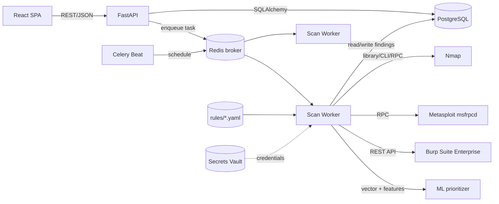
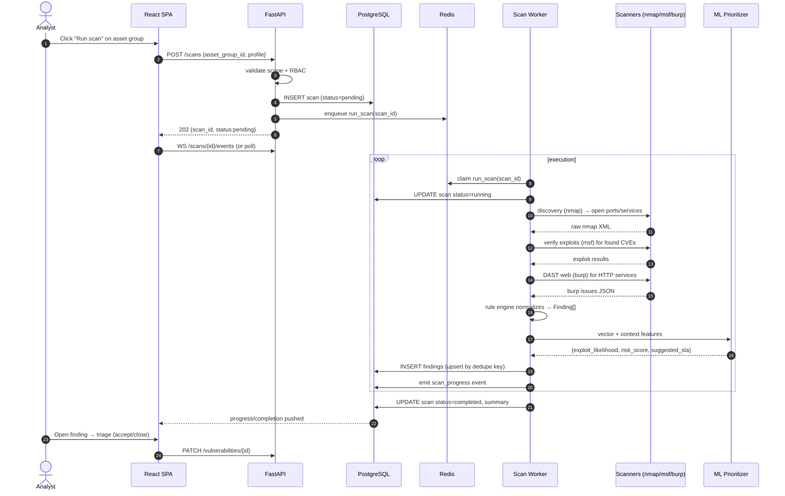
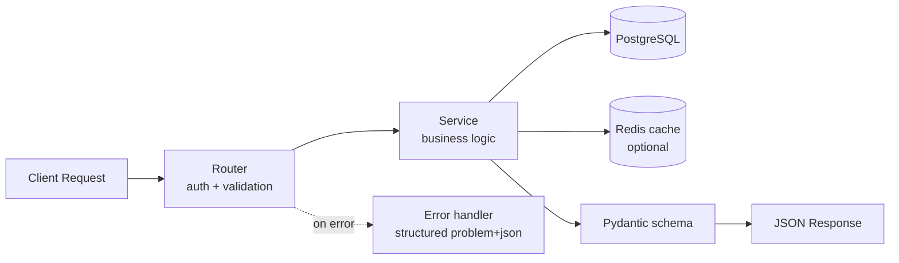
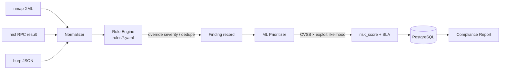

# Vulnerability Assessment Platform — Architecture

> Companion to [`PROJECT-PLAN.md`](./PROJECT-PLAN.md). This document describes
> *how the system is shaped and why*, not the task schedule.

---

## 2.1 Chosen Architectural Pattern

**Modular monolith (FastAPI) with an asynchronous scan-execution sidecar
(Celery workers), communicating over a Redis message bus.**

```
                ┌──────────────────────────────────────────────┐
   HTTPS ─────► │  FastAPI app  (sync request/response)        │
                │  routers → services → db (SQLAlchemy)        │
                └───────────────┬──────────────────────────────┘
                                │ enqueue scan_job(scan_id)
                                ▼
                        ┌───────────────┐
                        │   Redis bus   │  (broker + result backend)
                        └───┬───────┬───┘
            celery beat ───►│       │
                            ▼       ▼
            ┌──────────────────┐  ┌──────────────────┐
            │  Scan worker N   │  │  Scan worker N+1 │  ...horizontally scalable
            │  scanners/ ml/   │  │  scanners/ ml/   │
            │  rules/          │  │  rules/          │
            └────────┬─────────┘  └──────────┬───────┘
                     │ nmap/msfrpcd/burp REST│
                     ▼                       ▼
                 ┌────────────────────────────────┐
                 │  Target network (scoped hosts) │
                 └────────────────────────────────┘
```

### Why this shape

| Force | Decision | Rationale |
|---|---|---|
| Scan execution is long (minutes→hours) and CPU-bound | Decouple into Celery workers | Keeps HTTP API latency low; workers scale independently of API |
| On-premise deployment, small-medium team | Modular monolith (not microservices) | One deployable, shared DB schema, simpler ops; modules (`scanners`, `rules`, `ml`, `services`) keep boundaries clean for a future split |
| Scanners mutate external systems & run untrusted tooling | Isolated worker pool on a scanner VLAN | Blast-radius containment; workers are the only egress to target networks |
| Compliance needs an audit trail | Append-only event log + status state machine | Reproducibility of "what was found when" |
| Web UI is a thin client over the API | React SPA, no BFF | Single API contract (OpenAPI) consumed directly; fewer moving parts |

**Failure mode accepted deliberately:** the API and workers share one PostgreSQL
database. This is fine at this scale (single tenant per on-prem install, tens of
concurrent scans). If scan volume grows 10×, the `vulnerabilities`/`findings`
tables are the natural shard boundary, and the worker pool already scales
horizontally — no rewrite required.

---

## 2.2 Key Component Interactions



| Edge | Mechanism | Notes |
|---|---|---|
| UI ↔ API | HTTP/JSON REST | OpenAPI-generated client; JWT bearer auth |
| API ↔ DB | synchronous SQLAlchemy sessions | per-request session, committed in the service layer |
| API → Redis | Celery `.delay()` / `.apply_async()` | scan jobs only; never DB writes from the API path that depend on the job |
| Beat → Redis | scheduled task publication | recurring scans are first-class Celery beat entries |
| Worker ↔ scanners | subprocess (nmap), RPC (msfrpcd), REST (Burp) | each adapter normalizes output to a common `Finding` schema |
| Worker ↔ DB | SQLAlchemy sessions | worker owns its session; uses `SELECT ... FOR UPDATE SKIP LOCKED`-style job claiming |
| Worker ↔ ML | in-process call (model loaded once per worker) | no separate model server at this scale |
| Secrets | injected from Vault as env/files at worker start | scanner credentials never persisted in plaintext |

---

## 2.3 Data Flow

### End-to-end scan flow (sequence)



### Request/response data flow (CRUD path)



### Finding normalization pipeline (the heart of the system)



---

## 2.4 Scalability & Performance Strategy

1. **Horizontal worker scaling.** Scan workers are stateless and idempotent
   (dedupe key = `asset_id + cve/port + scanner`). Add workers behind the same
   Redis broker to raise concurrency. Nmap/Burp license seats, not the
   platform, are the real ceiling.

2. **Concurrency-safe job claiming.** Workers use Redis-backed visibility
   timeouts + `SELECT ... FOR UPDATE SKIP LOCKED` on a `scan` row to claim
   work, so two workers never scan the same scope simultaneously.

3. **Scan fan-out.** A large asset group is sharded into N worker tasks
   (one per host/subnet bucket) and re-aggregated. Turns a 4-hour serial
   scan into a 20-minute parallel one.

4. **Caching.** CVE metadata (descriptions, CVSS vectors, EPSS) is cached
   in Postgres + a Redis L1; external NVD/EPSS calls are batched and TTL'd
   to stay under rate limits.

5. **Async I/O in the API.** FastAPI runs on uvicorn(async); DB access stays
   sync (SQLAlchemy) via a threadpool — the right tradeoff here because most
   API calls are short and the heavy work is already in workers.

6. **Pagination everywhere.** Vulnerability lists are cursor-paginated
   (`?after=...`) so an asset with 50k findings never loads in one shot.

7. **Indexes that match the queries.** Composite indexes on
   `(asset_id, status)`, `(scan_id)`, `(severity, risk_score DESC)`.

**Where it will break first (and the plan):** the `vulnerabilities` table on a
large estate. Mitigation already in the design: partition by `created_at` month,
archive closed findings older than policy, and the worker pool is independent of
the API so a slow scan never blocks a UI click.

---

## 2.5 Security Considerations

This product *is* a security tool and itself handles credentials for the systems
it scans — it must be held to a higher bar than the apps it tests.

### Authentication & Authorization
- **OIDC** for SSO against the corporate IdP; service-to-service uses short-lived
  JWTs issued by the platform. Local fallback accounts are bcrypt-hashed and
  MFA-enforced for admins.
- **RBAC** with three roles — `admin`, `analyst`, `viewer`. Enforced as FastAPI
  dependencies (`Depends(require_role("analyst"))`), never only in the UI.
- **Scan scope enforcement:** every scan is bound to a *target scope* (CIDR/host
  allowlist). The worker validates the target against scope *before* launching
  any tool — this is the control that prevents the platform from being used to
  attack systems it shouldn't.

### Data protection
- Scan results can contain secrets/credentials captured from targets — findings
  marked sensitive are encrypted at rest (application-level AES-GCM, keys in Vault).
- TLS everywhere (API, DB, Redis, scanner RPC). HSTS on the SPA.
- PII minimization: asset owners stored as references, not full directory data.

### API security
- Strict input validation via Pydantic (rejects malformed scope/CIDR early).
- Rate limiting per user + per IP (slowapi). Request-size caps.
- Output encoding is JSON; the SPA escapes by default (React).
- No CORS wildcard — explicit allowlist of the SPA origin.

### Secret management
- Scanner credentials (SSH keys, AD accounts, API tokens for Burp/msfrpcd) live
  in **Vault** and are injected into workers as short-lived leases — never in env
  files, never in the DB, never logged.
- `.env` is for dev only and is gitignored; `.env.example` carries no real values.

### Safety rails specific to this product
- **Kill switch:** a global "pause all scans" flag the admin can flip; workers
  check it between targets.
- **Confirmation for exploit-verification** scans (Metasploit) — they can crash
  production hosts; requires `confirm_destructive=true` and the `analyst` role.
- **Audit log** of who launched what against which scope, append-only.

---

## 2.6 Error Handling & Logging Philosophy

### Error contract (RFC 7807 Problem Details)
Every error response is a uniform `application/problem+json`:

```json
{
  "type": "https://vap.internal/errors/scan-scope-violation",
  "title": "Target out of scope",
  "status": 422,
  "detail": "10.0.0.5 is not in any allowlist for asset group 42",
  "instance": "/scans",
  "trace_id": "01HXY...",
  "request_id": "req_8f..."
}
```

- Domain errors → `HTTPException` subclasses mapped to a status + code.
- Validation errors → 422 with field-level detail (Pydantic default, wrapped).
- Unexpected errors → 500 with a `trace_id`; the stack trace goes to logs, never
  to the client.

### Logging
- **Structured JSON** everywhere (structlog), one event per line, with stable
  fields: `timestamp`, `level`, `service`, `trace_id`, `request_id`, `user_id`,
  `scan_id`, `message`.
- **Trace propagation:** a middleware assigns `request_id` per inbound request
  and threads it into Celery task headers so a scan's full journey is greppable
  end-to-end.
- **Levels:** `INFO` for lifecycle (scan started/finished, user actions),
  `WARNING` for degraded behavior (scanner timeout, dedupe skip),
  `ERROR` for failures (scan aborted, DB error). Debug noise off by default.
- **Secret scrubbing:** a structlog processor redacts known-sensitive keys
  (`password`, `token`, `credentials`, `ssh_key`) before emission.
- **Sink:** stdout → collected by the on-prem logging stack (Loki/ELK). Workers
  log to the same bus so scans are visible alongside API traffic.

### Resilience patterns
- Scanner calls wrapped in **timeout + retry with backoff** (tenacity), capped so
  a hung nmap can't pin a worker forever.
- Celery tasks are **idempotent and retried** with a dead-letter queue for
  poison messages.
- Circuit breaker on external dependencies (Burp Enterprise API, NVD) so one
  slow upstream doesn't stall scans.
