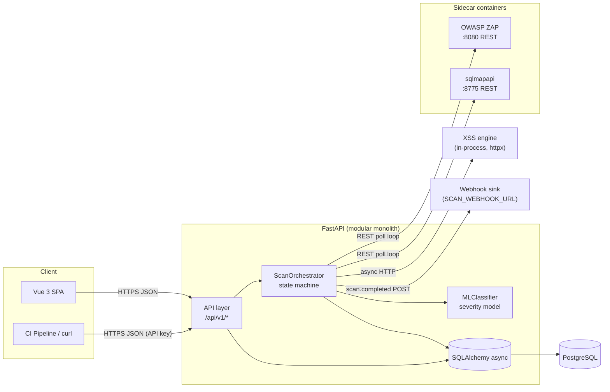
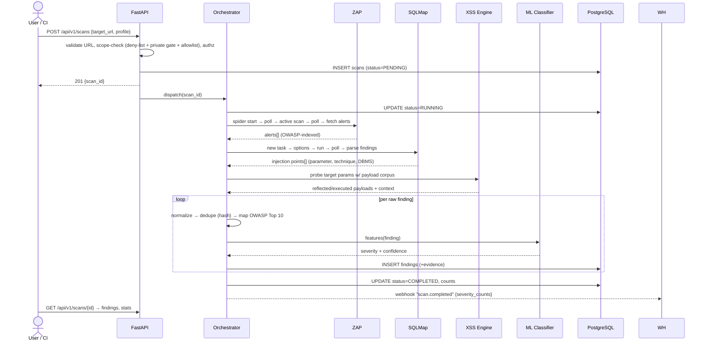

# Architecture — Web App Security Scanner

## 2.1 Chosen Architectural Pattern

**Modular Layered Monolith with sidecar tool services.**

```
┌──────────────────────────── Backend (one deployable) ────────────────────────────┐
│  API layer (FastAPI routers) → Service layer (orchestrator + scanner clients)   │
│  → Data layer (SQLAlchemy async → PostgreSQL)                                    │
└──────────────────────────────────────────────────────────────────────────────────┘
        │ REST (containers on the same compose network)                │
   ┌────▼─────┐   ┌───────────┐   ┌──────────────┐
   │ ZAP sidecar │   │ SQLMap sidecar │   │ (future) worker queue │
```

**Why not microservices?** The domain is a pipeline, not a set of independently
scaling products. At this scale (a security team + CI pipelines calling the API)
a modular monolith gives: one deployable, one migration chain, transactional
consistency between scans and findings, and trivial local dev. The *heavy*,
stateful, third-party components (ZAP, SQLMap) are already isolated as sidecar
containers — which buys the main operational benefit of microservices (crash
isolation, independent scaling of CPU-bound scanners) without the distributed-
data overhead. Clear module boundaries (`api/`, `services/`, `models/`) keep the
exit-ramp open: if scan volume grows, the orchestrator lifts out into a Celery
worker service unchanged, because it already has no framework coupling.

**Why not serverless?** Scans run for minutes-to-hours (ZAP active scan), need
persistent sessions with scanner state, and SQLMap is a long-lived stateful
process — all hostile to FaaS execution models.

## 2.2 Key Component Interactions



- **API calls (sync, inbound):** SPA and CI clients talk REST/JSON with JWT
  (humans) or API-key (machines) auth. Responses are always finite — scan
  creation returns immediately with a scan id; progress is polled.
- **Scanner control (REST, outbound):** The orchestrator drives ZAP and SQLMap
  purely over their HTTP APIs (`/JSON/scan/...`, `/task/...`). No subprocesses,
  no shared filesystems. Each scanner gets its own container and network alias.
- **Direct database access:** Only the backend touches PostgreSQL. Scanners are
  stateless-from-our-view; all results land in `findings` after normalization.
- **Events:** No broker in v1 — the orchestrator advances scan state in the
  DB, the UI polls, and a `scan.completed` webhook (not a bus) POSTs final
  severity counts to `SCAN_WEBHOOK_URL` when configured. Phase 3 may introduce
  Redis/Celery for long-scan offload; two consumers don't justify it yet.

## 2.3 Data Flow — Scan Lifecycle



Key data transformations on the path: **raw tool output → normalized finding**
(one schema regardless of scanner) → **deduplicated** (sha256 of
target+param+rule) → **classified** (ML severity) → **stored** with evidence
(request/response excerpts) → **served** to UI or exported as SARIF/HTML.

## 2.4 Scalability & Performance Strategy

- **Stateless API tier** — backend keeps no in-session state; scale horizontally
  behind nginx/Traefik. All state lives in PostgreSQL.
- **Scanners are the bottleneck, isolate them** — each ZAP/SQLMap instance is a
  container; N concurrent scans = N sidecars (compose `--scale` in dev, K8s HPA
  on a scan-queue-depth metric in prod). The orchestrator is written against
  scanner *interfaces*, so a pool of ZAP instances slots in behind the same
  client.
- **Async everywhere** — FastAPI + httpx + SQLAlchemy all async; request workers
  never blocked by scanner polling (poll loops run as background asyncio tasks
  in v1, Celery tasks in Phase 3).
- **Bounded polling** — fixed-interval polling loops with hard phase budgets
  (⅓ of the timeout for spider, ½ for active scan); the configurable scan
  timeout kills runaway scans and frees the sidecar slot.
- **DB discipline** — indexes on `(scan_id, severity)`, `dedup_hash UNIQUE`;
  evidence stored as JSONB (no joins to read a finding); partition-by-month on
  `findings` is the documented next step when volume demands it.
- **ML inference is cheap by design** — severity classification is a small
  calibrated logistic regression scoring 24 features; inference happens
  inline (no model server to scale), with a deterministic rules fallback
  when the artifact or confidence is missing.

## 2.5 Security Considerations

This product is itself a weapon-shaped tool; it must be *more* hardened than
the apps it scans.

- **Authentication & authorization:** JWT (short-lived access + rotating
  refresh, HS256, stdlib hmac — no external crypto deps) for users, passwords
  hashed with PBKDF2-SHA256 (310k iterations); static API keys (`wss_` prefix,
  SHA-256 hashed at rest, prefix-displayed, expiring) for CI. RBAC roles:
  `viewer` / `scanner` / `admin` (rank-ordered) — only `scanner`+ may launch
  scans. Scans and findings are **team-visible** by design (a security team
  shares its findings); per-user data isolation stays on the Phase 3 list.
- **Target scoping (critical, product-level):** three gates, enforced at the
  API layer *before* any scanner sees a URL —
    (a) a deny-list (localhost, link-local, cloud metadata IPs such as
    `169.254.169.254`), (b) a private-range guard (RFC1918 etc. rejected
    unless `ALLOW_PRIVATE_TARGETS=true`, with a DNS-rebinding re-check at
    request time), and (c) an operator-maintained allowlist of hosts/CIDRs
    (`/targets`, admin-only; empty allowlist = bootstrap mode, all
    scope-passing targets allowed). This is the single most important control
    in the system.
- **Data protection:** TLS everywhere (internal compose network excepted);
  at-rest encryption delegated to the DB volume/cloud disk; evidence
  (request/response captures) may contain secrets — retention policy with
  automatic purge (default 90d), redaction filters for `Authorization`/
  `Set-Cookie` values in stored evidence and reports.
- **API security:** pydantic strict validation on every input; rate limits on
  auth + scan-launch endpoints; CORS locked to the frontend origin; security
  headers via middleware; OpenAPI schema kept authoritative.
- **Secret management:** `.env` only for local dev; in CI/CD secrets come from
  GitHub Actions secret store; in prod from Docker/K8s secrets or Vault.
  `.env*` gitignored, `gitleaks` in pre-commit and CI.
- **Self-scan (dogfood):** CD pipeline runs the scanner against a staging
  deployment of itself; new High/Critical blocks release.

## 2.6 Error Handling & Logging Philosophy

**One taxonomy, three layers.**

1. **Transport:** services raise typed exceptions — `DomainError` subclasses
   (`TargetNotAllowed`, `ScanTimeout`, `ScannerUnavailable`,
   `ClassificationError`) plus per-scanner `ZapError` / `SqlmapError` and
   `TokenError` for auth failures; FastAPI exception handlers map them to
   stable JSON error bodies:
   `{ "error": {"code", "message", "details", "request_id"} }` — no stack
   traces to clients, ever.
2. **Orchestration:** the scan state machine treats every scanner failure as a
   first-class outcome — a scan goes `FAILED` with a machine-readable reason per
   phase (`{"phase": "zap_active_scan", "reason": "timeout"}`), so partial
   results (findings already ingested) survive and are still reported.
3. **Logging:** structured JSON (structlog-style) with `request_id` (from
   middleware) and `scan_id` correlation on every line; level by env
   (`DEBUG` dev, `INFO` prod). Scanner raw stdout/stderr is captured per scan
   into the evidence store at `DEBUG` only.

Rules of thumb: log at boundaries (in/out of services), never log payloads or
tokens (redaction filter installed as a logging processor), alert on
`ScannerUnavailable` rate (scanners crash-looping = platform incident), and
every error line must be actionable or deletable.
