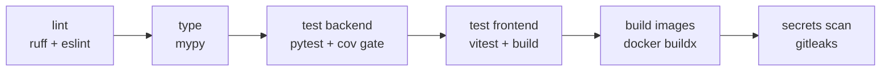

# Technical Notes — Web App Security Scanner

## 3.1 CI/CD Pipeline Design

Two workflows in `.github/workflows/`: `ci.yml` (fast feedback, every PR + push
to `master`) and `cd.yml` (tag-driven deploy).

**CI stages (fail fast, cheapest first):**



(The ZAP self-scan of staging lives in **CD**, after the staging deploy —
see below.)

- **Lint:** `ruff check` + `ruff format --check` (backend), `eslint` (frontend).
  Zero warnings policy — ruff is fast enough (~1s) that there is no excuse.
- **Type:** `mypy`, strict on `app/services/` first (highest-value code).
- **Test:** `pytest --cov=app --cov-fail-under=70`; frontend `vitest` + `vite build`.
- **Build:** `docker buildx` for backend + frontend images (GHA layer cache);
  build, don't push, on PRs — proves Dockerfiles are green before merge.
- **Security gates:** `pip-audit --no-deps` on the pinned requirements (hard
  gate — keep requirements pinned and clean, ignore-lists need an owner and
  an expiry), `gitleaks` on full history. (`bandit` config lives in
  `pyproject.toml` for local use; a *scanner* codebase trips S-level rules
  by design — tune excludes, don't blanket-disable.)

**CD stages:** on tag `v*` → re-run test matrix → build+push images to GHCR
(sha + semver tags) → deploy **staging** → run ZAP baseline self-scan against
staging → manual `environment` approval gate → deploy **prod**. Rollback =
redeploy previous immutable tag; DB migrations must be backward-compatible
(expand/contract pattern — add columns first, remove a release later).

## 3.2 Testing Strategy

| Layer | Tool | Scope | Target |
|---|---|---|---|
| Unit | pytest | services (XSS engine, normalizer, classifier), pure logic | 85% on `services/` |
| Integration | pytest + httpx `ASGITransport` + SQLite(async) | API endpoints, auth, scan lifecycle with **mocked** scanner clients | 70% overall (currently ~88%) |
| Contract | pytest + `respx` | ZAP/SQLMap clients against mocked API responses | all endpoints used |
| Frontend | vitest + happy-dom + `@vue/test-utils` | API client, auth store, router guards, views/components | all flows smoke-tested |
| Security E2E | pytest `-m e2e` + compose profile `e2e` (`tools/vuln-lab`) | full stack + real ZAP vs. deliberately vulnerable target | findings are asserted |

Practices that matter here:

- **Never hit real ZAP/SQLMap in unit/integration tests** — scanner clients get
  `respx`-mocked HTTP fixtures recorded from the real tools; a `@pytest.mark.e2e`
  marker gates tests that need the real sidecars (run nightly or on demand via
  `make test-e2e` which boots the compose stack).
- **Deterministic classifier tests:** the ML model is loaded from a *pinned*
  test artifact; training-pipeline tests assert on shapes/metrics ranges, not
  exact predictions.
- **The scanner's own API is a security surface** — integration tests must
  cover: SSRF reject list (metadata IPs, localhost, out-of-scope CIDR), authz
  (viewer cannot launch scans), and invalid-input fuzzing (pydantic strict mode
  keeps this mostly free).
- Fixtures over factories; one `conftest.py` per layer. Async DB tests use the
  `sqlite+aiosqlite` engine with a per-test transaction rollback.

## 3.3 Deployment Strategy

**Container-first; Docker Compose is the reference deployment, K8s optional.**

- **Images:** backend = multi-stage (builder installs wheels → trains/bakes
  the ML model → slim runtime, non-root `app` user, healthcheck on `/health`).
  Frontend = node build → nginx serve (static, immutable-cache assets,
  security headers, `/api` reverse proxy). Scanner sidecars: ZAP from
  `ghcr.io/zaproxy/zaproxy:stable`; sqlmap built from `tools/sqlmap/`
  (no official image ships the REST API).
- **Compose:** `docker-compose.yml` (dev: ports published; hot-reload is the
  separate `make dev` flow) + `docker-compose.prod.yml` (no host ports,
  replicas, restart policies, TLS terminator in front). The `e2e` profile
  adds the vuln-lab target on demand. `docker compose -f ... up -d` is the
  whole deploy for a single VM; the same images run under K8s later.
- **Database migrations run as a one-shot container** (`alembic upgrade head`)
  gated before the backend starts accepting traffic; compose `depends_on:
  condition: service_completed_successfully` enforces ordering.
- **Environment promotion:** dev (local) → staging (auto-deploy from `master`)
  → prod (tag + approval). Same images, different env/secrets — config drift is
  the #1 deploy failure mode.
- **Scaling path:** vertical first (bigger box), then split scanner sidecars
  onto their own hosts; the orchestrator's scanner-interface abstraction means
  "scanner pool" is a config change, not a rewrite.

## 3.4 Environment Management

**Rules:** one `.env.example` is the single source of truth for variables;
compose reads `.env`; the backend *never* branches on env names — all behavior
via explicit settings; frontend gets only `VITE_API_BASE_URL` at build time
(everything runtime-switchable goes through the backend).

`.env.example` (abridged — the file itself is authoritative):

```dotenv
# ── Core ────────────────────────────────────────────────────────────────
ENV=development                    # development | staging | production
SECRET_KEY=change-me-generate-64-random-chars
ACCESS_TOKEN_EXPIRE_MINUTES=30
REFRESH_TOKEN_EXPIRE_DAYS=7
CORS_ORIGINS=["http://localhost:5173","http://localhost:8090"]
ADMIN_EMAIL=admin@scanner.local    # first-boot admin seed
ADMIN_PASSWORD=change-me-admin

# ── Scanners ───────────────────────────────────────────────────────────
ZAP_BASE_URL=http://zap:8080
ZAP_API_KEY=change-me-zap-key
SQLMAP_BASE_URL=http://sqlmap:8775
SQLMAP_USERNAME=sqlmap
SQLMAP_PASSWORD=change-me-sqlmap-pass
SCAN_TIMEOUT_MINUTES=45
MAX_CONCURRENT_SCANS=3

# ── Target scoping (SSRF / authorization guardrails) ────────────────────
ALLOWED_TARGET_CIDRS=[]
ALLOW_PRIVATE_TARGETS=true          # dev/lab only; false in prod

# ── Notifications & retention ──────────────────────────────────────────
SCAN_WEBHOOK_URL=                  # "" = disabled
EVIDENCE_RETENTION_DAYS=90

# ── Frontend (build-time only) ─────────────────────────────────────────
VITE_API_BASE_URL=/api/v1
```

Dev/staging/prod differ only in values (and secret injection method: file →
GitHub secrets → Vault/orchestrator secrets). A settings-validate check on
boot fails fast with a human-readable list of missing/misconfigured vars.

## 3.5 Version Control Workflow

**Trunk-based with short-lived branches** (`feature/xss-context-detection`,
`fix/zap-poll-leak`), PR + CI green + one review to merge into `master`;
`master` is always deployable (deployed automatically to staging); production
releases are git tags `vX.Y.Z`.

Rationale vs. alternatives: Gitflow's release branches add ceremony a 3–5
person security team can't sustain and delay vulnerability fixes — bad fit for a
security product where "ship the detection rule this week" is the cadence.
GitHub Flow (~ trunk-based without the strict CI gate emphasis) is fine, but we
keep: branch lifetime < 3 days, squash merges (clean history, `main`-only
bisect), conventional commits (`feat:`, `fix:`) driving changelog + semver bump.

## 3.6 Common Pitfalls (This Stack Specifically)

1. **ZAP session state bleeds between scans.** ZAP keeps one session per
   instance — the compose stack runs one shared ZAP, so concurrent scans
   contaminate each other's alerts. `MAX_CONCURRENT_SCANS` bounds the blast
   radius today; the clean fixes are one ZAP container per scan (compose
   scale / ephemeral container) or serializing the ZAP phase in the
   orchestrator when concurrent scanning becomes routine.
2. **sqlmapapi task leaks.** Every `/task/new` needs `/task/destroy` — a
   crashed orchestrator leaves zombie tasks eating RAM. Wrap in `try/finally`
   and add a janitor sweep.
3. **Scanning your own infrastructure / legal exposure.** The scanner *will*
   happily attack whatever URL it's given, including cloud metadata endpoints.
   The scope allowlist + private-range guard is not optional (see ARCHITECTURE
   2.5); test it like a security control, because it is one.
4. **Evidence blobs bloat PostgreSQL.** Storing full HTTP responses per finding
   reaches GB-scale fast. Cap excerpt length, redact secrets, and set the
   retention purge before the first production scan, not after.
5. **Blocking the event loop with "async" code.** `sqlmap` log parsing and ML
   inference are CPU/sync — a naive `async def` that does heavy sync work stalls
   every request. Use `asyncio.to_thread` / a process pool for those sections.
6. **Vue polling stampedes.** Dashboard polls per scan; N open tabs = N× polls.
   Centralize polling in one store (or move to SSE in Phase 3) and add jitter.
7. **Alembic drift between dev containers.** Devs reset DBs at different
   migrations → "works on my machine" findings. `make migrate` on every pull is
   enforced via a pre-commit reminder + CI job that boots a fresh DB and runs
   `alembic upgrade head`.
8. **pip/npm audit fatigue.** Scanner-adjacent deps (many CVEs in parsers) fail
   builds weekly. Pin ignore-lists with expiry dates and an owner, or the team
   starts running with `--no-audit` — worse.
