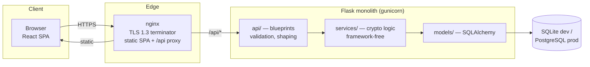
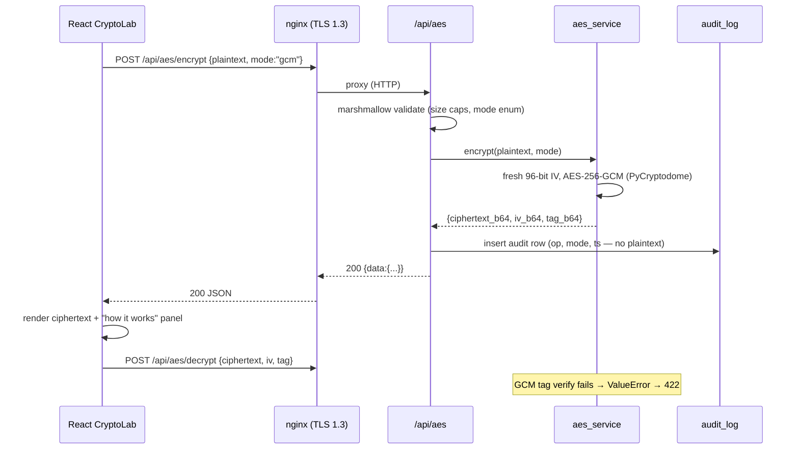

# Cryptography Toolkit — Architecture

## 2.1 Chosen Architectural Pattern: Modular Layered Monolith

A **layered monolith with strict module boundaries** (api → service → model),
deployed as two containers (nginx+React static, Flask+gunicorn) fronted by one
nginx TLS terminator.

**Why not microservices?** This is an educational tool with a single domain
(crypto demos), one team, and modest write load (demo results are mostly
stateless request/response). Microservices would add network hops, distributed
tracing, and deploy complexity for zero benefit at this scale. The module seams
below are the extraction points *if* the TLS demo or lesson CMS ever needs to
split out:

Layers and their rules:
1. **api/** — HTTP concerns only: parse, validate (marshmallow), call service, return JSON. No crypto.
2. **services/** — pure crypto/domain logic. No Flask imports. Takes/returns plain data.
3. **models/** — persistence (SQLAlchemy). Only services touch it.
4. **middleware/** — cross-cutting: error envelope, rate limiting hooks.

## 2.2 Key Component Interactions

| Interaction | Mechanism | Notes |
|---|---|---|
| React → API | `fetch` over HTTPS (nginx proxy) | JSON in/out; uniform `{data, error}` envelope |
| API → services | In-process function calls | No queue needed; crypto ops are ms-scale, CPU-bound |
| services → DB | SQLAlchemy 2.x ORM | Only lessons/users/audit — **never** plaintexts or keys |
| nginx → browser | HTTP/2 over TLS 1.3 | Doubles as the *real* TLS 1.3 demo endpoint (certificate inspection) |
| Rate limiting | In-memory token bucket (Flask-Limiter) | Swap to Redis backend when horizontally scaled |

No message queues or event buses — request/response covers all user flows.
The only async-ish need (long Argon2 params benchmark) stays synchronous but
rate-limited and capped.

## 2.3 Data Flow — AES demo round-trip (typical path)

Failure paths share one envelope: `{"error": {"code", "message", "detail?"}}`
produced by `middleware/error_handlers.py` from typed service exceptions.

## 2.4 Scalability & Performance Strategy

- **Stateless app servers** — all session state is a signed cookie; scale Flask
  horizontally behind nginx with zero sticky sessions.
- **CPU-bound crypto** is the hot path: gunicorn `--threads` for I/O overlap,
  worker count tuned to vCPU; Argon2 demos capped at "interactive" presets by
  default so a single request can't pin a core for seconds.
- **Rate limits per IP + per route** protect against accidental self-DoS from
  the classroom (30 students hitting keygen at once).
- **Caching:** lesson content is static-ish → `Cache-Control` + etag at nginx.
- **Growth path:** swap SQLite→PostgreSQL (config flag only), limiter→Redis,
  then split `tls_demo_service` out only if the lesson CMS and demo APIs start
  competing for resources (they won't at educational scale).

## 2.5 Security Considerations

- **AuthN/AuthZ:** Educational demos are anonymous by default; accounts gate
  lesson editing and the audit log via email+password (Argon2id-hashed),
  optional TOTP second factor (RFC 6238 on stdlib hmac; secret stored
  Fernet-encrypted under a key derived from `SECRET_KEY`; login enforces the
  §5.2 replay rule — a code is accepted only if its timestep is newer than the
  last accepted one, tracked in `users.totp_last_timestep`). Tokens are
  itsdangerous-signed with a `TOKEN_TTL_HOURS` lifetime; the authz check is a
  single guard — `auth_service.require_admin()` — no row-level ACLs needed.
  Bootstrap rule: **the first registered user becomes the admin** (documented,
  deterministic).
- **Data protection:**
  - Keys/plaintexts are **ephemeral, memory-only** — never logged, never persisted.
  - Audit log stores operation metadata only (op, scrubbed params, salted
    SHA-256 IP hash, user id, timestamp) — a deny-list drops any key that
    looks sensitive before the row is written.
  - All demo crypto uses secure defaults (GCM not ECB, OAEP not PKCS1v15, PSS for RSA sig).
  - Insecure modes exist **only** behind `demo=true` for attack illustration.
- **API security:** TLS 1.3-only at the edge (`ssl_protocols TLSv1.3`),
  strict HSTS, request-size caps (64 KB payloads), marshmallow allowlists,
  per-route rate limits, uniform JSON errors that never leak stack traces.
  Edge compression is static-assets-only — JSON responses stay uncompressed
  (reflected input + compression + TLS = BREACH). List endpoints
  (`/api/lessons/`, `/api/auth/audit`) paginate with `limit`/`offset`.
- **Secret management:** 12-factor — all secrets from env vars
  (`SECRET_KEY`, `DATABASE_URL`); GitHub Actions secrets → deploy env;
  dev certs generated by `scripts/gen_dev_certs.sh`, never committed.
- **Schema integrity:** `migrations/*.sql` and the ORM must stay in lockstep —
  production applies SQL first and `create_all()` skips existing tables, so
  drift only manifests deployed. `tests/test_schema_parity.py` builds both
  schemas and fails CI on any column/index difference.
- **Dependency posture:** pip-audit + npm audit in CI; PyCryptodome pinned.

## 2.6 Error Handling & Logging Philosophy

- **Typed exceptions at service level** (`CryptoServiceError`,
  `VerificationError`, `InvalidInputError`) — services raise, never `print`,
  never return `None` as an error signal.
- **One error envelope everywhere** — `error_handlers.py` maps:
  `InvalidInputError→422`, `VerificationError→422` (crypto-semantic),
  `NotFound→404`, `TooManyRequests→429`, anything else → generic `500`
  (message withheld in prod, correlation id included).
- **Structured logging** (JSON lines): level, route, correlation id, latency,
  op metadata. Plaintexts and keys are explicitly scrubbed by a logging filter.
- **Client rule:** `api/client.js` normalizes fetch failures and non-2xx into
  one thrown `ApiError` so every component has identical `{loading, error, data}` handling.
- **Fail loud in dev, quiet in prod:** `FLASK_ENV` toggles stack traces in the
  error envelope and DEBUG-level logging.
