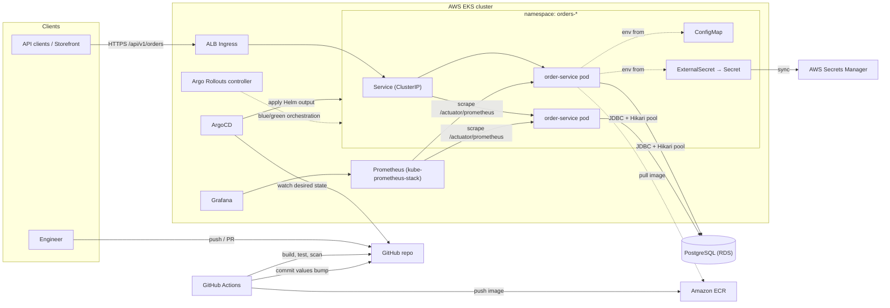
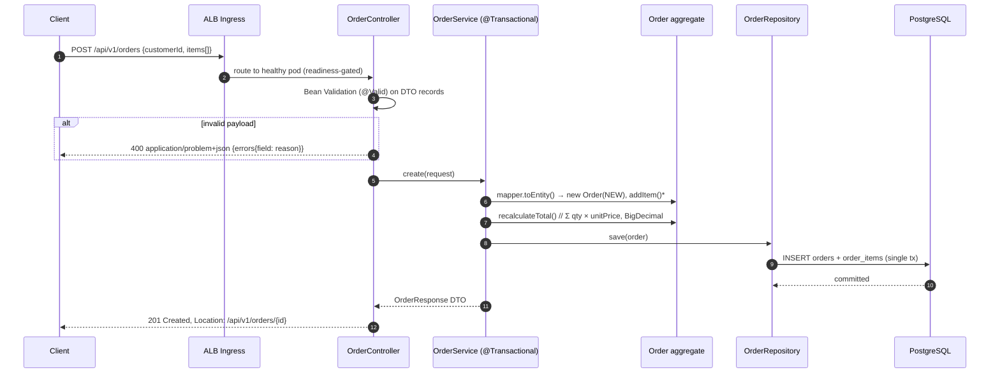
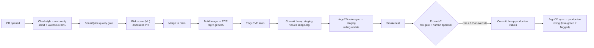

# Architecture — E-commerce Order Service & CI/CD Platform

## 2.1 Chosen Architectural Pattern

**Pattern: Microservices (starting with one well-factored service) + GitOps delivery.**

The runtime architecture is a **containerized microservice** — the Order Service — deployed on AWS EKS,
owning its data (PostgreSQL) and exposing a versioned REST API. Internally the service uses a classic
**layered structure with a rich domain model** (API → application service → domain → repository), which
keeps business rules (order totals, status transitions) in plain, unit-testable Java.

The delivery architecture is **GitOps**: GitHub Actions produces immutable images and *commits desired
state* (Helm values); ArgoCD continuously reconciles the cluster to that state.

**Why this fits:**

- The business scope ("Order Service") is a single bounded context today. One service per bounded
  context avoids the distributed-monolith trap; the monorepo layout (`services/*`, shared `deploy/`,
  `observability/`) makes adding `payment-service`/`inventory-service` a repeatable pattern, not a rewrite.
- The heavy requirements are **delivery requirements** (coverage gates, quality gates, staged
  environments, blue-green, risk scoring). Kubernetes + Helm + ArgoCD is the industry-standard answer
  and every piece (probes, HPA, PDB, Rollouts) is declarative and reviewable in Git.
- Spring Boot 3 / Java 21 gives virtual-thread-ready HTTP handling, native Actuator probes, Micrometer
  → Prometheus metrics, and first-class Testcontainers support — nothing custom to maintain.

Rejected alternatives, briefly: *serverless* (Lambda) complicates JVM cold starts, connection pooling to
PostgreSQL and blue-green semantics; *layered monolith* would not exercise the CI/CD platform this
project exists to build; *event-driven-first* adds a broker before there is a second consumer (kept as
Phase 3 outbox roadmap).

## 2.2 Key Component Interactions

Interaction styles, deliberately chosen:

| Interaction | Mechanism | Notes |
|---|---|---|
| Client → Order Service | Synchronous REST/JSON over HTTPS (ALB → Service) | Versioned path `/api/v1`; OpenAPI contract published by springdoc |
| Order Service → PostgreSQL | Direct JDBC via HikariCP; schema owned exclusively by this service | No shared-database integration — other services must use the API (or future events) |
| CI → Cluster | **Never direct.** CI commits to Git; ArgoCD pulls | No `kubectl apply` from pipelines; cluster credentials never live in GitHub |
| Metrics | Pull: Prometheus scrapes `/actuator/prometheus` on the dedicated **management port (8081)** via `ServiceMonitor` | RED + JVM + Hikari series tagged `application=order-service`; the ALB never routes the management port |
| Future inter-service | Transactional outbox → Kafka/SNS (`OrderCreated`, `OrderCancelled`) | Phase 3; avoids dual-write problem from day one of service #2 |

## 2.3 Data Flow

Typical write path — placing an order:

Read path: `GET /api/v1/orders/{id}` uses `findWithItemsById` (`@EntityGraph`) — one SQL join, no N+1;
list endpoints return a summary projection without items and a stable `PageResponse` envelope.
Status changes go through `PATCH /{id}/status`, where the `OrderStatus` state machine either applies
the transition or raises `409 Conflict` — never an invalid state in the database.

Deployment data flow (code → production):

## 2.4 Scalability & Performance Strategy

- **Stateless pods, horizontal-first.** No session state; scale via HPA (CPU 70% target, 2→6 default)
  behind a `PodDisruptionBudget`. `topologySpreadConstraints` and multiple replicas span AZs.
- **Rollouts without downtime.** `maxUnavailable: 0` rolling updates; readiness probes on
  `/actuator/health/readiness`; graceful shutdown (`server.shutdown: graceful` + `preStop` sleep) drains
  in-flight requests before SIGTERM takes effect — no 502s during deploys or scale-in.
- **Database as the scaling bottleneck, managed deliberately.** Hikari pool sized (10/pod) against RDS
  `max_connections`; indexes shipped in `V2` for the two real query patterns (customer lookup,
  status+date scans). Growth path: RDS read replicas → repository-level read routing; monthly
  partitioning of `orders`; Redis cache for hot GETs — all Phase 3, none require API changes.
- **JVM tuned for containers.** `MaxRAMPercentage=75`, G1GC, requests/limits set so the scheduler and
  the JVM agree about memory; CPU limit intentionally omitted (avoids throttling latency spikes —
  requests still guarantee scheduling).
- **Measure before optimizing.** p95/p99 via Micrometer histograms on every endpoint; Grafana dashboard
  and alert thresholds (§observability) define the performance budget: p95 < 500 ms, 5xx < 5%.

## 2.5 Security Considerations

- **Authentication & authorization** (implemented in `config/SecurityConfig`). Spring Security
  **OAuth2 Resource Server**: the JWT chain activates the moment
  `spring.security.oauth2.resourceserver.jwt.issuer-uri` is configured (per environment via the Helm
  ConfigMap — Cognito/Keycloak both fit). Scope rules: `orders:read` for GETs, `orders:write` for
  mutations; probes, `/actuator/prometheus`, API docs and the ops console stay public. Without an
  issuer (local dev, compose, tests) an equally stateless **open fallback chain** applies, so there is
  no fake auth to rip out and no environment-name branching in code. Enforcement is covered by
  `SecurityFilterChainTest` (401 / 403 / 200-201 / public paths).
- **Pipeline & supply chain.** GitHub→AWS via **OIDC federation** (no long-lived AWS keys as secrets);
  images tagged by **immutable git SHA** (no `latest` deploys); **Trivy** blocks CRITICAL/HIGH CVEs;
  Dependabot patches Maven/Actions/Docker/pip weekly; ECR image scanning as second opinion.
- **Secrets management.** Runtime DB credentials come from **AWS Secrets Manager via External Secrets
  Operator** — Kubernetes `Secret` objects are generated, never committed. The chart's `secret.create`
  path exists only for local/kind clusters and holds placeholders. `.env` is git-ignored; `.env.example`
  documents shape, not values. CI secrets live in GitHub encrypted secrets, least-scope.
- **Runtime hardening.** Containers run as non-root UID 10001 with `readOnlyRootFilesystem`, no
  privilege escalation, JRE-only base image; IRSA gives pods scoped AWS permissions instead of node
  roles. **Actuator is isolated on a separate management port (8081)** — probes, metrics scrape and
  the ALB health check use it cluster-internally, while the ingress routes only the API port, so no
  actuator endpoint is ever internet-reachable. An opt-in **NetworkPolicy** template
  (`networkPolicy.enabled`) adds default-deny: API port open, management port only from the
  monitoring namespace, egress limited to DNS, RDS and HTTPS.
- **Data protection.** TLS at the ALB (ACM certs); RDS encrypted at rest (KMS) with TLS in transit;
  no PII beyond `customer_id` UUIDs in this service; ProblemDetail responses never leak stack traces
  or SQL — the global handler returns sanitized RFC-7807 bodies and logs the details server-side.

## 2.6 Error Handling & Logging Philosophy

**Errors are part of the API contract.** Every error response is RFC-7807 `application/problem+json`,
produced by one `GlobalExceptionHandler`:

| Condition | HTTP | Source |
|---|---|---|
| Bean Validation failure | 400 + `errors` map (field → reason) | `MethodArgumentNotValidException` |
| Unknown order / route | 404 | `OrderNotFoundException`, `NoResourceFoundException` |
| Illegal status transition | 409 | `InvalidStatusTransitionException` (thrown by the domain, not the controller) |
| Anything unexpected | 500, generic body, full stack logged server-side | `Exception` catch-all |

Principles:

1. **Domain throws, edge translates.** Business rules raise typed exceptions; only the web layer knows
   about HTTP. No status codes inside services or entities.
2. **Fail fast at startup.** Flyway runs before traffic; `ddl-auto: validate` kills the pod on schema
   drift; readiness stays false until dependencies are proven — Kubernetes then simply doesn't route.
3. **Logs are structured events.** Local/dev: human-readable console. `production` profile: Spring Boot
   native **ECS-JSON structured logging** (`logging.structured.format.console: ecs`) → stdout → CloudWatch/Loki.
   One WARN/ERROR per failure at the outermost handler — no double-logging, no log-and-rethrow.
4. **Correlation.** Micrometer tracing hooks (W3C `traceparent`) are the Phase 2 path; until then the
   ALB request id is echoed in logs. Metrics record every failure (`http_server_requests` status tags)
   so alerting keys off *rates*, not log greps.
5. **Retries are safe by contract.** Reads are naturally idempotent; `POST /orders` accepts an
   **`Idempotency-Key` header** — a retry with the same key returns the original order with
   `200 OK` instead of creating a duplicate (`201 Created`). Enforced by a partial unique index
   per customer (migration `V3`) and race-safe in the service layer: the loser of a concurrent
   insert re-reads and serves the winner.
