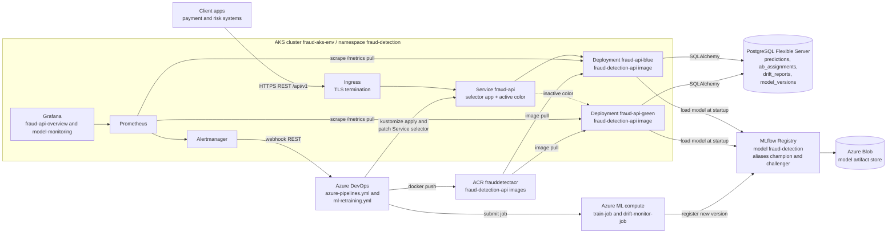
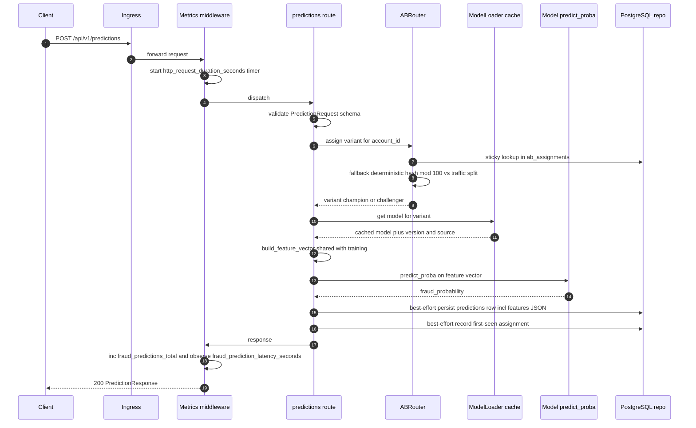
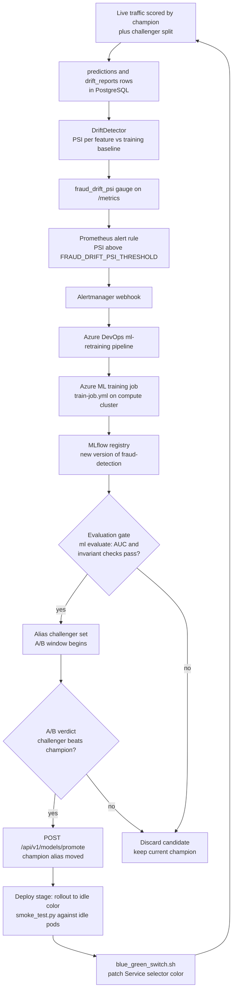

# Architecture — Fraud Detection API (Python ML Service CI/CD)

This document describes the architecture of the fraud-detection service: a single FastAPI
deployable that serves an ML fraud-scoring model, wrapped in an automated MLOps control loop
(drift detection → retraining → evaluation → promotion → blue-green rollout on AKS).

All statements below are grounded in the actual repository layout:

```
src/fraud_detection/        # application code (src layout, package: fraud_detection)
├── main.py                 # create_app() -> FastAPI `app`
├── core/                   # config.py (Settings, FRAUD_ prefix), logging.py (structlog)
├── api/                    # deps.py + routes/ (health, predictions, models, admin)
├── schemas/                # Pydantic request/response models
├── services/               # ab_router, model_loader, prediction_service, drift_detector, retraining
├── db/                     # session.py (lazy engine), models.py, repositories.py
├── ml/                     # features, train, evaluate, registry (LocalModelStore + MLflow)
└── monitoring/             # metrics.py (Prometheus), middleware.py
tests/                      # unit / integration / model quality gates
k8s/                        # base + overlays (dev/staging/prod), blue-green Deployments
pipelines/                  # Azure DevOps templates + ml-retraining.yml
mlops/azureml/              # Azure ML job specs (train-job, drift-monitor-job, environment)
infra/terraform/            # azurerm modules: aks, acr, postgres, azureml, keyvault
monitoring/                 # prometheus rules/alerts, grafana dashboards
migrations/                 # Alembic (0001 initial schema, 0002 prediction features)
dashboard/                  # React + Vite model-monitoring UI (catalog, A/B, drift, scoring)
```

---

## 2.1 Chosen Architectural Pattern

### Modular monolith + event-driven MLOps control loop

The serving side is a **modular monolith**: one FastAPI deployable
(`src/fraud_detection/main.py`, `app` built by `create_app()`) with strict internal seams:

| Seam | Location | Responsibility |
|---|---|---|
| `api/` | `src/fraud_detection/api/routes/*` | HTTP surface only — validation, status codes, dependency wiring via `api/deps.py`. No business logic. |
| `services/` | `ab_router.py`, `prediction_service.py`, `model_loader.py`, `drift_detector.py`, `retraining.py` | Use-case orchestration: variant routing, scoring, drift math (PSI), retraining triggers. |
| `ml/` | `features.py`, `train.py`, `evaluate.py`, `registry.py` | Model lifecycle: shared feature engineering, the full training pipeline (data → fit → quality gates → versioned artifacts + PSI baseline), and the two-tier registry (`LocalModelStore` + MLflow wrapper). |
| `db/` | `session.py`, `models.py`, `repositories.py` | Persistence: SQLAlchemy 2 models mirrored 1:1 by `migrations/versions/` (0001 schema, 0002 features column, 0003 read-path indexes); repositories hide the session. |
| `monitoring/` | `metrics.py`, `middleware.py` | Prometheus counters/histograms and the HTTP metrics middleware. |

Dependencies flow one way: `api → services → (ml | db | monitoring)`. Routes never touch
SQLAlchemy or MLflow directly; services never import FastAPI.

Around this monolith sits an **event-driven MLOps control loop** that is deliberately *not*
inside the service process:

1. `services/drift_detector.py` evaluates PSI per feature over the recent `predictions`
   window against the champion's training baseline (`baseline.json` in the model store),
   persists `drift_reports` rows, and exports `fraud_drift_psi{feature}`.
2. On detected drift the loop closes on **two paths**: in-process,
   `services/retraining.py` submits a retraining job immediately (debounced via
   `FRAUD_RETRAIN_MIN_INTERVAL_MINUTES`); and out-of-process, Prometheus
   (`monitoring/prometheus/alerts.yml`) fires so Alertmanager can webhook the Azure DevOps
   REST API and queue `pipelines/ml-retraining.yml`. Manual trigger:
   `POST {api_prefix}/admin/retrain` (bypasses the debounce).
3. Retraining runs on Azure ML (`mlops/azureml/train-job.yml`) when the SDK/credentials are
   configured, otherwise on the service's local training backend — the same
   `ml/train.train_pipeline` either way, with the same quality gates.
4. The passing model becomes the **`challenger`** alias (MLflow when available; the versioned
   local model store always).
5. After the A/B window, `POST {api_prefix}/models/promote` moves the `champion` alias, and
   the deploy stage flips traffic blue↔green via `scripts/blue_green_switch.sh` for
   code/image changes (a pure model change needs no rollout at all).

### Why not microservices

| Force | Assessment |
|---|---|
| **Single model domain** | One registered model (`fraud-detection`), one bounded context (transaction fraud scoring). There is no second domain to isolate — splitting would create network hops without ownership boundaries. |
| **Team size** | One small team owns API + model + infra. Microservices pay off when teams need independent deploy cadence; here every deploy is one pipeline (`azure-pipelines.yml`) anyway. |
| **Latency budget** | Fraud scoring sits in a synchronous payment path. In-process calls between `ab_router → model_loader → predict_proba` cost microseconds; a separated "feature service" or "scoring service" would add 2× serialization + network per request against a p99 budget tracked by `fraud_prediction_latency_seconds`. |
| **Operational cost** | One image (`frauddetectacr.azurecr.io/fraud-detection-api`), one Deployment pair (blue/green), one HPA, one dashboard set. Microservices would multiply all of that for zero current benefit. |

### Extraction seams (deliberate future exits)

The seams are drawn so extraction is a repackaging exercise, not a rewrite:

- **Scoring worker**: `services/prediction_service.py` depends only on `ml/` and
  `db/repositories.py`. It can be lifted into an async consumer (e.g. reading a Kafka/Service
  Bus topic) without touching route code — routes would enqueue instead of calling the service.
- **Feature service**: `ml/features.py` is pure (DataFrame in → matrix out) with no FastAPI or
  DB imports, so it can move behind a feature-store API (or Azure ML managed feature store)
  once multiple models need shared features.
- **Model registry adapter**: `ml/registry.py` is the single MLflow touchpoint (lazy imports,
  heuristic fallback), so swapping MLflow for Azure ML registry changes one module.

---

## 2.2 Key Component Interactions

| Interaction | Style | Where in repo |
|---|---|---|
| Clients → FastAPI | Synchronous REST over HTTPS ingress; routes under `FRAUD_API_PREFIX` = `/api/v1` | `api/routes/predictions.py`, `models.py`, `admin.py`; `k8s/base/ingress.yaml` |
| model_loader → registry tiers | Two-tier resolution per alias, cached with startup warm-up: MLflow (`FRAUD_MLFLOW_TRACKING_URI`, artifacts from Azure Blob) → versioned local store (`FRAUD_MODEL_DIR`) → monitored heuristic fallback | `services/model_loader.py`, `ml/registry.py` |
| Service → PostgreSQL | Direct SQLAlchemy 2 sessions (lazy engine, no import-time connect); repositories write `predictions`, `ab_assignments`, `drift_reports`, `model_versions` | `db/session.py`, `db/repositories.py`; schema in `migrations/versions/0001_initial_schema.py` |
| Prometheus → pods | **Pull** model: scrapes `GET /metrics` via ServiceMonitor; both colors scraped regardless of which one Service targets | `monitoring/middleware.py`, `k8s/base/servicemonitor.yaml`, `monitoring/prometheus/prometheus.yml` |
| Alertmanager → Azure DevOps | Webhook → Azure DevOps REST `runs` API queues the retraining pipeline | `monitoring/prometheus/alerts.yml`, `pipelines/ml-retraining.yml`, `services/retraining.py` |
| Azure DevOps → Azure ML | Pipeline submits job spec; job lifecycle: queued → running → completed → model registered | `mlops/azureml/train-job.yml`, `mlops/azureml/environment.yml` |
| Pipeline → ACR → AKS | Build/push image, then kustomize apply + patch Service selector for blue-green | `pipelines/templates/build-image.yml`, `deploy-aks.yml`, `scripts/blue_green_switch.sh` |
| Terraform → Azure | Provisions `rg-fraud-detection-<env>`, `fraud-aks-<env>`, `frauddetectacr`, Postgres, Key Vault, Azure ML workspace | `infra/terraform/main.tf` + `modules/*`, applied by `pipelines/templates/terraform.yml` |

### Container diagram (C4-style)



Key nuance: the blue-green switch is nothing more than patching the `color` label in the
`fraud-api` Service selector (`k8s/base/service.yaml`); both Deployments always exist, and
`scripts/blue_green_switch.sh` flips the selector after `scripts/smoke_test.py` passes against
the idle color.

---

## 2.3 Data Flow

### Prediction request path



Notes grounded in code:

- The middleware (`monitoring/middleware.py`) records `http_requests_total{method,path,status}`
  and `http_request_duration_seconds` for every route; prediction-specific metrics
  (`fraud_predictions_total{variant,model_version,outcome}`,
  `fraud_prediction_latency_seconds`) are emitted from `services/prediction_service.py`.
- `services/ab_router.py` is **sticky**: an existing `ab_assignments` row wins outright, so
  accounts keep their variant even if the split changes mid-experiment; new accounts get a
  deterministic hash bucket (default 10% to challenger). A database outage degrades to the
  hash — routing never fails. The effective split is a runtime value
  (`PUT {api_prefix}/models/ab-config`) seeded from settings.
- `services/model_loader.py` caches both champion and challenger in-process (warmed at
  startup); a registry outage never sits on the request path (see §2.6 fallback policy).
- The persisted `predictions` row (`db/models.py`) carries `model_version`, `variant`,
  `fraud_probability`, `latency_ms` **and the served feature vector** (`features` JSON,
  migration 0002) — the raw material for drift evaluation and A/B analysis. Persistence is
  best-effort by policy: a DB failure logs, increments `fraud_db_errors_total`, and the
  client still gets the score.

### Drift → retrain → promote → blue-green switch loop



- PSI computation lives in `services/drift_detector.py` (implemented for real, pure numpy) and
  each run is persisted to `drift_reports`; `GET {api_prefix}/admin/drift` exposes the latest
  report, and `mlops/azureml/drift-monitor-job.yml` runs the same check on a schedule offline.
- The evaluation gate is codified twice: `ml/evaluate.py` (AUC threshold vs current champion)
  and `tests/model/test_model_quality.py` / `test_model_invariants.py`, both executed by
  `pipelines/templates/model-validation.yml` — a model cannot reach the `challenger` alias
  without passing CI.
- Promotion is an alias move in MLflow (no image rebuild needed for a pure model change);
  the blue-green switch covers code+image changes and gives instant rollback by re-patching
  the Service selector to the previous color.

---

## 2.4 Scalability & Performance

### Horizontal scaling

- **HPA** (`k8s/base/hpa.yaml`) scales the active Deployment on CPU **plus** a custom metric
  derived from `fraud_prediction_latency_seconds` (p95 via Prometheus adapter). CPU alone is a
  poor proxy for tree-ensemble inference latency; the latency signal catches saturation before
  CPU does.
- **Stateless pods**: durable state is in PostgreSQL and the model registry tiers. Pods hold
  only an in-process model cache (`services/model_loader.py`), warmed best-effort during
  startup; `GET /health/ready` always answers 200 (the fallback model guarantees scoring)
  and reports per-component status (`database`, `model`) so probes and operators can
  distinguish healthy from degraded.
- **PodDisruptionBudget** (`k8s/base/pdb.yaml`) keeps a floor of available replicas during node
  drains and AKS upgrades.
- Per-environment sizing lives in `k8s/overlays/{dev,staging,prod}/patch-replicas.yaml`
  (dev small, prod sized for peak + A/B headroom).

### Model artifact strategy: pull-at-startup vs baked-in

| | Pull at startup (current) | Baked into image |
|---|---|---|
| Model rollout | Alias flip, no rebuild | Full image build + rollout |
| Startup time | Slower — blob download; mitigated by readiness gate | Fast, deterministic |
| Registry coupling | Startup depends on MLflow/Blob availability | None at runtime |
| Auditability | Registry is source of truth | Image digest is source of truth |

The repo takes **pull-at-startup** (with the §2.6 fallback for registry outages) because model
iterations are far more frequent than code iterations. The versioned local model store
(`FRAUD_MODEL_DIR`, a persistent volume in compose/K8s) doubles as the last-known-good cache:
a pod that cannot reach MLflow still serves the most recently registered local version.

### Read/write path

- Prediction persistence is a single-row, best-effort insert per request through
  `db/repositories.py`. Future work: move persistence off the response path via an async
  batch writer (in-process queue, flush N rows / T ms) once volume warrants — the repository
  seam makes this a drop-in change.
- Engine is lazy (`db/session.py`), pooled, and sized to `replicas × pool_size` against the
  Postgres connection limit.

### PostgreSQL scaling

- Azure Database for PostgreSQL **Flexible Server** (`infra/terraform/modules/postgres/`):
  vertical tier bumps per `infra/terraform/environments/*.tfvars` (burstable in dev, general
  purpose in prod).
- Read replicas for the analytical/drift read path (drift windows scan `predictions`) so
  reporting never contends with the insert path; `drift_detector` can point at a replica DSN.
- Time-based partitioning of `predictions` by `created_at` is designated future work before
  the table reaches hundreds of millions of rows.

### Per-variant capacity planning under A/B

With `FRAUD_AB_TRAFFIC_SPLIT=10`, ~10% of requests hit the challenger. Because both models are
cached **in every pod**, capacity math is per-pod memory (2 × model size) rather than separate
pools — one reason the modular monolith wins on cost here. Latency dashboards
(`monitoring/grafana/dashboards/fraud-api-overview.json`) break p95 out by `variant` label so a
slow challenger is caught during the A/B window, and the split can be dialed down live via
ConfigMap (`FRAUD_AB_TRAFFIC_SPLIT`) without redeploying code.

---

## 2.5 Security

### Authentication & authorization

- **Design**: OAuth2 / JWT validation against **Azure AD** (Entra ID) as a FastAPI dependency
  in `api/deps.py` — admin routes (`{api_prefix}/admin/*`, `{api_prefix}/models/promote`)
  require an elevated role claim; scoring requires a client-credentials token per calling
  system. **Current state**: application-layer auth is not yet wired (future work item); the
  API is intended to run only behind the TLS ingress on a private VNet with network-level
  access control until it lands. Do not expose it publicly before then.
- Azure DevOps → cluster access uses service connections scoped per environment, with manual
  approval checks on the prod stage (`pipelines/variables/prod.yml`).

### Network

- Ingress TLS only (`k8s/base/ingress.yaml`); no plaintext listener exposed.
- **Private AKS** API server and **private endpoint** for PostgreSQL (provisioned in
  `infra/terraform/modules/aks` / `modules/postgres`) — the database is never reachable from
  the public internet; app traffic stays on the VNet.
- NetworkPolicy (future work): restrict egress from the `fraud-detection` namespace to
  Postgres, MLflow, and Azure endpoints only.

### Identity & secrets

- **Workload identity** (federated credentials) for pods: ACR image pull, Key Vault reads, and
  MLflow artifact access to Azure Blob — no long-lived credentials in the cluster.
- Secrets exist **only** in Key Vault (`infra/terraform/modules/keyvault/`) and are projected
  into the cluster as Secret `fraud-api-secrets` via the Key Vault CSI driver /
  external-secrets. The repo never commits a Secret manifest — `k8s/base/deployment-*.yaml`
  only *reference* `fraud-api-secrets` (e.g. `FRAUD_DATABASE_URL`); non-secret config comes
  from ConfigMap `fraud-api-config`.
- `.env.example` documents variable names with placeholder values only.

### Supply chain

- Image scanning (Trivy) runs in `pipelines/templates/build-image.yml` before push; the build
  fails on critical CVEs. ACR (`frauddetectacr`) additionally runs Defender registry scanning.
- Multi-stage `Dockerfile`, non-root user, pinned base image; `.dockerignore` keeps tests,
  infra and secrets material out of the image context.

### Data protection

- **No PII in logs or metrics**: `account_id` is hashed before it appears in any structlog
  event; metric labels are restricted to the canonical low-cardinality set
  (`variant`, `model_version`, `outcome`, `feature`, `method`, `path`, `status`) — never raw
  account or transaction identifiers.
- Postgres encryption at rest is Azure-managed; TLS enforced on the DB connection string.

---

## 2.6 Error Handling & Logging

### Structured logging

- `core/logging.py` configures **structlog** for JSON output: every event carries
  `timestamp`, `level`, `logger`, `request_id`, plus contextual keys (`variant`,
  `model_version`, `latency_ms`).
- A middleware-generated **request-id** (honoring inbound `X-Request-ID`) is bound into
  structlog contextvars, returned in the response header, and echoed in error payloads —
  one grep correlates client report ↔ logs ↔ Grafana exemplar.
- Log levels per environment via `FRAUD_LOG_LEVEL` in ConfigMap: `DEBUG` in dev, `INFO` in
  staging/prod; `FRAUD_DEBUG=false` outside local so stack traces never leak into responses.

### Error responses

Errors are converted by the exception handlers in `main.py` (for `AppError` domain errors,
`HTTPException`, and request validation) into **RFC 7807** `application/problem+json`
payloads:

```json
{
  "type": "about:blank",
  "title": "Not Found",
  "status": 404,
  "detail": "unknown model version '77'"
}
```

Validation failures (422) carry an additional `errors` array with the Pydantic issue list.
Domain semantics: unknown resources → 404, deleting the current champion → 409, invalid
traffic splits → 422. A duplicate `transaction_id` deliberately does **not** error — the
scoring result is returned and the duplicate insert is dropped under the best-effort
persistence policy. The request correlation id travels in the `X-Request-ID` response header
and in every log line.

### Fallback-model policy (no 500 on registry failure)

A registry or blob outage must not take fraud scoring down. Resolution order per alias in
`services/model_loader.py`:

1. **MLflow** — imported lazily, every call wrapped; any failure degrades to the next tier.
2. **Local model store** (`ml/registry.py` `LocalModelStore`) — versioned artifacts under
   `FRAUD_MODEL_DIR`; training always writes here, so this tier is populated everywhere a
   model has ever been trained or bootstrapped.
3. **Heuristic fallback** (`HeuristicStubModel`) — deterministic, bounded, monotone in
   amount. Engaging it increments `fraud_model_fallback_total` and logs a warning;
   `monitoring/prometheus/alerts.yml` alerts on it so humans are paged **instead of**
   clients receiving 500s.

Responses flag degraded mode via `model_version` (`stub-<alias>`) and `/health/ready`
reports `model: fallback`, so downstream consumers and probes can apply their own policy.

This is also what makes the test suite hermetic: `from fraud_detection.main import app` and all
of `tests/` pass on a machine without mlflow/psycopg2 installed.

### Retry & timeout budgets

| Dependency | Budget |
|---|---|
| MLflow registry / Blob | Tried once per (re)load, then the local-store tier serves; never called on the hot request path (per-alias cache) |
| PostgreSQL | Connect timeout on lazy engine + `pool_pre_ping`; insert failure rolls back, logs, increments `fraud_db_errors_total` and still returns the score — persistence is not on the correctness path (future: async retry queue) |
| Retraining (`services/retraining.py`) | Azure ML submission failure degrades to the local training backend; automatic drift triggers are debounced (`FRAUD_RETRAIN_MIN_INTERVAL_MINUTES`); job outcomes surfaced via `GET admin/retrain/{job_id}` and `fraud_retraining_runs_total{status}` |
| Inbound requests | Ingress and uvicorn timeouts aligned so the client deadline is the outermost |

### Health semantics

- `GET /health/live` — process is up; never checks dependencies (avoids restart storms during
  a Postgres blip).
- `GET /health/ready` — 200 whenever scoring is possible (which the fallback model
  guarantees), with per-component detail in the body:
  `{"components": {"database": "up|down", "model": "mlflow|local|fallback"}}`. Probes keep
  the pod in the Service (availability first); alerting on the *body* (`model: fallback`,
  `database: down`) catches degradation — availability and health are deliberately separate
  signals.
