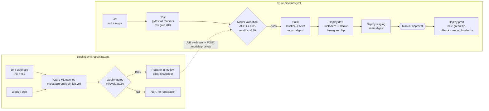

# Technical Notes — Fraud Detection API (Python ML Service CI/CD)

Actionable engineering notes for the fraud-detection service. Companion documents:
[`docs/PROJECT-PLAN.md`](PROJECT-PLAN.md) (scope/milestones) and
[`docs/ARCHITECTURE.md`](ARCHITECTURE.md) (system design). Paths below are relative to the
repository root.

---

## 3.1 CI/CD Pipeline Design

### 3.1.1 Main pipeline: `azure-pipelines.yml`

The main pipeline is a single multi-stage Azure DevOps YAML pipeline. Stage logic lives in
reusable templates under `pipelines/templates/`; per-environment values come from
`pipelines/variables/{dev,staging,prod}.yml` plus Library variable groups for secrets.

| Stage | Template | What runs | Gate (must pass to proceed) |
|---|---|---|---|
| **Lint** | `pipelines/templates/lint-test.yml` (lint job) | `ruff check`, `ruff format --check`, `mypy src/fraud_detection` | Zero lint/type errors |
| **Test** | `pipelines/templates/lint-test.yml` (test job) | `pytest` (all markers) with coverage, plus a dashboard `tsc`+Vite build job | All tests green; coverage gate **70%** on `fraud_detection` (suite currently sits ~89%) |
| **Model Validation** | `pipelines/templates/model-validation.yml` | `python -m fraud_detection.ml.train --no-register` — trains a candidate on the configured data source and enforces the gates in `ml/evaluate.py` | AUC >= 0.85, recall >= 0.70 on holdout (exit 1 blocks the stage) |
| **Build** | `pipelines/templates/build-image.yml` | Multi-stage `Dockerfile` build, `pip-audit`/trivy scan, push to `frauddetectacr.azurecr.io/fraud-detection-api:<tag>` | Image builds, scan has no critical CVEs; **digest recorded as pipeline artifact** |
| **Deploy dev** | `pipelines/templates/deploy-aks.yml` | `kubectl apply -k k8s/overlays/dev`, roll idle color, `scripts/smoke_test.py`, `scripts/blue_green_switch.sh` | Smoke test green |
| **Deploy staging** | `pipelines/templates/deploy-aks.yml` | Same, `k8s/overlays/staging` | Smoke + Azure DevOps Environment check (auto) |
| **Deploy prod** | `pipelines/templates/deploy-aks.yml` | Same, `k8s/overlays/prod`, blue-green switch with manual approval on the `prod` Environment | Manual approval + smoke on idle color *before* selector flip |

Infrastructure changes go through `pipelines/templates/terraform.yml`
(fmt/validate/plan on PR; apply on `master` with environment approval), operating on
`infra/terraform/` with `infra/terraform/environments/<env>.tfvars`.

**Why Model Validation is a distinct stage** (not folded into Test):

1. **Different failure semantics.** A unit-test failure means *the code is wrong*; a model-gate
   failure means *the artifact is not good enough*. The fix paths differ completely (code change
   vs. retrain/re-register in MLflow), so they must be separately visible in the pipeline UI.
2. **Different dependencies and cost.** Model tests pull an artifact from MLflow / Azure Blob and
   score a holdout set — slower, needs network + credentials that lint/test jobs should never
   have. Keeping it separate keeps the fast stages fast and least-privileged.
3. **It is the promotion gate shared with retraining.** The same gates
   (`src/fraud_detection/ml/evaluate.py`, `tests/model/`) are invoked by
   `pipelines/ml-retraining.yml`, so a challenger promoted by retraining passed *exactly* the
   gates the service pipeline enforces. One stage, one source of truth.
4. **It can be skipped safely** on doc-only or infra-only changes via path filters, while unit
   tests always run.

### 3.1.2 Retraining pipeline: `pipelines/ml-retraining.yml`

A **separate** pipeline, deliberately decoupled from code deploys:

- **Triggers:**
  - Webhook (Azure DevOps *incoming webhook* service connection + `resources.webhooks`) fired by
    the drift path: `src/fraud_detection/services/drift_detector.py` computes PSI per feature;
    when `fraud_drift_psi{feature} > FRAUD_DRIFT_PSI_THRESHOLD` (default 0.2),
    `src/fraud_detection/services/retraining.py` posts to the webhook (also reachable manually
    via `POST /api/v1/admin/retrain`).
  - Scheduled weekly cron as a safety net.
- **Steps:** submit `mlops/azureml/train-job.yml` to Azure ML (environment from
  `mlops/azureml/environment.yml`) → job runs `src/fraud_detection/ml/train.py` → evaluation via
  `ml/evaluate.py` gates → on pass, register new version of MLflow model `fraud-detection` and
  set alias **`challenger`**.
- **What it does NOT do:** it never touches the `champion` alias and never deploys. Promotion is
  an explicit human/API action (`POST /api/v1/models/promote`) after A/B evidence, keeping
  "new model exists" and "new model serves 100% of traffic" as separate, auditable events.

### 3.1.3 Poetry venv caching

Dependency installation dominates job time. Every job that needs Python uses:

```yaml
- task: Cache@2
  inputs:
    key: 'poetry | "$(Agent.OS)" | poetry.lock'
    restoreKeys: 'poetry | "$(Agent.OS)"'
    path: $(Pipeline.Workspace)/.venv
- script: |
    poetry config virtualenvs.in-project false
    poetry config virtualenvs.path $(Pipeline.Workspace)
    poetry install --no-interaction --sync
```

Key is the hash of `poetry.lock` — a lockfile change invalidates the cache; anything else
restores in seconds. `--sync` removes stale packages when restoring on top of an old cache.
Docker builds do **not** use this cache; they rely on `poetry export` + BuildKit layer caching
(see 3.3.1).

### 3.1.4 Pipeline diagram



---

## 3.2 Testing Strategy

### 3.2.1 Layout and markers

```
tests/
├── conftest.py                      # per-test SQLite DB, per-test copy of a real trained model store
├── unit/                            # service/repo logic on SQLite  @pytest.mark.unit
│   ├── test_ab_config.py            # runtime A/B config store
│   ├── test_ab_router.py            # sticky assignments + hash split properties
│   ├── test_drift_detector.py       # PSI math + DB-backed evaluation + auto-retrain
│   ├── test_evaluate.py             # hand-computed metrics + gate reasons
│   ├── test_model_loader.py         # two-tier resolution, fallback, cache invalidation
│   ├── test_prediction_service.py   # persistence, duplicates, DB-outage resilience
│   ├── test_repositories.py         # CRUD roundtrips for all four tables
│   ├── test_retraining.py           # local retraining jobs + debounce
│   └── test_schemas.py
├── integration/                     # FastAPI TestClient, in-proc   @pytest.mark.integration
│   ├── test_api_admin.py            # retrain lifecycle + drift over live traffic
│   ├── test_api_health.py
│   ├── test_api_models.py           # catalog, ab-config, promote, delete guards
│   └── test_api_predictions.py
└── model/                           # quality gates + invariants    @pytest.mark.model
    ├── test_model_quality.py
    ├── test_model_invariants.py
    └── test_training_pipeline.py    # artifacts, baseline schema, gate rejection
```

Markers are registered in `pyproject.toml` (`[tool.pytest.ini_options]`). The whole suite is
hermetic (SQLite + a model trained once per session into a temp store), so CI runs it in one
job; `-m model` can still isolate the quality gates when needed.

### 3.2.2 Coverage

- Gate: **70%** line coverage on `fraud_detection`, enforced with
  `--cov=fraud_detection --cov-fail-under=70` in the Test stage and `make coverage`.
  The suite currently measures **~89%** — the gate is a floor, not the target.
- Excluded via `[tool.coverage.report]` in `pyproject.toml`: `pragma: no cover` lines,
  `if __name__ == "__main__":` blocks and protocol `...` bodies. The training pipeline itself
  IS covered (`tests/model/test_training_pipeline.py` runs it end-to-end).

### 3.2.3 Integration tests — no network

`tests/integration/*` use `fastapi.testclient.TestClient` against the app from
`create_app()` (`src/fraud_detection/main.py`). No running server, no Docker, no Postgres:

- DB access uses the real dependency (`get_db_session`) against a **per-test SQLite file**
  created by `tests/conftest.py` via env overrides — real SQLAlchemy sessions and real
  repositories, no mocks on the persistence path.
- The model is **real**: a session-scoped fixture trains once via `ml/train.py` into a temp
  local model store, and each test gets its own mutable copy. MLflow is never imported —
  `services/model_loader.py` resolves the local store tier, so the suite passes on machines
  without `mlflow` installed (a hard requirement of this repo).

### 3.2.4 Model tests = quality gates

`tests/model/test_model_quality.py` asserts the **promotion contract** on the trained
artifact's stored metrics and on a *fresh* never-seen holdout sample:

- `roc_auc_score >= 0.85` and `recall >= 0.70` at registration (fraud is recall-critical: a
  missed fraud costs far more than a manual review);
- fresh-holdout generalization with a small allowed gap, and a shuffled-label sanity check
  (AUC must collapse to ~0.5, gates must reject).

`tests/model/test_model_invariants.py` asserts behavioral properties:

- **Determinism:** same input → identical probability, fuzzed over 200 seeded inputs.
- **Bounds/robustness:** probabilities stay in `[0, 1]` under missing/degenerate features;
  the heuristic fallback is monotone non-decreasing in the transaction amount.

Thresholds live in one place (`src/fraud_detection/ml/evaluate.py`) and are imported by the
tests, so pipeline and tests can never disagree.

### 3.2.5 Contract tests — future work

The exported spec (`docs/api/openapi.json`, regenerated with `make openapi`) plus the Pydantic
schemas in `src/fraud_detection/schemas/` and `tests/unit/test_schemas.py` are the contract
today. Property-based contract testing with **schemathesis** against that spec is a candidate
addition (a `contract` job in `pipelines/templates/lint-test.yml` running
`schemathesis run --app=fraud_detection.main:app`).

### 3.2.6 E2E / smoke

`scripts/smoke_test.py` is the single e2e entrypoint, used in two places:

1. In the pipeline against an **ephemeral `docker-compose.yml` environment** (api + postgres +
   prometheus) spun up in the Build stage — proves the *image* boots, migrates, and serves.
2. In `pipelines/templates/deploy-aks.yml` against the idle color's pod (port-forward /
   color-specific probe) **before** `scripts/blue_green_switch.sh` flips the Service selector.

It checks `GET /health/ready` and a real `POST /api/v1/predictions` (asserting a
`fraud_probability` in `[0, 1]`). `/health/live` is probed separately by
`scripts/blue_green_switch.sh` before flipping the Service selector. A `/metrics` assertion
(e.g. that `fraud_predictions_total` appears after the prediction call) is deliberately left
as future work — today metrics are validated in Grafana during the prod validation gate.

---

## 3.3 Deployment Strategy

### 3.3.1 Multi-stage Docker build (`Dockerfile`)

```
stage 1 "export":  poetry export -f requirements.txt --without dev -o requirements.txt
stage 2 "build":   python:3.12 — pip wheel -r requirements.txt -w /wheels
stage 3 "runtime": python:3.12-slim — pip install --no-index --find-links=/wheels,
                   copy src/, run as non-root user (uid 10001), EXPOSE 8000,
                   CMD uvicorn fraud_detection.main:app --host 0.0.0.0 --port 8000
```

Rules:

- **Poetry never enters the runtime image** (see pitfall 3.6.1). Only exported, hash-pinned
  requirements do.
- Runtime is slim + non-root + no compiler toolchain; wheels are built in stage 2 where gcc is
  available (needed for `psycopg2`).
- `.dockerignore` keeps `tests/`, `infra/`, `.venv`, `docs/` out of the build context.
- Image name/tag: `frauddetectacr.azurecr.io/fraud-detection-api:<git-sha>`.

### 3.3.2 AKS blue-green mechanics

> **NOTE — requirements vs. platform:** the original requirements say "ECS blue-green".
> This project's platform is Azure, so the pattern is implemented on **AKS**. The mechanics are
> the same idea (two identical task sets / deployments, atomic traffic switch, instant
> rollback); only the primitive differs — ECS CodeDeploy target-group swap vs. Kubernetes
> Service selector patch.

- Two Deployments exist permanently in namespace `fraud-detection`:
  `k8s/base/deployment-blue.yaml` and `k8s/base/deployment-green.yaml`, labeled
  `app: fraud-api, color: blue|green`.
- `k8s/base/service.yaml` (`fraud-api`) selects `app: fraud-api` **and** the active `color`.
  Whichever color the Service selects is live; the other is idle.
- Deploy flow (encoded in `pipelines/templates/deploy-aks.yml` +
  `scripts/blue_green_switch.sh`):
  1. Read current active color from the Service selector.
  2. `kubectl set image` the **idle** Deployment to the new digest; wait for rollout + readiness
     (`/health/ready`).
  3. Run `scripts/smoke_test.py` against the idle color directly.
  4. Flip: `kubectl patch service fraud-api -n fraud-detection -p '{"spec":{"selector":{"app":"fraud-api","color":"<new>"}}}'`.
  5. Keep the old color running (scaled, warm) for the rollback window.
- **Rollback = re-patch the selector back.** No image pull, no rollout — seconds, not minutes.
  `scripts/blue_green_switch.sh <blue|green>` is idempotent and is the only thing on-call needs.
- Per-env sizing via kustomize overlays: `k8s/overlays/{dev,staging,prod}/patch-replicas.yaml`;
  `k8s/base/hpa.yaml` and `k8s/base/pdb.yaml` protect the active color during node churn.

### 3.3.3 Image promotion — same digest, no rebuilds

The image is built **once** in the Build stage. The Build stage publishes the image
**digest** (`sha256:...`) as a pipeline artifact; Deploy dev/staging/prod all deploy
`frauddetectacr.azurecr.io/fraud-detection-api@sha256:...` — by digest, not tag. What you
smoke-tested in dev is byte-for-byte what runs in prod. Rebuilding per environment would
re-resolve base images and wheels and silently invalidate every earlier test result.
Environment differences are injected exclusively via `k8s/base/configmap.yaml`
(patched per overlay) and the `fraud-api-secrets` Secret — never baked into the image.

### 3.3.4 DB migrations under blue-green — expand-contract

During every deploy there is a window where **blue and green run simultaneously against the
same PostgreSQL database**. Therefore every Alembic migration in `migrations/versions/` must be
**backward-compatible by one application version** (expand-contract):

- **Expand (release N):** additive only — new nullable columns, new tables, new indexes
  (`CREATE INDEX CONCURRENTLY`), dual-write in code if renaming.
- **Contract (release N+1 or later):** drop/rename old columns only after no running version
  reads them.
- Forbidden in a single release: `DROP COLUMN`, `ALTER TYPE`, `NOT NULL` on existing columns,
  renames without a compatibility view.
- Migrations run as a step before rolling the idle color (`alembic upgrade head` via
  `migrations/env.py`, which imports metadata from `src/fraud_detection/db/models.py`) — safe
  precisely *because* of the expand-contract rule: the still-live old color must tolerate the
  new schema.

---

## 3.4 Environment Management

Configuration is a single `Settings` class (`pydantic-settings`) in
`src/fraud_detection/core/config.py`, env prefix **`FRAUD_`**, accessed via cached
`get_settings()`. One code path, three sources:

| Context | Source |
|---|---|
| Local dev | `.env` file at repo root (gitignored; copy from `.env.example`) |
| AKS (all envs) | Non-secrets: ConfigMap `fraud-api-config` (`k8s/base/configmap.yaml`, values patched per overlay in `k8s/overlays/<env>/`). Secrets: Secret `fraud-api-secrets`, synced from Azure Key Vault (provisioned by `infra/terraform/modules/keyvault/`) via CSI Secrets Store driver — **never committed**; only referenced by name from the Deployments. |
| Pipelines | Azure DevOps variable groups per env (`fraud-dev`, `fraud-staging`, `fraud-prod`), mapped in `pipelines/variables/{dev,staging,prod}.yml`; secrets linked from Key Vault. |

Rules: no config file baked into the image; `FRAUD_DATABASE_URL` is always a secret (it embeds
credentials); a new setting requires touching `config.py`, `.env.example`, the ConfigMap, and
(if secret) Key Vault + the variable group — PR checklist item.

`.env.example` (canonical template, kept in repo root — regenerate this section whenever
`Settings` gains a field):

```dotenv
# Fraud Detection API — local development template.
# Copy to .env (gitignored) and adjust. All settings use the FRAUD_ prefix,
# see src/fraud_detection/core/config.py.

FRAUD_APP_NAME=fraud-detection-api
FRAUD_ENVIRONMENT=local
FRAUD_DEBUG=false
FRAUD_LOG_LEVEL=INFO

# Database. Local default is zero-setup SQLite; compose/K8s override with
# PostgreSQL (postgresql+psycopg2://fraud:fraud@db:5432/fraud).
FRAUD_DATABASE_URL=sqlite:///./fraud.db
FRAUD_DB_AUTO_CREATE=true          # dev convenience; prod uses Alembic (entrypoint)

# Model registry
FRAUD_MLFLOW_TRACKING_URI=http://localhost:5000
FRAUD_MODEL_NAME=fraud-detection
FRAUD_MODEL_DIR=models             # versioned local model store (always-on tier)

# A/B testing (champion vs challenger)
FRAUD_AB_TEST_ENABLED=true
FRAUD_AB_TRAFFIC_SPLIT=10          # percent of accounts routed to challenger

# Drift detection + automated retraining
FRAUD_DRIFT_PSI_THRESHOLD=0.2
FRAUD_DRIFT_WINDOW_SIZE=500        # recent predictions per evaluation
FRAUD_DRIFT_MIN_ROWS=50            # minimum rows before drift is evaluated
FRAUD_AUTO_RETRAIN_ON_DRIFT=true
FRAUD_RETRAIN_MIN_INTERVAL_MINUTES=60   # debounce between automatic retrainings

# Training data source (empty = built-in synthetic generator)
FRAUD_TRAINING_DATA_PATH=
FRAUD_TRAINING_SAMPLES=20000

# Observability
FRAUD_METRICS_ENABLED=true

# Prefix for all business API routes (predictions, models, admin)
FRAUD_API_PREFIX=/api/v1
```

---

## 3.5 Version Control Workflow

**Trunk-based development.** `master` is always releasable; work happens on short-lived branches
(`feature/*`, `fix/*`, < ~2 days) merged via PR.

**PR gates** (branch policy on `master`): the Lint, Test and Model Validation stages of
`azure-pipelines.yml` run as the PR build (deploy stages are skipped on PR); plus one review and
linked work item. `.pre-commit-config.yaml` (ruff, ruff-format, end-of-file/newline fixers) runs
the same checks locally so PRs rarely bounce on lint.

**Why not Gitflow.** Gitflow earns its complexity when you ship multiple parallel versions or
cut long-stabilization releases. This service is a **single deployable** with continuous
delivery: `develop` would just be a stale copy of `master`, and release branches would duplicate
what the pipeline already provides — **promotion through dev → staging → prod of one immutable
digest, gated by environment approvals** (3.3.3). The pipeline *is* the release branch. Fewer
long-lived branches also means no merge-back drift, which matters when a hotfix must reach prod
in minutes via the blue-green flip.

**Releases.** Every merge to `master` builds and deploys to dev automatically. A prod deploy
tags the commit `vYYYY.MM.DD-<shortsha>` (annotated tag pushed by the prod stage), so
`git tag --contains` answers "is this fix live?". Hotfix = normal PR to `master` + fast-tracked
approvals; no hotfix branches off tags.

**Model versions are NOT tracked in git.** Weights/artifacts never enter the repo. The MLflow
registry (model `fraud-detection`, aliases `champion`/`challenger`) is the source of truth for
*which model*, and rows in the `model_versions` table plus the `model_version` label on
`fraud_predictions_total` record *which model served which request*. Git tracks only the code
that trains/serves models (`src/fraud_detection/ml/`, `mlops/azureml/`). Corollary: a model
rollback is an MLflow alias move + `POST /api/v1/models/promote` — **no git revert, no image
rebuild, no deploy.**

---

## 3.6 Common Pitfalls (this stack specifically)

### 3.6.1 Poetry inside Docker
Installing Poetry in the runtime image drags in its own dependency tree, slows builds, and has
historically broken on pip/virtualenv skew. **Rule:** Poetry exists only in build stage 1 of
`Dockerfile` to run `poetry export`; runtime installs from exported, hash-pinned requirements
via prebuilt wheels. If `poetry` appears in the final image, the build is wrong.

### 3.6.2 MLflow client/server version skew + Azure Blob artifact auth
The MLflow REST API drifts between minor versions (model registry aliases specifically —
`champion`/`challenger` need client >= 2.9). Pin the client in `pyproject.toml` to the server's
minor version. Artifact downloads go **directly to Azure Blob**, bypassing the tracking server —
so the serving pod needs Blob credentials (`AZURE_CLIENT_ID` via workload identity), not just
network access to `FRAUD_MLFLOW_TRACKING_URI`. Symptom of getting this wrong: registry calls
succeed, `load_model` fails with 403. Also: `src/fraud_detection/services/model_loader.py`
imports mlflow **lazily** and resolves the versioned **local model store** when MLflow is
unavailable (heuristic fallback only when both tiers are empty, with a counter + warning) —
required because dev machines here don't have mlflow installed; never move that import to
module level.

### 3.6.3 PSI drift false positives (seasonality)
PSI (`src/fraud_detection/services/drift_detector.py`) compared against a *fixed* training
baseline fires every Black Friday and every payday. Fixes: compare against a **rolling
baseline** (e.g. same window 7 days prior) in addition to the training baseline; debounce
automatic triggers — implemented as `FRAUD_RETRAIN_MIN_INTERVAL_MINUTES` in
`src/fraud_detection/services/retraining.py` (manual `POST /api/v1/admin/retrain` bypasses
it); alert (via `monitoring/prometheus/alerts.yml` on `fraud_drift_psi`) at a lower threshold
than the retrain trigger so humans see drift before automation acts.

### 3.6.4 A/B contamination — sticky assignment
If variant assignment were random per request, one account would see both models, poisoning
outcome attribution and enabling score-shopping by retrying a transaction. Assignment in
`src/fraud_detection/services/ab_router.py` is sticky in two layers: an existing
`ab_assignments` row **always wins** (so accounts keep their variant even when the split
changes mid-experiment), otherwise a **deterministic hash of `account_id`**
(`sha256(account_id) % 100 < traffic_split` → challenger) decides — stable across requests,
pods, and restarts even when the DB is down. Never "rebalance" by changing the hash function
mid-experiment; changing the split only moves the boundary cohort for *new* accounts. Tested
in `tests/unit/test_ab_router.py`.

### 3.6.5 Blue-green + Alembic
Already covered in 3.3.4 but worth restating as a pitfall because it's the most common
blue-green failure: a migration that drops/renames a column crashes the still-live old color
mid-deploy. Expand-contract, one version of backward compatibility, migrations reviewed with
"could the previous release run against this schema?" as an explicit PR question.

### 3.6.6 Prometheus label cardinality
Metrics in `src/fraud_detection/monitoring/metrics.py` must keep labels **low-cardinality**:
`fraud_predictions_total{variant,model_version,outcome}` is fine (2 × ~5 × 2 series). **Never**
label by `account_id` or `transaction_id` — that creates a time series per customer and OOMs
Prometheus. Same for HTTP metrics: `http_requests_total{method,path,status}` must use the
**route template** (`/api/v1/predictions`), not the raw URL — the middleware in
`src/fraud_detection/monitoring/middleware.py` reads `request.scope["route"].path` for this
reason. Per-entity data belongs in the `predictions` table, not in metrics.

### 3.6.7 Windows dev vs Linux runtime
Dev happens on Windows; containers and CI are Linux. Classic breakages: CRLF line endings making
`scripts/blue_green_switch.sh` fail with `bad interpreter`, `\` path building, and files
committed without the executable bit. Mitigations: `.gitattributes` forcing `eol=lf` for
`*.sh`/`*.py`/`*.yml`, `pathlib` everywhere in Python, `git update-index --chmod=+x scripts/*.sh`,
and `.pre-commit-config.yaml` hooks (`mixed-line-ending`, `check-executables-have-shebangs`)
catching it before CI does.

### 3.6.8 Pickled sklearn models and Python version pinning
A model pickled under one Python/sklearn version may fail — or worse, silently mispredict —
when unpickled under another. The training environment (`mlops/azureml/environment.yml`) and
the serving image (`Dockerfile`) must pin the **same Python 3.12.x minor and identical
`scikit-learn`/`numpy` versions**. Version pinning between `mlops/azureml/environment.yml`
and the serving image is a PR-review checklist item; the determinism/bounds tests in
`tests/model/test_model_invariants.py` are the last line of defense at load time.

### 3.6.9 asyncio + blocking model inference
`sklearn.predict_proba` is CPU-bound and synchronous — called from an `async def` handler it
would block the event loop and crater p99 latency under load (visible as
`fraud_prediction_latency_seconds` staying flat while `http_request_duration_seconds`
explodes). **Mitigation in place:** every route in `src/fraud_detection/api/routes/` is a
plain `def`, so Starlette runs handlers on its thread pool and the event loop stays free.
Keep it that way — converting a scoring route to `async def` without
`run_in_threadpool` around inference is a latency regression waiting to happen.

### 3.6.10 SQLite across threads (local dev + tests)
The local default DB is SQLite, and the retraining worker writes `model_versions` from a
background thread. SQLite connections refuse cross-thread use unless
`check_same_thread=False` — `src/fraud_detection/db/session.py` sets it for every `sqlite://`
URL (plus `StaticPool` for `:memory:` so all threads share the one in-memory DB). If you add
another engine construction path, copy those connect args or background writes will raise
`ProgrammingError: SQLite objects created in a thread...`.

### 3.6.11 Local model store vs MLflow skew
The two registry tiers can point at different versions: MLflow aliases move via the registry
UI/API while `registry.json` moves via `POST /api/v1/models/promote`. The loader prefers
MLflow whenever it is reachable, so an MLflow alias change silently wins over a local
promotion. Rule: in environments with MLflow, treat MLflow as the only write path (the
promote endpoint updates both when MLflow is available); the local store is authoritative
only where MLflow does not exist (local dev, air-gapped smoke environments).
