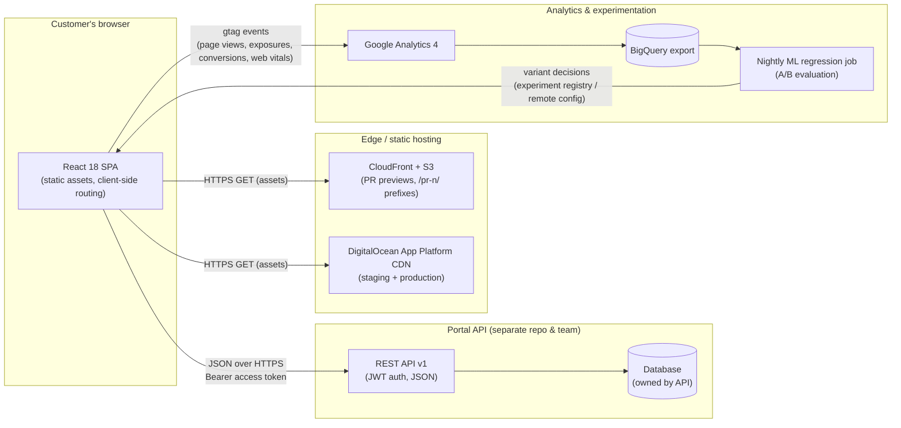
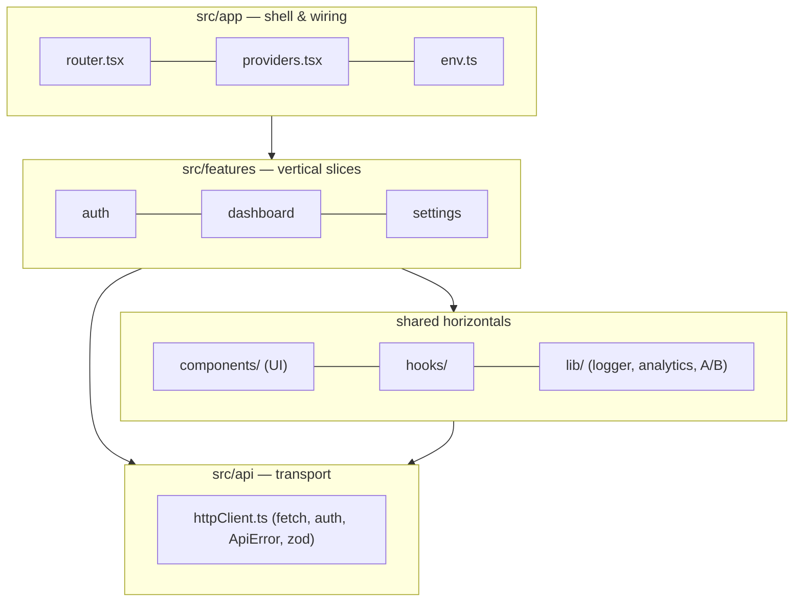
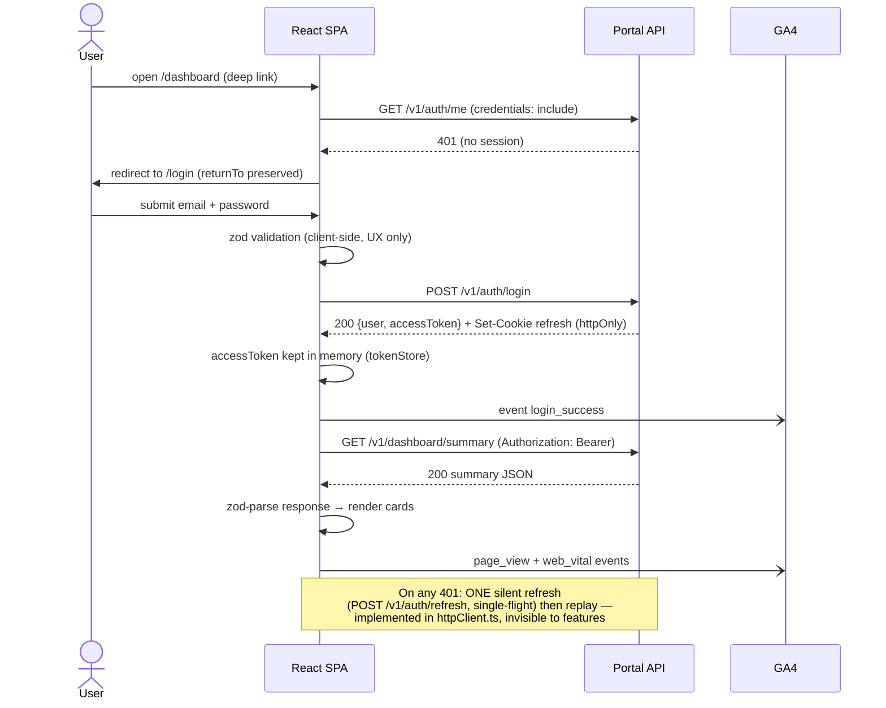
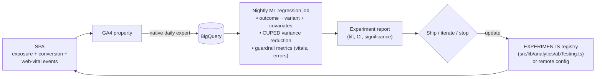

# Architecture — Customer Portal SPA

> Companion documents: [PROJECT-PLAN.md](./PROJECT-PLAN.md) (structure & roadmap),
> [TECH-NOTES.md](./TECH-NOTES.md) (pipeline, testing, deployment mechanics).

---

## 2.1 Chosen Architectural Pattern

**CDN-delivered SPA + external REST API** (a Jamstack-style split), with the frontend itself
organized as a **feature-sliced, layered modular monolith**.

### Why this pattern fits

- **The product is a portal behind a login.** There is no SEO requirement for authenticated
  content, which removes the main argument for SSR (Next.js et al.). A pure SPA keeps the
  hosting model trivially cheap and infinitely cacheable.
- **Static assets scale for free.** Every environment is "files on a CDN" — scaling, TLS, and
  global latency are the platform's problem. The only tier we must engineer for scale is the
  API, which is out of scope for this repo.
- **One team, one domain → no micro-frontends.** Feature slices (`src/features/auth|dashboard|settings`)
  give team-scalability (clear ownership, `CODEOWNERS`) without the operational tax of
  independently deployed frontends. If a slice ever needs independent cadence, it can be
  extracted along its existing boundary.
- **The robustness lives in the delivery pipeline.** For a frontend of this size the highest-risk
  surface is regression and performance decay, so the architecture invests in gates
  (Jest, Playwright, Lighthouse budgets) and disposable per-PR environments rather than in
  runtime infrastructure.

### Internal layering (frontend)

Dependency rule: arrows only point downward. `api/` and `lib/` never import from `features/`;
features never import from each other (shared needs get promoted to `components/`/`lib/`).

---

## 2.2 Key Component Interactions

| Interaction         | Mechanism                                                              | Notes                                                                                                       |
| ------------------- | ---------------------------------------------------------------------- | ----------------------------------------------------------------------------------------------------------- |
| SPA ↔ Portal API    | REST/JSON over HTTPS                                                   | `src/api/httpClient.ts`; responses parsed with zod so contract drift fails fast and loudly                  |
| Authentication      | Bearer access token (in-memory) + httpOnly refresh cookie              | See §2.5; no tokens in localStorage                                                                         |
| SPA ↔ GA4           | `gtag` events, fire-and-forget                                         | Typed event map in `src/lib/analytics/events.ts`; analytics is _lossy by design_ — never on a critical path |
| A/B assignment      | Local deterministic hashing (`abTesting.ts`) + future remote overrides | Exposure events flow to GA4 → BigQuery → ML regression                                                      |
| Dev/test ↔ mock API | MSW service worker / node server                                       | Same handlers serve `npm run dev`, Jest, and hermetic E2E builds                                            |
| CI ↔ AWS            | GitHub OIDC → short-lived role credentials                             | `aws s3 sync` + CloudFront invalidation per PR                                                              |
| CI ↔ DigitalOcean   | `digitalocean/app_action` with scoped API token                        | Declarative app specs in `infra/digitalocean/`                                                              |

**Deliberately absent:** client-side message queues, GraphQL, and shared mutable state
libraries. Server cache/state is currently handled by `useFetch`; if invalidation logic grows,
the sanctioned upgrade path is TanStack Query behind the same feature-slice API modules
(hook point already marked in `src/app/providers.tsx`).

---

## 2.3 Data Flow

### Primary journey: login → dashboard

### Analytics & ML/A/B regression loop

The frontend's contract with this loop is narrow and testable: **deterministic assignment**
(same user → same variant, verified by unit tests) and **faithful exposure logging** (an
`experiment_exposure` event exactly when the variant UI is actually rendered). Everything
statistical happens offline in the warehouse, where it can be re-run and audited.

---

## 2.4 Scalability & Performance Strategy

**Traffic scalability** is delegated to CDNs on both targets; there are no servers owned by
this repo to scale. The engineering effort therefore goes into _payload_ and _perceived_
performance:

- **Caching contract:** Vite emits content-hashed filenames under `assets/`; deploy scripts
  upload those with `Cache-Control: public,max-age=31536000,immutable` and `index.html` with
  `no-cache`. Rollbacks and deploys are instant and safe (only the HTML pointer changes).
- **Code splitting:** every routed page is `React.lazy`-loaded (`src/app/router.tsx`); vendor
  libraries are chunked separately (`vite.config.ts` `manualChunks`) so app changes don't
  invalidate the React chunk.
- **Budgets as gates:** `.lighthouserc.json` enforces performance ≥ 0.90, accessibility ≥ 0.95,
  LCP ≤ 2.5 s, TBT ≤ 300 ms, CLS ≤ 0.10 and a JS transfer budget on every PR. Decay is caught
  at review time, not in production.
- **RUM feedback:** `web-vitals` metrics from real users flow to GA4 (`webVitals.ts`), closing
  the loop that lab-only Lighthouse leaves open.
- **Team scalability:** feature slices + the downward-only dependency rule keep merge conflicts
  and blast radius local; `CODEOWNERS` routes reviews.
- **Future levers (documented, not built):** runtime `/config.json` to avoid per-env rebuilds,
  TanStack Query for request dedup/caching, container+nginx tier if header-level tuning
  (early hints, strict CSP) becomes necessary.

---

## 2.5 Security Considerations

### Authentication & authorization

- Credentials are exchanged at `POST /v1/auth/login` for a **short-lived access token kept only
  in memory** (`tokenStore` in `httpClient.ts`) plus a **refresh token in an httpOnly,
  `Secure`, `SameSite=Strict` cookie** scoped to the refresh endpoint. Rationale: an XSS payload
  cannot read httpOnly cookies or trivially exfiltrate a token that never touches
  `localStorage`; CSRF on the refresh endpoint is blunted by SameSite + a rotating refresh
  token (backend-enforced).
- Authorization is **enforced by the API** on every request; the SPA's `ProtectedRoute` and
  role checks are UX conveniences, never security boundaries.
- Silent refresh + single replay on 401 is implemented in `httpClient.ts` — single-flight
  (concurrent 401s share one refresh round-trip) and bounded (a replayed request is never
  retried again). Idle-session expiry UX remains a roadmap item (PROJECT-PLAN Phase 3).

### Data protection

- TLS everywhere (CDN-terminated). No PII is persisted client-side; the only browser storage
  used is the session cookie (API-owned). Analytics events must contain **ids, never PII** —
  the typed event map (`events.ts`) is the reviewable choke point.
- GA runs in Consent Mode with everything denied by default; `gtag.js` is only injected
  after the user accepts the consent banner (`ConsentBanner` + `setAnalyticsConsent` in
  `analytics.ts`), and the decision persists in localStorage.

### API & app security

- Client-side zod validation is UX; the mock handlers in `mocks/` deliberately re-validate
  server-side to model the real contract ("never trust the client").
- Security headers: on the container path they're set in `nginx.conf` (CSP, `X-Content-Type-Options`,
  `Referrer-Policy`, `Permissions-Policy`). DO static hosting has limited header control — if a
  strict CSP becomes mandatory, ADR-001's container fallback is the sanctioned route.
- React's JSX escaping is relied on; `dangerouslySetInnerHTML` is banned by review convention.

### Secret management

- **No secrets in the frontend, ever:** every `VITE_*` value is embedded in the public bundle.
  `.env.example` carries this warning; anything sensitive lives in GitHub **Environments**
  (`pr-preview`, `staging`, `production` — the latter with required reviewers).
- **AWS access is OIDC-federated** (`id-token: write` + `aws-actions/configure-aws-credentials`
  role assumption) — no long-lived AWS keys exist in GitHub.
- DigitalOcean uses a scoped API token stored as an environment secret.
- Supply chain: committed lockfile + `npm ci` only, weekly Dependabot, nightly `npm audit`;
  pinning Actions to SHAs is a Phase 3 hardening task.

---

## 2.6 Error Handling & Logging Philosophy

**One taxonomy, three destinations, no silent failures.**

- **Taxonomy:** everything the transport layer throws is an `ApiError { status, code, message,
details }` (`src/api/httpClient.ts`) — including zod parse failures (contract drift surfaces
  as an error, not as `undefined` UI). Features branch on `code`/`status`, never on message
  strings.
- **Containment layers:**
  1. _Hook level_ — `useFetch` converts errors into an explicit `status: 'error'` state so every
     screen renders a recoverable error UI with a Retry affordance (see `ExampleComponent`).
  2. _Route level_ — the router's `errorElement` (`RouteErrorFallback`) catches render/loader
     failures per page without unmounting the shell.
  3. _App level_ — a top-level class `ErrorBoundary` is the last line; it logs and offers reload.
  4. _Global_ — `window.onerror` / `unhandledrejection` hooks feed the logger (wired in
     `main.tsx`) so nothing escapes unrecorded.
- **Logging:** all code logs through `src/lib/logger.ts` (leveled, environment-aware) — never
  `console.*` directly. `warn`/`error` are forwarded to whatever collector is registered via
  `registerErrorTransport()` (a pluggable seam; wiring Sentry there with release =
  `VITE_APP_VERSION` — the git SHA — is an ops task, PROJECT-PLAN Phase 2). PII scrubbing
  happens in the transport, at the boundary, and a throwing transport can never take the
  app down.
- **User-facing rules:** errors users can act on (bad password, offline) get specific, polite
  messages; everything else gets a generic apology + retry, while the full detail goes to
  telemetry. Error states are first-class UI states, designed and tested (unit tests cover
  error branches; E2E covers the login-failure journey).
- **In CI:** the same philosophy — fail fast (`--max-warnings 0`, coverage thresholds,
  Lighthouse assertions), keep evidence (Playwright traces/videos on retry, uploaded as
  artifacts), and treat flakiness as a defect (retries are capped at 2 and tracked, not
  tolerated).
