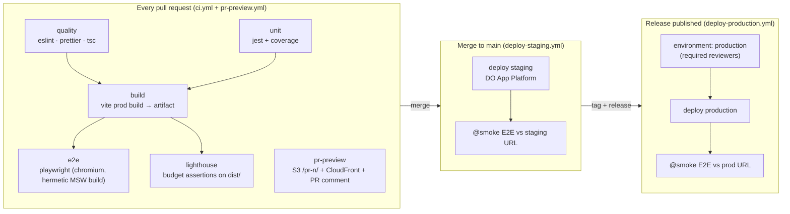

# Technical Notes — Customer Portal SPA

> Companion documents: [PROJECT-PLAN.md](./PROJECT-PLAN.md), [ARCHITECTURE.md](./ARCHITECTURE.md).

---

## 3.1 CI/CD Pipeline Design



### Stage-by-stage

| Stage      | Command                                  | Gate                            | Notes                                                                                  |
| ---------- | ---------------------------------------- | ------------------------------- | -------------------------------------------------------------------------------------- |
| Lint       | `npm run lint`                           | `--max-warnings 0`              | ESLint 9 flat config                                                                   |
| Format     | `npm run format:check`                   | any diff fails                  | Prettier is not negotiable in review                                                   |
| Typecheck  | `npm run typecheck`                      | `tsc --noEmit`                  | separate from build so failures are labeled clearly                                    |
| Unit       | `npm run test:coverage -- --ci`          | coverage thresholds (80/70)     | jsdom + MSW; junit + lcov artifacts                                                    |
| Build      | `npm run build`                          | build success                   | `VITE_APP_VERSION=$GITHUB_SHA`; `dist/` uploaded as artifact                           |
| E2E        | `npm run test:e2e -- --project=chromium` | all specs                       | builds its own **hermetic** bundle (`--mode e2e`, MSW on) — deterministic, no live API |
| Lighthouse | `npx lhci autorun`                       | `.lighthouserc.json` assertions | runs against the **production** dist artifact, median of 3 runs                        |
| Preview    | `scripts/deploy-pr-preview.sh`           | n/a (informational)             | sticky PR comment with the URL                                                         |

### Design decisions

- **Fail fast, in parallel:** quality/unit run concurrently; build fans out to e2e + lighthouse.
  Nothing waits on anything it doesn't consume.
- **One install definition:** the composite action `.github/actions/setup-node-cache` owns
  Node version (`.nvmrc`), npm cache, and `npm ci` — workflows can't drift from each other.
- **Artifacts over rebuilds:** lighthouse consumes the `dist` artifact from the build job; the
  only intentional second build is the hermetic E2E bundle (different mode, different env).
- **Concurrency groups** cancel superseded runs per ref/PR — force-pushing doesn't queue zombies.
- **Least privilege:** workflows default to `contents: read`; only `pr-preview.yml` adds
  `id-token: write` (AWS OIDC) and `pull-requests: write` (comment).
- **Required checks** for branch protection: `quality`, `unit`, `build`, `e2e`, `lighthouse`.

---

## 3.2 Testing Strategy

**Shape:** classic pyramid — many Jest tests, a focused Playwright suite, a thin `@smoke`
layer that runs against live environments.

### Unit & integration (Jest 29 + Testing Library + MSW)

- `jest-environment-jsdom`, tests colocated with source (`*.test.ts[x]`).
- **Coverage gate:** 80 % lines/statements/functions, 70 % branches on `src/`
  (`jest.config.ts#coverageThreshold`). Ratchet upward per directory as slices mature; never
  chase 100 % — cover branches that carry behavior (error paths especially).
- **Conventions:** query by role/label (`getByRole`, `getByLabelText`) — this doubles as an
  a11y check; no implementation-detail assertions; `user-event` over `fireEvent`; snapshots
  only for tiny, stable output.
- **Integration flavor:** components are tested against **MSW handlers**, not mocked hooks —
  `ExampleComponent.test.tsx` exercises the real `useFetch` + `httpClient` + mock API chain,
  including the 500 → Retry path. That's the highest-value test per line of test code.
- Pure logic (e.g. `abTesting.ts` bucketing determinism/distribution) is tested exhaustively —
  it's cheap and the A/B pipeline depends on it.

### End-to-end (Playwright)

- **Two modes, one suite:**
  - _Hermetic (default, PRs):_ `playwright.config.ts` starts `npm run e2e:serve`, which builds
    with `--mode e2e` (`.env.e2e` → MSW enabled) and serves `dist/` via `vite preview`.
    Deterministic data, no network flake, safe to parallelize.
  - _Live (`PLAYWRIGHT_BASE_URL` set):_ no webServer; deploy workflows run only specs tagged
    `@smoke` against staging/production. Smoke specs must be read-only and idempotent.
- **Patterns:** shared fixtures (`e2e/fixtures/auth.fixture.ts` provides `loggedInPage`),
  role/label selectors only, no `waitForTimeout`, `trace: on-first-retry` +
  screenshots/videos retained on failure and uploaded as CI artifacts.
- **Browser matrix:** chromium on every PR (speed); chromium + firefox + webkit nightly
  (`nightly.yml`) — full-matrix-on-PR buys flake, not confidence.
- **Flake policy:** `retries: 2` in CI, but a test that needed a retry gets a ticket; quarantine
  via `test.fixme` rather than deleting.

### What we deliberately don't do

- No shallow rendering, no enzyme-style internals testing.
- No E2E through GA/AWS/DO — third parties are asserted at the boundary (events queued,
  scripts injected) and trusted beyond it.

---

## 3.3 Deployment Strategy

Three targets, one build contract (`dist/` of static files):

| Environment | Platform                      | Trigger                   | URL pattern                          |
| ----------- | ----------------------------- | ------------------------- | ------------------------------------ |
| PR preview  | AWS S3 + CloudFront           | PR open/update            | `https://<PREVIEW_DOMAIN>/pr-<n>/`   |
| Staging     | DO App Platform (static site) | merge to `main`           | `https://staging.portal.example.com` |
| Production  | DO App Platform (static site) | GitHub Release + approval | `https://portal.example.com`         |

### DigitalOcean App Platform (staging/production)

- Declarative specs in `infra/digitalocean/app*.yaml`: static-site component,
  `output_dir: dist`, and — critically for an SPA — `catchall_document: index.html` so deep
  links don't 404.
- `deploy_on_push: false`: GitHub Actions is the **only** deployer
  (`digitalocean/app_action/deploy@v2`), so a deploy always implies green gates. Rollback =
  DO's previous-deployment rollback (fast) or revert commit → pipeline (preferred, keeps
  history truthful).
- Build-time env (`VITE_*`) is defined per spec — staging and production are **separate builds**,
  not one artifact promoted (Vite inlines env at build; see §3.4 and the runtime-config
  escape hatch).

### PR previews (S3 + CloudFront)

- One private bucket + one CloudFront distribution (Origin Access Control); each PR lives under
  the `pr-<n>/` prefix. Infra stub: `infra/aws/pr-preview-stack.yml`.
- The build must know its prefix: `vite build --base "/pr-<n>/"`, and the router follows via
  `basename: import.meta.env.BASE_URL` (already wired in `router.tsx`). Forgetting either is
  the #1 preview bug — see §3.6.
- **Cache-control split** (in `scripts/deploy-pr-preview.sh`): hashed `assets/` →
  `max-age=31536000,immutable`; `index.html` and friends → `no-cache`. Invalidation scope is
  only `/pr-<n>/*`.
- A CloudFront Function rewrites `/pr-<n>/<deep-link>` → `/pr-<n>/index.html` (SPA fallback
  per prefix). Previews default to the hermetic MSW build so they work without a shared dev API.
- Teardown on PR close (`pr-preview-cleanup.yml`) keeps the bucket and invalidation bills flat.

### Containerization strategy

The SPA needs no container to run — and DO's static tier is cheaper and simpler — so the
default path is bufferless static hosting. A production-grade `Dockerfile` (multi-stage:
node build → nginx) + `nginx.conf` are nevertheless maintained because they are the sanctioned
fallback when **response-header control** (strict CSP, HSTS preload, `Permissions-Policy`)
outgrows what DO static sites offer, and they make the app portable to any container platform
(DO Web Service, K8s) without redesign. The nginx config already implements the same caching
contract, SPA fallback, and a `/healthz` endpoint.

---

## 3.4 Environment Management

**Cardinal rule:** every `VITE_*` variable is **baked into the public JS bundle at build
time**. Two consequences: (1) never a secret, (2) changing one means rebuilding, which is why
each environment is its own build.

| Variable                 | local        | e2e (hermetic) | PR preview     | staging          | production    |
| ------------------------ | ------------ | -------------- | -------------- | ---------------- | ------------- |
| `VITE_ENV_NAME`          | `local`      | `e2e`          | `preview`      | `staging`        | `production`  |
| `VITE_API_BASE_URL`      | `/api` (MSW) | `/api` (MSW)   | `/api` (MSW) † | staging API URL  | prod API URL  |
| `VITE_ENABLE_MSW`        | `true`       | `true`         | `true` †       | `false`          | `false`       |
| `VITE_GA_MEASUREMENT_ID` | empty (off)  | empty (off)    | empty (off)    | staging property | prod property |
| `VITE_APP_VERSION`       | `dev`        | `dev`          | git SHA        | git SHA          | git SHA       |

† until a shared dev API exists; then previews flip to it via repo variables.

- **Sources:** local dev → committed `.env.development` defaults (MSW on, no secrets), with
  personal overrides in gitignored `.env.local`; e2e → checked-in `.env.e2e`; CI → workflow
  `env:` blocks fed by GitHub **variables** (public config) and **secrets** (credentials),
  scoped per **Environment** (`pr-preview`, `staging`, `production` with required reviewers).
- **Secrets inventory (GitHub):** `DIGITALOCEAN_ACCESS_TOKEN`, `AWS_ROLE_ARN` (OIDC — no static
  AWS keys), `LHCI_GITHUB_APP_TOKEN` (optional). Variables: `PREVIEW_BUCKET`,
  `PREVIEW_CF_DISTRIBUTION_ID`, `PREVIEW_DOMAIN`, per-env API URLs and GA ids.
- **Guardrails:** `src/app/env.ts` is the only file reading `import.meta.env` (typed in
  `vite-env.d.ts`); `scripts/check-env.mjs` fails CI builds when required vars are missing.
- **Escape hatch (Phase 3):** if per-env rebuilds hurt, serve `/config.json` per environment
  and fetch at boot — then one artifact can be promoted. Documented now so nobody "solves" it
  with runtime `process.env` hacks that Vite can't fulfill.

### `.env.example` template

The authoritative copy lives at the repo root ([`.env.example`](../.env.example)); keep this
excerpt in sync:

```bash
# ⚠️  Every VITE_* value is PUBLIC — embedded in the shipped JS bundle. Never put secrets here.
VITE_ENV_NAME=local
VITE_API_BASE_URL=/api
VITE_ENABLE_MSW=true
VITE_GA_MEASUREMENT_ID=
VITE_APP_VERSION=dev

# Tooling (not baked into the bundle) —
PLAYWRIGHT_BASE_URL=            # set to run E2E against a deployed URL instead of local preview
PREVIEW_BUCKET=                 # CI-only: S3 bucket for PR previews
PREVIEW_CF_DISTRIBUTION_ID=     # CI-only: CloudFront distribution
PREVIEW_DOMAIN=                 # CI-only: previews.example.com
```

---

## 3.5 Version Control Workflow

**GitHub Flow with release tags** (trunk-ish): short-lived branches off `main`, PR with all
gates + preview, **squash merge**, `main` auto-deploys to staging, production ships by
publishing a Release (`v1.4.0`) which triggers the approval-gated prod workflow.

Why this and not the alternatives:

- **Not Gitflow:** Gitflow earns its complexity when multiple released versions need parallel
  maintenance (`release/*`, `hotfix/*`, `develop`). A continuously deployed SPA has exactly one
  live version; Gitflow here would only add merge ceremony and stale branches.
- **Not pure trunk-based (commit straight to main):** the PR is where this project's value
  concentrates — preview URLs, Lighthouse budgets, review, E2E. We keep trunk-based _spirit_
  (branches live hours-to-days, no long-running feature branches) with PR mechanics.

Conventions: `feat/…`, `fix/…`, `chore/…` branch names; Conventional Commits on squash titles
(enables changelog automation later); branch protection on `main` — required checks
(§3.1), ≥ 1 review, linear history, no force push; hotfix = same flow, expedited by an
immediate release after merge.

---

## 3.6 Common Pitfalls (this exact stack)

1. **`import.meta.env` explodes under Jest.** ts-jest compiles to CJS where `import.meta` is a
   syntax error. _Solution (already wired):_ only `src/app/env.ts` touches `import.meta`, and
   `jest.config.ts` maps `^@/app/env$` → `src/test/env.mock.ts`. Never read `import.meta.env`
   elsewhere or Jest breaks mysteriously.
2. **MSW v2 + Jest needs two fixes, both encountered here.** (a) `jest-environment-jsdom`
   strips Node globals (fetch, streams, `TextEncoder`, `structuredClone`) and resolves
   package `exports` with the browser condition, hiding `msw/node`. _Solution (wired):_ the
   `jest-fixed-jsdom` test environment, plus `src/test/polyfills.ts` for the two gaps jsdom
   itself still has (`AbortSignal.timeout`, `structuredClone` belt-and-braces).
   (b) msw ≥ 2.11 depends on the **ESM-only** package `rettime`; real Node ≥ 22 handles
   `require(esm)`, but Jest's CJS runtime does not and dies with "Cannot use import statement
   outside a module". _Solution (wired):_ msw is pinned to `~2.10` (same API surface) until
   the test runner is ESM-native — unpin when moving to Vitest or Jest-ESM.
3. **`VITE_*` = public.** Someone will eventually try to add an API secret "just for staging".
   The bundle ships it to every browser. Review `.env.example` changes accordingly; secrets
   go in GitHub Environments only.
4. **SPA deep-link 404s exist in four places.** DO (`catchall_document`), nginx (`try_files`),
   CloudFront (rewrite function per `/pr-<n>/` prefix) — and the router itself
   (`basename: import.meta.env.BASE_URL`) for prefixed previews. Symptom: app loads from `/`
   but F5 on `/settings` 404s, or a preview renders a blank page with asset 404s → the `--base`
   flag or basename was dropped.
5. **Lighthouse scores are noisy.** Single runs on shared runners swing ±5 points.
   _Mitigations (already configured):_ `numberOfRuns: 3` (median), assertions on **numeric
   metrics** (LCP/TBT/CLS) with headroom rather than only the composite score, budgets rolled
   out as `warn` first, then `error` once a baseline exists. Note: the **SEO category is
   deliberately not asserted** — portal pages are intentionally non-indexable
   (`public/robots.txt`), which caps the SEO score by design and would only produce
   permanent warning noise.
6. **Hermetic E2E vs production build drift.** E2E runs a `--mode e2e` MSW build; production
   ships without MSW. Keep the delta to _test doubles only_ (never branch app logic on
   `VITE_ENV_NAME`), keep mocks honest against `contracts/openapi.yaml`, and let zod response
   parsing catch contract drift in staging smoke runs.
7. **ESLint 9 flat config ecosystem.** Plugins must explicitly support flat config; mixing
   `.eslintrc.*` styles or legacy `extends` silently misconfigures. This repo is flat-only
   (`eslint.config.js`); when adding a plugin, use its `configs.flat*`/`flatConfigs` export.
8. **Windows dev vs Linux CI.** CRLF in `scripts/*.sh` breaks bash runners ("bad interpreter");
   optional native deps (esbuild/rollup) differ per OS. _Solution:_ `.gitattributes` forces LF
   (with `*.sh text eol=lf` explicitly), and `package-lock.json` is committed from Linux/CI,
   not from a Windows machine.
9. **Ad-blockers eat GA.** 20–40 % of events can vanish; never gate features on gtag loading
   (the wrapper queues and no-ops), treat GA-derived A/B data as lossy, and log exposure at
   variant _render_ time — assignment-time logging inflates exposure and biases the regression.
10. **`vite preview` serves stale builds.** Playwright's webServer here rebuilds via
    `e2e:serve` on purpose. If you "optimize" it to plain `preview`, you'll test yesterday's
    `dist/` — keep the build in the chain or clean `dist/` first.
11. **`npm audit` policy.** Production dependencies must stay at zero vulnerabilities — the
    nightly workflow fails on high+ there. Dev-tooling findings are triaged, not blindly
    "fixed": as of 2026-07-12 the only remaining ones live inside `@lhci/cli@0.15.1`
    (latest; `inquirer → tmp`, `uuid`) — a CI-only CLI run against our own artifacts on
    ephemeral runners, accepted until upstream updates. `npm audit fix --force` would
    downgrade `@lhci/cli` to 0.1.0 — never run it blindly.
12. **nginx `add_header` does not inherit past a location's own `add_header`.** A location
    declaring even one `add_header` (e.g. `Cache-Control`) silently discards every
    server-level header — we shipped the container with zero security headers until the
    running stack was probed. _Solution (wired):_ the security set lives in
    `nginx-security-headers.conf` and is `include`d at server level **and** in every
    location that sets its own header. If you add a location with `add_header`, add the
    include too — and verify with `curl -I`, not by reading the config.
