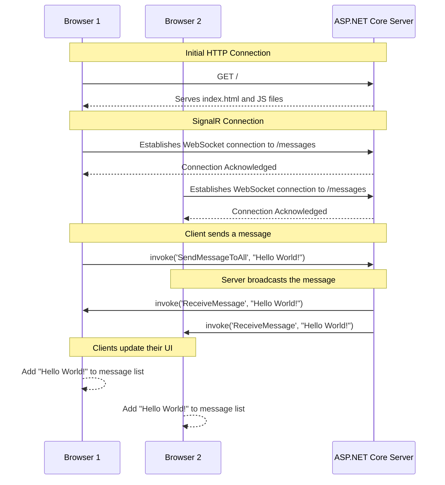

# ASP.NET Core SignalR Chat Demo

This project is a simple real-time chat application built with ASP.NET Core SignalR. It demonstrates how to set up a SignalR hub on the backend and a basic HTML/JavaScript client on the frontend.

## A Note on `Startup.cs` vs. `Program.cs`

This guide uses the modern .NET "minimal hosting model," where all application configuration is done in the `Program.cs` file.

If you are using an older version of .NET (.NET 5 or earlier), your project will have a `Startup.cs` file. The logic for configuring services (e.g., `services.AddSignalR()`) and the middleware pipeline (e.g., `app.UseStaticFiles()` and `app.MapHub<MessageHub>()`) would go into the `ConfigureServices` and `Configure` methods in `Startup.cs`, respectively.

## Application Diagram

The following diagram illustrates the communication flow between the clients and the server.



## How to Create This Project From Scratch

These instructions will guide you through creating this project from a blank template.

### 1. Initialize the Project

First, create a new ASP.NET Core web application. This command also sets the project's default namespace.

```bash
dotnet new web -n Practical.AspNetCore.SignalR
cd Practical.AspNetCore.SignalR
```

### 2. Add the SignalR Hub

A "hub" is the central component of SignalR that receives and sends messages.

1.  Create a new folder named `Hubs`:
    ```bash
    mkdir Hubs
    ```

2.  Create a new file inside the `Hubs` folder named `MessageHub.cs` and add the following C# code. This hub has a single method, `SendMessageToAll`, which takes a message and broadcasts it to every connected client.

    ```csharp
    // Hubs/MessageHub.cs
    using Microsoft.AspNetCore.SignalR;

    namespace Practical.AspNetCore.SignalR.Hubs
    {
        public class MessageHub : Hub
        {
            public Task SendMessageToAll(string message)
            {
                return Clients.All.SendAsync("ReceiveMessage", message);
            }
        }
    }
    ```

### 3. Configure the Application

Now, you need to configure your application to use SignalR and map your new hub to an endpoint. Modify your `Program.cs` file to look like this.

> **Note:** We are adding the SignalR service (`AddSignalR`), enabling static files (`UseDefaultFiles` and `UseStaticFiles`) for our client, and mapping the hub to the `/messages` URL (`MapHub`).

```csharp
// Program.cs
using Practical.AspNetCore.SignalR.Hubs;

var builder = WebApplication.CreateBuilder(args);

// Add services to the container.
builder.Services.AddSignalR();

var app = builder.Build();

// Configure the HTTP request pipeline.
app.UseDefaultFiles(); // Enables serving index.html
app.UseStaticFiles();  // Enables serving files from wwwroot

// Map the SignalR hub to the "/messages" endpoint
app.MapHub<MessageHub>("/messages");

app.Run();
```

### 4. Create the Client-Side Frontend

We will create a simple HTML page with JavaScript to act as the chat client.

1.  **Create the Web Root Folder**
    ASP.NET Core serves static files from the `wwwroot` directory by default.

    ```bash
    mkdir wwwroot
    ```

2.  **Initialize npm and Install SignalR Client**
    Navigate to your project's root directory and run npm to download the SignalR client library.

    ```bash
    npm init -y
    npm install @microsoft/signalr
    ```

3.  **Create the HTML Page**
    Create a new file `wwwroot/index.html` with the following content:

    ```html
    <!-- wwwroot/index.html -->
    <!DOCTYPE html>
    <html>
    <head>
        <meta charset="utf-8" />
        <title>SignalR Client</title>
    </head>
    <body>
        <h1>SignalR Client</h1>
        <textarea id="message" rows="3" placeholder="Enter a message..."></textarea>
        <br />
        <button id="sendButton">Send Message</button>
        <hr />
        <h3>Messages</h3>
        <ul id="messagesList"></ul>

        <script src="js/signalr.js"></script>
        <script src="js/site.js"></script>
    </body>
    </html>
    ```

4.  **Add the SignalR and Site JavaScript Files**
    First, create a `js` sub-folder in `wwwroot`.

    ```bash
    mkdir wwwroot/js
    ```

    Next, copy the SignalR client library from the `node_modules` folder into your `wwwroot/js` folder.

    ```bash
    cp node_modules/@microsoft/signalr/dist/browser/signalr.js wwwroot/js/
    ```

    Finally, create your site's custom JavaScript file `wwwroot/js/site.js` with the code to connect to the hub and handle messages.

    ```javascript
    // wwwroot/js/site.js
    const connection = new signalR.HubConnectionBuilder()
        .withUrl("/messages")
        .build();

    // This function is called by the server to send a message
    connection.on("ReceiveMessage", (message) => {
        const li = document.createElement("li");
        li.textContent = message;
        document.getElementById("messagesList").appendChild(li);
    });

    // Add a click listener to the send button
    document.getElementById("sendButton").addEventListener("click", (event) => {
        const message = document.getElementById("message").value;
        // This calls the "SendMessageToAll" method on the C# hub
        connection.invoke("SendMessageToAll", message).catch((err) => {
            return console.error(err.toString());
        });
        event.preventDefault();
    });

    // Start the connection
    async function start() {
        try {
            await connection.start();
            console.log("SignalR Connected.");
        } catch (err) {
            console.log(err);
            setTimeout(start, 5000); // Retry connection after 5 seconds
        }
    };

    connection.onclose(async () => {
        await start();
    });

    start();
    ```

### 5. Run the Application

You are all set! Run the application from your terminal:

```bash
dotnet run
```

Open your web browser and navigate to the URL provided in the output (e.g., `http://localhost:5000`). You can open multiple browser tabs to simulate multiple users and see messages appear in real-time.pplication.CreateBuilder(args);

// Add services to the container.
builder.Services.AddSignalR();

var app = builder.Build();

// Configure the HTTP request pipeline.
app.UseDefaultFiles(); // Enables serving index.html
app.UseStaticFiles();  // Enables serving files from wwwroot

// Map the SignalR hub to the "/messages" endpoint
app.MapHub<MessageHub>("/messages");

app.Run();
```

### 4. Create the Client-Side Frontend

We will create a simple HTML page with JavaScript to act as the chat client.

1.  **Create the Web Root Folder**
    ASP.NET Core serves static files from the `wwwroot` directory by default.

    ```bash
    mkdir wwwroot
    ```

2.  **Initialize npm and Install SignalR Client**
    Navigate to your project's root directory and run npm to download the SignalR client library.

    ```bash
    npm init -y
    npm install @microsoft/signalr
    ```

3.  **Create the HTML Page**
    Create a new file `wwwroot/index.html` with the following content:

    ```html
    <!-- wwwroot/index.html -->
    <!DOCTYPE html>
    <html>
    <head>
        <meta charset="utf-8" />
        <title>SignalR Client</title>
    </head>
    <body>
        <h1>SignalR Client</h1>
        <textarea id="message" rows="3" placeholder="Enter a message..."></textarea>
        <br />
        <button id="sendButton">Send Message</button>
        <hr />
        <h3>Messages</h3>
        <ul id="messagesList"></ul>

        <script src="js/signalr.js"></script>
        <script src="js/site.js"></script>
    </body>
    </html>
    ```

4.  **Add the SignalR and Site JavaScript Files**
    First, create a `js` sub-folder in `wwwroot`.

    ```bash
    mkdir wwwroot/js
    ```

    Next, copy the SignalR client library from the `node_modules` folder into your `wwwroot/js` folder.

    ```bash
    cp node_modules/@microsoft/signalr/dist/browser/signalr.js wwwroot/js/
    ```

    Finally, create your site's custom JavaScript file `wwwroot/js/site.js` with the code to connect to the hub and handle messages.

    ```javascript
    // wwwroot/js/site.js
    const connection = new signalR.HubConnectionBuilder()
        .withUrl("/messages")
        .build();

    // This function is called by the server to send a message
    connection.on("ReceiveMessage", (message) => {
        const li = document.createElement("li");
        li.textContent = message;
        document.getElementById("messagesList").appendChild(li);
    });

    // Add a click listener to the send button
    document.getElementById("sendButton").addEventListener("click", (event) => {
        const message = document.getElementById("message").value;
        // This calls the "SendMessageToAll" method on the C# hub
        connection.invoke("SendMessageToAll", message).catch((err) => {
            return console.error(err.toString());
        });
        event.preventDefault();
    });

    // Start the connection
    async function start() {
        try {
            await connection.start();
            console.log("SignalR Connected.");
        } catch (err) {
            console.log(err);
            setTimeout(start, 5000); // Retry connection after 5 seconds
        }
    };

    connection.onclose(async () => {
        await start();
    });

    start();
    ```

### 5. Run the Application

You are all set! Run the application from your terminal:

```bash
dotnet run
```

Open your web browser and navigate to the URL provided in the output (e.g., `http://localhost:5000`). You can open multiple browser tabs to simulate multiple users and see messages appear in real-time.
