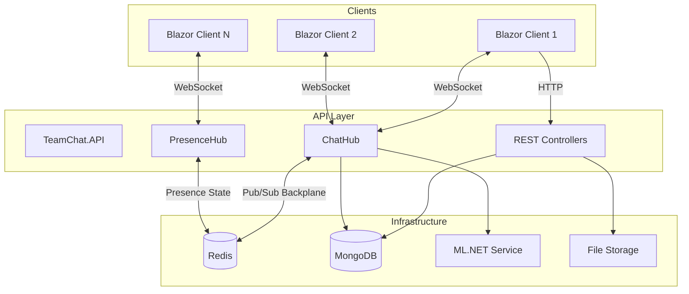
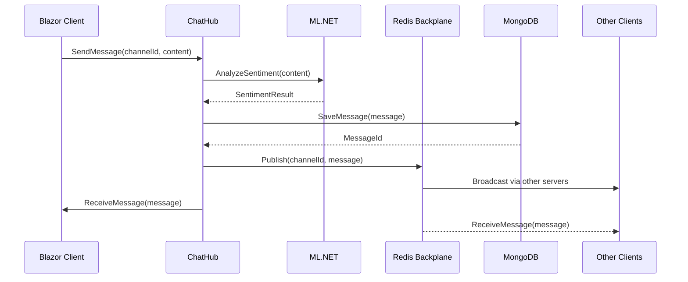
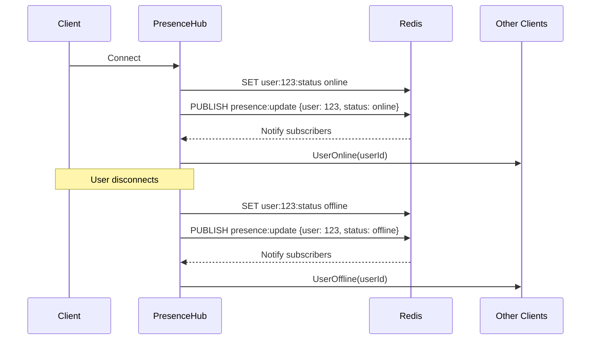
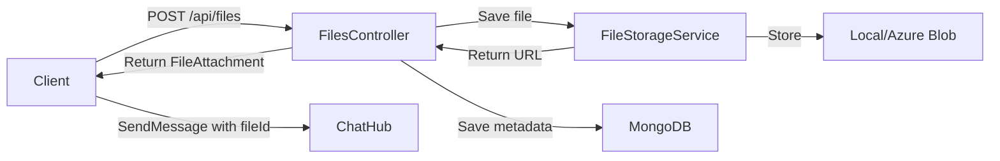
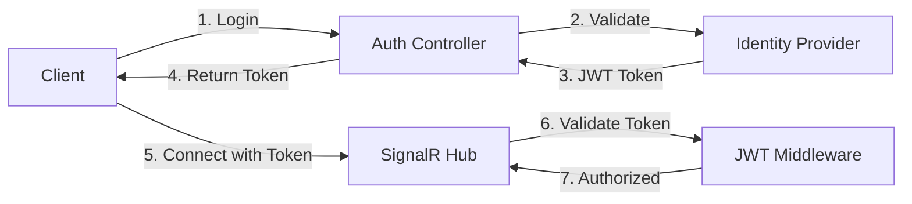

# TeamChat - Architecture Documentation

## 1. Architectural Pattern

### Clean Architecture (Layered Monolith)

```
┌─────────────────────────────────────────────────────────────┐
│                        Presentation                          │
│  ┌─────────────────┐              ┌──────────────────────┐  │
│  │  TeamChat.API   │              │  TeamChat.Client     │  │
│  │  (SignalR Hubs) │              │  (Blazor WASM)       │  │
│  └────────┬────────┘              └──────────┬───────────┘  │
└───────────┼──────────────────────────────────┼──────────────┘
            │                                  │
            ▼                                  ▼
┌─────────────────────────────────────────────────────────────┐
│                     Application Core                         │
│  ┌────────────────────────────────────────────────────────┐ │
│  │                    TeamChat.Core                        │ │
│  │  • Entities (User, Message, Channel, Thread)           │ │
│  │  • DTOs (Data contracts)                               │ │
│  │  • Interfaces (Repository & Service contracts)         │ │
│  │  • Enums (MessageType, Sentiment, etc.)                │ │
│  └────────────────────────────────────────────────────────┘ │
└─────────────────────────────────────────────────────────────┘
            ▲
            │
┌───────────┴─────────────────────────────────────────────────┐
│                      Infrastructure                          │
│  ┌──────────────────────────────────────────────────────┐   │
│  │              TeamChat.Infrastructure                  │   │
│  │  ┌──────────┐  ┌───────────┐  ┌────────┐  ┌───────┐  │   │
│  │  │ MongoDB  │  │   Redis   │  │Storage │  │ ML.NET│  │   │
│  │  │  Repos   │  │ Presence  │  │ Files  │  │Sentim.│  │   │
│  │  └──────────┘  └───────────┘  └────────┘  └───────┘  │   │
│  └──────────────────────────────────────────────────────┘   │
└─────────────────────────────────────────────────────────────┘
```

### Justification

**Why Clean Architecture?**

1. **Testability**: Core business logic has no external dependencies
2. **Flexibility**: Can swap MongoDB for another DB without touching business logic
3. **Maintainability**: Clear separation of concerns
4. **Scalability**: Can extract services to microservices later if needed

**Why Monolith (not Microservices)?**

1. Team chat is a cohesive domain - splitting would add unnecessary complexity
2. SignalR naturally fits a single service model
3. Can scale horizontally with Redis backplane
4. Easier to develop, test, and deploy initially

---

## 2. Key Component Interactions



### Communication Patterns

| From | To | Protocol | Purpose |
|------|-----|----------|---------|
| Blazor Client | ChatHub | WebSocket | Real-time messaging |
| Blazor Client | PresenceHub | WebSocket | Presence updates |
| Blazor Client | Controllers | HTTP REST | CRUD operations |
| ChatHub | Redis | TCP | Backplane (cross-server broadcast) |
| PresenceHub | Redis | TCP | Presence state + pub/sub |
| API | MongoDB | TCP | Data persistence |
| ChatHub | ML.NET | In-process | Sentiment analysis |

---

## 3. Data Flow

### 3.1 Send Message Flow



### 3.2 User Presence Flow



### 3.3 File Upload Flow



---

## 4. Scalability & Performance Strategy

### Horizontal Scaling with Redis Backplane

```
                    ┌─────────────────┐
                    │  Load Balancer  │
                    └────────┬────────┘
                             │
        ┌────────────────────┼────────────────────┐
        │                    │                    │
        ▼                    ▼                    ▼
┌───────────────┐   ┌───────────────┐   ┌───────────────┐
│   API Server  │   │   API Server  │   │   API Server  │
│   Instance 1  │   │   Instance 2  │   │   Instance N  │
└───────┬───────┘   └───────┬───────┘   └───────┬───────┘
        │                   │                   │
        └───────────────────┼───────────────────┘
                            │
                    ┌───────▼───────┐
                    │     Redis     │
                    │   (Backplane) │
                    └───────────────┘
```

### Performance Strategies

| Strategy | Implementation |
|----------|----------------|
| **Connection Pooling** | MongoDB driver connection pool, Redis connection multiplexer |
| **Message Pagination** | Load messages in batches (50 per request) |
| **Caching** | Redis cache for channel metadata, user profiles |
| **Async Everywhere** | All I/O operations are async |
| **SignalR Groups** | Users join channel groups, targeted broadcasts |

### Azure SignalR Service (Production)

```csharp
// Program.cs
builder.Services.AddSignalR()
    .AddAzureSignalR(options =>
    {
        options.ConnectionString = config["Azure:SignalR:ConnectionString"];
    });
```

Benefits:
- Automatic scaling
- Managed WebSocket connections
- Built-in backplane
- 99.9% SLA

---

## 5. Security Considerations

### 5.1 Authentication & Authorization



**Implementation:**
- JWT Bearer authentication
- SignalR hub authorization attributes
- Channel-based access control

```csharp
[Authorize]
public class ChatHub : Hub
{
    [Authorize(Policy = "ChannelMember")]
    public async Task SendMessage(string channelId, string content)
    {
        // Only channel members can send
    }
}
```

### 5.2 Data Protection

| Data | Protection Method |
|------|-------------------|
| Passwords | BCrypt hashing |
| JWT Tokens | RS256 signing |
| Files | Virus scanning before storage |
| Messages | Input sanitization (XSS prevention) |
| Connection Strings | Azure Key Vault / User Secrets |

### 5.3 API Security

- Rate limiting on all endpoints
- CORS configuration
- Input validation with FluentValidation
- SQL/NoSQL injection prevention (parameterized queries)

### 5.4 Secret Management

```
Development:  User Secrets (dotnet user-secrets)
Staging:      Environment variables
Production:   Azure Key Vault
```

---

## 6. Error Handling & Logging Philosophy

### 6.1 Error Handling Strategy

```csharp
// Global exception handling middleware
public class ErrorHandlingMiddleware
{
    public async Task InvokeAsync(HttpContext context)
    {
        try
        {
            await _next(context);
        }
        catch (ValidationException ex)
        {
            // 400 Bad Request
            await HandleValidationException(context, ex);
        }
        catch (NotFoundException ex)
        {
            // 404 Not Found
            await HandleNotFoundException(context, ex);
        }
        catch (UnauthorizedAccessException ex)
        {
            // 403 Forbidden
            await HandleForbiddenException(context, ex);
        }
        catch (Exception ex)
        {
            // 500 Internal Server Error
            _logger.LogError(ex, "Unhandled exception");
            await HandleUnknownException(context, ex);
        }
    }
}
```

### 6.2 SignalR Error Handling

```csharp
public class ChatHub : Hub
{
    public override async Task OnDisconnectedAsync(Exception? exception)
    {
        if (exception != null)
        {
            _logger.LogWarning(exception,
                "Client {ConnectionId} disconnected with error",
                Context.ConnectionId);
        }

        await _presenceService.SetOffline(Context.UserIdentifier);
        await base.OnDisconnectedAsync(exception);
    }
}
```

### 6.3 Logging Strategy

```
┌─────────────────────────────────────────────────────────────┐
│                      Logging Levels                          │
├─────────────────────────────────────────────────────────────┤
│  Trace    │ Detailed diagnostic info (dev only)             │
│  Debug    │ Internal flow information                       │
│  Info     │ General operational events                      │
│  Warning  │ Unexpected but handled situations               │
│  Error    │ Failures that need attention                    │
│  Critical │ System failures requiring immediate action      │
└─────────────────────────────────────────────────────────────┘
```

**Structured Logging with Serilog:**

```csharp
Log.Information("Message sent to channel {ChannelId} by {UserId}",
    channelId, userId);
```

**Log Sinks:**
- Development: Console + Debug
- Production: Application Insights + Azure Log Analytics

### 6.4 Health Checks

```csharp
builder.Services.AddHealthChecks()
    .AddMongoDb(mongoConnectionString)
    .AddRedis(redisConnectionString)
    .AddAzureSignalR();
```

Endpoints:
- `/health` - Overall health
- `/health/ready` - Readiness probe
- `/health/live` - Liveness probe
