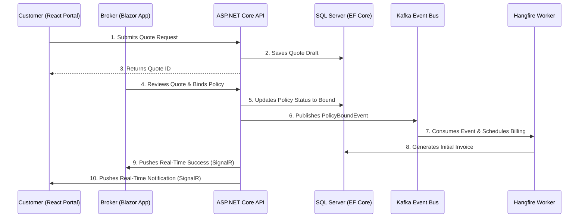

# Enterprise Insurance Portal - Architecture Documentation

## 2.1 Chosen Architectural Pattern

**Pattern:** Modular Monolith evolving towards Microservices (Event-Driven)

**Justification:** For an enterprise application of this scale, starting with a Modular Monolith inside `.NET 8` allows for rapid development, straightforward debugging, and shared type definitions (Core). It reduces the operational overhead of managing multiple deployed services immediately. However, the system utilizes an Event-Driven backbone (Kafka) and background workers (Hangfire), ensuring that as the team scales or specific modules (like Claims Processing or Premium Calculation) require independent scaling, they can easily be detached into standalone microservices communicating via gRPC and Kafka.

## 2.2 Key Component Interactions

- **API Calls:** The React public portal communicates with the backend via RESTful endpoints exposed by ASP.NET Core API. IdentityServer provides OAuth 2.0 / OIDC tokens for authorization.
- **Message Queues / Event Bus:** Kafka handles asynchronous communications. For example, when a broker binds a policy in Blazor, a `PolicyBoundEvent` is published to Kafka. Other consumers (e.g., billing, auditing) process these events independently.
- **Real-Time Push:** SignalR is used to push immediate updates. For instance, when a background process updates a claim status, SignalR pushes a notification directly to the connected React or Blazor clients.
- **Direct Database Access:** EF Core provides data access to the SQL Server. Blazor Server directly accesses backend services which in turn use EF Core.
- **Background Jobs:** Hangfire uses SQL Server to persist job state and executes heavy batch processes like monthly regulatory reports and nightly premium recalculations.
- **Inter-Service Communication:** gRPC is configured for high-performance, strongly-typed internal communication between any future decoupled microservices or integration nodes.

## 2.3 Data Flow

## 2.4 Scalability & Performance Strategy

- **Stateless APIs:** The ASP.NET Core APIs are stateless, allowing them to be horizontally scaled inside Azure Kubernetes Service (AKS).
- **Read/Write Segregation (CQRS Light):** LINQ queries and EF Core are optimized; if needed, read operations can target a read-replica SQL Server database.
- **Caching:** Distributed caching (e.g., Redis) will be utilized for reference data, session state for Blazor, and frequent lookups.
- **Event-Driven Resilience:** By pushing heavy workloads to Kafka and Hangfire, the user-facing web threads remain responsive under high load.

## 2.5 Security Considerations

- **Authentication & Authorization:** Handled via IdentityServer integrating with Azure Active Directory (AAD) or local identity stores. JWTs are used for React, and cookie auth for Blazor.
- **Data Protection:** Connection strings, JWT secrets, and third-party API keys are stored in Azure Key Vault. Data at rest is encrypted in SQL Server (TDE).
- **API Security:** CORS policies strictly whitelist the React portal domain. All endpoints require `[Authorize]` attributes enforcing specific roles/policies.
- **Secret Management:** Development relies on `dotnet user-secrets` and `.env` files (never checked into version control). CI/CD injects secrets at runtime into AKS pods.

## 2.6 Error Handling & Logging Philosophy

- **Global Exception Handling:** ASP.NET Core's Global Error Handling Middleware catches unhandled exceptions, returning standard RFC 7807 Problem Details to the API clients.
- **Logging:** Serilog is configured to output structured JSON logs. Logs include correlation IDs spanning across REST, gRPC, and Kafka events.
- **Aggregation:** Logs are aggregated into a centralized system (e.g., Azure Application Insights or ELK stack) for alerting and dashboarding.
