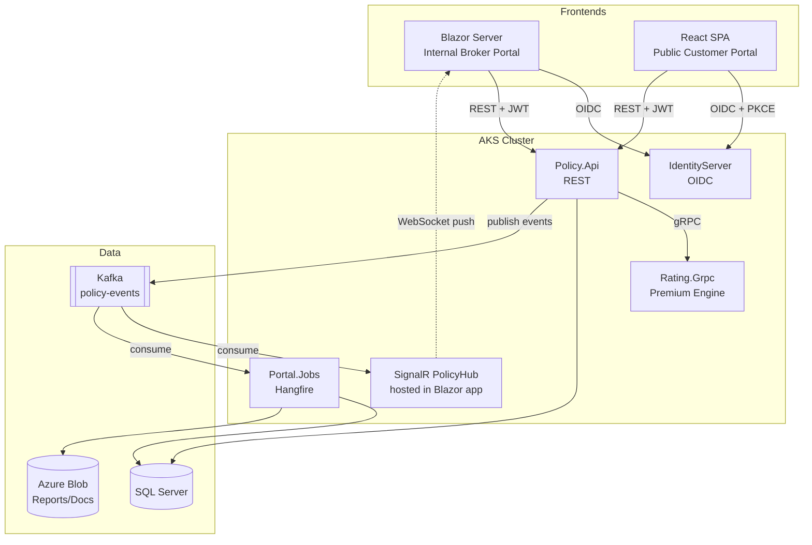
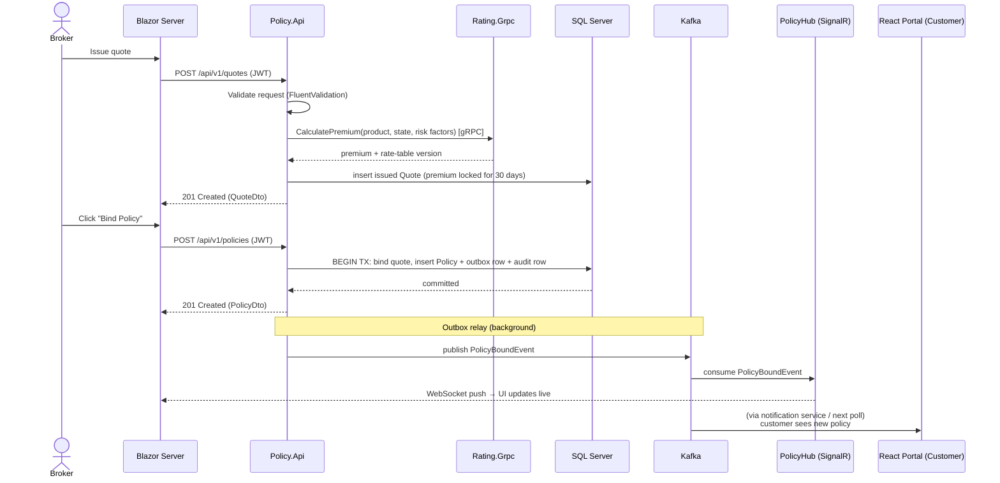

# Enterprise Insurance Portal — Architecture

## 2.1 Chosen Architectural Pattern

**Event-driven microservices with a modular core**, deliberately kept coarse-grained:

- **Policy.Api** — the core service owning quotes, policies, and claims (REST).
- **Rating.Grpc** — a separate compute-heavy rating engine (gRPC), isolated so it can scale independently and be rewritten without touching policy workflows.
- **Portal.Jobs** — Hangfire host for scheduled work (nightly premium recalc, monthly regulatory reports), separated so long-running batches never compete with request traffic.
- **Portal.Identity** — IdentityServer as the single OIDC authority for both frontends and service-to-service auth.
- **Two frontends** — Blazor Server (internal brokers, rich real-time UX via SignalR) and React SPA (public customers, CDN-friendly, independent release cadence).
- **Kafka** as the event backbone for policy lifecycle events.

**Why this fits:** Insurance workflows (quote → bind → claim) are transactional and benefit from a single strongly-consistent core service over SQL Server, while downstream concerns (notifications, reporting, analytics, real-time UI updates) are naturally eventual-consistent — a perfect fit for Kafka events. Splitting into *dozens* of microservices would add distributed-transaction pain with no payoff at this scale; splitting out only the rating engine and the job host isolates the two components with genuinely different scaling and deployment profiles.

## 2.2 Key Component Interactions

| Interaction | Mechanism | Notes |
|---|---|---|
| Frontends → Policy.Api | REST/JSON over HTTPS, JWT bearer | Versioned routes (`/api/v1/...`) |
| Policy.Api / Portal.Jobs → Rating.Grpc | gRPC (HTTP/2) | 5s call deadline; proto contract in `Rating.Grpc/Protos`; client-credentials scope + Polly retries are roadmap hardening |
| Policy.Api → consumers | Kafka topic `policy-events` | Transactional outbox in SQL Server → relay publishes to Kafka, guaranteeing no lost/phantom events |
| Kafka → Blazor brokers | SignalR `PolicyHub` consumes events and pushes to connected clients | Azure SignalR Service as backplane across pods |
| Kafka → Portal.Jobs | Consumer group `jobs` | Roadmap: `PolicyBound` triggers document generation (jobs currently read the policy store directly) |
| Database access | Each service owns its schema; **only** Policy.Api and Portal.Jobs touch the policy schema, Jobs read-mostly | No shared-database coupling between unrelated services |
| Service-to-service auth | IdentityServer client-credentials flow | Scopes: `rating.calculate`, `policy.read`, ... |

## 2.3 Data Flow — "Broker binds a policy"

Writes are synchronous and strongly consistent (single SQL transaction including the outbox row); everything downstream — real-time UI, customer notifications, reporting — is asynchronous off Kafka. The system never blocks a broker on a Kafka publish.

## 2.4 Scalability & Performance Strategy

- **Stateless services scale horizontally** in AKS via HPA (CPU + custom metrics). Rating.Grpc, the CPU-hot path, scales independently of Policy.Api.
- **Blazor Server is stateful** (circuits): use Azure SignalR Service + session affinity on ingress; size pods by concurrent circuits, not RPS.
- **Database:** EF Core with no-tracking queries for reads, compiled queries on hot paths; SQL Server read replica for reporting/Hangfire reads; indexes reviewed per migration.
- **Kafka partitioning** by `PolicyId` preserves per-policy ordering while parallelizing consumers.
- **Hangfire batches** nightly recalculation into chunked, idempotent jobs (resumable after pod restarts); runs against the replica where possible.
- **Caching:** rate tables and reference data cached in-memory with Kafka-driven invalidation; HTTP response caching on public read endpoints.

## 2.5 Security Considerations

- **AuthN/AuthZ:** IdentityServer (OIDC). Blazor uses authorization-code flow (server-side, confidential client); React uses code + PKCE (public client). APIs validate JWTs; authorization via policy-based roles/claims (`Broker`, `Underwriter`, `Customer`) and resource-based checks (a customer can only read *their* policies — enforced in the service layer and covered by integration tests). *Implementation status:* client registrations and the JWT validation path exist; environments without an `Identity:Authority` (local dev, tests) use the API's header-driven Dev auth scheme, and interactive OIDC login is the next roadmap item (PROJECT-PLAN Phase 1).
- **Data protection:** TLS everywhere (ingress + mTLS in-cluster optional); TDE on SQL Server; PII columns (SSN, DOB) encrypted at column level via Always Encrypted or EF value converters; data-retention jobs for regulatory compliance.
- **API security:** input validation at the edge (FluentValidation), rate limiting (`Microsoft.AspNetCore.RateLimiting`), strict CORS for the React origin only, no detailed errors to clients.
- **Secrets:** Azure Key Vault + AKS CSI Secrets Store driver — no secrets in appsettings, env files, or pipelines. Pipeline identities use workload identity federation (no PATs/passwords).
- **Auditing:** every policy/claim mutation writes an immutable audit row (who/what/when) — required for regulatory reporting.

## 2.6 Error Handling & Logging Philosophy

- **Fail loud at boundaries, recover in middleware.** Domain code throws specific exceptions (`EntityNotFoundException` → 404, `DomainException`/`InvalidStateTransitionException` → 422); a single ASP.NET Core exception-handling middleware maps them to RFC 7807 ProblemDetails. No swallowed exceptions, no `catch (Exception)` in business code.
- **Structured logging** via Serilog → console (JSON) → Azure Monitor/Log Analytics. Every request carries a correlation ID propagated through HTTP headers, gRPC metadata, and Kafka message headers, so one ID traces a broker click through to the SignalR push.
- **Transient faults** (SQL, gRPC, Kafka) are retried with Polly (exponential backoff + circuit breaker); retries are logged as warnings, exhausted retries as errors.
- **Kafka consumers** use dead-letter topics after N failed attempts — poison messages never block a partition.
- **Hangfire** jobs are idempotent and rely on built-in retry; failures alert via Azure Monitor action groups.
- **Log levels:** Error = needs human action; Warning = degraded but self-healing; Information = business events only (policy bound, claim filed). Debug stays off in prod.
