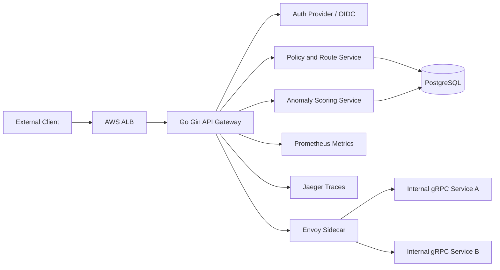
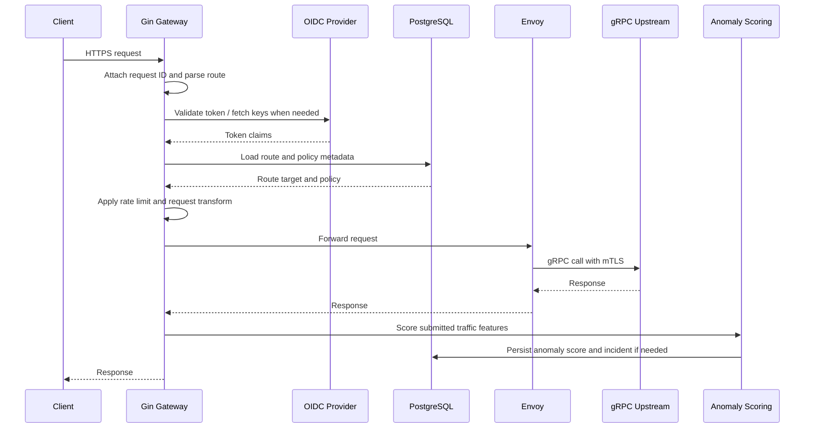

# API Gateway & Service Mesh Architecture

## 2.1 Chosen Architectural Pattern

The recommended architecture is a microservices platform with an API gateway edge, Envoy sidecars, and event-driven telemetry processing.

This pattern fits the project because API management, authentication, rate limiting, traffic routing, observability, and anomaly detection have different scaling profiles and release cadences. The gateway remains latency-sensitive and horizontally scalable, while anomaly detection can process traffic features asynchronously and run ML inference independently.

## 2.2 Key Component Interactions

### API Calls

- Public clients call the gateway over HTTPS.
- Admin users operate route and policy settings through the React frontend.
- The React frontend calls the gateway admin API.
- The gateway performs OIDC/JWT validation and policy checks before routing traffic.

### gRPC Communication

- Internal service calls use gRPC where low latency, typed contracts, and streaming are useful.
- The gateway can use gRPC clients for policy lookup, route discovery, and service health if those concerns are split into separate services.
- Envoy sidecars handle retries, timeouts, load balancing, and mTLS enforcement.

### Direct Database Access

- The gateway accesses PostgreSQL only for admin/configuration reads and writes in the initial implementation.
- High-volume request-path decisions should use local caches or dedicated policy services instead of blocking on database queries.
- The anomaly service persists detected incidents, features, and model evaluation summaries.

### Event Bus

- The implemented service exposes `POST /api/v1/traffic/score` for scoring traffic features and persisting anomaly events.
- The gateway can evolve to Kafka, AWS MSK, Kinesis, or NATS when traffic volume requires asynchronous feature processing.
- Scoring is kept outside the request proxy hot path; persisted anomaly events inform operators and future adaptive policies.

## 2.3 Data Flow

## 2.4 Scalability & Performance Strategy

- Scale gateway pods horizontally on CPU, request rate, and p95 latency.
- Keep the hot request path free of synchronous database calls through local route caches and short-lived policy snapshots.
- Use Envoy for connection pooling, retries, circuit breaking, and outlier detection.
- Use Redis or another low-latency shared store for distributed rate limiting.
- Separate admin APIs from data-plane routing when traffic grows.
- Emit telemetry asynchronously and use bounded queues to protect the request path.
- Partition traffic metrics by tenant, route, service, and time bucket for efficient anomaly analysis.
- Store raw high-cardinality telemetry in time-series or stream storage, not only PostgreSQL.

## 2.5 Security Considerations

### Authentication and Authorization

- Use OIDC/JWT for external clients and admin users.
- Validate issuer, audience, expiry, signature, and required scopes.
- Apply role-based access control for admin operations.
- Use service identities and mTLS for internal gRPC calls.

### Data Protection

- Encrypt traffic with TLS at the edge and mTLS inside the cluster.
- Encrypt PostgreSQL storage and backups.
- Avoid logging credentials, raw tokens, API keys, or sensitive request bodies.
- Tokenize or hash identifiers used for analytics where business rules permit it.

### API Security

- Enforce strict request size, timeout, and content-type limits.
- Apply route-specific rate limits and tenant quotas.
- Validate all admin API input before persistence.
- Use allowlisted upstream targets to prevent open proxy behavior.
- Add WAF rules at the AWS ALB or CloudFront layer for common attacks.

### Secret Management

- Use AWS Secrets Manager or External Secrets Operator for runtime secrets.
- Store only examples and references in git.
- Rotate database passwords, JWT signing keys, and service credentials.
- Scope Kubernetes service accounts with least privilege IAM roles for service accounts.

## 2.6 Error Handling & Logging Philosophy

- Use structured JSON logs with request ID, route ID, tenant ID, method, path, status, latency, and upstream service.
- Return stable client-facing error shapes without leaking internal stack traces.
- Distinguish validation errors, authentication failures, authorization denials, upstream failures, and internal errors.
- Treat timeouts and circuit breaker events as first-class telemetry signals.
- Send traces through OpenTelemetry and export them to Jaeger.
- Use Prometheus metrics for request counts, latency histograms, rate-limit decisions, upstream errors, and anomaly scores.
- Prefer retry only for idempotent operations or explicitly safe upstream calls.
