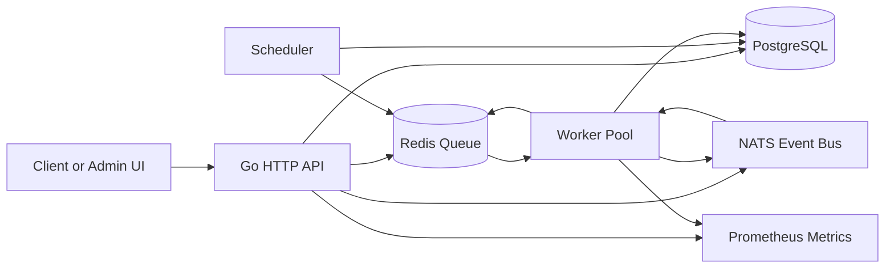
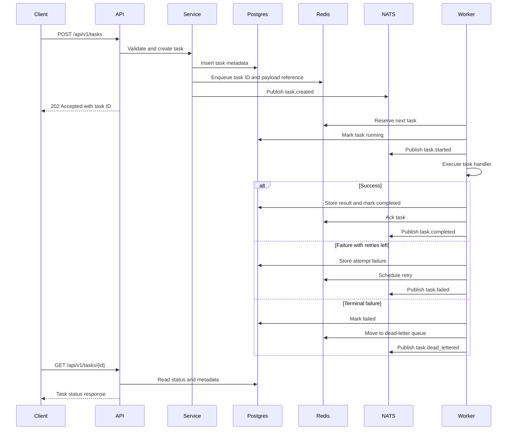

# Distributed Task Queue - Architecture

## 1. Chosen Architectural Pattern

The system uses an event-driven modular service architecture.

The API, worker, and scheduler are separate deployable processes, but they share one Go codebase and common internal packages. This keeps operational complexity lower than a full microservice split while still allowing the API and workers to scale independently on AWS ECS.

Redis is used for fast queue operations, PostgreSQL is used for durable task metadata and audit state, and NATS is used as the event bus for worker coordination and task lifecycle notifications.

## 2. Key Component Interactions

### API Calls

The HTTP API accepts task submissions and administrative operations. It validates input, calls the service layer, persists task metadata in PostgreSQL, enqueues task references in Redis, and publishes lifecycle events to NATS.

Primary API surfaces:

- `POST /api/v1/tasks`: Create a task.
- `GET /api/v1/tasks`: List tasks.
- `GET /api/v1/tasks/{id}`: Fetch task status and result metadata.
- `PUT /api/v1/tasks/{id}`: Update a pending or retrying task.
- `POST /api/v1/tasks/{id}/cancel`: Request cancellation.
- `DELETE /api/v1/tasks/{id}`: Delete a task record.
- `GET /api/v1/tasks/{id}/attempts`: Fetch attempt audit records.
- `GET /api/v1/dead-letters`: Inspect dead-lettered tasks.
- `POST /api/v1/dead-letters/{id}/requeue`: Requeue a dead-lettered task.
- `GET /api/v1/queue/stats`: Inspect Redis queue depth.
- `GET /healthz`: Process health check.
- `GET /metrics`: Prometheus scrape endpoint.

### Message Queues

Redis stores operational queue state:

- Pending task queue.
- Reserved/in-flight task set.
- Retry schedule.
- Dead-letter queue.

Workers reserve work from Redis using bounded goroutine concurrency. Queue movement uses Redis Lua scripts for atomic reservation, retry, promotion, and dead-letter transitions.

### Direct Database Access

Only repository packages access PostgreSQL directly. API, scheduler, and worker code call application services instead of issuing SQL from transport or worker layers. PostgreSQL remains the source of truth for durable task identity, status, attempts, result metadata, and timestamps.

### Event Bus

NATS carries events such as `task.created`, `task.started`, `task.completed`, `task.failed`, and `task.cancelled`. NATS is not the only source of truth; events are used for coordination, notification, and decoupled extensions.

## 3. Data Flow

## 4. Scalability & Performance Strategy

- Scale API tasks horizontally behind an Application Load Balancer.
- Scale worker tasks independently based on Redis queue depth, oldest pending task age, CPU, and memory.
- Use bounded worker pools to prevent unbounded goroutine growth and downstream overload.
- Use PostgreSQL indexes for task status, creation time, and idempotency keys.
- Keep Redis operations atomic for reservation, acknowledgement, retry, and dead-letter transitions.
- Use NATS for lightweight event fanout instead of coupling every consumer to the API.
- Expose Prometheus metrics so autoscaling and alerting can be driven by queue behavior, not only CPU.

## 5. Security Considerations

### Authentication & Authorization

Use API authentication for all mutating and administrative routes. In production, prefer OIDC/JWT validation at the edge or service level. Authorization should distinguish task submitters, operators, and administrators.

### Data Protection

Use TLS for external traffic and managed-service encryption at rest for PostgreSQL, Redis, and NATS where supported. Avoid storing sensitive task payloads directly when possible; store references to encrypted object storage for large or sensitive payloads.

### API Security

Apply request size limits, schema validation, rate limiting, timeout enforcement, and security headers. Validate task type against an allowlist so callers cannot trigger arbitrary behavior.

### Secret Management

Do not store secrets in source control. In AWS, use Secrets Manager or SSM Parameter Store and inject secrets into ECS tasks. Rotate database, Redis, NATS, and API credentials on a defined schedule.

## 6. Error Handling & Logging Philosophy

Errors should be explicit, contextual, and observable.

- API handlers return stable client-facing error shapes and avoid leaking internals.
- Service methods wrap errors with operation context.
- Worker failures are categorized as retryable or terminal.
- Every task attempt records status, error summary, timestamps, and attempt number.
- Logs are structured JSON with fields for `request_id`, `task_id`, `worker_id`, `attempt`, and `component`.
- Metrics count successes, failures, retries, dead-letter events, processing duration, and queue depth.
- Graceful shutdown stops accepting new work, drains in-flight work within a timeout, and safely requeues unfinished tasks.
