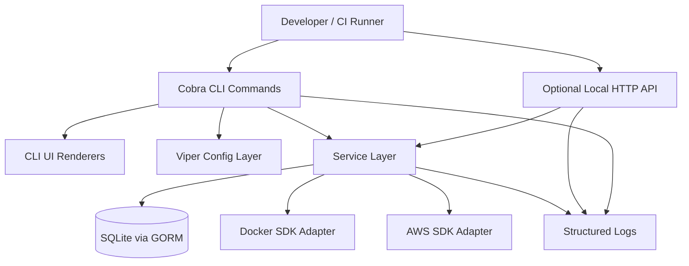
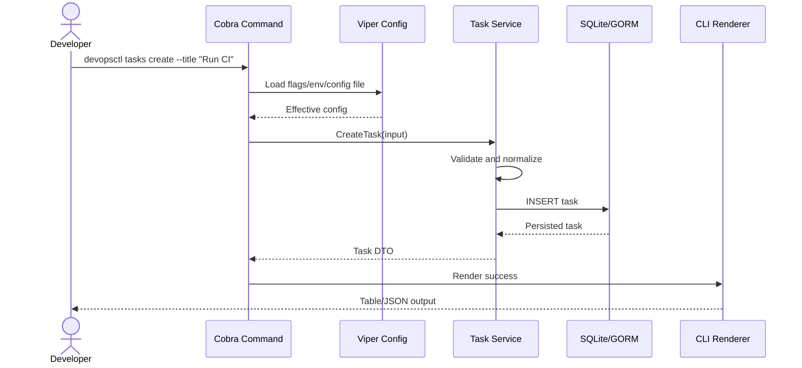
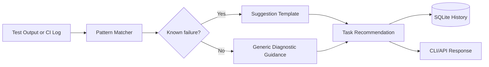

# CLI DevOps Tool Architecture

## 2.1 Chosen Architectural Pattern

The project uses a **Layered Modular Monolith**.

This fits the current scale because the product is distributed as a single CLI binary, yet it still needs clear boundaries between command routing, configuration, persistence, cloud/container integrations, and business logic. A monolith keeps installation and release simple for Homebrew/APT users, while package boundaries leave room for future extraction of long-running agents or hosted APIs.

## 2.2 Key Component Interactions

- **CLI command calls:** Cobra commands validate user input, load configuration, invoke services, and delegate output formatting to CLI UI renderers.
- **Optional local API calls:** `internal/api` exposes simple HTTP handlers for automation systems that prefer a local API process. It uses the same service layer as the CLI.
- **Direct database access:** Only `internal/service` and `internal/database` should interact with GORM. Command handlers should not issue database queries directly.
- **Cloud and container operations:** Services call narrow interfaces in `internal/aws` and `internal/docker`, keeping SDK-specific types away from command code.
- **Events and queues:** No external event bus is required initially. For long-running automation, use in-process progress callbacks first. If background workers are needed later, introduce a local jobs table before adopting a remote queue.

## 2.3 Data Flow

Typical task creation flow:

Automation suggestion flow:

## 2.4 Scalability & Performance Strategy

- Keep the default path fast by using local SQLite and short-lived CLI processes.
- Use service interfaces so AWS/Docker calls can be mocked in tests and later replaced by asynchronous workers.
- Add context timeouts around all network and SDK calls.
- Avoid loading large command histories into memory; list commands should paginate or stream rows.
- Use SQLite indexes for high-frequency lookups such as status, creation date, and task type.
- Prefer deterministic local pattern matching for test suggestions before invoking any remote LLM provider.
- Keep command output rendering separate from service code so JSON output can remain stable for scripts.

## 2.5 Security Considerations

- **Authentication and authorization:** The CLI primarily inherits the user's local OS permissions. For optional local API mode, bind to `127.0.0.1` by default and require an API token when listening on non-loopback interfaces.
- **Data protection:** Store local state in a user-specific application directory with restrictive file permissions. Avoid storing raw secrets in SQLite.
- **API security:** Validate request bodies, cap payload sizes, set HTTP timeouts, and return generic errors for unexpected failures.
- **Secret management:** Prefer environment variables, OS credential stores, AWS profiles, and Docker credential helpers. `.env` files are for development only and must never be committed.
- **Cloud permissions:** AWS operations should work with least-privilege IAM policies and support dry-run modes where AWS APIs provide them.
- **Supply chain:** Release binaries should be checksummed and signed before Homebrew/APT distribution.

## 2.6 Error Handling & Logging Philosophy

- Service functions return typed or wrapped errors with enough context for operators.
- Cobra handlers map errors to consistent exit codes and concise user-facing messages.
- Logs should be structured, level-based, and written to stderr by default.
- Commands should not hide SDK failures; they should explain which operation failed and suggest the next diagnostic command.
- API handlers should return RFC-friendly HTTP status codes with short JSON error bodies.
- Panics are reserved for programmer errors during initialization and should not be used for normal command failures.
