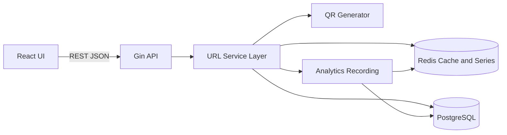
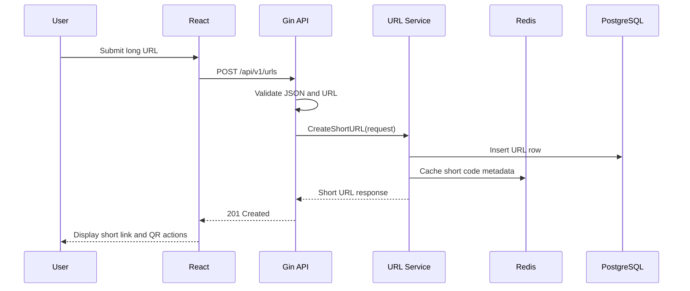
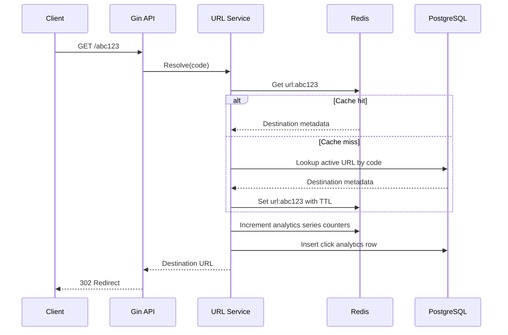

# URL Shortener Service Architecture

## 2.1 Chosen Architectural Pattern

The service starts as a layered modular monolith:

- HTTP delivery layer: Gin handlers, routing, middleware.
- Application/service layer: URL shortening, redirect resolution, analytics orchestration, QR generation.
- Infrastructure layer: PostgreSQL repositories, Redis cache, external integrations.
- Frontend: React single page app deployed separately or served behind the same edge domain.

This pattern is suitable because the product needs high throughput and clean operational boundaries, but it does not yet need the coordination cost of multiple independently deployed services. The internal package layout keeps future extraction possible. Analytics ingestion, QR generation, and abuse scanning can later become workers or separate services without changing the public API contract.

## 2.2 Key Component Interactions

### API Calls

- `POST /api/v1/urls`: creates a short URL.
- `GET /:code`: resolves and redirects to the original URL.
- `GET /api/v1/urls/:code`: fetches URL metadata.
- `PATCH /api/v1/urls/:code`: updates destination or expiration metadata.
- `DELETE /api/v1/urls/:code`: soft deletes a short URL.
- `GET /api/v1/urls/:code/analytics`: returns aggregate click metrics.
- `GET /api/v1/urls/:code/qr`: returns QR code bytes or metadata.

### Direct Database Access

Only repository packages access PostgreSQL directly. Handlers do not issue SQL, and services depend on interfaces rather than concrete storage details.

### Redis Series Model

Redis holds:

- Short code cache entries: `url:{code} -> destination metadata`.
- Click counters by time bucket: `series:clicks:{code}:{yyyyMMddHHmm}`.
- Hot analytics dimensions: referrer, country, user agent family.
- Rate limit buckets: `ratelimit:{scope}:{identifier}`.

The API records each redirect in PostgreSQL for durable analytics and increments Redis series counters for hot, short-lived operational views. The schema includes hourly rollup storage for future batch aggregation without changing the public API.

### Message Queues and Event Buses

The current implementation records analytics through the service layer into PostgreSQL and Redis. If event volume grows, that recording boundary can be backed by NATS, Kafka, or a managed queue without changing handler code.

## 2.3 Data Flow

Redirect flow:

## 2.4 Scalability and Performance Strategy

- Use Redis read-through cache for high volume redirects.
- Keep redirect path minimal: validate code, cache lookup, DB fallback, record analytics, return redirect.
- Store analytics writes in Redis counters first, then roll up asynchronously for query efficiency.
- Add PostgreSQL indexes on `short_code`, `owner_id`, `created_at`, and click rollup dimensions.
- Use connection pools with explicit limits for PostgreSQL and Redis.
- Keep API stateless so Fly.io can scale horizontally.
- Use short TTLs for cache correctness and longer TTLs for frequently accessed URLs.
- Use CDN or edge caching only for safe, non-user-specific assets and frontend bundles.

## 2.5 Security Considerations

### Authentication and Authorization

- Public redirect endpoints do not require authentication.
- URL creation can start unauthenticated with IP limits, then support API keys or user accounts.
- Admin and analytics mutation endpoints must require API key or session authentication.
- Ownership checks belong in the service layer, close to business rules.

### Data Protection

- Store secrets only in environment variables or platform secret stores.
- Do not log full query strings for sensitive URLs by default.
- Use TLS for all external traffic and managed TLS for database connections in production.
- Consider URL malware/phishing scanning before enabling public creation at scale.

### API Security

- Validate and normalize submitted URLs.
- Block unsupported schemes such as `javascript:` and local network targets if required.
- Add request size limits, timeout middleware, CORS restrictions, and rate limits.
- Use structured error responses that do not leak internal details.

### Secret Management

- Local development uses `.env`.
- GitHub Actions uses repository/environment secrets.
- Fly.io uses `fly secrets set`.
- No secrets should be committed to git.

## 2.6 Error Handling and Logging Philosophy

- Handlers translate service errors into stable API error responses.
- Services return typed domain errors such as not found, validation failed, conflict, and unavailable.
- Infrastructure packages wrap lower-level errors with context but avoid exposing credentials or full SQL statements.
- Logs are structured JSON in production and include request ID, route, status, latency, and error class.
- Redirect analytics failures should be logged and counted, but should not block successful redirects unless the storage outage also prevents URL resolution.
- Panics are recovered at middleware boundaries and returned as `500` responses with request IDs.
