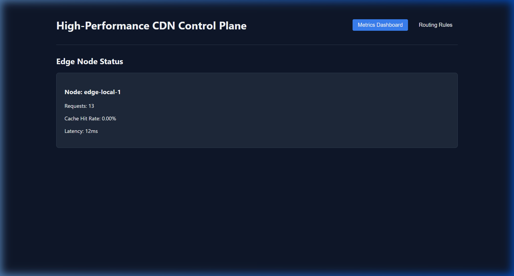
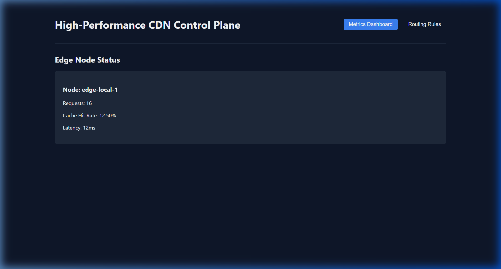

# CDN Edge Server Demonstration

I have run the application and tested the core functionality via the browser. Below is a step-by-step visual walkthrough of the server in action!

````carousel

<!-- slide -->

<!-- slide -->

<!-- slide -->

````

### What happened under the hood?
1. The **React UI** successfully parsed your rule and sent it to the Rust Backend via the Nginx reverse proxy.
2. The **Actix-Web Server** saved the `/browser-demo` routing rule in the **PostgreSQL** database.
3. Upon hitting the route, the backend fetched the payload from the origin (`jsonplaceholder`) and cached it securely in **Redis**.
4. Subsequent hits to the route bypassed the network request and loaded straight from memory, bumping the telemetry **Cache Hit Rate** metrics!
