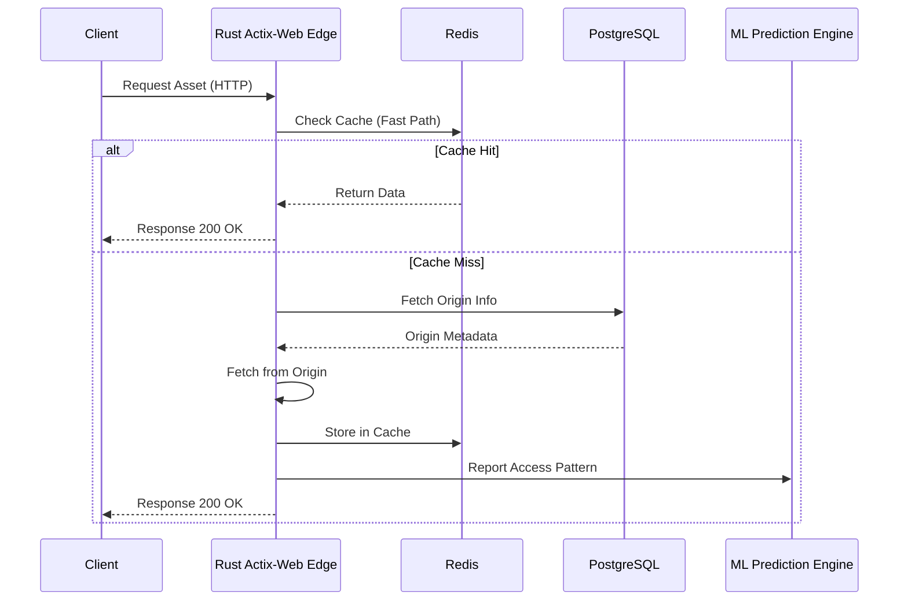

# System Architecture

## 2.1 Chosen Architectural Pattern
**Layered Microservices / Edge Server Pattern**

We are using a specialized edge-oriented microservice architecture. The Rust server acts as a CDN edge node handling high-throughput ingress, caching, and serving. The control plane (managed via the TypeScript frontend) interacts with a primary relational DB (PostgreSQL).

**Justification:** Rust and Tokio provide the predictable, low-latency performance required for a CDN handling millions of requests. Actix-web offers robust asynchronous HTTP handling. The architecture segregates the high-performance edge components from the control plane management features.

## 2.2 Key Component Interactions
- **API Calls:** External clients request assets via HTTP. The Rust server intercepts and checks the Redis cache.
- **Message Queues:** WebSockets are used to stream real-time logs and analytics from edge nodes to the control plane dashboard.
- **Direct Database Access:** Diesel ORM connects to PostgreSQL for persistent configuration, user management, and billing data.
- **Event Buses:** Redis Pub/Sub propagates cache invalidation events across multiple edge nodes globally.

## 2.3 Data Flow

## 2.4 Scalability & Performance Strategy
- **Concurrency:** Utilizing Tokio's multi-threaded asynchronous runtime to handle thousands of concurrent connections per edge node.
- **Caching:** Multi-tier caching. In-memory LRU cache in Rust for hottest assets, Redis for distributed tier.
- **Pre-warming:** The ML prediction engine analyzes access patterns to proactively push assets to edge nodes before they are requested.

## 2.5 Security Considerations
- **Authentication & Authorization:** JWT-based authentication for the control plane dashboard.
- **Data Protection:** TLS 1.3 termination at the edge. No plain-text internal communication.
- **API Security:** Rate limiting per IP via Redis to mitigate DDoS attacks.
- **Secret Management:** HashiCorp Vault or Fly.io secrets for managing DB credentials and API keys.

## 2.6 Error Handling & Logging Philosophy
- **Logging:** Structured JSON logging using `tracing` in Rust.
- **Error Handling:** Custom `thiserror` based enums mapped to standard HTTP status codes in Actix-web, ensuring internal stack traces never leak to the client.
