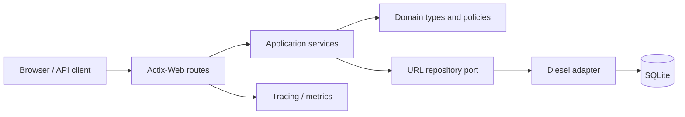
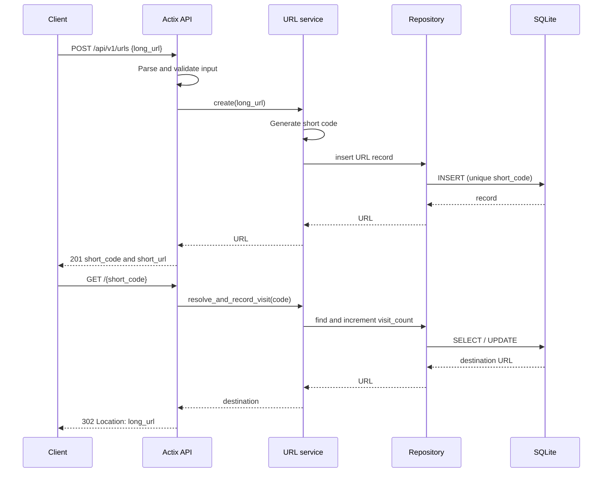

# Architecture

## 1. Chosen pattern: layered modular monolith

The service is a single deployable Actix-Web process organized into API, service, domain, and infrastructure layers. This is the right starting point because URL creation and redirect resolution are a compact, cohesive workload. It minimizes operational overhead while preserving explicit seams for testing and later extraction. SQLite is appropriate for a low-to-moderate write workload or a single replica; production growth should move the infrastructure implementation to PostgreSQL before adding replicas.

## 2. Key component interactions

HTTP is synchronous request/response over TLS. Route handlers validate and deserialize DTOs, then call application services rather than Diesel directly. Services own business policy such as URL validation, code collision retries, and which failures are safe to expose. The repository adapter owns SQL/Diesel details and maps records to domain entities.

No message queue or event bus is needed for the first release. A redirect increments `visit_count` in the request path for simplicity. At higher traffic, publish a compact `UrlVisited` event to a durable queue and aggregate asynchronously; redirect lookup then remains fast and write contention is removed. The queue consumer is an optional, separately deployable component, not a dependency of redirect availability.

## 3. Data flow

## 4. Scalability and performance

Keep handlers non-blocking by running synchronous Diesel work through `web::block` or a dedicated blocking executor. Pool database connections with r2d2 and cap the pool to match SQLite’s single-writer behavior. Index `short_code` uniquely; it is the critical lookup path. Use short, bounded transactions for visit updates.

The process is stateless aside from its database, so it can be containerized and replicated once persistence moves to PostgreSQL. Add a small TTL cache for hot resolutions, metrics around cache/database latency and collision rate, and queue-based visit analytics as demand grows. Horizontal scaling with SQLite is unsafe unless the database is externalized or a single writer is guaranteed.

## 5. Security considerations

- Enforce HTTPS at the edge; set trusted proxy configuration deliberately.
- Validate `http`/`https` URLs, length limits, control characters, and optionally block private-network targets if link scanning/previewing is introduced.
- Apply bounded per-IP rate limiting and request body limits to creation endpoints; expire client buckets on an amortized schedule and avoid logging query strings or sensitive tokens.
- Trust forwarding headers only behind an edge that removes client-supplied values. The included Nginx configuration replaces the forwarding header before proxying.
- Keep administrative delete/list endpoints behind authentication and role/ownership checks. Public redirects need no identity.
- Store secrets only as platform-managed secrets; commit `.env.example`, never `.env`. Rotate credentials and use least-privilege database access.
- Use parameterized Diesel queries, secure response headers, controlled CORS origins, and dependency/security scanning.

## 6. Error handling and logging philosophy

Use one typed `AppError` hierarchy. Domain/service failures retain useful cause context but handlers expose stable, non-sensitive JSON error codes: validation errors return 400, missing codes return 404, conflicts return 409, and unexpected faults return 500. Redirect failures never leak database details.

Emit structured `tracing` events with request ID, route, status, latency, and short code where safe. Log errors once at the boundary with causal context; do not duplicate error logs across layers. Export metrics for request rates, error classes, database latency, collision retries, and redirects. Redact long URLs when they could contain credentials or tokens.
