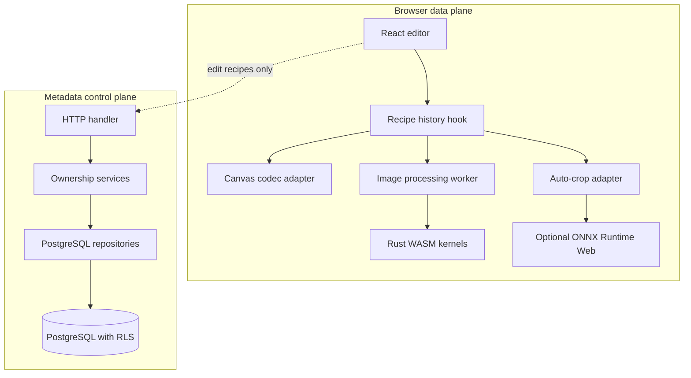
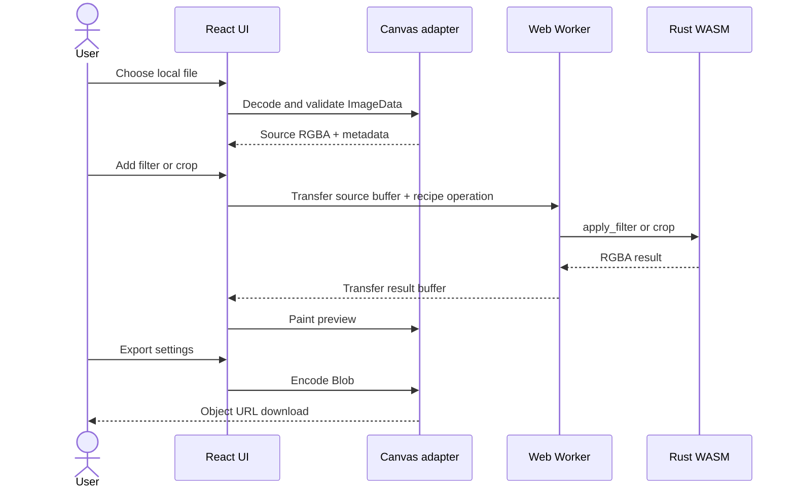
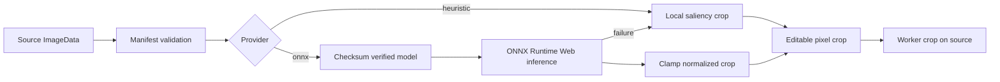
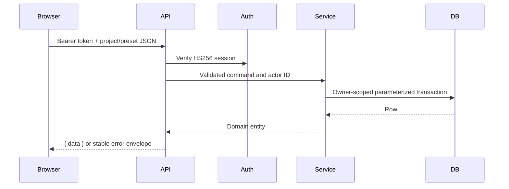

# WebAssembly Image Editor - Architecture

## 1. Pattern

The application is a **client-side modular monolith with a small layered control plane**. The browser is the image data plane: React coordinates state, Canvas decodes and encodes, a Web Worker isolates computation, and a Rust/WASM crate performs pixel work. A stateless TypeScript HTTP application provides recipe persistence only.

This pattern fits the product because image bytes do not need server storage or server CPU. It keeps latency and privacy risk low, while the metadata API remains independently deployable and horizontally scalable.

## 2. Components and interactions

| Component             | Responsibility                                                                      | Communication                         |
| --------------------- | ----------------------------------------------------------------------------------- | ------------------------------------- |
| `ImageEditor`         | Accessible controls, forms, preview, error/loading UI                               | React hooks and Canvas                |
| `useImageProcessor`   | Source image lifecycle, validated recipe history, replay, undo/redo                 | Worker messages and auto-crop adapter |
| Image worker          | Transfers RGBA `ArrayBuffer` ownership and calls generated WASM                     | `postMessage` transfer list           |
| Rust crate            | Validates dimensions and applies RGBA filters/crops deterministically               | wasm-bindgen methods                  |
| Auto-crop adapter     | Validates manifest, executes a checked ONNX model or local heuristic, clamps crop   | `fetch` for public model assets only  |
| HTTP handler          | Routes readiness, anonymous session, paginated projects/presets; maps safe errors   | HTTPS JSON                            |
| Services/repositories | Enforce owner boundaries and execute parameterized SQL in owner-scoped transactions | PostgreSQL                            |

There is no message queue or cross-service event bus. Browser worker messages are sufficient for image operations, and the stateless API completes metadata requests synchronously. Browsers never have database credentials and never call PostgreSQL directly.

## 3. Data flow

### Manual editing and export

The source remains in browser memory. The edit recipe is replayed from the source to make history deterministic; only the final exported blob is exposed to the user.

### Auto-crop

### Preset persistence

## 4. Scalability and performance

- Pixel work is local and transferred to a worker, so API capacity is independent of image size.
- WASM and ONNX code are lazy-loaded. The default heuristic avoids model download entirely.
- The UI keeps a recipe rather than history copies of full-resolution buffers.
- Canvas export optionally scales to a maximum width to bound output memory.
- Vercel/CDN or Nginx serves hashed assets immutably and revalidates fixed-name WASM bindings; the API is stateless and PostgreSQL indexes match owner/update/id pagination.
- PostgreSQL transactions set `app.user_id`; row-level security prevents a repository mistake from exposing another owner's rows.
- Future traffic growth can use a managed pooled PostgreSQL provider without changing the API contract. A future server-image feature would be a separate architecture with object storage and a queue; it is not part of this product.

## 5. Security and privacy

- The API has no route that accepts image payloads. Browser tests assert the edit flow creates no unexpected remote request.
- File MIME, decoded dimensions, filter amounts, crop bounds, API shapes, UUIDs, and body size are validated at their boundary.
- Anonymous sessions are signed with a server-only `JWT_SECRET`; client input never selects an owner ID.
- Every persisted access is owner-scoped, uses parameterized SQL, and is guarded by PostgreSQL RLS.
- The runtime database role is non-superuser and receives only the grants needed for metadata CRUD, so it cannot bypass RLS.
- API responses are `no-store`, CORS is allowlisted, the local API has a fixed-window rate limiter, and errors use safe stable codes.
- Production secrets are server environment variables only; `VITE_*` values are intentionally public build configuration.
- Nginx/Vercel apply CSP, HSTS, content type, referrer, permissions, and transport headers. Vercel or a trusted self-hosted load balancer terminates TLS.

## 6. Errors and observability

The browser preserves the source and presents a concise message for decode, process, auto-crop, export, and metadata failures. Auto-crop falls back to local heuristics if model loading or inference fails. Server errors use `{ error: { code, message, requestId } }`; expected validation, authentication, ownership, and rate-limit problems produce 4xx responses. Unexpected server failures log structured JSON with a request ID and error class, without tokens, image data, filenames, or raw database details.
