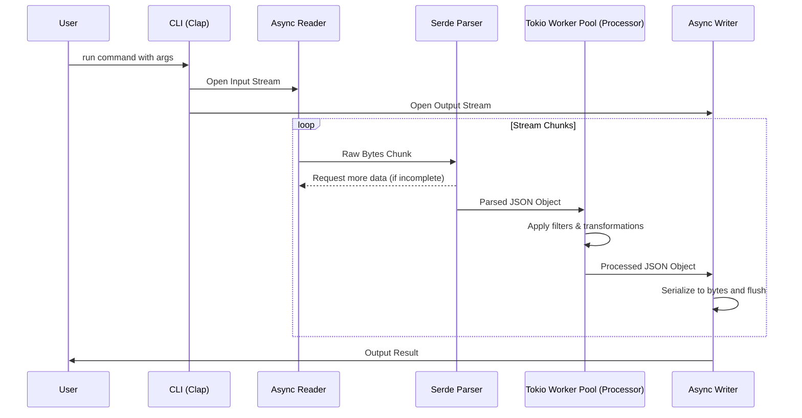

# Architecture Documentation: Command-Line JSON Processor

## 2.1 Chosen Architectural Pattern

**Pattern:** Pipeline / Filter Architecture with Async Task Workers (Local CLI)

**Justification:** For a high-performance command-line JSON processor, a pipeline architecture is highly suitable because it models the natural flow of data: reading from an input stream -> parsing -> filtering/transforming -> serializing -> writing to an output stream. Using Async Task Workers (via Tokio) allows for non-blocking I/O and concurrent processing of independent JSON objects, maximizing CPU utilization on modern multi-core machines, which is crucial for handling large data files efficiently.

## 2.2 Key Component Interactions

- **CLI Parser (`clap`)**: Parses user arguments and initializes the processing context.
- **I/O Reader**: Reads raw bytes from stdin or file. Communicates with the Parser component.
- **Parser (`serde_json`)**: Converts raw bytes to strongly typed Rust structs or generic `serde_json::Value`.
- **Processor Pipeline**: Takes parsed values and applies the requested filtering/transformation rules. Uses channels to receive data from the Parser.
- **Schema Inferencer**: Observes data flowing through the pipeline to build statistical models of the data shape.
- **I/O Writer**: Serializes processed data and writes to stdout or file.

## 2.3 Data Flow

## 2.4 Scalability & Performance Strategy

- **Streaming Architecture**: By streaming data chunk by chunk rather than loading entire files into memory, the application can handle files larger than available RAM.
- **Asynchronous I/O**: Leveraging Tokio for I/O operations ensures the CPU isn't idle while waiting for disk reads/writes.
- **Parallel Processing**: JSON records are independent of each other (usually, in newline-delimited JSON or streaming JSON arrays). These can be dispatched to a Tokio worker pool or Rayon threads for parallel transformation.
- **Zero-Copy Parsing (where possible)**: Utilizing Serde's capability to borrow strings directly from the input buffer to minimize memory allocations.

## 2.5 Security Considerations

- **Denial of Service (Memory Exhaustion)**: Prevented by strict streaming; bounds are placed on the size of a single JSON object to prevent OOM kills from maliciously crafted input (e.g., deeply nested objects or massive strings).
- **Data Protection**: As a local CLI tool, data privacy is dependent on the host filesystem permissions. We do not transmit data externally unless explicitly requested.
- **Safe Parsing**: Relying on the well-tested `serde_json` ensures resilience against buffer overflows or parsing exploits common in C/C++ parsers.

## 2.6 Error Handling & Logging Philosophy

- **User-Facing Errors**: Use the `anyhow` crate for top-level error propagation and reporting. Errors must be contextualized (e.g., "Failed to parse line 42: invalid syntax") rather than generic.
- **Internal Errors**: Use the `thiserror` crate to define strongly-typed error enums for library-level components (like the custom filtering engine).
- **Logging**: Use the `tracing` crate for structured, leveled logging (DEBUG, INFO, WARN, ERROR). By default, only warnings and errors are shown, but users can pass `-v` or `--verbose` to see execution traces.
