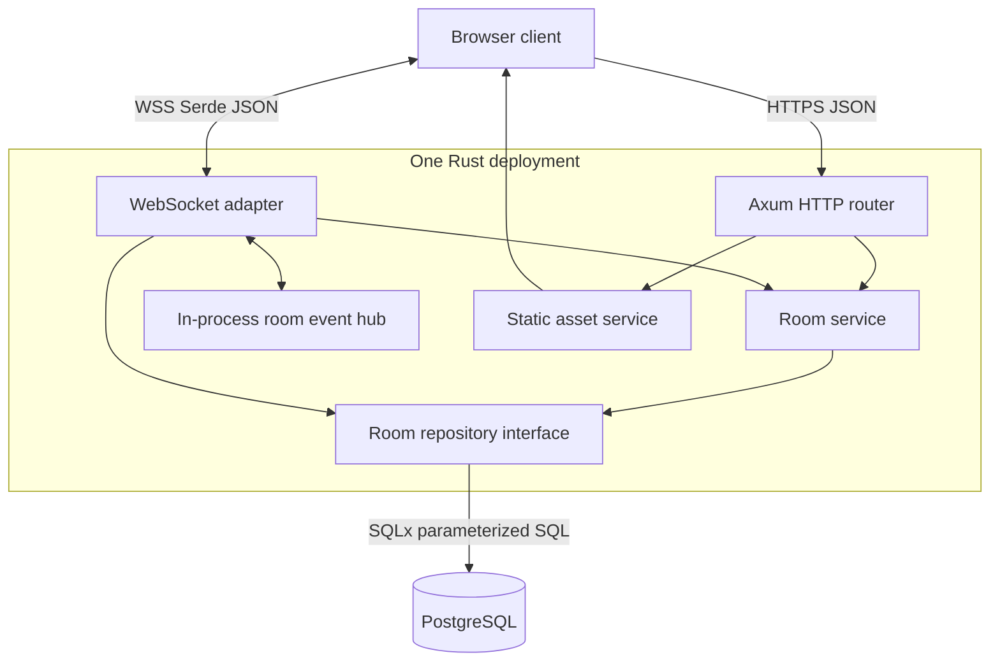
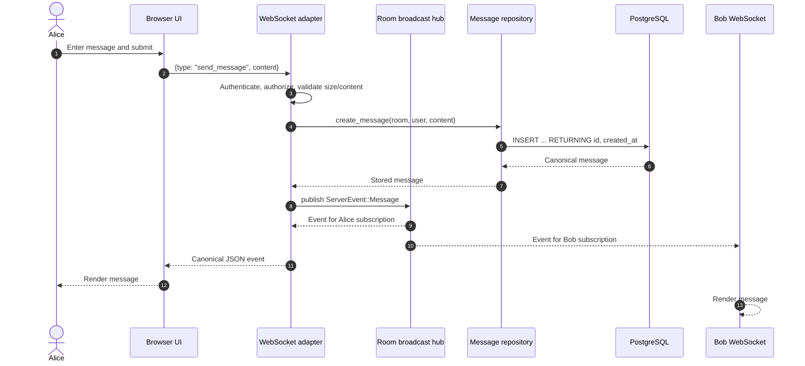
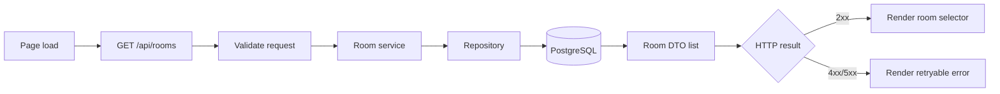
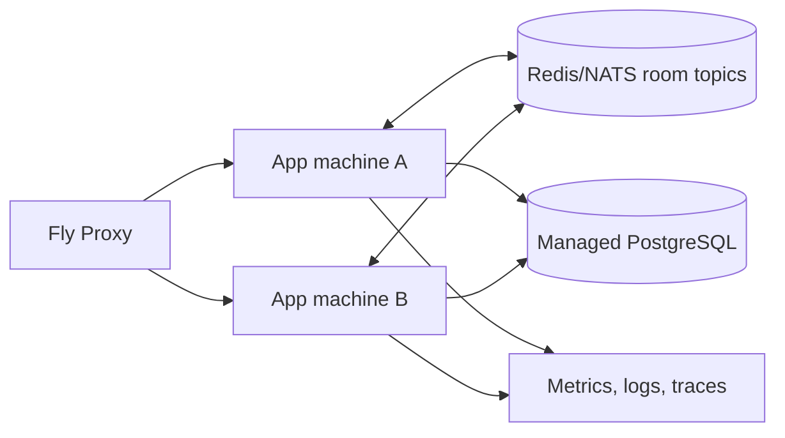

# Real-Time Chat App — Architecture

## 1. Chosen pattern: modular layered monolith with an event-driven chat core

The initial system is one deployable Rust process organized as a modular layered monolith. HTTP/WebSocket adapters call application services; services depend on repository interfaces and a chat event hub; infrastructure implements PostgreSQL and process-level concerns. Real-time chat within the process is event-driven through bounded Tokio broadcast channels.

This shape is appropriate because the product needs low-latency concurrent connections but does not yet justify the deployment, consistency, and observability cost of microservices. A Tokio process can support many mostly idle WebSockets efficiently. Explicit module boundaries and transport-independent services leave deliberate extraction seams for distributed pub/sub or a dedicated presence service when measured demand requires them.

### Layer rules

1. **Adapters (`api`)** own HTTP/WebSocket syntax, extraction, status codes, and boundary validation. They contain no SQL.
2. **Application services (`services`)** coordinate use cases and expose intention-revealing operations. They do not depend on Axum response types.
3. **Domain (`domain`, `shared`)** contains room models and the versionable wire protocol. It is independent of runtime infrastructure.
4. **Infrastructure (`repositories`, `telemetry`, `config`)** owns PostgreSQL, environment, and observability details behind narrow boundaries.
5. **Composition (`lib`, `main`, `state`)** wires concrete implementations once and controls process lifecycle.

## 2. Key component interactions

### API calls

- `GET /api/rooms` returns available rooms.
- `POST /api/rooms` validates and creates a room through `RoomService`.
- `PUT/DELETE /api/rooms/{id}` authorize an owner/moderator through `RoomService`; only an owner may delete.
- Membership and message routes share service-layer role checks across HTTP and WebSocket operations.
- `GET /ws/{room_id}` authenticates the session cookie, validates membership and origin, then upgrades to WebSocket.
- `GET /health/live` proves the event loop can respond; `GET /health/ready` proves PostgreSQL can answer a lightweight query.

HTTP errors use one JSON envelope with a stable machine-readable code. WebSocket messages use Serde's tagged enum encoding, allowing additive event variants and explicit protocol evolution.

### Message queues and event buses

There is no external queue in the first topology. Each room has a Tokio `broadcast` channel, which acts as an in-process ephemeral event bus. One connection task publishes a `ServerEvent`; every subscribed connection task receives it. Capacity is bounded: a slow receiver observes lag and can be warned/disconnected instead of growing memory without limit.

This choice deliberately means a single application machine for correct broadcast/presence semantics. Before horizontal application scaling, introduce Redis Pub/Sub, Redis Streams, or NATS as a `ChatEventBus` implementation. Durable history remains in PostgreSQL; pub/sub is delivery coordination, not the system of record. If guaranteed asynchronous jobs are later required, use a durable stream/queue with an outbox rather than treating ephemeral pub/sub as a work queue.

### Direct database access

Only repository implementations access PostgreSQL, using a bounded SQLx pool and parameterized statements. Application services depend on repository traits. Handlers and the frontend never connect directly. Migrations define constraints and indexes, and the deployment applies them once before new code receives traffic.

### Connection task ownership

Axum creates one Tokio task per upgraded socket. That task uses `select!` to multiplex client frames and room broadcasts. A presence lease increments the room count after successful admission and decrements it on every exit path through RAII cleanup. Cancellation, socket close, protocol failure, and server shutdown therefore share cleanup behavior.

## 3. Data flow

The normal send path validates at both the UI boundary and the trusted server boundary. Persistence occurs before broadcast so clients do not receive a message that the system failed to durably accept. The returned database record supplies the canonical ID and timestamp.

Room discovery uses a simpler path:

### Delivery semantics

- Live delivery is **at most once per active process subscription**; transient disconnects can miss events.
- Durable message creation is authoritative. Reconnection fetches history with a stable cursor and deduplicates by canonical message ID.
- Client-generated idempotency keys have a database uniqueness constraint; retries return the original row without rebroadcast.
- Ordering is stable per room publisher in one process. A distributed bus will require a room sequence or database cursor if strict cross-machine ordering is needed.

## 4. Scalability and performance strategy

### Initial scale

- Tokio provides non-blocking socket/database I/O; no blocking work belongs on executor threads.
- Per-room channels avoid broadcasting every message to unrelated rooms.
- Channel, frame, content, and database-pool limits make resource consumption bounded.
- Static assets and the API share a container and use negotiated Brotli/gzip compression; fingerprinted immutable assets or CDN hosting can be added independently.
- PostgreSQL indexes cover room/message history queries. Cursor pagination avoids deep `OFFSET` scans.
- Fly health checks and graceful shutdown drain rolling deployments without accepting new work from an unhealthy machine.

### Growth path

1. Measure connection count, broadcast lag, event-loop latency, memory/socket, database pool saturation, and end-to-end delivery latency.
2. Scale vertically while one machine comfortably meets availability needs.
3. Add a `ChatEventBus` abstraction and distributed presence leases, then scale app machines horizontally.
4. Partition topics by room ID. Apply per-room limits so one celebrity room cannot starve the process.
5. Add read replicas or archive/partition old messages only when query measurements show database pressure.

Backpressure is part of the protocol, not an incidental error. Slow clients are allowed to lag only up to channel capacity; after that the server reports a recoverable error or closes the socket. Persistence concurrency is limited by the database pool. Load shedding should reject new upgrades with `503` before existing conversations become unusable.

## 5. Security considerations

### Authentication and authorization

- Identity comes from revocable server-managed `HttpOnly`, `SameSite=Strict` session cookies. Staging/production startup requires secure cookies and HTTPS origins.
- Authenticate the HTTP request before WebSocket upgrade. Bind the user ID to server-side connection state and never trust a user ID inside a client frame.
- Authorize membership, private-room access, room deletion, moderation, and history reads in the service layer.
- Store passwords only as Argon2id hashes with unique salts. Support session revocation and key rotation.

### Data protection

- Use HTTPS/WSS exclusively outside local development; Fly terminates TLS and traffic to instances follows platform policy.
- Encrypt managed volumes/databases and backups, define message retention, and support account/data deletion.
- Avoid message bodies, tokens, cookies, and connection query secrets in logs. Treat IP addresses as sensitive operational data.
- Escape rendered message content. The browser component uses `textContent`, never untrusted `innerHTML`.

### API and WebSocket security

- Validate JSON shape, UTF-8, normalized names, IDs, content length, and allowed frame types server-side.
- Set request/body/frame limits, idle heartbeat timeouts, connection quotas, and per-user/IP message rates.
- Validate `Origin` for WebSocket upgrades and use an explicit production allowlist.
- Configure narrow CORS only if the frontend moves to another origin. Same-origin deployment needs no permissive CORS.
- Use parameterized SQL, generic public errors, CSP/security headers, and dependency/license auditing.

### Secret management

- `.env` is local-only and ignored. `.env.example` contains names and safe examples, never live credentials.
- Store runtime secrets with `fly secrets set` and CI deployment credentials in protected GitHub environments.
- Prefer short-lived/OIDC deployment identity where supported. Rotate database credentials and Fly tokens, and audit access.

## 6. Error handling and logging philosophy

Errors are typed near their source and translated once at the transport boundary. Expected failures (`validation`, `not_found`, `conflict`, `unauthorized`, `rate_limited`) map to stable codes and safe messages. Unexpected infrastructure failures keep their cause chain for logs but return a generic `internal_error`; SQL text, credentials, and backtraces never go to clients.

Every HTTP request receives a correlation ID. Structured tracing fields include request ID, room ID, authenticated user ID, close reason, latency, status, broadcast lag, and error category. They exclude message content and credentials. Log levels are consistent: `INFO` for lifecycle and meaningful state transitions, `WARN` for recoverable client/lag conditions, and `ERROR` for failed invariants or unavailable dependencies.

WebSocket errors distinguish malformed client input from server failures. A malformed command receives a protocol error when safe; repeated violations close with an appropriate code. Receiver lag signals that history resynchronization is required. All connection loops execute the same presence cleanup on exit.

Operational visibility should combine:

- **Logs:** searchable structured events with correlation fields.
- **Metrics:** active connections, users per room, messages/sec, delivery latency, lagged receivers, rejected upgrades, HTTP status/latency, DB pool wait, and process saturation.
- **Traces:** sampled HTTP upgrade, persistence, and publish spans across external dependencies.
- **Alerts:** symptoms tied to SLOs, such as elevated connection failures or delivery latency, rather than individual log lines.

Panics represent bugs, not normal control flow. The process logs them and Fly restarts the failed machine; tests should exercise error returns, cancellation, shutdown, and dependency outages. Graceful shutdown stops accepting connections, signals active sockets, waits for a bounded drain period, and then exits non-zero if startup/runtime invariants fail.

## 7. Architecture decisions to record next

- ADR-001: session mechanism and identity provider.
- ADR-002: message delivery, ordering, retry, and idempotency guarantees.
- ADR-003: Redis Streams versus NATS for cross-machine fan-out.
- ADR-004: history retention, privacy deletion, and moderation audit policy.
- ADR-005: zero-downtime migration compatibility rules.
