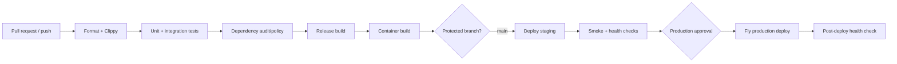

# Real-Time Chat App — Technical Notes

## 1. CI/CD pipeline design

Use two GitHub Actions workflows: `ci.yml` proves a revision is releasable, and `deploy.yml` promotes the exact revision to Fly.io. Pin action major versions and Rust tooling; use dependency caching only as an optimization, never as an input to correctness.



Recommended stages:

1. **Fast quality gate:** `cargo fmt --all --check` and `cargo clippy --workspace --all-targets --all-features -- -D warnings`.
2. **Tests:** compile and run workspace tests. Integration jobs start PostgreSQL, apply migrations, and run serially only where shared database state requires it.
3. **Supply chain:** `cargo audit` for known vulnerabilities and `cargo deny check` for advisories, licenses, bans, and duplicate policy. Use Dependabot/Renovate for small, reviewable updates.
4. **Build:** `cargo build --workspace --release --locked`; build the Docker image using the committed lockfile.
5. **Staging:** on `main`, deploy the revision to a separate Fly app/database, run migrations as a release command, then test health, HTTP CRUD, WebSocket connect/send/receive, and static assets.
6. **Production:** require a protected GitHub environment approval. Deploy the same commit/image with rolling checks. Run a post-deploy smoke test and retain the previous image for immediate rollback.

Never deploy from an untrusted pull-request context with secrets. Concurrency groups should cancel superseded CI runs but serialize deployments per environment. Migration compatibility must follow expand/migrate/contract: deploy additive schema first, backfill separately, switch code, and remove old schema only in a later release.

## 2. Testing strategy

### Unit tests

Rust's built-in `#[test]`/`#[tokio::test]` are sufficient. Place focused tests beside validation, configuration, hub, and service code. Use fakes implementing repository traits instead of mocking SQL details.

Prioritize behavioral coverage over a single percentage. The enforced gate is at least 80% whole-workspace line coverage plus explicit coverage of important validation/authorization/error branches. Generated glue and `main` can have lower coverage. CI runs `cargo llvm-cov --workspace --all-features --fail-under-lines 80` and uses behavioral tests rather than coverage-only assertions.

Important unit cases include:

- room/display-name/message normalization and boundary sizes;
- subscribe, publish, presence decrement on every exit path, and receiver lag;
- service mapping of duplicate/not-found/repository failures;
- protocol JSON round trips and forward-compatible unknown input behavior;
- configuration defaults, missing secrets, malformed numbers, and environment precedence.

### Integration tests

Run a real PostgreSQL version matching production, preferably with Testcontainers or a CI service container. Apply migrations from scratch for every suite, then test repository constraints, room CRUD, history ordering/cursors, deletion behavior, and pool exhaustion timeouts. Avoid sharing mutable fixtures across parallel tests; give each test a transaction or unique database/schema.

Exercise the Axum router in-process with Tower `oneshot` for status, headers, JSON envelopes, validation, and auth. Also start a listener on an ephemeral port for real WebSocket tests. Verify two clients in one room receive the same canonical message, another room does not, counts change on disconnect, malformed/oversize frames are rejected, and shutdown completes.

### End-to-end and non-functional tests

Use Playwright against the deployed static UI for the critical path: load rooms, create/select a room, connect two browser contexts, send, receive, display count, reconnect, and render an outage. Keep E2E tests few and deterministic; API/integration tests carry most variants.

Use k6 or a purpose-built Tokio load client for thousands of WebSockets and representative room distributions. Record connection success, p50/p95/p99 delivery latency, CPU, memory, socket count, lagged receivers, and database pool wait. Include slow consumers, reconnect storms, a very large room, PostgreSQL interruption, and rolling deploys. Run security scanning and dependency audit in CI; schedule deeper dynamic scans against staging.

## 3. Deployment strategy

The `Dockerfile` uses a Rust builder followed by a small Debian runtime. Build dependencies stay out of production, the process runs as a non-root user, and the frontend is copied beside the executable. Keep the runtime glibc-compatible with the builder and install only CA certificates and required runtime libraries.

For local development, Docker Compose starts PostgreSQL and the app. For Fly.io:

1. Create separate `real-time-chat-staging` and production apps and separate managed PostgreSQL databases.
2. Set `DATABASE_URL` and any auth/observability credentials with Fly secrets.
3. Deploy the container in one primary region initially. The app listens on `0.0.0.0:8080` and Fly Proxy handles TLS/WSS.
4. Execute `chat-server migrate` (or the documented SQLx migration command) through Fly's release command before traffic shifts.
5. Gate traffic on `/health/ready`; use `/health/live` only for process replacement decisions.
6. Keep at least one machine running for chat availability. Disable aggressive autostop unless reconnect behavior and cold-start impact are explicitly acceptable.
7. Back up PostgreSQL, test restore, and define RPO/RTO. Roll back code to the previous image; never depend on an automatic destructive down-migration.

WebSockets are long lived, so deployment settings need a bounded graceful-shutdown window. The server stops accepting upgrades, sends/permits a close handshake, and drains tasks before termination. Once a distributed event bus exists, multi-machine rolling deployment no longer splits rooms by instance.

## 4. Environment management

Configuration follows twelve-factor precedence: safe code defaults, documented environment policy, then process environment. The checked-in TOML files contain non-secret operating policy; secrets always come from the runtime environment. Parse into a typed structure once during startup, validate cross-field invariants, and pass configuration explicitly.

Use these files:

- `.env` — developer-only values, ignored by Git.
- `.env.example` — complete variable inventory with safe local examples.
- Fly secrets — staging/production credentials.
- `config/*.toml` — non-secret intent and environment policy; do not silently combine ambiguous sources.

Template (the repository also contains this as `.env.example`):

```dotenv
APP_ENV=development
APP_HOST=0.0.0.0
APP_PORT=8080
DATABASE_URL=postgres://chat:<local-password>@localhost:5432/chat
DATABASE_MAX_CONNECTIONS=10
RUST_LOG=chat_backend=debug,tower_http=info
STATIC_DIR=frontend
ALLOWED_ORIGINS=http://localhost:8080
CHAT_CHANNEL_CAPACITY=256
MAX_MESSAGE_BYTES=4096
MAX_CONNECTIONS_PER_ROOM=500
SHUTDOWN_TIMEOUT_SECONDS=20
SESSION_TTL_HOURS=24
SECURE_COOKIES=false
MAX_HISTORY_PAGE_SIZE=100
MESSAGES_PER_MINUTE=60
API_REQUESTS_PER_MINUTE=300
HEARTBEAT_INTERVAL_SECONDS=20
HEARTBEAT_TIMEOUT_SECONDS=60
```

Validate production invariants such as non-local database host, HTTPS origins, sufficiently large credentials, non-debug log filters, and bounded numeric values. Do not give a missing secret a production fallback. Ensure crash output and diagnostic endpoints cannot dump the environment.

## 5. Version-control workflow

Use trunk-based GitHub Flow:

- `main` is protected and always deployable.
- Work in short-lived branches named by purpose (for example, `feat/history-cursors`).
- Open a pull request early; require CI and at least one review for production-impacting changes.
- Prefer small commits with tests and reversible migrations. Rebase or squash according to team policy; do not maintain long-running develop/release branches.
- Merge to `main` deploys staging automatically. Promote a known commit to production through a protected environment.
- Tag production releases with semantic versions once external clients rely on the API/protocol. Record user-visible changes and migration notes.

This is simpler than Gitflow for a continuously deployed single service and reduces merge divergence. Feature flags, not long-lived branches, isolate incomplete work. Urgent fixes follow the same pull-request pipeline; rollback is usually safer than an unreviewed forward patch.

## 6. Common pitfalls

### Tokio and WebSockets

- **Blocking the executor:** synchronous filesystem, DNS, crypto, or CPU-heavy moderation can stall unrelated sockets. Use async APIs or `spawn_blocking` with explicit concurrency limits.
- **Unbounded tasks/channels:** per-connection queues can exhaust memory during a burst. Bound every queue and define reject/drop/disconnect behavior.
- **Leaked presence:** early returns and cancelled tasks can skip decrements. Use an RAII presence lease and test abrupt close/cancellation.
- **Split-socket lifecycle bugs:** ensure reader/writer halves cancel each other; otherwise a dead peer can leave a writer task and room subscription alive.
- **No heartbeat:** half-open TCP connections can remain counted. Use ping/pong deadlines and platform-aware idle timeouts.
- **Slow receivers:** Tokio broadcast reports lag. Do not loop forever or hide it; resync history or close the consumer.
- **Oversized/fragmented frames:** enforce limits before allocation where possible, and decide whether binary frames are rejected.

### Protocol and business semantics

- **Display names are not identity:** query parameters are forgeable. Bind trusted identity during upgrade.
- **Duplicate sends:** automatic reconnect/retry can create duplicates. Add client message IDs plus a database uniqueness constraint before retrying writes.
- **Ambiguous ordering:** timestamps alone do not guarantee total order. Use a stable `(created_at, id)` cursor or per-room sequence.
- **Presence races:** a distributed exact count is expensive. Define whether presence is eventually consistent and use TTL leases across machines.
- **Protocol drift:** hand-written JavaScript and Rust types can diverge. Version events, add JSON contract fixtures, or generate client schemas from a source such as JSON Schema.

### SQLx, PostgreSQL, and deployment

- **Compile-time query metadata:** SQLx macros need a live database or checked-in offline metadata. Dynamic `query_as` avoids build-time coupling but moves column-shape verification to integration tests.
- **Holding transactions across awaits:** never retain a DB transaction while waiting on a client/broadcast; it consumes a pool slot and increases lock time.
- **Pool multiplication:** each Fly machine owns a pool. Size per instance so aggregate connections remain below the database limit.
- **Hot indexes/table growth:** messages grow indefinitely. Monitor index size, paginate by cursor, and establish retention/archival.
- **Breaking migrations:** old and new machines overlap during rolling deploys. Schema must support both versions during the rollout.
- **False readiness:** liveness must not restart the process for a transient database issue; readiness should remove it from traffic while retaining diagnostics.
- **Single-process broadcasts:** adding a second machine without external pub/sub silently partitions live conversations. Do not horizontally scale this topology prematurely.

### Serde and security

- Use tagged enums and reject unknown privileged fields/commands intentionally; decide compatibility per protocol version.
- Validate after deserialization; type-safe JSON does not enforce business ranges or Unicode normalization.
- Never deserialize arbitrary polymorphic types from untrusted input or expose internal error chains.
- Render messages as text, set a Content Security Policy, validate WebSocket Origin, and avoid auth tokens in URLs because proxies/logs may retain them.

## 7. Operational checklist

Before production, verify a clean migration and restore, graceful deploy with active sockets, bounded overload behavior, alert routing, secret rotation, dependency audit, TLS/custom domain, privacy retention, rate limits, authorization tests, and a rollback rehearsal. Record the tested load envelope and configure capacity alerts well below it.
