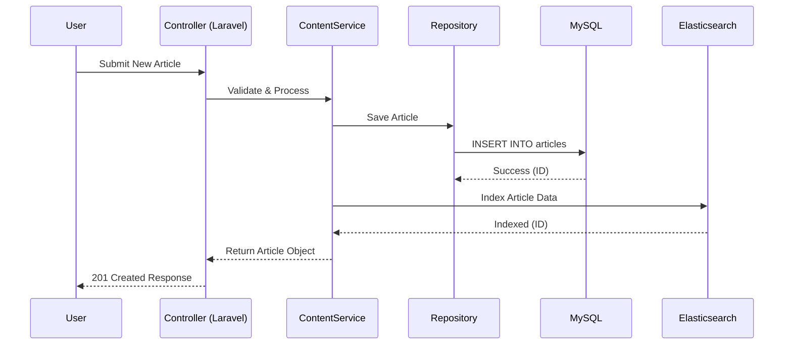

# Architecture Documentation: Enterprise CMS

## 2.1 Chosen Architectural Pattern
**Pattern: Hybrid Layered Structure with Service-Oriented (Microservices) Elements**

This application uses a refined Layered Monolith pattern for its core functionality, leveraging service integration for specialized components (Elasticsearch, Redis, ML).
This pattern is selected because:
- **Simplicity & Speed:** Reduces initial complexity while retaining strict separation of concerns (Repositories, Services, Controllers).
- **Scalability:** The critical services (Search, Cache, ML Recommendations) are decoupled and can scale independently.
- **Maintainability:** Clear boundaries ensure team scalability and easier onboarding.

## 2.2 Key Component Interactions (Mermaid Diagram)

```mermaid
graph TD
    User([User / Web Admin]) -->|HTTP Requests| LB[Load Balancer]
    LB -->|Routes| Laravel[Laravel App Server]
    
    subgraph Data Layer
        Laravel -->|Queries| MySQL[(MySQL - Primary DB)]
        Laravel -->|Indexing/Search| ES[(Elasticsearch)]
        Laravel -->|Cache/Queue| Redis[(Redis)]
    end

    subgraph External Services
        Laravel -->|API Calls (Recommendation)| ML[ML Service]
        Laravel -->|Assets (S3)| S3[S3 Storage]
    end

    ML -.->|Read user history| MySQL
```

## 2.3 Data Flow Structure

Standard Flow: **Request -> Controller -> Service Layer -> Repository -> Database**



## 2.4 Scalability & Performance Strategy

1. **Horizontal Scaling**: The Laravel app is stateless, running across multiple ECS containers behind an Application Load Balancer (ALB). Session management is offloaded to Redis.
2. **Caching Strategy**: 
   - **Page Caching**: Redis for rendered HTML (Varnish/CloudFront optional).
   - **Data Caching**: Redis for frequent query results (e.g., user profiles, menu structures).
   - **Query Optimization**: Using Eager Loading to prevent N+1 queries.
3. **Database**: Read replicas for heavy read operations. Separate connection for write operations.
4. **Asynchronous Processing**: Heavy tasks (image processing, email notifications, search indexing) are pushed to Redis Queues and processed by background workers (Horizon).
5. **Search**: Offloading full-text search queries to Elasticsearch to reduce load on MySQL.

## 2.5 Security Considerations

1. **Authentication & Authorization**:
   - Usage of Laravel Sanctum/Passport for API Token management.
   - Role-Based Access Control (RBAC) via middleware (Policies & Gates).
   - Two-Factor Authentication (2FA) for admin accounts.
2. **Data Protection**:
   - Encrypting sensitive data at rest using Laravel's encryption services.
   - All external communication over HTTPS (TLS 1.3).
   - Hashing passwords with Bcrypt/Argon2.
3. **API Security**:
   - Throttle middleware (Rate Limiting) to prevent abuse.
   - Input validation using strict Form Requests.
   - CORS configuration to strict whitelists.
4. **Secrets Management**:
   - AWS Secrets Manager or Parameter Store for production credentials, injected as environment variables at runtime.

## 2.6 Error Handling & Logging Philosophy

1. **Centralized Exception Handling**: A custom `Handler.php` intercepts all exceptions to format consistent JSON error responses for API clients.
2. **Standardized Responses**: 
   - Success: `{ "data": payload, "meta": meta }` (HTTP 200/201)
   - Error: `{ "error": { "code": "EXT_CODE", "message": "User friendly message" } }` (HTTP 4xx/5xx)
3. **Logging**:
   - **Application Logs**: Standardized info/error logs pushed to AWS CloudWatch or ELK Stack via Monolog.
   - **Audit Logs**: Critical actions (Model events like Create/Update/Delete) are logged to a dedicated `audit_logs` table for compliance.
