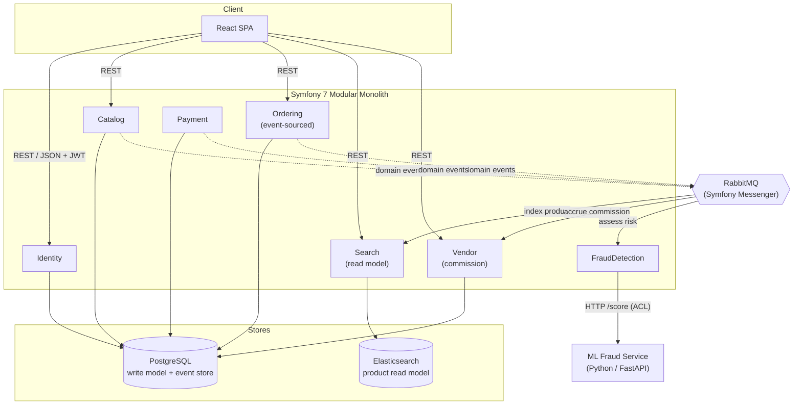
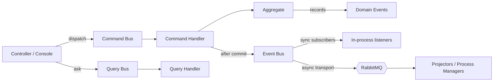
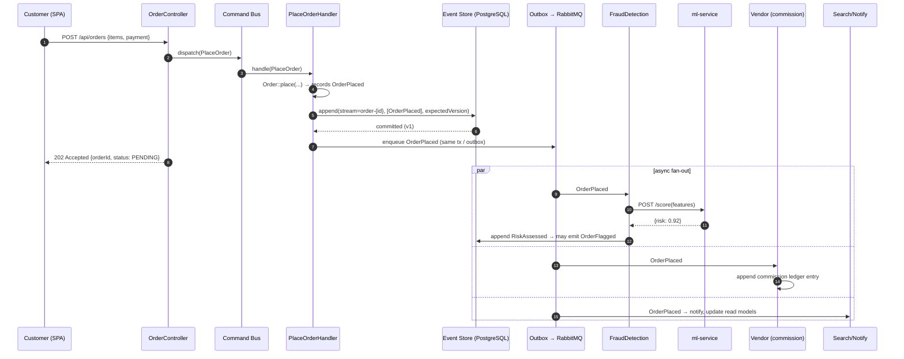
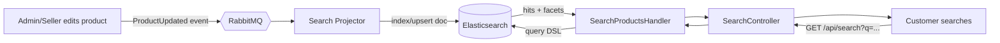
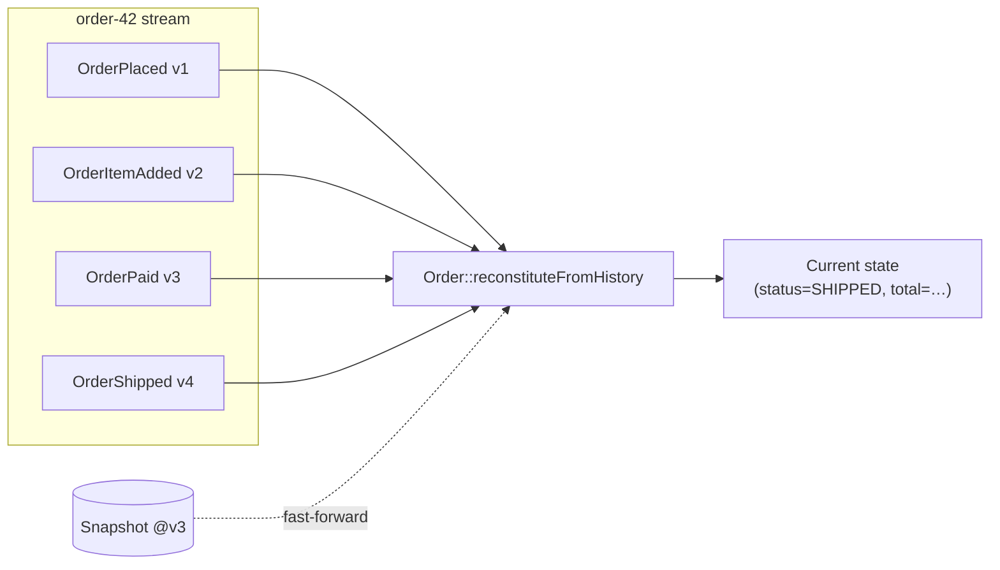
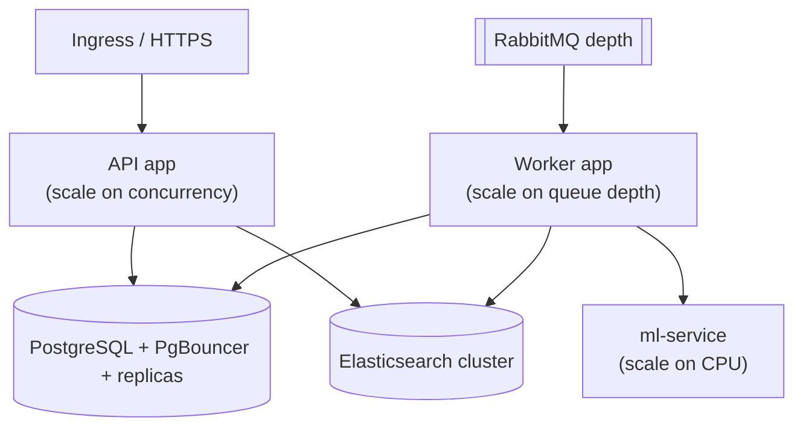
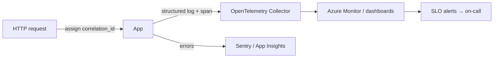

# E-Commerce Marketplace — Architecture

---

## 2.1 Chosen Architectural Pattern

**Modular Monolith + Domain-Driven Design + selective Event-Driven / CQRS / Event Sourcing.**

A single deployable Symfony application is internally partitioned into **bounded
contexts** (Catalog, Ordering, Search, Vendor, Payment, FraudDetection, Identity).
Contexts communicate **in-process via domain events** today, but the boundaries are
drawn so any context can be extracted into a standalone service later without
rewriting its domain.

### Why a modular monolith (not microservices)

| Driver | Implication |
|--------|-------------|
| Team & traffic at launch are moderate | Microservices' operational tax (distributed tracing, network failure modes, eventual consistency everywhere, N deploys) is not yet justified. |
| Domain boundaries are still being learned | A monolith lets boundaries move cheaply via refactor; premature service splits ossify the wrong seams. |
| Strong consistency needed in places | Order placement, commission ledger entries and payment capture benefit from in-process transactions. |
| Future scale is real | Hexagonal + event-driven seams mean extraction later is mechanical, not a rewrite. |

### Where we *do* go event-driven / CQRS / event-sourced

- **Event Sourcing — Ordering only.** Order history is a hard requirement
  ("event sourcing for order history"). Orders are stored as an immutable stream
  of events; the current state is a fold over that stream. This gives a perfect,
  queryable audit trail and natural inputs for fraud features and commission
  calculation.
- **CQRS — Search & dashboards.** The write model (PostgreSQL) is optimised for
  consistency; **read models** (Elasticsearch for product search, projected SQL
  tables for seller dashboards) are optimised for query shape and rebuilt from
  events. We do *not* impose CQRS on simple CRUD (Catalog write side stays plain).
- **Event-Driven integration.** Domain events (`ProductUpdated`, `OrderPlaced`,
  `PaymentCaptured`) are published to RabbitMQ via Symfony Messenger; other
  contexts subscribe asynchronously (search indexing, fraud scoring, commission
  accrual, notifications).

---

## 2.2 Key Component Interactions

| From → To | Mechanism | Sync? | Notes |
|-----------|-----------|-------|-------|
| SPA → Backend | REST/JSON over HTTPS, `Authorization: Bearer <JWT>` | sync | Versioned under `/api`. |
| UI Controller → Application | **Command/Query bus** (Symfony Messenger, sync transport) | sync | Controllers are thin; they dispatch a Command or Query and map the result to JSON. |
| Application → Domain | direct method calls on aggregates | sync | Domain layer is framework-free. |
| Domain → Infrastructure | **ports** (repository interfaces) implemented by Doctrine/ES adapters | sync | Dependency inversion; domain depends only on interfaces. |
| Context → Context | **Domain events** on the event bus → RabbitMQ async transport | async | The only sanctioned cross-context channel. No context calls another's repositories. |
| Search projector ← Catalog | subscribes to `ProductCreated/Updated/Deleted` | async | Builds/refreshes the ES index. |
| Vendor ← Ordering/Payment | subscribes to `OrderPlaced`, `PaymentCaptured` | async | Appends to commission ledger. |
| FraudDetection ← Ordering/Payment | subscribes to `OrderPlaced`, `PaymentInitiated` | async | Calls ml-service through an **anti-corruption layer**. |
| FraudDetection → ml-service | HTTP `POST /score` (timeout + circuit breaker) | sync (within async handler) | Fails *open* to "manual review", never blocks indefinitely. |

### Bus topology

Three logical buses (all Symfony Messenger): **command** (one handler, sync,
transactional), **query** (one handler, sync, read-only), **event** (many
handlers, async via RabbitMQ). Events are dispatched **after** the write
transaction commits (transactional outbox semantics) so subscribers never see
state that was rolled back.

---

## 2.3 Data Flow

### Example: customer places an order (write path + async fan-out)

### Example: product search (read path, CQRS)

The **write model never serves search**; the SPA queries the Elasticsearch
read model, which lags the write model by the (sub-second) projection time —
an explicit, acceptable eventual-consistency tradeoff for search.

### Event-sourced aggregate reconstruction (Ordering)

---

## 2.4 Scalability & Performance Strategy

- **Stateless app tier.** The Symfony app holds no session state (JWT auth), so
  Azure Container Apps scales it horizontally on HTTP concurrency / CPU. Target
  scale 1→N with KEDA rules.
- **Separate read & write scaling.** Search load hits Elasticsearch, not
  PostgreSQL; dashboard reads hit projected tables. The write DB is shielded from
  read fan-out (CQRS).
- **Async workers scale independently.** Messenger consumers (projection, fraud,
  commission, email) run as a **separate Container App** scaled on RabbitMQ queue
  depth (KEDA `rabbitmq` scaler) — a spike in orders adds consumers, not API pods.
- **PostgreSQL**: connection pooling (PgBouncer), read replicas for heavy
  analytical reads, partition the `event_store` table by month once large.
- **Event sourcing performance**: snapshots every N events bound replay cost;
  projections are async and cacheable.
- **Caching**: HTTP cache headers on catalog reads; Redis (optional, Phase 3) for
  hot read models and rate-limit counters.
- **ml-service** scales separately and is called with a tight timeout + circuit
  breaker so it can never become a latency bottleneck on the order path.

---

## 2.5 Security Considerations

**Authentication & Authorization**
- Stateless **JWT** bearer tokens (short-lived access + refresh). Issued by the
  Identity context on login.
- **Role hierarchy** (`ROLE_ADMIN > ROLE_SELLER > ROLE_CUSTOMER`) enforced via
  Symfony Security voters; resource-level checks (a seller may only mutate *their*
  products/orders) via custom **Voters** in each context's UI layer.

**Data protection**
- TLS everywhere (ingress + service-to-service). Secrets never in images.
- Passwords hashed with `argon2id`. PII columns encryptable at rest (Azure managed
  disk encryption + app-level field encryption for the most sensitive fields).
- Payment data: store **tokens/references only** (PSP-tokenised); never raw PAN.
  Keep PCI scope minimal by delegating card capture to the PSP.

**API security**
- Input validation at the boundary (Symfony Validator on request DTOs) — domain
  invariants additionally enforced inside aggregates (defence in depth).
- CORS allow-list, security headers (HSTS, CSP, X-Content-Type-Options), rate
  limiting (Symfony RateLimiter) on auth & search endpoints.
- Idempotency keys on payment/order mutations to make retries safe.

**Secret management**
- Local: `.env.local` (git-ignored). Cloud: **Azure Key Vault** referenced by
  Container Apps secrets; rotated; never logged. CI uses GitHub OIDC federation to
  Azure (no long-lived cloud credentials in GitHub).

**Fraud / abuse**
- The FraudDetection context scores transactions; high scores route to a manual
  review queue and can block payment capture. This is **security-relevant
  defensive logic** — model and thresholds are versioned and auditable.

---

## 2.6 Error Handling & Logging Philosophy

**Layered error model**
- **Domain layer** throws typed domain exceptions for invariant violations
  (`OrderAlreadyPaidException`) — these are *expected* business outcomes.
- **Application layer** may translate/aggregate; never leaks infrastructure detail.
- **UI layer** maps exceptions to HTTP via a single `ApiExceptionListener`:
  domain/validation → `400/409/422`, auth → `401/403`, not-found → `404`,
  unexpected → `500` with a correlation id (never a stack trace to the client).

**Async failures**
- Messenger **retry strategy** with exponential backoff; exhausted messages land
  in a **dead-letter** transport for inspection/replay. Consumers are
  **idempotent** (dedupe on event id) so at-least-once delivery is safe.
- Fraud/ml-service failures **fail open** to `MANUAL_REVIEW`, never silently allow
  nor hard-block on an outage.

**Logging & observability**
- **Structured JSON logs** (Monolog) with a `correlation_id` propagated from the
  inbound request through commands, events and async consumers.
- **OpenTelemetry** traces span HTTP → bus → DB → ES → ml-service. Metrics
  (RED: rate/errors/duration; queue depth; projection lag) feed Azure Monitor
  dashboards and SLO-based alerts.
- Errors aggregated in Sentry (or App Insights) with release + correlation id.
- **Audit**: the order event stream *is* the business audit log; security-relevant
  actions (role changes, payouts, fraud overrides) are additionally logged
  immutably.

