# E-Commerce Marketplace — Technical Notes

Actionable guidance for building, testing, shipping and operating this stack.

---

## 3.1 CI/CD Pipeline Design

Three GitHub Actions workflows (see `.github/workflows/`). Each deployable unit
has its own lint→test→build pipeline; a shared deploy workflow promotes images.

```mermaid
flowchart LR
    PR[Pull Request] --> L[Lint & format check]
    L --> SA[Static analysis<br/>PHPStan L9 / tsc / mypy]
    SA --> UT[Unit tests]
    UT --> IT[Integration tests<br/>PG + RabbitMQ + ES services]
    IT --> BUILD[Build container images]
    BUILD --> SCAN[Trivy image + deps scan]
    SCAN -->|merge to main| DEV[Deploy → dev]
    DEV --> SMOKE[Smoke tests]
    SMOKE -->|manual approval| STG[Deploy → staging]
    STG -->|tag vX.Y.Z| PROD[Deploy → prod]
```

**Stages**
1. **Lint / format** — `php-cs-fixer --dry-run`, `eslint`, `prettier --check`, `ruff`.
2. **Static analysis** — PHPStan level 9 (+ Deptrac for context-boundary rules),
   `tsc --noEmit`, `mypy`.
3. **Test** — unit (fast, no I/O) then integration (spin up PG/RabbitMQ/ES as
   GitHub Actions **service containers**) then functional API tests.
4. **Build** — multi-stage Docker images, tagged with the commit SHA; pushed to
   Azure Container Registry (ACR) on merge.
5. **Security** — Trivy (image + filesystem), `composer audit`, `npm audit`,
   secret scanning.
6. **Deploy** — `az containerapp update --image …` per environment. `dev` is
   automatic on `main`; `staging` gated by approval; `prod` triggered by a
   semver tag. Uses **GitHub OIDC → Azure** (no static cloud secrets).

**Principles**: fail fast (cheap checks first), every check runs on PRs, `main`
is always releasable, deploys are immutable image promotions (build once, deploy
the same artifact to every environment).

---

## 3.2 Testing Strategy

Follow the **test pyramid** — many fast unit tests, fewer integration, fewest E2E.

**Backend (PHP / PHPUnit)**
- **Unit** — domain aggregates, value objects, command/query handlers with
  in-memory fakes. No DB, no container. *This is where event-sourcing logic is
  tested*: given a list of past events, when a command is applied, assert the new
  events recorded (`given/when/then` event-sourcing tests). Target **≥ 90%** on
  `Domain/`.
- **Integration** — Doctrine repositories against a real PostgreSQL, the
  Elasticsearch indexer/searcher against a real ES, Messenger handlers end-to-end.
  Run against docker-compose / CI service containers. Target **≥ 70%** overall.
- **Functional** — boot the Symfony kernel, hit the REST API with
  `WebTestCase`/`ApiTestCase`, assert status + JSON. Covers auth, validation,
  error mapping.
- Tooling: PHPUnit, `dama/doctrine-test-bundle` (wrap each test in a rolled-back
  transaction), `zenstruck/foundry` for fixtures.

**Frontend (TypeScript / React)**
- **Unit/component** — Vitest + React Testing Library; test components in terms of
  user-visible behaviour, mock the API client.
- **Contract** — type-check API responses against shared TS types; consider MSW to
  mock the backend with realistic fixtures.
- Coverage target **≥ 80%** on `components/`, `hooks/`, `features/`.

**ml-service (Python)**
- **Unit** — pytest on the feature pipeline & scoring contract; assert the API
  schema and the fail-safe behaviour (degraded model → safe default).
- Model quality is tracked separately (offline eval: AUC/precision-recall on a
  labelled holdout), not in unit CI.

**End-to-end**
- **Playwright** against an ephemeral `dev`/staging deploy: register → browse →
  search → place order → seller sees commission. Run nightly + pre-prod, not on
  every PR (slow, flaky-prone). Keep ≤ 10 critical-journey specs.

---

## 3.3 Deployment Strategy

**Containerisation** — each unit is a small, multi-stage image:
- *backend*: stage 1 `composer install --no-dev` → stage 2 `php:8.3-fpm-alpine`
  + nginx (or FrankenPHP/Caddy for a single-process image). Run as non-root,
  read-only FS, healthcheck on `/health`.
- *frontend*: stage 1 `node:20` build → stage 2 `nginx:alpine` serving static
  assets (or pushed to Azure Static Web Apps / CDN).
- *ml-service*: `python:3.12-slim`, model artifact baked in or pulled from blob
  storage at boot.

**Target — Azure Container Apps** (see `infra/azure/`):
- One **Container Apps Environment** per stage (dev/staging/prod), wired to
  Log Analytics.
- Apps: `api` (external ingress), `worker` (no ingress, scales on queue depth),
  `ml-service` (internal ingress only).
- Managed dependencies: **Azure Database for PostgreSQL Flexible Server**, a
  RabbitMQ add-on/VM (or Azure Service Bus if we drop AMQP-specific features),
  **Elastic Cloud** or self-managed ES.
- Secrets from **Key Vault**; images from **ACR**; revisions enable **blue/green
  / canary** (split traffic across revisions, roll forward/back instantly).
- IaC is **Bicep**; CI runs `az deployment group create` for infra changes and
  `az containerapp update` for app image rollouts.

**Migrations** run as a pre-deploy step (a one-off Container Apps **job**), gated
so the app revision only goes live after migrations succeed. Migrations must be
**backward-compatible** (expand/contract) to support zero-downtime rollouts.

---

## 3.4 Environment Management

- Config via environment variables only (12-factor). Symfony reads `.env` →
  `.env.local` (dev) and real env vars (cloud). Vite needs `VITE_`-prefixed vars
  at **build** time.
- Three environments — **dev** (auto-deployed, throwaway data), **staging**
  (prod-like, real integrations in test mode), **prod**.
- Per-environment values live in Container Apps config + Key Vault, *never* in the
  repo. The committed `.env.example` is the single source of truth for *which*
  variables exist (documented above each).
- Feature flags for risky/in-progress features so deploy ≠ release.

See **`.env.example`** at the repo root for the documented template (DB, RabbitMQ,
Elasticsearch, JWT, fraud-service, CORS, commission rate).

---

## 3.5 Version Control Workflow

**Trunk-based development with short-lived feature branches** (GitHub Flow):
- `main` is always deployable and protected (PR + green CI + 1 review required).
- Branch `feat/…`, `fix/…`, `chore/…`; keep branches < 1–2 days; rebase on `main`.
- Merge via **squash** → linear history, one commit per logical change.
- **Conventional Commits** (`feat:`, `fix:`, `refactor:`…) drive automated
  changelog + semver.
- Releases: tag `vX.Y.Z` on `main` → triggers prod deploy.

*Rationale*: with strong CI, continuous integration to trunk minimises merge hell
and long-lived divergence — a better fit than Gitflow for a fast-moving SaaS with
automated deploys. Gitflow's release/hotfix branches add ceremony we don't need
when we can roll forward via Container Apps revisions.

---

## 3.6 Common Pitfalls (this stack)

**DDD / modular monolith**
- *Anaemic domain models* — putting logic in services and leaving entities as data
  bags. Keep invariants inside aggregates.
- *Boundary leaks* — one context querying another's tables/repositories. Enforce
  with **Deptrac/phpat** in CI; cross-context only via events or published
  contracts.
- *Aggregate too large* — design for the smallest consistency boundary; reference
  other aggregates by id, not object graph.

**Event Sourcing (Ordering)**
- *Event schema evolution* — events are immutable forever; version them and write
  **upcasters**; never edit a stored event.
- *Replay cost* — add snapshots before streams get long; make projections
  idempotent and rebuildable.
- *Leaking persistence into events* — events are domain facts, not ORM rows; keep
  them serialisation-stable and PII-aware.

**CQRS / Eventual consistency**
- The UI must tolerate read-model lag (e.g. a just-created product not instantly
  in search). Show optimistic UI / "processing" states; don't assume read-after-
  write on the read side.

**Doctrine**
- N+1 queries — use `JOIN`/`fetch=EAGER` deliberately and DQL `addSelect`.
- The `EntityManager` closes on any exception — in long-running Messenger workers,
  reset the manager and handle this, or the worker dies after the first error.
- Avoid lifecycle-callback business logic; keep it explicit in handlers.

**RabbitMQ / Messenger**
- At-least-once delivery → consumers **must** be idempotent (dedupe by event id).
- Forgetting a **dead-letter** transport → poison messages block the queue.
- Long-running workers leak memory — use `--time-limit`/`--memory-limit` and let
  the orchestrator restart them.

**Elasticsearch**
- Mapping drift — define explicit index mappings; reindex via alias swap, don't
  mutate live mappings.
- Treating ES as source of truth — it is a **derived** read model; it must be
  rebuildable from PostgreSQL events at any time.

**Azure Container Apps**
- Cold starts when scaled to zero — keep `minReplicas ≥ 1` for latency-sensitive
  apps (api), allow zero for workers.
- Connection storms — pool DB connections (PgBouncer); a burst of new replicas can
  exhaust PostgreSQL `max_connections`.
- Build-time vs run-time env for the SPA — `VITE_*` must be present at image build.

**ML fraud service**
- Don't put a synchronous, unbounded ML call on the order critical path — score
  **asynchronously** with a strict timeout + circuit breaker, fail open to manual
  review.
- Train/serve skew — share the exact feature pipeline between training and `/score`.
