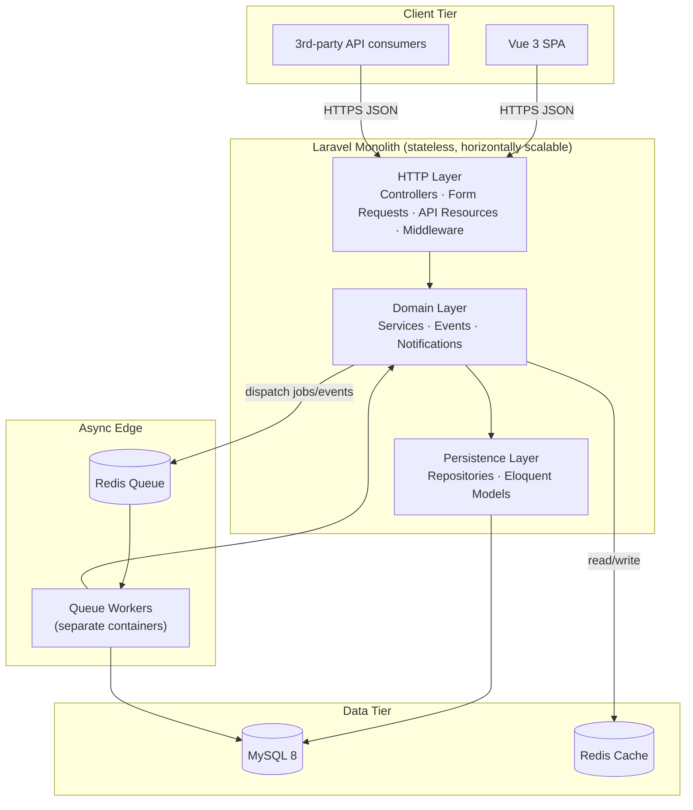
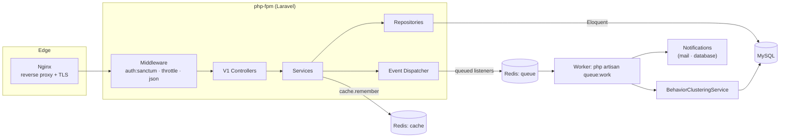
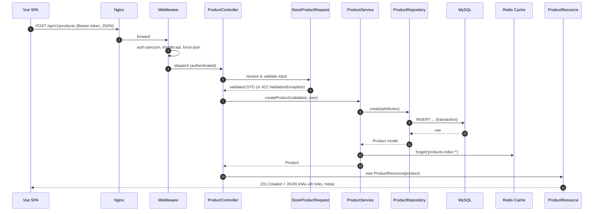
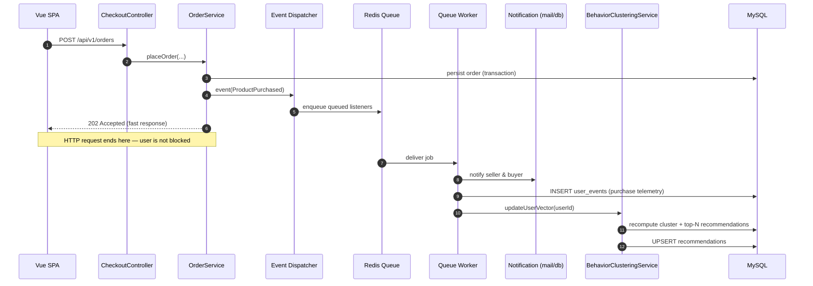
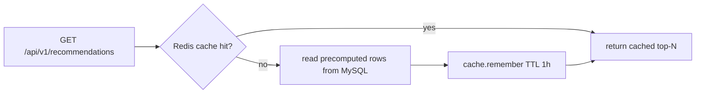
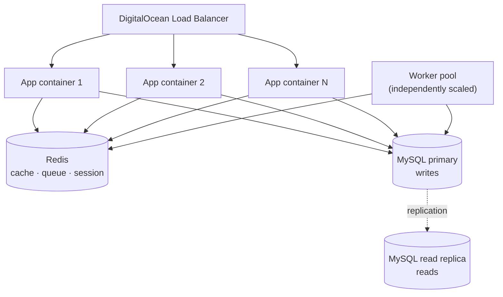
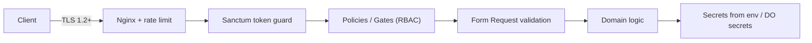
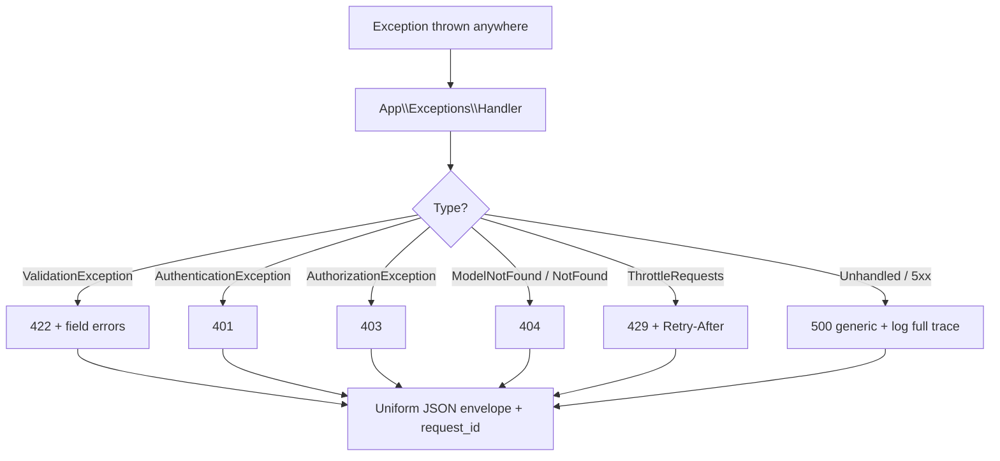

# REST API Backend — Architecture

> Architecture of a **Laravel 11 marketplace/SaaS API** with token auth, versioned & rate-limited endpoints, event-driven notifications, and user-behavior clustering for recommendations. Backed by **MySQL 8** + **Redis 7**, fronted by a **Vue 3** SPA, deployed to **DigitalOcean**.

---

## 2.1 Chosen Architectural Pattern

### Pattern: **Modular Layered Monolith with an Event-Driven (async) edge**

A single deployable Laravel application, internally organized into strict layers, with slow/side-effecting work pushed onto a **Redis queue** consumed by separate worker processes.



### Why a layered monolith (and not microservices)?

| Criterion | Decision driver |
| --- | --- |
| **Team & scale** | A marketplace at launch/growth stage benefits from a single codebase: one deploy, one schema, easy transactions. Microservices would add network, distributed-transaction, and ops overhead well before the domain justifies it. |
| **Strong consistency** | Orders, inventory, and auth want ACID transactions in one database — trivial in a monolith, painful across services. |
| **Velocity** | Laravel's batteries-included stack (Eloquent, Sanctum, queues, events, notifications) makes the layered monolith the highest-velocity choice for this team and timeline. |
| **Future-proofing** | The **module + interface boundaries** (Services behind contracts, Repositories behind interfaces) mean a hot subdomain — e.g. *Recommendations* — can later be **extracted into a service** without rewriting callers. The async edge already models that seam. |
| **Performance under load** | The expensive parts (notifications, clustering recompute) are **already asynchronous**, so the synchronous request path stays fast without a service mesh. |

**In one line:** start as a *well-factored modular monolith*, keep the seams clean, and let real load — not fashion — decide what gets extracted later.

---

## 2.2 Key Component Interactions



**Communication styles used and where:**

- **Synchronous HTTP (JSON/REST)** — Vue SPA & external consumers → Nginx → Laravel. Versioned under `/api/v1`. This is the only public surface.
- **Direct database access (Eloquent)** — *only* through the **Persistence layer** (Repositories/Models). Controllers and Services never issue raw queries against the connection.
- **Cache reads/writes (Redis)** — Services use `Cache::remember()` for hot reads (product listings, a user's recommendation set). Writes invalidate the relevant keys/tags.
- **Message queue (Redis)** — Domain events and notifications are **dispatched as queued jobs**. The web process returns immediately; workers do the slow work.
- **Event bus (in-process → async)** — Laravel's event dispatcher decouples "what happened" (`ProductPurchased`) from "what to do about it" (record telemetry, notify the seller, refresh recommendations). Listeners implementing `ShouldQueue` run on workers.

---

## 2.3 Data Flow

### 2.3.1 Synchronous request — *Create a product* (write path)



### 2.3.2 Asynchronous flow — *Purchase → notify → re-personalize*



### 2.3.3 Read path with cache (recommendations)



---

## 2.4 Scalability & Performance Strategy



- **Stateless app tier** → scale **horizontally**. Sessions, cache, and queues live in **Redis**, never on the box, so any container can serve any request and the load balancer can add/remove instances freely.
- **Asynchronous offload** → the request thread never waits on email, push, or clustering. Workers scale **independently** of web traffic (purchases spike ≠ page views spike).
- **Caching layers**:
  - *Application cache* (`Cache::remember`) for hot reads (catalog pages, a user's recommendation list).
  - *OPcache + preloading* for compiled PHP.
  - *HTTP caching* (`ETag`/`Cache-Control`) on cacheable GETs.
- **Database scaling**: read/write split (Eloquent's read/write connections) → reads hit a **replica**; indexes on all filter/sort/foreign-key columns; pagination is **always** enforced (no unbounded list endpoints).
- **Rate limiting** (Redis token bucket) protects the system from abusive/runaway clients and is itself a performance guardrail.
- **Recommendation cost control**: clustering is **precomputed off-peak** (scheduled job) and served from a cheap key-value read — never computed inside a request.
- **Extraction seam**: if *Recommendations* becomes the bottleneck, the `BehaviorClusteringService` (already behind an interface, already async) can be lifted into its own service or a Python ML worker without touching API callers.

---

## 2.5 Security Considerations



- **Authentication** — **Laravel Sanctum** bearer tokens for the SPA and API clients. Passwords hashed with **bcrypt/argon2**. Token abilities (scopes) limit what each token can do; tokens are revocable.
- **Authorization** — **Policies & Gates** enforce per-resource RBAC (e.g. only a product's owner/admin may update it). Authorization is checked in the controller/Form Request `authorize()`, never assumed.
- **Input validation** — every write goes through a **Form Request**; mass-assignment controlled via `$fillable`. Output goes through **API Resources** so internal columns never leak.
- **API security** — HTTPS everywhere (HSTS); **rate limiting** per user/IP; strict CORS allow-list; security headers (CSP, X-Content-Type-Options, X-Frame-Options); request size limits; no stack traces in production responses.
- **Injection defense** — Eloquent/parameter binding everywhere (no string-concatenated SQL); Blade/Vue auto-escaping for any rendered content.
- **Secret management** — secrets (`APP_KEY`, DB creds, mail/API keys) come from **environment variables / DigitalOcean encrypted secrets**, never committed. `.env.example` documents *names only*. Rotate keys via the platform, not code.
- **Transport & data protection** — TLS in transit; encrypt sensitive columns at rest where needed; sign/expire any URLs that grant access.
- **Auditability** — auth events and privileged actions are logged with request IDs for forensics.

---

## 2.6 Error Handling & Logging Philosophy

### Principles

1. **One error contract.** Every API error — validation, auth, not-found, server — returns the **same JSON envelope**, so clients write one error handler. The HTTP status carries the category; the body carries the detail.

   ```json
   {
     "message": "The given data was invalid.",
     "errors": { "price": ["The price must be at least 0."] },
     "error_code": "VALIDATION_FAILED",
     "request_id": "01J9Z…"
   }
   ```

2. **Fail at the boundary.** Validation (422) and authorization (403) failures are caught **before** domain logic runs, via Form Requests and Policies. Domain code can then assume clean, authorized input.

3. **Exceptions over error codes.** Domain code throws typed exceptions (`ProductNotFoundException`, `InsufficientStockException`); the **central `Handler`** maps each to the right status + envelope. Controllers don't litter `try/catch`.

4. **Never leak internals.** In production, 5xx responses are generic (`"Server Error"` + `request_id`); the real stack trace goes to logs only.



### Logging

- **Structured JSON logs** (Monolog) to **stdout/stderr** — the container platform (DigitalOcean) aggregates them. No logging to local files in production.
- **Correlation** — a `request_id` (and `user_id` when authenticated) is attached to every log line and echoed in error responses, so a user-reported error maps to exact log lines.
- **Levels with intent** — `debug` (local only), `info` (business milestones: order placed), `warning` (recoverable: cache miss storms, retries), `error` (handled failures), `critical` (paging-worthy: DB down).
- **Error tracking** — uncaught exceptions ship to **Sentry** with release + environment tags for grouping and alerting.
- **Queue/worker failures** — failed jobs land in the `failed_jobs` table with full context and are retried with backoff; exhausted retries alert.

---

## Related Documents

- [`PROJECT-PLAN.md`](./PROJECT-PLAN.md) — file structure & phased TODO list.
- [`TECH-NOTES.md`](./TECH-NOTES.md) — CI/CD, testing, deployment, environments, git workflow, pitfalls.
