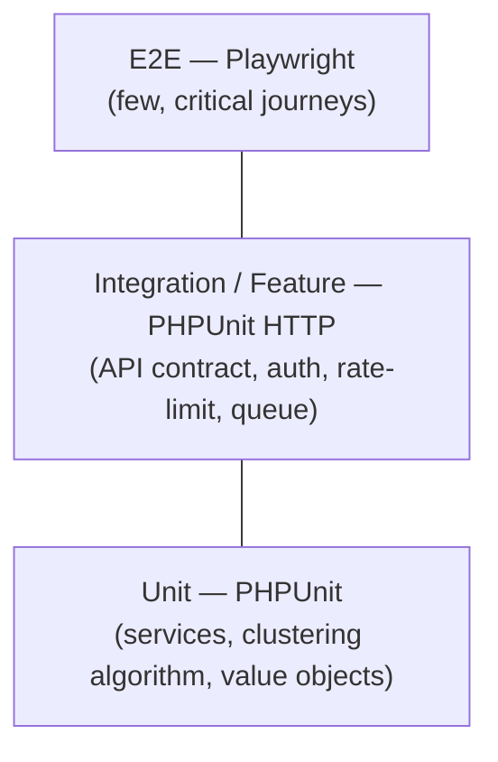
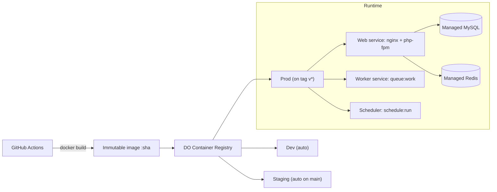
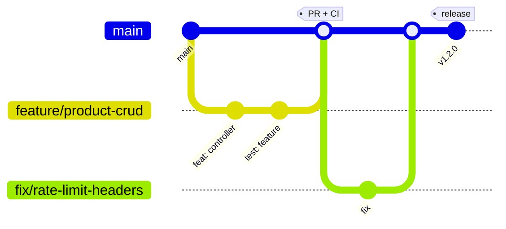

# REST API Backend — Technical Notes

> Actionable engineering guidance for the **Laravel 11 / MySQL / Redis / Vue 3** marketplace API deployed to **DigitalOcean** via **GitHub Actions**.

---

## 3.1 CI/CD Pipeline Design

Two workflows, separated by intent: **`ci.yml`** (correctness, runs on every push/PR) and **`deploy.yml`** (delivery, runs on tags/main).

```mermaid
flowchart LR
    subgraph CI["ci.yml — every push / PR"]
        A["Checkout"] --> B["Setup PHP 8.3 + Composer"]
        B --> C["Lint · Pint --test"]
        C --> D["Static analysis · PHPStan/Larastan"]
        D --> E["Unit + Feature tests · PHPUnit"]
        E --> F["Frontend lint + build · ESLint + Vite"]
    end
    subgraph CD["deploy.yml — main / tag"]
        G["Build Docker image"] --> H["Push to DO Container Registry"]
        H --> I["Deploy: dev → staging → prod"]
        I --> J["Run migrations (gated)"]
        J --> K["Smoke test /health"]
    end
    F -.green required.-> G
```



**Stage ordering matters — cheapest, fastest failure first:**

1. **Lint** (`pint --test`) — seconds; rejects style drift before anything expensive runs.
2. **Static analysis** (PHPStan/Larastan level 6) — catches type/null/contract bugs without executing code.
3. **Tests** (PHPUnit, SQLite in-memory + a MySQL+Redis service for integration) — the correctness gate; enforce a **coverage floor** in CI.
4. **Build** — only after green: build the production Docker image once, reuse the same artifact across environments.
5. **Deploy** — promote the **same image** dev → staging → prod (build once, deploy many). Migrations run as a **gated, explicit** step. A post-deploy **smoke test** hits `/up` (health) and one real read endpoint; failure triggers rollback.

**Guardrails:** branch protection requires CI green + review; secrets come from GitHub Actions secrets / DO; tag-based prod deploys (`v*`) for an auditable release trail.

---

## 3.2 Testing Strategy

The classic pyramid — many fast unit tests, fewer integration tests, a thin e2e layer.



| Layer | Tooling | What it covers | Target |
| --- | --- | --- | --- |
| **Unit** | PHPUnit | Pure logic in isolation — `BehaviorClusteringService`, services with mocked repositories. Fast, no I/O. | ~70% of tests; **≥ 80% line coverage** on `app/Services` & domain. |
| **Integration / Feature** | PHPUnit + Laravel `TestCase`, `RefreshDatabase` | Full HTTP requests through routes/middleware/validation/DB. Asserts status, JSON shape (`assertJsonStructure`), auth (401/403), **rate limiting (429)**, and `Notification::fake()` / `Queue::fake()` for async paths. | ~25%; cover every endpoint's happy + key error paths. |
| **E2E** | Playwright (or Cypress) | A handful of real browser journeys against a running stack: login → browse → purchase → see recommendation. | ~5%; smoke-level, run pre-deploy. |
| **Contract** | Spectator / OpenAPI assertions | Responses conform to the generated Swagger spec — prevents silent contract drift. | Per public endpoint. |

**Conventions:** in-memory SQLite for unit/most feature tests (speed); a real **MySQL + Redis service container** in CI for integration tests that exercise DB/queue specifics; **factories** for data; **fakes** (`Queue::fake`, `Notification::fake`, `Event::fake`, `Http::fake`) to assert dispatch without side effects; overall coverage gate **≥ 75%**, ratcheting up.

---

## 3.3 Deployment Strategy

**Containerized, image-promotion deploys to DigitalOcean.**



- **Containerization** — multi-stage `Dockerfile`: a Composer/build stage produces vendored deps + optimized autoloader + cached config/routes; a slim runtime stage runs **php-fpm**. The **same image** runs as three role-differentiated services: **web** (`php-fpm` behind Nginx), **worker** (`queue:work`), **scheduler** (`schedule:run`).
- **Platform** — **DigitalOcean App Platform** (simplest: managed build/deploy, log aggregation, autoscaling) *or* **Droplets + Docker Compose** behind a DO Load Balancer for more control. Use **DO Managed MySQL & Managed Redis** so the app tier stays stateless and disposable.
- **Migrations** — run as an explicit, **gated release step** (not on container boot, which would race across replicas). Always **backward-compatible / expand-contract** so old and new code coexist during rollout.
- **Release style** — **rolling** (App Platform default) or **blue-green** for zero downtime: bring up new color, smoke-test, flip the load balancer, drain old.
- **Rollback** — redeploy the previous image tag (immutable images make this instant); pair with reversible migrations.

---

## 3.4 Environment Management

- **Three tiers** — `local`, `staging`, `production`. Identical images; **only configuration differs**, injected via environment variables.
- **Never commit secrets.** `.env` is git-ignored; **`.env.example` documents variable *names* only**. Real values live in GitHub Actions secrets and DigitalOcean encrypted env vars.
- **12-factor config** — everything environment-specific (DB host, Redis host, queue driver, mail driver, log channel) comes from env, so promoting an image between tiers needs no rebuild.
- **Local parity** — `docker-compose.yml` mirrors prod services (php, nginx, mysql, redis, worker) so "works on my machine" means "works in prod."

### `.env.example` (backend) template

```dotenv
# ── App ───────────────────────────────────────────────
APP_NAME="REST API Backend"
APP_ENV=local                 # local | staging | production
APP_KEY=                      # php artisan key:generate
APP_DEBUG=true                # MUST be false in staging/production
APP_URL=http://localhost:8080
APP_TIMEZONE=UTC

# ── API ───────────────────────────────────────────────
API_DEFAULT_VERSION=v1
API_RATE_LIMIT_PER_MINUTE=60  # authenticated default
API_AUTH_RATE_LIMIT=5         # login/register per minute

# ── Database (MySQL 8) ────────────────────────────────
DB_CONNECTION=mysql
DB_HOST=mysql
DB_PORT=3306
DB_DATABASE=marketplace
DB_USERNAME=app
DB_PASSWORD=                  # secret — set per environment

# ── Redis (cache · queue · session) ───────────────────
REDIS_HOST=redis
REDIS_PORT=6379
REDIS_PASSWORD=null
CACHE_STORE=redis
SESSION_DRIVER=redis
QUEUE_CONNECTION=redis

# ── Auth (Sanctum) ────────────────────────────────────
SANCTUM_STATEFUL_DOMAINS=localhost:5173
SESSION_DOMAIN=localhost

# ── Mail / Notifications ──────────────────────────────
MAIL_MAILER=log               # log locally; ses/smtp in prod
MAIL_FROM_ADDRESS="noreply@example.com"

# ── Observability ─────────────────────────────────────
LOG_CHANNEL=stack
LOG_LEVEL=debug               # info/warning in prod
SENTRY_LARAVEL_DSN=

# ── Recommendations ───────────────────────────────────
RECOMMENDATION_CLUSTERS=8     # k for clustering
RECOMMENDATION_TOP_N=10
```

> A separate `frontend/.env.example` holds `VITE_API_BASE_URL=http://localhost:8080/api/v1`.

---

## 3.5 Version Control Workflow

**Recommended: GitHub Flow (trunk-ish) with short-lived feature branches.**



- **Why GitHub Flow over Gitflow** — a single small team shipping a continuously-deployed API doesn't need Gitflow's `develop`/`release`/`hotfix` ceremony. Trunk (`main`) is always deployable; features live on short branches and merge via PR. Lower overhead, faster feedback, fewer long-lived merge conflicts.
- **Branch naming** — `feature/…`, `fix/…`, `chore/…`, `docs/…`.
- **PR rules** — small, focused PRs; **CI must be green**; ≥1 review; squash-merge for a linear history.
- **Conventional Commits** — `feat:`, `fix:`, `chore:`, `test:`, `docs:` → enables automated changelogs and SemVer.
- **Releases** — tag `main` with `vMAJOR.MINOR.PATCH`; the tag triggers the production deploy. **API versioning** (`/v1`) is independent of app SemVer — a breaking API change ships as a new URI version, not a silent change to `v1`.

---

## 3.6 Common Pitfalls (this stack)

| # | Pitfall | Guidance |
| --- | --- | --- |
| 1 | **N+1 queries** with Eloquent/Resources | Eager-load (`with()`); detect with Laravel Debugbar / `Model::preventLazyLoading()` in non-prod; assert query counts in tests. |
| 2 | **`APP_DEBUG=true` in production** | Leaks stack traces, env, secrets. Enforce `false` via config check + a CI assertion on the prod env. |
| 3 | **Cached config/routes drift** | `config:cache` & `route:cache` snapshot config — they must run **on every deploy** (in the image build), and you must re-run after any change. Stale cache = mystifying "my env var isn't read" bugs. |
| 4 | **Running migrations on container boot** | Races across replicas; can corrupt or deadlock. Run migrations as a single gated deploy step, expand-contract style. |
| 5 | **Rate limiter without Redis in prod** | The default `cache` limiter must point at **Redis**, or limits won't be shared across instances (each box would allow the full quota). |
| 6 | **Queue workers not restarted after deploy** | Long-running workers hold **old code** in memory. Run `queue:restart` post-deploy (or recreate worker containers). |
| 7 | **Sanctum SPA cookie/CORS misconfig** | `SANCTUM_STATEFUL_DOMAINS`, `SESSION_DOMAIN`, and CORS must align with the SPA origin, or auth silently 401s. For pure token APIs, prefer bearer tokens and skip stateful cookies. |
| 8 | **Mass-assignment / over-exposure** | Guard `$fillable`; **always** serialize through API Resources so new DB columns don't leak into responses by default. |
| 9 | **Unbounded list endpoints** | Always paginate; never `Model::all()` on user-facing routes. |
| 10 | **Recommendation cost in the request path** | Never cluster synchronously per request — precompute via scheduled job, serve from Redis. Cold-start users get a popularity-based fallback. |
| 11 | **MySQL `utf8` vs `utf8mb4`** | Use `utf8mb4` (real 4-byte UTF-8) or emoji/multilingual data breaks; mind the index key-length limit. |
| 12 | **Timezone & money types** | Store UTC; format at the edge. Store money as integer minor units (cents) or `DECIMAL`, never float. |

---

## Related Documents

- [`PROJECT-PLAN.md`](./PROJECT-PLAN.md) — file structure & phased TODO list.
- [`ARCHITECTURE.md`](./ARCHITECTURE.md) — patterns, diagrams, data flow, scalability, security.
