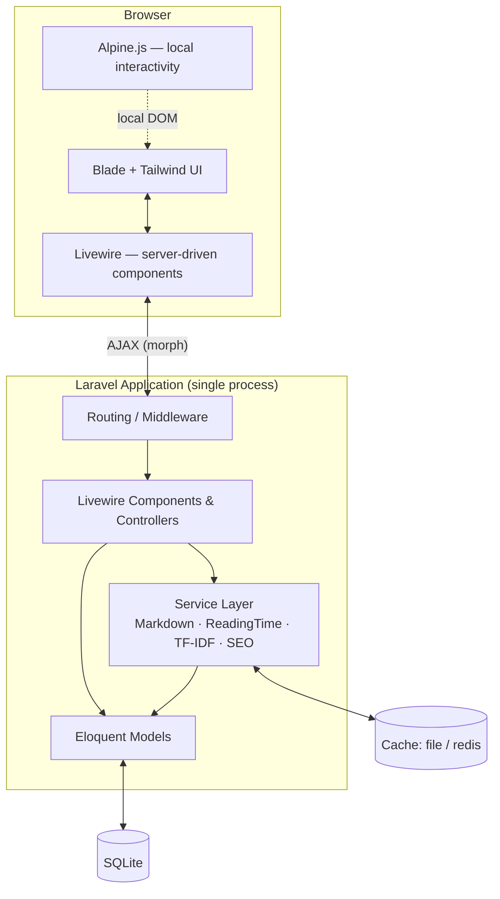
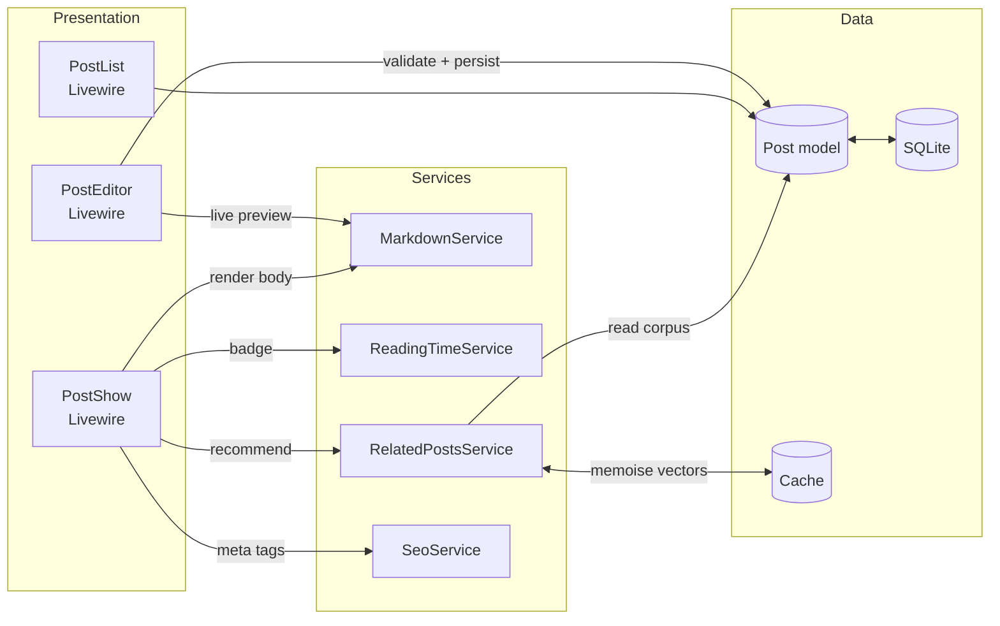
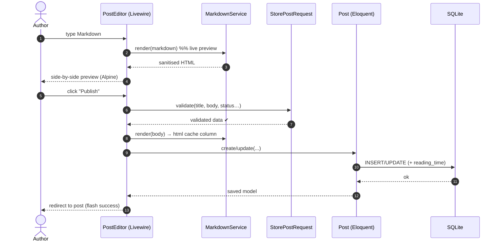
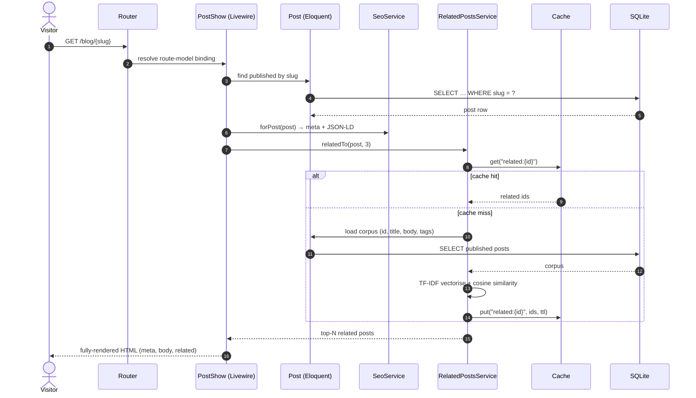
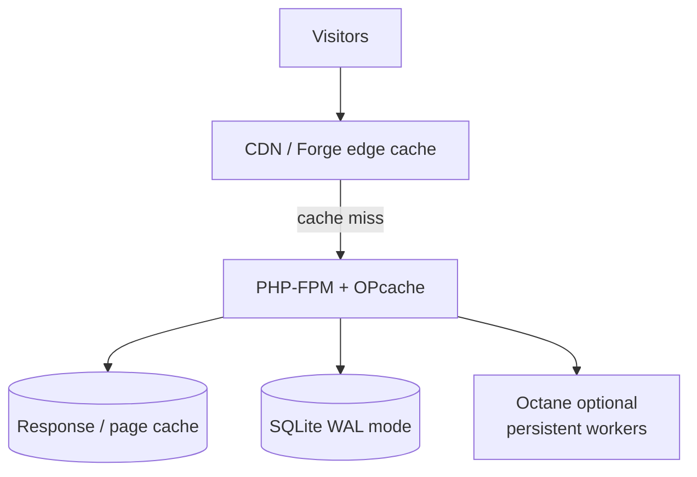
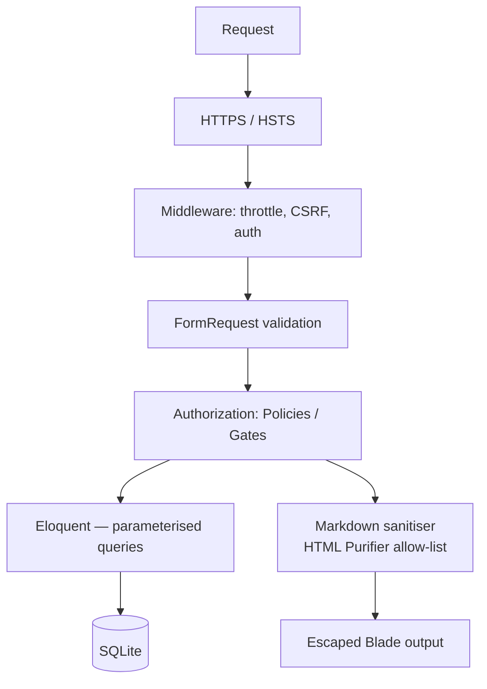
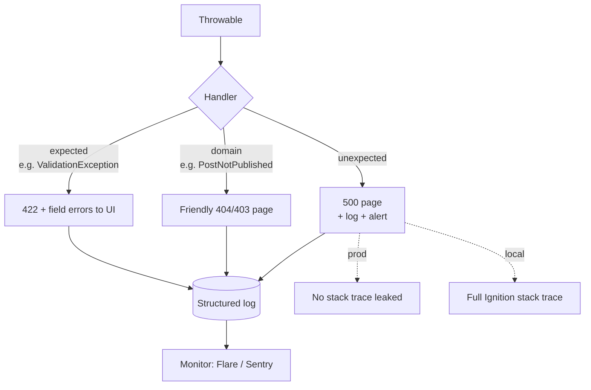

# Blog Platform — Architecture

> A single-deployable Laravel application serving a personal blog with Markdown
> authoring, SEO, reading-time estimation, and TF-IDF related-post
> recommendations. Optimised for **operational simplicity** (one PHP process,
> one SQLite file) without sacrificing testability or future scale.

---

## 2.1 Chosen Architectural Pattern — Modular Layered Monolith

We use a **layered monolith** with an explicit **domain/service layer**.

### Why a layered monolith (and not microservices)?

| Driver | Implication |
|---|---|
| **Single author / low write volume** | No need for independent scaling of services. One box handles it. |
| **SQLite** | Single-file DB rules out a distributed data tier by design — a monolith is the natural fit. |
| **Operational simplicity** | Laravel Forge deploys one artifact; no service mesh, no inter-service auth, no network hops. |
| **Cohesive domain** | Posts, tags, SEO, and recommendations are tightly coupled reads of the same data — splitting them adds latency and complexity for zero benefit. |
| **Testability preserved** | The **service layer** isolates business logic from the framework, giving us the main benefit people chase with microservices (clear boundaries) without the distribution tax. |

> **Escape hatch:** Because domain logic lives in `App\Services` (not in
> controllers or models), extracting (say) `RelatedPostsService` into a queued
> job, a separate worker, or even a small microservice later is a refactor — not
> a rewrite. Swapping SQLite → Postgres is a config + migration change.

---

## 2.2 Key Component Interactions

**Communication mechanisms used:**

- **Direct method calls (in-process):** Presentation → Service → Model. This is
  the dominant pattern; everything runs in one PHP process, so there are no
  network calls, no serialization, and no message broker on the hot path.
- **Livewire round-trips (HTTP/AJAX):** The browser and server components
  exchange diffed DOM updates over HTTP. Alpine handles purely local UI state
  (dropdowns, toggles) with **no** server round-trip.
- **Cache (read-through):** `RelatedPostsService` memoises expensive TF-IDF
  vectors and similarity results in the cache store.
- **Queue (deferred, optional):** Heavy one-off work (sitemap regen, search
  index rebuild, related-posts precompute) is dispatched to a queued job —
  the only "async" boundary, and it stays in-process via the `database`/`sync`
  driver until volume justifies Redis + a worker.

---

## 2.3 Data Flow

### Authoring a post (write path)

### Reading a post (read path, SEO-critical)

---

## 2.4 Scalability & Performance Strategy

**Today's profile:** read-heavy, write-rare, single-author. Optimise reads.

- **Vertical first:** A single Forge box with **OPcache** + **PHP 8.3 JIT**
  comfortably serves a personal blog's traffic. SQLite in **WAL mode** handles
  concurrent reads with non-blocking writers.
- **Cache the expensive bits:**
  - **Rendered Markdown** is stored in a `body_html` column (render-on-write,
    not render-on-read) — reads never invoke the Markdown parser.
  - **Reading time** is computed on save and persisted.
  - **TF-IDF / related posts** are cached per-post with tag-aware invalidation.
  - **Full-page / response caching** for anonymous visitors (the 99% case).
- **Asset delivery:** Vite-built, hashed, immutable assets served via CDN;
  HTTP/2, Brotli, long `Cache-Control`.
- **Concurrency upgrade path (in order):**
  1. Add **Laravel Octane** (FrankenPHP/Swoole) for persistent workers.
  2. Move cache/queue/session to **Redis**.
  3. Migrate SQLite → **Postgres/MySQL** (service layer + migrations make this a
     config change) and add read replicas.
  4. Front everything with a CDN doing stale-while-revalidate.
- **N+1 prevention:** eager-load relationships; enable
  `Model::preventLazyLoading()` in non-prod to fail loudly.

---

## 2.5 Security Considerations

- **Authentication:** Laravel session auth (Breeze, Livewire stack) for the
  single author/admin. Passwords Bcrypt/Argon2id-hashed. Optional 2FA.
- **Authorization:** Policies/Gates guard every write (`update`, `delete`,
  `publish`). Public read routes are unauthenticated by design.
- **Input validation:** All writes go through `FormRequest` classes — never
  trust Livewire-bound properties without server-side rules.
- **Output / XSS:** This is the #1 risk for a Markdown blog. The pipeline is
  **CommonMark with raw HTML disabled** → **HTML Purifier allow-list** →
  Blade auto-escaping for everything except the deliberately-trusted post body
  (`{!! $post->body_html !!}` only after sanitisation).
- **SQL injection:** Eloquent / query builder uses bound parameters throughout;
  no raw string-interpolated SQL.
- **CSRF & headers:** Laravel CSRF on all state-changing requests; secure
  headers (CSP, X-Frame-Options, HSTS, Referrer-Policy) via middleware.
- **Rate limiting:** Throttle login, comment, and search endpoints.
- **Secret management:** Secrets live only in `.env` on the server (never
  committed). CI/CD secrets in **GitHub Actions encrypted secrets**; production
  env managed by **Laravel Forge**. `APP_KEY` rotated per environment.
- **Dependencies:** `composer audit` + Dependabot in CI to catch CVEs.

---

## 2.6 Error Handling & Logging Philosophy

**Principle:** *Fail loudly in development, gracefully in production, and always
leave a structured trace.*

- **Layered exceptions:** Domain code throws **typed, meaningful exceptions**
  (`PostNotPublishedException`) rather than generic ones. The framework's
  exception handler maps each to the right HTTP response.
- **Validation errors** surface inline in Livewire components (real-time),
  never as a 500.
- **Structured logging:** JSON logs with context (request id, user id, route)
  via Monolog. Channels: `daily` file in prod, `stack` (stderr + file) for
  containerised runs.
- **Severity discipline:** `debug/info` for flow, `warning` for recoverable
  anomalies (cache miss storms), `error` for failed operations, `critical` for
  data-integrity / security events (paged immediately).
- **No leaking internals:** Production renders branded 404/500 pages with a
  correlation id; full stack traces (Ignition) only in `local`.
- **Monitoring:** Errors shipped to **Flare/Sentry**; uptime + Lighthouse
  budgets tracked in CI. Health endpoint (`/up`) for Forge/monitoring probes.
- **Graceful degradation:** If `RelatedPostsService` or the cache fails, the
  post still renders — related posts are a non-blocking enhancement wrapped in
  try/catch with a logged warning.
