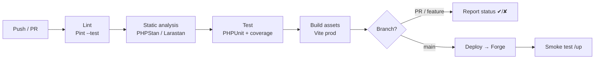
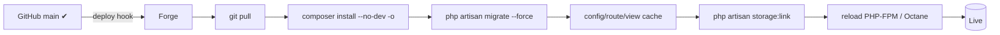
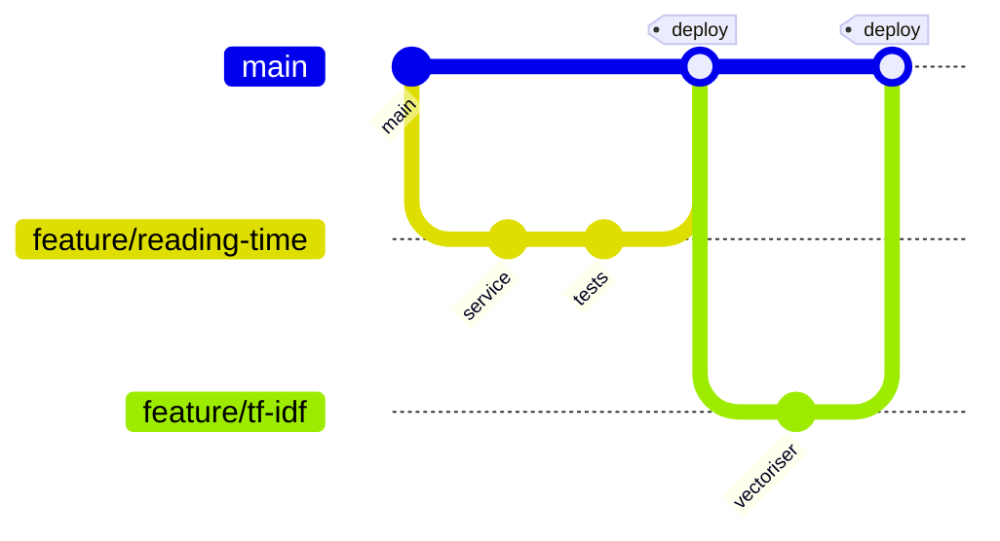

# Blog Platform — Technical Notes

Actionable guidance for building, testing, shipping, and operating the platform.

---

## 3.1 CI/CD Pipeline Design

**Goal:** every push is linted, statically analysed, tested, and asset-built;
only a green `main` deploys to production.



| Stage | Tool | Gate |
|---|---|---|
| **Lint** | Laravel Pint (`--test`) | Style must match `pint.json` |
| **Static analysis** | PHPStan + Larastan (level 6+) | No new type errors |
| **Security** | `composer audit` | No known CVEs |
| **Test** | PHPUnit (SQLite `:memory:`) | All green; coverage threshold |
| **Build** | Vite (`npm run build`) | Assets compile clean |
| **Deploy** | Forge deploy hook (main only) | Triggered by green pipeline |
| **Verify** | curl `/up` health endpoint | 200 OK post-deploy |

- **Environments:** PRs run lint+analyse+test. `main` additionally deploys to
  **production** via Forge. (Add a `staging` Forge site + a `develop` branch
  trigger if you want a pre-prod gate.)
- **Caching:** cache Composer (`~/.composer/cache`) and npm (`~/.npm`) keyed on
  lockfile hashes to keep pipelines fast.
- **Concurrency:** cancel in-progress runs for the same ref to save minutes.
- See `.github/workflows/ci.yml` and `deploy.yml`.

---

## 3.2 Testing Strategy

A pragmatic **testing trophy**: lots of fast service/feature tests, a thin layer
of E2E for the few flows that must never break.

| Layer | Framework | Targets | Coverage goal |
|---|---|---|---|
| **Unit** | PHPUnit (Pest optional) | Services in isolation: `ReadingTimeService`, `RelatedPostsService` (TF-IDF math), `MarkdownService` (XSS cases) | **≥ 90%** of `app/Services` |
| **Feature/Integration** | PHPUnit + Laravel | HTTP + Livewire + DB: post CRUD, auth, draft→publish, search/filter | **≥ 80%** overall |
| **Browser/E2E** | Laravel Dusk / Playwright | Author publishes a post; visitor reads it; live Markdown preview works | Happy paths only |

**Conventions & tips**

- DB tests use **SQLite `:memory:`** with `RefreshDatabase` — fast and isolated;
  identical engine to production keeps behaviour faithful.
- Test **services directly** (plain `new`/resolved objects) — they're
  framework-light by design, so unit tests are trivial and fast.
- Use Livewire's testing helpers: `Livewire::test(PostEditor::class)->set(...)
  ->call('save')->assertHasNoErrors()`.
- For TF-IDF, assert **ranking/ordering** and known similarities on a tiny fixed
  corpus rather than brittle floating-point equality (use `assertEqualsWithDelta`).
- Factories + seeders generate realistic Markdown content for integration tests.
- Enforce coverage in CI (`--coverage --min=80`); require Xdebug/PCOV on the runner.

---

## 3.3 Deployment Strategy

**Target:** Laravel Forge-managed VPS (single droplet to start).



- **Atomic-ish deploys:** Forge's deploy script (see `scripts/deploy.sh`) runs
  `composer install`, migrations, and cache warmup, then reloads workers.
- **Zero-downtime option:** enable Forge's **zero-downtime deployments** (symlinked
  releases) so a bad deploy never serves a half-updated tree.
- **Assets:** built in **CI** (`npm run build`) and committed/uploaded, or built
  on the server — prefer building in CI and shipping the `public/build` manifest
  to keep Node off production.
- **Containerisation (optional):** A `Dockerfile` (PHP 8.3-FPM + nginx, or
  **FrankenPHP** single binary) makes the app portable to Fly.io/Render/K8s.
  For a personal blog on Forge it's **optional** — included as a stub for
  parity/local dev, not required for the Forge path.
- **SQLite care:** the database file lives **outside** the release directory
  (e.g. `storage/app/database.sqlite` symlinked, or `/home/forge/db/`), so
  zero-downtime release swaps never replace or wipe it. **Back it up** (litestream
  to S3, or a cron `sqlite3 .backup`).
- **Migrations:** always `--force` in prod; keep them backward-compatible
  (expand→contract) so a rollback doesn't strand the schema.

---

## 3.4 Environment Management

- **Config over hardcoding:** read tunables via `config('blog.*')`, which reads
  `.env`. Never call `env()` outside config files (it returns `null` once config
  is cached).
- **Per-environment files:** `.env` (local), Forge-managed env (prod), and CI
  uses `.env.example` copied to `.env` with `APP_KEY` generated on the fly.
- **Three environments:** `local` (debug on, Ignition, mail→log),
  `staging` (prod-like, separate DB, noindex), `production` (debug off, cache on,
  real mail, monitoring).
- App-specific knobs live in **`config/blog.php`**: `reading_words_per_minute`,
  `related_posts_count`, `excerpt_length`, cache TTLs.

### `.env.example` (template — full file in repo root)

```dotenv
APP_NAME="Blog Platform"
APP_ENV=local
APP_KEY=                       # php artisan key:generate
APP_DEBUG=true
APP_URL=http://localhost

LOG_CHANNEL=stack
LOG_LEVEL=debug

# SQLite — note the ABSOLUTE path requirement
DB_CONNECTION=sqlite
# DB_DATABASE=/absolute/path/to/storage/app/database.sqlite

CACHE_STORE=file               # → redis in prod
QUEUE_CONNECTION=database      # → redis in prod
SESSION_DRIVER=database

# Domain tunables (consumed by config/blog.php)
BLOG_WORDS_PER_MINUTE=225
BLOG_RELATED_POSTS_COUNT=3
BLOG_RELATED_CACHE_TTL=86400
```

---

## 3.5 Version Control Workflow

**Recommended: GitHub Flow (trunk-ish).**



- **Why GitHub Flow:** a single-author blog doesn't need Gitflow's release/hotfix
  ceremony. Short-lived `feature/*` branches → PR → CI green → squash-merge to
  `main` → auto-deploy. Simple, fast, always-releasable trunk.
- **Branch protection:** require PR + passing CI on `main`; no direct pushes.
- **Conventional Commits** (`feat:`, `fix:`, `chore:`) → enables automated
  changelogs / semver later.
- **Squash merge** keeps `main` history linear and each feature atomic
  (easy revert = easy rollback).
- *If you later add collaborators or scheduled releases,* graduate to a
  `develop` + `staging` branch with a Gitflow-lite model.

---

## 3.6 Common Pitfalls (this stack specifically)

**SQLite**
- **Relative `DB_DATABASE` paths break** depending on the working directory —
  use an **absolute path** in prod.
- Writes are **serialised**; enable **WAL mode** for concurrent reads. Don't put
  the DB file inside an atomically-swapped release dir (it'll vanish on deploy).
- Some MySQL/Postgres column types/JSON ops differ — test on SQLite, the engine
  you actually ship.

**Markdown / XSS**
- CommonMark allows **raw HTML by default** → stored XSS. Disable
  `html_input`/`allow_unsafe_links` **and** run output through HTML Purifier.
- Render to HTML **on save** (cache in `body_html`), not on every page view.

**Livewire 3**
- Every property hydrates from the client each request — **never trust** bound
  values; validate server-side and don't bind sensitive/large objects.
- A **single root element** per component template, or you'll get morph errors.
- Overusing `wire:model.live` causes a network request per keystroke — prefer
  `wire:model.blur`/`.debounce`, and push purely-local UI to **Alpine** (no
  round-trip). Use `wire:key` in loops to keep the DOM diff stable.

**Tailwind / Vite**
- Production purge: make sure dynamic class names appear in `content` globs or
  are safelisted, or they'll be stripped from the prod CSS.
- Don't forget `@vite` directives + run `npm run build` in CI/deploy.

**TF-IDF / related posts**
- O(n²) similarity across all posts doesn't scale — **cache** results and
  recompute only on publish/update; cap the corpus or precompute in a job.
- Strip Markdown/HTML and **stopwords** before tokenising, else common words
  dominate the vectors and "related" becomes noise.

**Laravel ops**
- `env()` returns `null` after `config:cache` — only read env inside `config/*`.
- Forgetting `php artisan config:cache route:cache view:cache` in deploy leaves
  easy performance on the table; forgetting to **clear** them after a config
  change causes "why won't my change show up" confusion.
- Run `php artisan optimize` on deploy; `optimize:clear` when debugging stale config.
