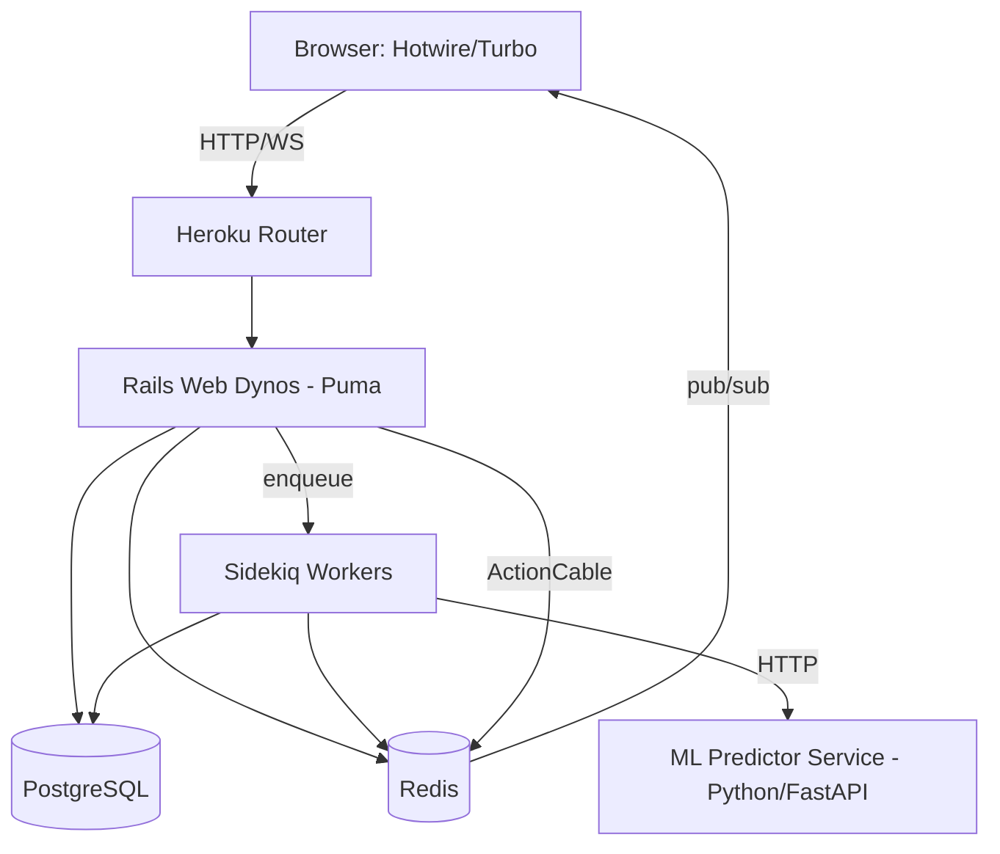
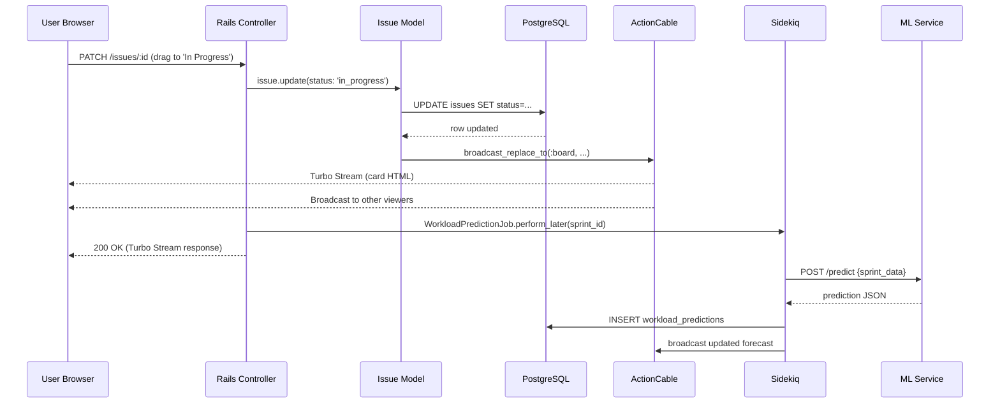
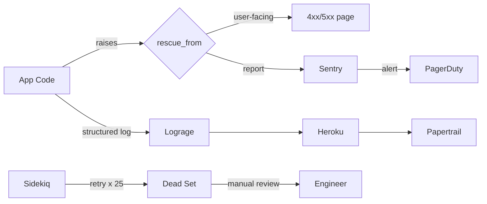

# Architecture — Project Management Platform

## 2.1 Chosen Architectural Pattern: Modular Monolith (Majestic Monolith)

A **modular monolith** with Rails conventions, enhanced by:
- **Service Objects** for complex business logic
- **Background Workers** (Sidekiq) for async processing
- **Pub/Sub via ActionCable + Redis** for real-time features
- **Sidecar ML Service** (Python) called over HTTP for workload predictions

### Justification
- **Team velocity:** Rails conventions + Hotwire keep the frontend/backend contract simple. One deploy, one test suite.
- **Scale target:** Jira-like workloads for small-to-mid orgs (≤10k active users per tenant) fit comfortably in a monolith.
- **Real-time UX:** Turbo Streams + ActionCable deliver SPA-quality interactions without the overhead of a separate frontend app.
- **Clear extraction seams:** Service objects and job boundaries mean the ML predictor, notifications, or reporting can extract to services later without a rewrite.

---

## 2.2 Key Component Interactions

| Interaction | Mechanism | Example |
|---|---|---|
| Browser ↔ Rails | HTTPS + Turbo Frames/Streams | Issue status change re-renders card fragment |
| Real-time board updates | ActionCable over WebSocket, Redis pub/sub backend | Teammate moves issue → all viewers' boards update |
| Controller → Worker | Sidekiq enqueue (Redis queue) | Sprint closed → burndown recalculation job |
| Worker → ML Service | HTTP JSON (Faraday + retries) | Nightly workload prediction for sprint planning |
| Cross-model events | ActiveSupport::Notifications + after-commit callbacks | Issue moved → broadcast Turbo Stream |
| API clients | REST JSON (v1), token auth | Mobile app / Zapier integrations |

---

## 2.3 Data Flow — Moving an Issue on the Board

---

## 2.4 Scalability & Performance Strategy

**Vertical scaling first, horizontal when justified:**
1. **Web tier:** Heroku Standard-2X dynos with Puma (5 workers × 5 threads). Scale horizontally via `heroku ps:scale`.
2. **Database:** Start on Heroku Postgres Standard-0. Add read replicas via `Makara` or Rails 7 multi-DB routing when reads dominate.
3. **Redis:** Separate Redis instances for cache, Sidekiq, and ActionCable (different eviction policies).
4. **Sidekiq:** Scale worker dynos independently based on queue latency. Use `sidekiq-limit_fetch` for per-queue concurrency caps.
5. **Caching strategy:**
   - Fragment caching for issue cards (`cache @issue`)
   - Russian Doll caching for sprint/board views
   - HTTP caching (ETag/Last-Modified) for API endpoints
   - Redis-backed Rails.cache for expensive aggregations (velocity, burndown)
6. **DB optimization:**
   - Indexes on FKs, status, assignee, sprint_id
   - Counter caches on projects/sprints for totals
   - Avoid N+1 with `includes`, enforced by Bullet in dev
   - `pg_search` + GIN indexes for full-text search
7. **ML predictions:** Cached per sprint_id with TTL; recomputed async on scope change, not on every read.

---

## 2.5 Security Considerations

**Authentication:**
- Devise (email/password) + OmniAuth for SSO (Google, GitHub)
- API tokens via `has_secure_token`, rotated on demand
- Session cookies: `secure`, `httponly`, `same_site: :lax`

**Authorization:**
- Pundit policies per resource, project-scoped (user must belong to project)
- `verify_authorized` + `verify_policy_scoped` enforced in `ApplicationController`

**Data protection:**
- TLS enforced (`config.force_ssl = true`)
- Sensitive attrs encrypted via Rails 7 `encrypts :column` (AES-256-GCM)
- `strong_parameters` in every controller — never `params.to_unsafe_h`
- CSRF tokens on all non-GET requests
- Content Security Policy headers configured

**API security:**
- Bearer token in `Authorization` header
- Rate limiting via `rack-attack` (per-IP + per-token buckets)
- CORS locked to known origins
- JSON-only endpoints — no HTML error leakage

**Secret management:**
- Rails 7 encrypted credentials (`config/credentials.yml.enc`) for dev/test
- Heroku Config Vars for staging/prod, access-audited
- **Never** commit keys; `.env` in `.gitignore`; `.env.example` checked in
- Secrets scanning via GitHub secret scanning + `trufflehog` in CI

---

## 2.6 Error Handling & Logging Philosophy

**Principles:**
- **Fail loud in dev, gracefully in prod.** Users see friendly errors; devs see full traces in Sentry.
- **Structured logs over strings.** JSON log format with request_id, user_id, duration.
- **Exception ≠ control flow.** Reserve raises for truly exceptional states.

**Implementation:**
- `rescue_from` in `ApplicationController` for `Pundit::NotAuthorizedError`, `ActiveRecord::RecordNotFound`, returning 403/404 with Turbo-aware responses
- Sidekiq: exponential backoff (Sidekiq default), dead set review weekly, `sidekiq_retries_exhausted` hook notifies Sentry
- ML service calls wrapped in `retryable` + circuit breaker (via `stoplight` gem). Fallback: serve last-known prediction.
- Sentry (`sentry-rails` + `sentry-sidekiq`) captures exceptions with breadcrumbs
- Lograge for request log one-liners; tagged with request_id, user_id
- Heroku Logplex → Papertrail for long-term retention

