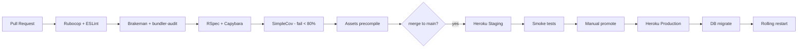

# Technical Notes

## 3.1 CI/CD Pipeline Design



**Stages:**
1. **Lint:** `rubocop --parallel`, `erb_lint`, `eslint` for Stimulus controllers
2. **Security:** `brakeman -z`, `bundler-audit check`, secret scanning
3. **Test:** RSpec (models, requests, services, system), parallelized with `parallel_tests`
4. **Build:** Asset precompile sanity check (fail fast if broken)
5. **Deploy staging:** Auto on `main` merge via Heroku pipeline promotion
6. **Deploy prod:** Manual promotion after staging smoke tests pass

## 3.2 Testing Strategy

| Layer | Tool | Target Coverage |
|---|---|---|
| Models / Services | RSpec + FactoryBot | ≥ 90% line |
| Controllers / Requests | RSpec request specs | ≥ 85% |
| System (E2E) | Capybara + Cuprite (headless Chrome) | Critical user journeys |
| Jobs | RSpec with `perform_enqueued` | All happy paths + failure |
| JS (Stimulus) | Jest (light) | Smoke tests only |
| Contract (API) | rspec-openapi → OpenAPI spec | All v1 endpoints |

**Principles:**
- Prefer request specs over controller specs (Rails 7 default)
- One system spec per core user journey (login, create issue, move card, start timer)
- Use `VCR` cassettes for external HTTP (ML service)
- Flaky test budget = 0 — quarantine and fix within a sprint

## 3.3 Deployment Strategy

**Platform:** Heroku (Standard dynos), paired with Heroku Postgres and Heroku Redis.

**Process types (Procfile):**
```
web: bundle exec puma -C config/puma.rb
worker: bundle exec sidekiq -C config/sidekiq.yml
release: bundle exec rails db:migrate
```

**Deploy flow:**
- `git push heroku main` via GitHub Actions
- `release` phase runs migrations atomically before new dynos boot
- Zero-downtime: Heroku preboot enabled for `web`
- Rollback: `heroku rollback v<N>` — keep migrations backward-compatible for ≥ 1 release

**Containerization (optional):** Dockerfile provided for local parity and future portability, but Heroku buildpacks remain the primary deploy path.

## 3.4 Environment Management

**Three environments: development → staging → production.**

- Development: local machine, seeded DB, mocked email (letter_opener)
- Staging: Heroku staging app, production-like config, Heroku pipeline
- Production: Heroku production app, encrypted Rails credentials for secrets not in ENV

**Config precedence:** ENV vars > encrypted credentials > defaults.

See `.env.example` in repo root for required variables.

## 3.5 Version Control Workflow

**GitHub Flow** — recommended for this team size.

- `main` is always deployable to staging
- Feature branches: `feat/…`, `fix/…`, `chore/…`
- PR → review → squash merge to `main`
- Staging auto-deploys from `main`; production promoted manually
- Tag production releases: `v2026.04.28-1`

**Why GitHub Flow vs Gitflow:** Single deployable branch pairs naturally with Heroku's pipeline model. Gitflow's `develop`/`release` branches add ceremony without payoff for a monolith with continuous deployment.

## 3.6 Common Pitfalls

- **N+1 queries on issue boards.** Mitigate with `includes(:assignee, :labels, :sprint)` and enforce with Bullet in dev.
- **Sidekiq job argument serialization.** Never pass AR objects — pass IDs and reload. Sidekiq serializes to JSON; non-primitives break silently.
- **ActionCable + Heroku routing.** Requires session token auth (not cookies) across separate dynos; use `connect` identifier pattern.
- **Turbo Stream accidentally returning HTML.** Always check `format.turbo_stream` first in controller `respond_to` blocks.
- **Migration drift between staging/prod.** Use `schema_format = :sql` if you add PG-specific features (GIN indexes, triggers).
- **Long-running migrations.** Heroku release phase has a 30-minute ceiling. Use `strong_migrations` gem to enforce online-migration patterns.
- **Redis memory exhaustion.** ActionCable subscriptions + Sidekiq queues + Rails cache on one Redis = OOM. Use separate Redis instances.
- **Hotwire + CSP.** Inline styles/scripts break strict CSP. Use nonce-based CSP and keep Stimulus controllers external.
- **ML service latency.** Never block a request waiting for predictions — always async + cached.
- **Time zones.** Store UTC, display local. Use `Time.current` (not `Time.now`); set `config.time_zone` consistently.
