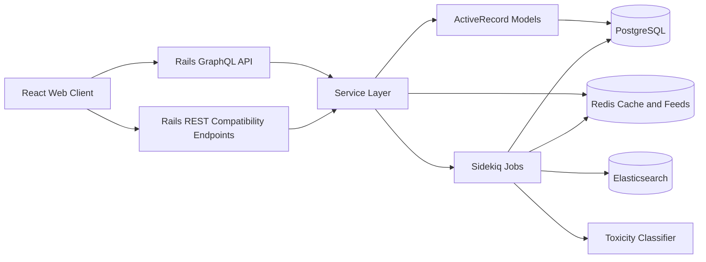
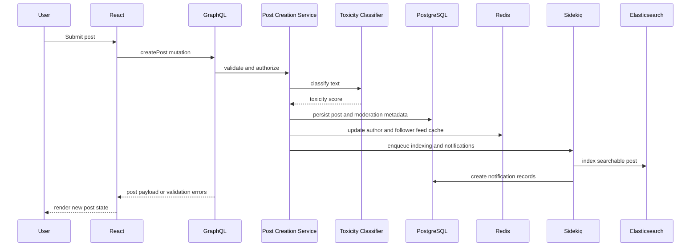

# Architecture

## 2.1 Chosen Architectural Pattern

The recommended architecture is a modular layered monolith with asynchronous event-driven extensions.

Rails owns the backend process, domain models, database transactions, GraphQL schema, service objects, and background job orchestration. This is suitable because the product domain is tightly connected: posts, follows, notifications, feeds, messages, moderation, and search all depend on shared user identity and authorization rules. A modular monolith keeps deployment and schema evolution simple while still allowing future extraction of high-volume boundaries such as feed generation, messaging, or moderation.

## 2.2 Key Component Interactions

- API calls: React communicates with Rails primarily through GraphQL over HTTPS. REST endpoints are reserved for operational compatibility, webhooks, health checks, and simple CRUD fallbacks.
- Message queues: Rails enqueues jobs through ActiveJob backed by Sidekiq and Redis. Jobs handle search indexing, notification delivery, feed fanout, and expensive moderation checks.
- Direct database access: Only the Rails backend and Sidekiq workers access PostgreSQL directly. The frontend never talks to storage systems.
- Event buses: Internal domain events start as service-layer method calls plus Sidekiq jobs. If scale requires it, events can later move to Azure Service Bus without changing frontend contracts.

## 2.3 Data Flow

## 2.4 Scalability & Performance Strategy

The first scaling boundary is process-level separation: run API containers, Sidekiq workers, PostgreSQL, Redis, and Elasticsearch independently. Azure Container Apps can scale the API by HTTP concurrency and workers by queue depth.

Feeds should use a hybrid strategy. Recent feed entries are stored in Redis sorted sets for fast reads. PostgreSQL remains the source of truth and supports backfills, pagination recovery, and analytics. Elasticsearch handles full-text post and profile search, keeping expensive text queries away from PostgreSQL.

GraphQL needs query depth limits, complexity limits, batched loading, and persisted operations for high-traffic clients. Database access should use targeted indexes, cursor pagination, and N+1 protection through dataloaders.

## 2.5 Security Considerations

- Authentication and authorization: Use token-based authentication with refresh token rotation. Enforce ownership and relationship rules in GraphQL resolvers and service objects, not only in UI code.
- Data protection: Encrypt traffic with TLS, store password hashes with a strong adaptive algorithm, and treat direct messages as sensitive data with strict access rules.
- API security: Add GraphQL query limits, input validation, rate limiting, CSRF protection where cookies are used, CORS allowlists, and request logging with sensitive fields filtered.
- Secret management: Use Azure managed identities and Container Apps secrets. Do not commit production secrets. Keep `.env.example` as documentation only.

## 2.6 Error Handling & Logging Philosophy

Errors should be explicit, structured, and safe to expose. Validation errors return user-actionable messages. Authorization failures return generic messages. Unexpected exceptions are logged with request IDs and reported to an error tracker.

All backend logs should be structured JSON in staging and production. Each request should carry a correlation ID through Rails, Sidekiq, and external service calls. GraphQL should normalize domain errors into a predictable `errors` shape while preserving server-side diagnostic details in logs only.
