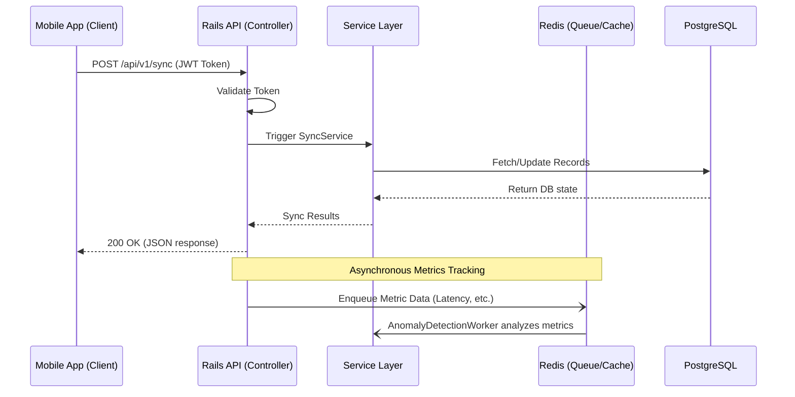

# Architecture Documentation

## 2.1 Chosen Architectural Pattern

**Layered Monolith (with modular services)**
Given the project scope (Mobile App Backend with data sync and anomaly detection), a Layered Monolith using Rails API mode is highly suitable. 
* **Justification:** It provides high developer velocity, clear separation of concerns (Controllers, Models, Services), and is easy to deploy and test. Introducing Microservices at this stage would add unnecessary operational overhead. The anomaly detection and heavy tasks can be offloaded to background workers (Sidekiq/Redis) to keep the API responsive, effectively scaling the monolith.

## 2.2 Key Component Interactions

* **Client (Mobile/Frontend):** Communicates with the Rails API via REST/JSON over HTTPS.
* **Rails API (Controllers):** Handles routing, request validation, and authorization (JWT).
* **Service Objects:** Encapsulate complex business logic (e.g., Data Sync logic, Anomaly Detection).
* **Background Jobs (Redis):** Asynchronous processing for anomaly detection analysis and sending notifications.
* **Database (PostgreSQL):** Primary persistent storage for user data and sync state.

## 2.3 Data Flow

## 2.4 Scalability & Performance Strategy

* **Database Optimization:** Use appropriate indexing, query caching, and connection pooling (PgBouncer).
* **Caching:** Utilize Redis for caching frequent, read-heavy API responses.
* **Asynchronous Processing:** Move all non-blocking operations (e.g., metric aggregation, anomaly detection) to background jobs.
* **Horizontal Scaling:** The Rails API instances are stateless (JWT for auth), making it easy to add more web nodes behind a load balancer on Render.

## 2.5 Security Considerations

* **Authentication & Authorization:** JWT-based authentication. Short-lived access tokens with secure refresh token rotation.
* **Data Protection:** Data encrypted at rest (handled by Render/AWS) and in transit (TLS 1.2+).
* **API Security:** CORS configuration restricted to allowed domains. Rate limiting (e.g., `rack-attack`) to prevent brute force and DDoS.
* **Secret Management:** Secrets managed via environment variables and injected at runtime by the deployment platform (Render).

## 2.6 Error Handling & Logging Philosophy

* **API Responses:** Consistent JSON error structure `{ "error": { "code": "...", "message": "..." } }`.
* **Centralized Exception Handling:** Utilize `rescue_from` in `ApplicationController` to map standard exceptions (e.g., `ActiveRecord::RecordNotFound`) to appropriate HTTP status codes (404).
* **Logging:** Structured logging (JSON format) for easier ingestion into log management tools. Ensure sensitive data (PII, passwords, tokens) is filtered from logs.
