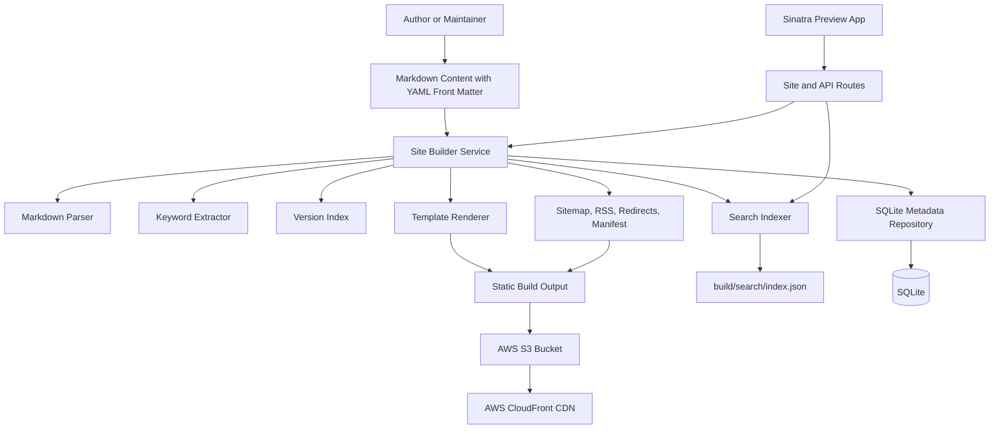
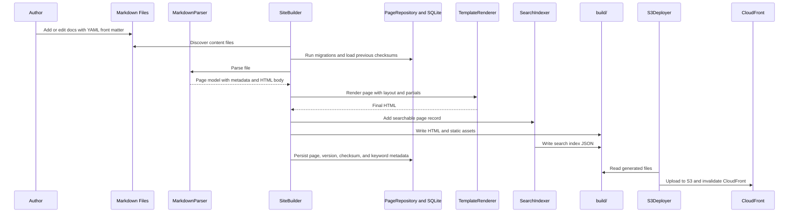

# Static Site Generator - Architecture

## 2.1 Chosen Architectural Pattern

The project uses a **Layered Monolith** architecture.

This is a good fit because the application is primarily a build tool with a small Sinatra preview/API surface. The business capabilities, including Markdown parsing, ERB rendering, version indexing, search index generation, keyword extraction, and S3 deployment, are cohesive and benefit from being developed, tested, and released together. The architecture still keeps clear boundaries between routes, services, models, templates, and deployment code, so individual pieces can be extracted later if usage grows.

## 2.2 Key Component Interactions

### Sinatra Routes

- `app/routes/site_routes.rb` serves preview pages, search UI, and health checks.
- `app/routes/api_routes.rb` exposes JSON endpoints for pages and search.
- Routes should validate input, call services, and serialize responses. They should not parse Markdown or deploy assets directly.

### Services

- `MarkdownParser` reads Markdown files, extracts YAML front matter, validates metadata, and converts Markdown to HTML.
- `TemplateRenderer` applies ERB templates and layouts.
- `VersionIndex` discovers documentation versions and current/latest version metadata.
- `SearchIndexer` generates compact browser-readable search records.
- `KeywordExtractor` extracts deterministic keywords for ranking and metadata.
- `SiteBuilder` orchestrates parsing, rendering, search generation, and writing to `build/`.
- `S3Deployer` uploads build artifacts and applies cache-control policies.
- `PageRepository` performs real CRUD by writing Markdown files and synchronizing SQLite metadata.
- `LinkValidator`, `SitemapGenerator`, `FeedGenerator`, and `RedirectManager` create production build artifacts and validate output.

### Data Access

Markdown files remain the source format for documentation content. SQLite stores page, version, checksum, and keyword metadata so the preview API can perform real CRUD operations, build reports can identify changed pages, and search/indexing state can be inspected between runs. The repository layer writes Markdown first, parses it back through the same generator pipeline, and then synchronizes the SQLite metadata tables.

### Events and Queues

Message queues and event buses are not part of the initial architecture. Build and deploy jobs are executed synchronously in local scripts and GitHub Actions. If build times become large, the orchestration can later emit build events to a queue or split indexing into separate jobs.

## 2.3 Data Flow

## 2.4 Scalability & Performance Strategy

- Keep static generation deterministic so builds can be cached and compared in CI.
- Use incremental build metadata when content volume grows.
- Generate a compact search index and avoid shipping unnecessary Markdown/source metadata to browsers.
- Apply long-lived cache headers to fingerprinted assets and short-lived headers to HTML and search index files.
- Serve all production traffic through S3 and CloudFront, keeping Sinatra out of the production request path.
- Keep keyword extraction deterministic and local first; external ML services can be introduced behind `KeywordExtractor` if ranking quality needs to improve.

## 2.5 Security Considerations

### Authentication and Authorization

The generated static site is public by default. Authoring and deployment permissions are controlled through GitHub repository access and AWS IAM. If protected documentation is required, use CloudFront signed URLs, an identity-aware proxy, or a separate authenticated documentation platform.

### Data Protection

- Avoid committing secrets or unpublished customer data in Markdown content.
- Treat build artifacts as public unless explicitly protected.
- Validate front matter to prevent unsafe template behavior.
- Escape template output by default when rendering untrusted text.

### API Security

The Sinatra API is intended for local preview and CI validation. If exposed beyond local usage, require authentication, rate limiting, strict CORS, and request logging.

### Secret Management

- Use GitHub Actions encrypted secrets for AWS credentials.
- Use least-privilege IAM roles for S3 upload and CloudFront invalidation.
- Keep local secrets in `.env`, never in source control.
- Document required variables in `.env.example`.

## 2.6 Error Handling & Logging Philosophy

- Parsing and build errors should fail fast with file path, line-oriented context where possible, and actionable messages.
- Route handlers should return structured JSON errors for API requests.
- Deployment errors should include the affected object key and AWS operation.
- Use Ruby logger with stable fields for build phase, file path, version, and duration.
- CI logs should be concise by default, with verbose mode available through environment variables.
- Recoverable content issues, such as missing optional descriptions, should be warnings. Invalid front matter, broken required links, or failed uploads should fail the build.
