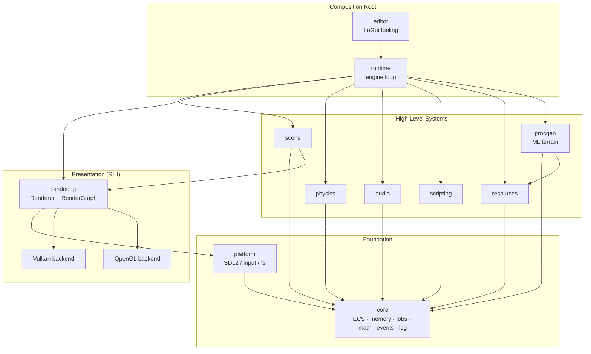
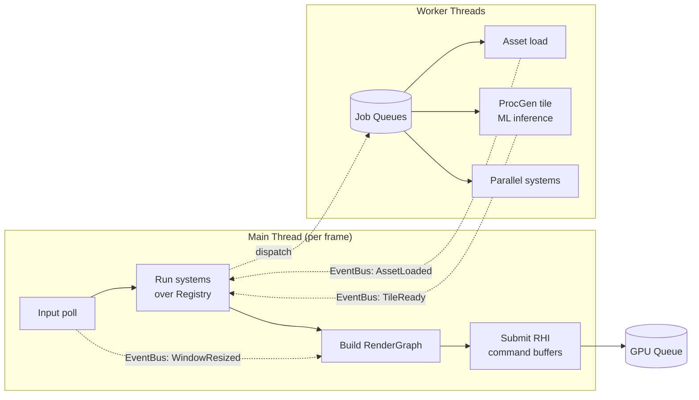
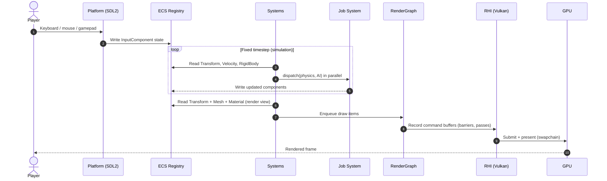
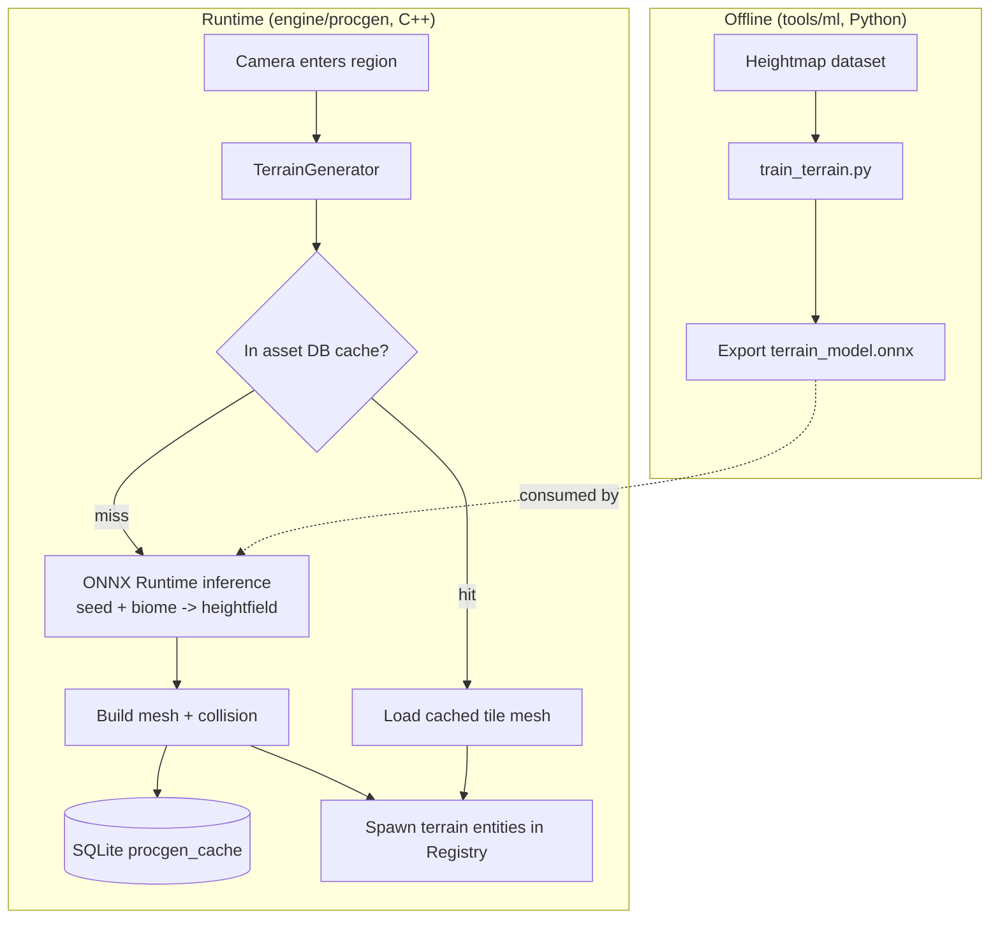
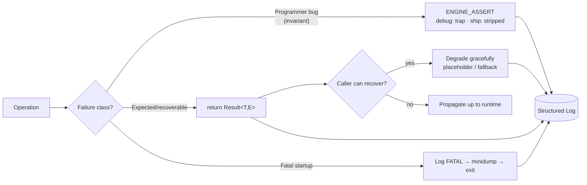

# Game Engine Core — Architecture

> Scope: the architecture of a native C++20 game engine built around an
> **Entity-Component-System (ECS)** core with **data-oriented design**, a
> backend-agnostic **render hardware interface (RHI)** with a Vulkan
> implementation, and an **ML-driven procedural terrain** subsystem.

---

## 2.1 Chosen Architectural Pattern

### Pattern: Data-Oriented ECS within a Layered, Plugin-style Modular Core

The engine combines three complementary structural ideas:

1. **Entity-Component-System (ECS)** as the *runtime data and behaviour model*.
   - **Entities** are opaque IDs (a 32-bit index + generation counter).
   - **Components** are plain data (`struct`s), stored in **dense, contiguous arrays**.
   - **Systems** are stateless functions that iterate over component sets each frame.

2. **Data-Oriented Design (DOD)** as the *memory and performance philosophy*.
   - Components live in **Structure-of-Arrays**-friendly pools (sparse sets) so a
     system touches only the data it needs, maximizing cache-line utilization and
     enabling auto-vectorization.
   - Hot loops avoid virtual dispatch, pointer chasing, and per-entity allocation.

3. **Layered, modular libraries** as the *compile-time structure*.
   - `core → platform → rendering → scene → runtime`, with `physics`, `audio`,
     `scripting`, `resources`, `procgen` plugging into `core`.
   - Each subsystem is an independently linkable CMake target with a clean public API.

### Why this pattern fits

| Requirement | How the pattern satisfies it |
|-------------|------------------------------|
| **Cache-friendly memory** (stated goal) | DOD/sparse-set storage keeps component data contiguous; systems stream over arrays. |
| **High, predictable frame-rate** | No per-frame heap churn (arena + pools); data layout designed for the CPU cache hierarchy. |
| **Many heterogeneous subsystems** | ECS decouples *data* (components) from *behaviour* (systems); new features = new component + system, no base-class surgery. |
| **Multiple render backends (Vulkan/GL)** | RHI abstraction isolates the API; the rest of the engine is backend-agnostic. |
| **Parallelism** | Stateless systems over disjoint component sets parallelize cleanly on the job system. |
| **Team scalability / build times** | Modular targets compile and test in isolation; explicit dependency DAG prevents coupling creep. |

An inheritance-heavy "actor/component" object model (the classic OOP game-object tree)
was explicitly rejected: it scatters data across the heap, defeats the cache, and makes
the stated "cache-friendly memory layout" goal unreachable. See
[`docs/adr/0001-ecs-sparse-set.md`](./adr/0001-ecs-sparse-set.md).

### Layered module view

---

## 2.2 Key Component Interactions

The engine is an **in-process, single-address-space** system, so "communication"
means in-memory mechanisms, not network calls. Four interaction styles are used,
each chosen deliberately:

| Mechanism | Used for | Why |
|-----------|----------|-----|
| **Direct data access via `Registry`** | Systems reading/writing component arrays. | Hottest path; must be zero-overhead. The `Registry` is the single source of truth (analogous to "direct DB access"). |
| **Event bus (`core/event`)** | Decoupled, cross-cutting notifications: window resized, asset loaded, collision began. | Publishers don't know subscribers; avoids hard wiring between subsystems. |
| **Job system (queues)** | Offloading work: async asset loads, procgen tile generation, parallel system execution. | Keeps the main thread responsive; bounded queues give back-pressure (analogous to "message queues"). |
| **RHI command submission** | CPU → GPU. The render graph records commands into RHI command buffers, submitted to the GPU queue. | Isolates the graphics API; enables Vulkan/GL swap and explicit synchronization. |

---

## 2.3 Data Flow

### Frame lifecycle (input → simulation → render → present)

### Procedural terrain data flow (offline training → runtime inference)

**End-to-end path of a unit of data** (e.g., a player moving a character):
input event → `InputComponent` (write) → movement/physics systems read
`Transform`+`Velocity`, integrate, write back → render system reads
`Transform`+`Mesh` into a render view → render graph records draws →
RHI submits to GPU → frame presented. Persistent state (the scene) is
serialized to JSON / the asset DB on save and rehydrated into the `Registry` on load.

---

## 2.4 Scalability & Performance Strategy

**Performance ("scaling down" to the frame budget) is the primary axis** for an engine;
horizontal/server scaling does not apply to an in-process runtime.

- **Cache locality first.** Components stored in dense arrays (sparse-set). A system
  touching N entities streams ~N×sizeof(component) bytes linearly — prefetcher-friendly,
  vectorizable. Hot components are kept small and split (SoA) so unused fields don't
  pollute cache lines.
- **Zero per-frame allocation in hot paths.** Frame data uses a `LinearAllocator`
  (bump arena, reset each frame); fixed-size objects use `PoolAllocator`. The general
  heap is reserved for load-time/asset allocation.
- **Job-based parallelism.** Systems operating on disjoint component sets run on a
  work-stealing thread pool. The schedule is derived from declared read/write component
  sets, so conflicting systems serialize and independent ones run concurrently.
- **GPU-side scaling.** The render graph batches by pipeline/material, supports
  instancing, and (Vulkan) records command buffers on multiple threads. Frames-in-flight
  (double/triple buffering) decouple CPU and GPU pacing.
- **Streaming & LOD.** Terrain and assets stream by camera proximity through the job
  system; the procgen cache avoids recomputing tiles. Distant content uses LODs.
- **Measure, don't guess.** Tracy/GPU timestamps and micro-benchmarks
  (`benchmarks/bench_ecs.cpp`) gate performance regressions in CI.

**Growth dimensions:** more *entities* (bounded by memory & system cost — scales near-linearly
with DOD), more *subsystems* (add module + system, no core changes), more *content*
(streaming + cache), more *platforms* (new RHI backend / platform layer behind existing interfaces).

---

## 2.5 Security Considerations

A desktop game engine's threat model differs from a web service: there is no
authenticated multi-tenant server, but there **is** untrusted input
(assets, save files, mods/scripts, network packets in multiplayer) and a
distribution/supply-chain surface.

- **Authentication & authorization.** Delegated to the **Steam platform**
  (Steamworks: ownership checks, Steam ID, DRM wrapper, optional VAC). The engine
  does not roll its own identity system. Any future online services authenticate via
  Steam auth session tickets, validated server-side.
- **Data protection.** Save games and user config live under the OS user-data path;
  optionally signed/checksummed to detect tampering and corruption. No secrets are
  stored in plaintext in shipped builds.
- **"API" / input security (the real attack surface).**
  - **Asset & save parsers are hardened**: bounds-checked deserialization, size/recursion
    limits, and fuzz-tested (`libFuzzer`) — malformed files must fail safely, never execute.
  - **Scripting is sandboxed**: Lua runs with a restricted standard library (no raw
    `os`/`io`/`package` in shipped builds), CPU/instruction budgets, and a curated binding
    surface — mods cannot reach the filesystem or process arbitrarily.
  - **Multiplayer** (future) treats all packets as hostile: validated, rate-limited,
    server-authoritative simulation.
- **Secret management.** No secrets in the repo. Build/release credentials
  (Steam build account, signing certs) live in **GitHub Actions encrypted secrets** /
  the CI secret store, injected at release time only. The `.env.example` documents the
  expected variable names with placeholder values; real `.env` is git-ignored.
- **Supply chain.** Dependencies pinned via the `vcpkg.json` manifest + baseline commit;
  CodeQL + dependency scanning in CI; reproducible builds via the `Dockerfile`.

---

## 2.6 Error Handling & Logging Philosophy

**Principle: fail loud in development, fail safe in production, and never pay for
error handling in the hot path.**

### Error handling

- **`Result<T, E>` for recoverable, expected failures** (asset not found, device
  creation failed, parse error). No exceptions across module/ABI boundaries and none in
  per-frame hot loops — exceptions are reserved for truly exceptional, non-recoverable
  startup paths only.
- **Assertions for programmer errors / invariants** (`ENGINE_ASSERT`). Active in debug
  and checked builds; compiled out in shipping. They catch *bugs*, not runtime conditions.
- **Layered policy:**
  - *Core/hot path*: assert invariants, return `Result` for fallible operations.
  - *Subsystems*: convert backend errors (Vulkan `VkResult`, SDL errors) into engine
    `Result`/error codes at the boundary; never leak backend types upward.
  - *Composition root (`runtime`)*: top-level handling — log, attempt graceful
    degradation (e.g., fall back GL←Vulkan, skip a corrupt asset), or controlled shutdown
    with a crash report.
- **Graceful degradation over crashing** where a frame can still be produced: a missing
  texture renders as a magenta placeholder; a failed script is disabled and logged, not fatal.

### Logging

- **Single structured logger** (`core/Log.hpp`) with levels
  `TRACE · DEBUG · INFO · WARN · ERROR · FATAL` and named channels per subsystem
  (`[Renderer]`, `[ECS]`, `[ProcGen]`).
- **Compile-time level filtering**: `TRACE`/`DEBUG` are stripped from shipping builds
  (zero cost). Async sink so logging never blocks the frame.
- **Outputs**: colored console (dev), rotating file sink (always), and an in-editor
  console panel. On `FATAL`/crash, a minidump + recent log ring-buffer are written for
  post-mortem.
- **Diagnostics tie-in**: validation layers (Vulkan), sanitizers, and the Tracy profiler
  are wired in debug/CI builds; their output flows through the same channels.

