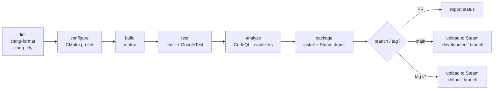

# Game Engine Core — Technical Notes

Actionable, opinionated guidance for building, testing, shipping, and operating
the engine. Pairs with [PROJECT-PLAN.md](./PROJECT-PLAN.md) and
[ARCHITECTURE.md](./ARCHITECTURE.md).

---

## 3.1 CI/CD Pipeline Design

**Goal:** every PR is configured, built, tested, and statically analyzed on all
supported toolchains before merge; tagged commits produce signed, packaged builds
uploaded to Steam.

### Stages



| Stage | Tooling | Gate |
|-------|---------|------|
| **Lint** | `clang-format --dry-run -Werror`, `clang-tidy` | Fail on any formatting/lint diff. |
| **Configure** | `cmake --preset ci-<os>` | Manifest deps resolve (vcpkg), presets valid. |
| **Build** | `cmake --build --preset ci-<os>` | **Warnings-as-errors.** Matrix below. |
| **Test** | `ctest --preset ci-<os> --output-on-failure` | All suites pass; coverage threshold met. |
| **Analyze** | CodeQL (C++), ASan/UBSan job (Linux) | No new high-severity alerts; no sanitizer reports. |
| **Package** | `cmake --install`, depot staging | Artifacts assembled & checksummed. |
| **Deploy** | `steamcmd` (`release.yml`) | Tag → Steam `default`; `main` → `development`. |

### Build matrix

| OS | Compiler | Renderer | Notes |
|----|----------|----------|-------|
| Windows | MSVC (VS 2022, `/std:c++20`) | Vulkan | Primary ship target. |
| Linux | Clang (libc++) | Vulkan | Sanitizer + fuzzing host. |
| Linux | GCC | OpenGL | Fallback backend coverage. |

Caching: vcpkg binary cache + CMake/compiler cache (`ccache`/`sccache`) keyed on the
vcpkg baseline and toolchain to keep CI minutes low. See `.github/workflows/ci.yml`.

---

## 3.2 Testing Strategy

### Unit testing
- **Framework:** GoogleTest (+ GoogleMock). Run via CTest.
- **What to test:** the deterministic core — ECS (`Registry` CRUD, `SparseSet`
  invariants, `View` iteration), allocators (alignment, exhaustion, reset),
  job system (completion, ordering), math, serialization round-trips.
- **Coverage target:** **≥ 80% lines** on `engine/core` and `engine/resources`
  (the logic-dense, deterministic modules). Rendering/audio/platform are harder to
  unit-test and rely more on integration/manual tests — don't chase a number there.
- **Style:** Arrange-Act-Assert; one behaviour per test; no sleeps; deterministic seeds.

### Integration testing
- **Headless engine tick:** boot `core` + `scene` + a null/headless RHI, run N fixed
  ticks, assert world state (no window/GPU required → CI-friendly).
- **Round-trips:** scene → JSON → scene equality; asset import → DB → load.
- **ProcGen:** fixed seed + fixed model → byte-stable heightfield (golden test).

### End-to-end / smoke testing
- **Boot smoke test:** launch `runtime` with `--smoke-test` → init all subsystems,
  render N frames offscreen, clean shutdown, exit 0. Runs in CI on a software/headless
  Vulkan (lavapipe) device.
- **GPU capture diffing (manual/nightly):** RenderDoc captures of reference scenes,
  image-compared against goldens with a perceptual tolerance.
- **Soak test (nightly):** run a benchmark scene for a long session under ASan; assert
  no leaks, no unbounded memory growth, stable frame time.

### Performance regression
- `benchmarks/bench_ecs.cpp` (google/benchmark) tracks ECS iteration throughput;
  CI flags >X% regressions on the hot paths.

---

## 3.3 Deployment Strategy

The product is a **native desktop application distributed via Steam** — not a
containerized cloud service. Containers are used for *build reproducibility*, not runtime.

- **Packaging:** `cmake --install` lays out a self-contained tree
  (`runtime` executable + runtime deps + `assets/` + compiled SPIR-V shaders).
  Bundle the required runtime redistributables per platform.
- **Steam pipeline:** `release.yml` stages the install tree into a **Steam depot**,
  then `steamcmd +run_app_build` uploads it.
  - **Branch mapping:** `main` → Steam **`development`** beta branch (internal testers);
    `tag v*` → **`default`** (public). Steam handles delta patching & CDN distribution.
- **Containerization (build-time only):** the `Dockerfile` defines a pinned Linux image
  (compiler + vulkan-sdk + vcpkg) so local and CI Linux builds are bit-reproducible.
  No game server is shipped; if a future dedicated server is added, *it* would be
  containerized and deployed separately.
- **Crash reporting:** shipping builds generate minidumps on fatal errors and (opt-in)
  upload symbolicated reports; debug symbols are archived per release for symbolication.
- **Versioning:** SemVer tags drive both the in-app version string (injected via CMake)
  and the Steam build description.

---

## 3.4 Environment Management

Native builds are configured primarily through **CMake presets**, not environment
variables, but a few secrets/paths are environment-driven (CI, tooling, ML export).

- **`CMakePresets.json`** is the source of truth for build configuration
  (debug/release/ci, backend selection, sanitizer toggles). Developers run
  `cmake --preset dev` rather than memorizing flags.
- **Runtime config:** `assets/config/engine.default.json` holds shipped defaults;
  a user config in the OS user-data dir overrides it; CLI flags override that.
  Precedence: **CLI > user config > default config**.
- **Secrets & machine-specific paths** come from the environment (and in CI, from
  encrypted secrets). Documented in `.env.example` (copy to `.env`, never commit `.env`):

```dotenv
# .env.example — copy to .env (git-ignored). Placeholders only; no real secrets.

# --- Build / tooling ---
VCPKG_ROOT=C:/dev/vcpkg
VULKAN_SDK=C:/VulkanSDK/1.3.x
ENGINE_BUILD_TYPE=Debug              # Debug | Release | RelWithDebInfo

# --- Logging / runtime (dev) ---
ENGINE_LOG_LEVEL=DEBUG               # TRACE|DEBUG|INFO|WARN|ERROR|FATAL
ENGINE_RENDER_BACKEND=vulkan         # vulkan | opengl
ENGINE_ENABLE_VALIDATION=1           # Vulkan validation layers (dev only)

# --- ML procgen tooling (tools/ml) ---
PROCGEN_DATASET_DIR=./data/heightmaps
PROCGEN_MODEL_OUT=./assets/models/terrain_model.onnx

# --- CI / release (provided by CI secret store; placeholders here) ---
STEAM_BUILD_ACCOUNT=__set_in_ci__
STEAM_BUILD_TOKEN=__set_in_ci__
STEAM_APP_ID=480
CODE_SIGN_CERT_BASE64=__set_in_ci__
```

> **Three logical environments:** *development* (validation layers on, asserts on,
> debug logging, hot-reload), *staging* (RelWithDebInfo, validation off, internal
> Steam `development` branch), *production* (Release, asserts/trace stripped, minimal
> logging, Steam `default`).

---

## 3.5 Version Control Workflow

**Recommended: trunk-based development with short-lived feature branches.**

- **Why:** game-engine work benefits from continuous integration of many parallel
  subsystems; long-lived divergent branches make integrating ECS/renderer changes
  painful. Trunk-based keeps `main` always green and releasable, with CI as the gate.
- **Flow:**
  1. Branch from `main`: `feature/<short-desc>`, `fix/<short-desc>` (hours–days, not weeks).
  2. Open a PR early; CI (lint→build→test→analyze) must pass.
  3. At least one review; squash-merge to keep `main` history linear.
  4. **Releases via tags** (`vMAJOR.MINOR.PATCH`) cut from `main`; `release.yml`
     packages and ships. Hotfixes branch from the tag, fix, tag a patch, forward-merge.
- **Conventions:** Conventional Commits (`feat:`, `fix:`, `perf:`, `refactor:`)
  to drive changelogs; protect `main` (required checks, no direct pushes).
- **Large binaries:** keep the repo lean — track large/binary assets via **Git LFS**
  (textures, models, audio); never commit build artifacts or generated SPIR-V.

> Gitflow was considered but rejected: its long-lived `develop`/`release` branches add
> ceremony that doesn't fit a fast-moving engine with strong CI. Plain GitHub Flow is
> close to what's recommended here; "trunk-based + tags" just makes the release story explicit.

---

## 3.6 Common Pitfalls (this stack)

**C++20 / build**
- **vcpkg/CMake drift:** pin the vcpkg baseline in `vcpkg.json`; without it, contributors
  silently get different dependency versions. Treat the manifest + baseline as locked.
- **ODR / header hygiene:** the modular `include/` layout helps, but be strict about
  what's public. Prefer forward declarations; keep heavy headers (Vulkan, SDL) out of
  public surfaces to protect compile times.
- **C++20 modules vs headers:** toolchain support is still uneven across MSVC/Clang/GCC —
  this project stays on headers for portability; revisit modules later behind CI proof.

**ECS / data-oriented**
- **Iterator invalidation:** adding/removing components *during* a `View` iteration can
  reallocate pools. Use deferred command buffers (queue structural changes, apply at a
  safe point) — don't mutate the set you're iterating.
- **Entity recycling bugs:** always use the **generation counter** in entity handles;
  a stale handle reused after recycle is a classic, hard-to-find defect.
- **"OOP creep":** resist adding virtual methods/inheritance to components — it
  reintroduces the cache-unfriendly object model the ECS exists to avoid.

**Vulkan**
- **Verbosity & synchronization:** explicit barriers/layout transitions are the #1 source
  of bugs. Centralize them in the render graph; **always run validation layers in dev**.
- **Resource lifetime / frames-in-flight:** never free a GPU resource still referenced by
  an in-flight frame; use per-frame deletion queues fenced on frame completion.
- **Driver variance:** test on multiple GPU vendors (NV/AMD/Intel) + a software device
  (lavapipe) in CI — "works on my GPU" is not portability.

**Concurrency**
- **Data races between systems:** only parallelize systems with disjoint read/write
  component sets; derive the schedule from declared access, don't eyeball it. Run TSan in CI.
- **False sharing:** keep per-thread/per-frame data cache-line-aligned in the allocators.

**ML procgen**
- **Native ML inference is awkward in C++:** standardize on **ONNX Runtime** and export
  trained models to ONNX from Python (`tools/ml`); don't link a full training framework
  into the engine. Keep inference off the main thread (job system) and **cache results**
  (the `procgen_cache` table) — never block a frame on inference.
- **Determinism:** procgen must be reproducible from (seed, model version). Pin model
  versions in the asset DB so a save loads the terrain it was generated against.
