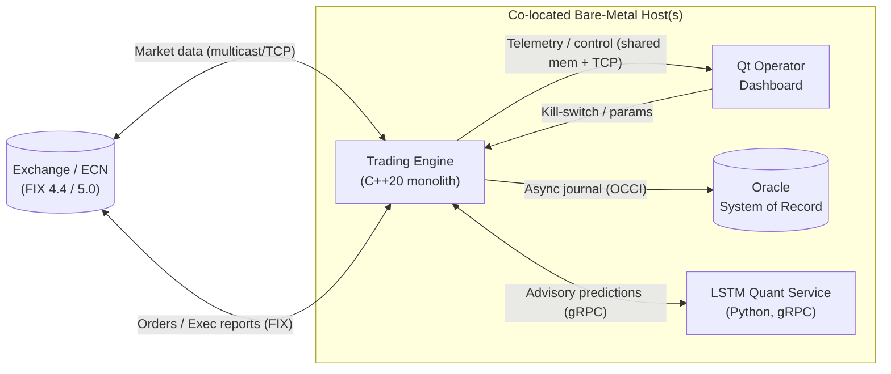
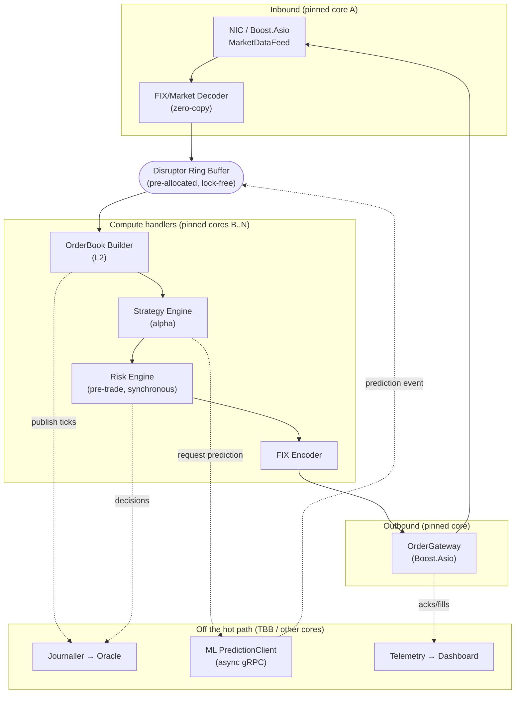
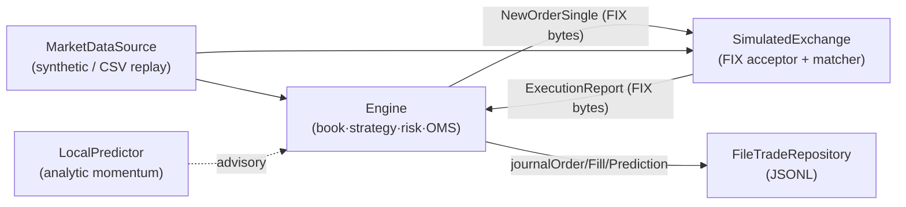
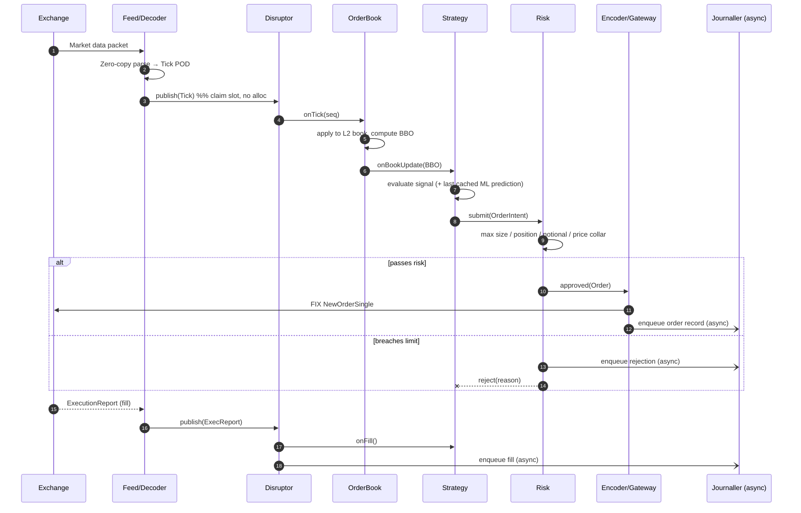
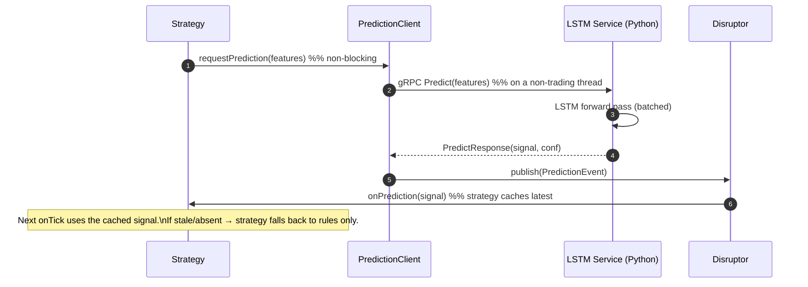
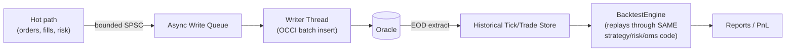
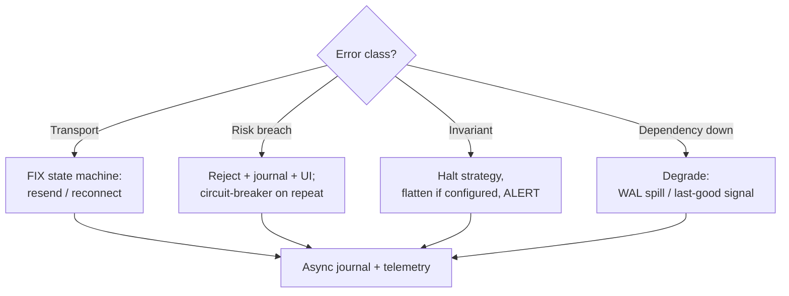

# Real-Time Trading System — Architecture

---

## 1. Chosen Architectural Pattern

**Event-Driven Pipeline (LMAX Disruptor) inside a Modular Monolith, surrounded by
a small set of out-of-band services.**

The trading engine is a **single OS process** structured as a staged, single-writer
**event pipeline**. A market or order event is published once into a pre-allocated
ring buffer and flows through a deterministic sequence of handlers
(*decode → book → strategy → risk → encode → send*). Around this core sit
**out-of-process** collaborators that must never be on the critical path: the **Qt
dashboard**, the **Oracle** system-of-record, and the **Python LSTM** quant service.

### Why this pattern fits

| Requirement | Why the pattern serves it |
|-------------|---------------------------|
| **Sub-10µs tick-to-trade** | A monolith keeps the hot path in one address space — no serialization, no network hops, no context switches between stages. |
| **Determinism** | The Disruptor enforces the *single-writer principle* and a total order of events, so behavior is reproducible (critical for backtest/live parity and audit). |
| **No GC / no locks** | Ring buffers are pre-allocated; handlers run on pinned cores busy-spinning — predictable, jitter-free latency. |
| **Maintainability** | Although it's one process, modules (`fix`, `oms`, `risk`, `strategy`) are cleanly separated with explicit interfaces, so teams can evolve them independently. |
| **Selective scale-out** | The genuinely parallelizable, latency-tolerant work (ML inference, analytics, persistence, UI) is pushed *out* of the monolith where horizontal scaling is cheap and safe. |

> **Rejected alternatives.** A microservice hot path was rejected: every network
> hop adds microseconds and tail-latency jitter that dwarf the entire latency
> budget. A classic layered monolith with shared mutable state + locks was rejected
> for lock contention and non-deterministic latency. Serverless is a non-starter for
> a persistent, co-located, latency-critical workload.

### System context (C4 level 1)

---

## 2. Key Component Interactions

The engine is internally wired as a Disruptor pipeline. Each box below is an
**event handler** consuming from a sequence and publishing to the next stage.

**Interaction mechanisms (deliberately chosen per edge):**

- **Intra-process, hot path → Disruptor ring buffer.** No locks, no allocation;
  handlers advance sequence numbers and read in place. This is the *only*
  mechanism used between latency-critical stages.
- **Strategy → OMS → Risk → Encoder.** Direct, synchronous, in-order calls within
  the pipeline stage. Risk is **mandatory and blocking** — no order is encoded
  before it clears.
- **Engine ↔ ML service → async gRPC.** Fire-and-forget request; the response is
  *published back into the ring* as a normal event, so strategies consume
  predictions through the same uniform event stream. Never a blocking RPC.
- **Engine → Oracle → bounded async queue + dedicated writer thread** using OCCI.
  The hot path enqueues a POD record and moves on; durability happens off-core.
- **Engine ↔ Dashboard → shared-memory telemetry ring + a control TCP channel.**
  High-rate metrics stream lock-free via shared memory; low-rate commands
  (kill-switch, param change) come back over a small request/response channel.

### 2.1 Implemented default runtime (the seam in action)

The reference build realizes this design **dependency-free** by binding each seam
to a self-contained default, so the whole pipeline runs and is tested without any
external venue, database, or model server:

- The **wire is a byte callback** (`fix::WireSink`): `Engine` and
  `SimulatedExchange` exchange the *same framed, checksummed FIX messages* a real
  venue would, so swapping in the `RTS_ENABLE_BOOST` TCP gateway is a drop-in.
- `ITradeRepository` → `FileTradeRepository` by default; `RTS_ENABLE_ORACLE`
  swaps the OCCI adapter behind the identical interface.
- `IPredictor` → `LocalPredictor` by default; `RTS_ENABLE_GRPC` routes to the
  remote LSTM service. Either way predictions are advisory and never block.

This is the same code path `apps/trading_engine` and the integration tests run;
only the seam bindings change in a production deployment.

---

## 3. Data Flow

### 3.1 Tick-to-trade (the critical path)

Everything between **(3) publish** and **(11) FIX NewOrderSingle** runs on pinned,
busy-spinning cores with no allocation and no locking. The journaller (async) and
any ML interaction are intentionally outside this span.

### 3.2 Advisory ML prediction flow (off the hot path)

### 3.3 Persistence & backtest data flow

The backtester replays recorded events through the **identical** strategy, risk,
and OMS code paths used in production — only the transport (file reader vs. NIC)
and clock (simulated vs. TSC) differ. This guarantees backtest/live parity.

---

## 4. Scalability & Performance Strategy

**Scale-up first, scale-out at the edges.**

- **Vertical (the engine).** Performance comes from mechanical sympathy, not more
  boxes: cache-line alignment (`alignas(64)`) and false-sharing elimination,
  NUMA-local allocation, CPU isolation (`isolcpus`/`nohz_full`), huge pages,
  `mlockall`, busy-polling, and a kernel-bypass-ready transport seam
  (`network/` can swap Asio for ef_vi/DPDK without touching strategy code).
- **Pipeline parallelism.** The Disruptor lets independent handlers (book build,
  journaller, telemetry) run on **separate cores** consuming the same sequence in
  parallel, so throughput grows with cores without locks.
- **Horizontal where it's safe.**
  - **By instrument/venue:** run one engine instance per symbol-group or venue,
    each pinned to its own NUMA node / NIC. Shared-nothing — trivially parallel.
  - **ML service:** stateless gRPC; scale replicas behind a local load balancer.
  - **Oracle:** RAC + partitioning by trade date; writes are batched and async.
- **Backtesting:** embarrassingly parallel — shard historical data by
  symbol/day across an Intel TBB `task_arena` or a compute grid.
- **Capacity headroom:** ring-buffer sizes, pool counts, and queue depths are
  configured for peak message rates with margin; back-pressure is explicit and
  bounded (drop-to-spill for journaling, never for risk).

---

## 5. Security Considerations

> A co-located trading system's threat model is dominated by **integrity**,
> **authorization of orders**, and **insider/operational risk**, more than public
> web threats. The hot path is not internet-facing.

- **Authentication & authorization**
  - Exchange sessions authenticate via FIX logon credentials + per-session
    comp IDs; sessions are mutually pinned to known IPs.
  - Operator access to the dashboard and control channel is authenticated
    (LDAP/Kerberos) and **role-based**: who may change params, who may flip the
    kill-switch, who may release a halted strategy. Four-eyes for risk-limit
    changes.
  - The ML gRPC channel uses mTLS even on the LAN; service identity is verified.
- **Data protection**
  - Oracle TDE (transparent data encryption) at rest; column encryption for any
    PII/account data. Backups encrypted.
  - In transit: TLS for gRPC and the control channel; market/order links run on
    isolated, firewalled VLANs (exchange networks are private circuits).
- **API / interface security**
  - The control channel validates and rate-limits every command; the kill-switch
    is idempotent and always honored. Strict input validation on the FIX parser
    (length/tag bounds) to prevent malformed-message faults.
  - Principle of least privilege for the engine's OS user; no shell, locked-down
    capabilities, read-only binary mount.
- **Secret management**
  - No secrets in source or images. Secrets (DB creds, FIX passwords, TLS keys)
    come from **HashiCorp Vault** (or CyberArk) at startup and are held in
    `mlock`ed memory. `.env.example` documents *names only*.
  - Jenkins injects build/deploy secrets from a credentials store, never logged.
- **Auditability**
  - Immutable, append-only journal of every order/fill/risk decision with
    nanosecond timestamps (PTP-synced) for regulatory reconstruction.

---

## 6. Error Handling & Logging Philosophy

**Fail safe, fail loud, never fail silently — and never let logging slow a trade.**

- **Error taxonomy & policy**
  - *Recoverable transport errors* (disconnect, seq gap): handled by the FIX
    session state machine — resend/gap-fill, automatic reconnect with backoff.
  - *Risk breaches*: not errors but **expected control flow** — the order is
    rejected, journaled, surfaced to the dashboard. Repeated breaches can trip a
    per-strategy circuit breaker.
  - *Invariant violations* (corrupt book, impossible state): **fail fast** — halt
    the affected strategy, flatten if configured, and alert. Correctness over
    uptime when money is at risk.
  - *Dependency outages* (Oracle/ML down): degrade gracefully — journaling spills
    to a local WAL and replays on recovery; ML signals fall back to last-good /
    rules-only. The engine keeps trading within risk limits.
- **No exceptions on the hot path.** Steady-state handlers use `std::expected` /
  status codes and pre-validated inputs; exceptions are reserved for startup,
  config, and truly exceptional off-path conditions.
- **Logging mechanics.** Hot-path code **only enqueues** a compact, pre-formatted
  record into a lock-free ring; a dedicated logging thread formats and writes.
  Producers never touch I/O, never allocate, never block. Levels: `TRACE`
  (off in prod), `INFO`, `WARN`, `ERROR`, `FATAL`.
- **Structured & correlated.** Every record carries a monotonic event sequence id
  and nanosecond timestamp so logs, journal, and telemetry can be joined to
  reconstruct any trade end-to-end.
- **Observability loop.** Per-stage timestamps feed an HdrHistogram; latency
  regressions, queue depth, reject rates, and disconnects raise alerts. The
  dashboard shows live health; the journal is the forensic source of truth.

