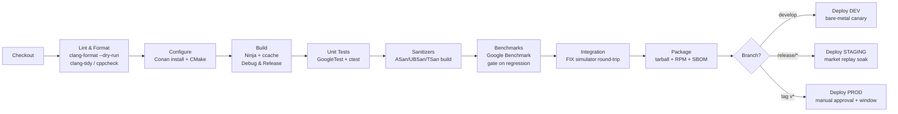
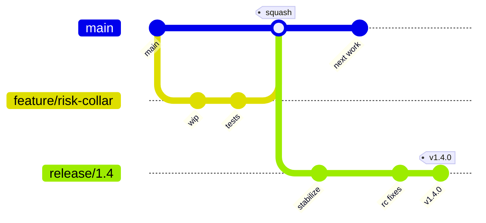

# Real-Time Trading System — Technical Notes

Actionable engineering guidance for building, testing, shipping, and operating the
platform on bare metal with Jenkins.

---

## 1. CI/CD Pipeline Design

> **Implementation note.** The shipped default build is **dependency-free** — CMake
> + Ninja + a C++20 compiler, with a bundled GoogleTest-compatible runner — so CI
> needs no package manager (see `ci/Jenkinsfile`, `ci/scripts/build.sh`). Conan is
> only required when enabling the optional `RTS_ENABLE_*` integrations below.

**Tooling:** Jenkins (declarative `Jenkinsfile`), CMake + Ninja, ccache,
GCC 13 / Clang 17, GoogleTest (or bundled shim) + Google Benchmark, clang-format,
clang-tidy, cppcheck, Include-What-You-Use, ASan/UBSan/TSan, `gcovr` for coverage,
Conan for the optional-feature builds.

### Stages



**Principles**

- **Fast feedback first:** lint and unit tests run on every push and must finish
  in a few minutes; sanitizer, benchmark, and integration stages run on merge to
  `develop` and nightly.
- **Build once, promote the same artifact** through DEV → STAGING → PROD. No
  rebuilds per environment; configuration is injected, not baked.
- **Latency is a test, not a vibe.** The benchmark stage fails the build if p99 of
  the core pipeline regresses beyond a threshold vs. a stored baseline.
- **Reproducible builds:** pinned Conan lockfile, pinned compiler, deterministic
  flags; emit an SBOM (CycloneDX) per artifact.
- **Deployments are gated:** STAGING requires a green market-replay soak; PROD
  requires manual approval and only deploys inside an exchange maintenance window.

---

## 2. Testing Strategy

| Layer | Framework | Target | What it covers |
|-------|-----------|--------|----------------|
| **Unit** | GoogleTest / GoogleMock | **≥ 85%** line, **≥ 75%** branch on `core`, `oms`, `risk`, `fix` | Lock-free queue invariants, book mutations, FIX parse/encode round-trips, risk limit math, OMS state machine |
| **Property/fuzz** | libFuzzer + RapidCheck | n/a | FIX parser on malformed input; book never goes crossed; pool never double-frees |
| **Concurrency** | GoogleTest under **TSan** + stress loops | race-free | SPSC/Disruptor publish/consume under contention |
| **Benchmark** | Google Benchmark | p50/p99 budgets | Per-stage latency, allocation count (must be 0 on hot path) |
| **Integration** | Custom FIX acceptor (QuickFIX-based simulator) + ctest | full round-trip | logon → order → ack → fill → journal, reconnect/gap-fill |
| **Backtest parity** | BacktestEngine harness | bit-for-bit | Same decisions in backtest vs. live-replay on identical input |
| **End-to-end / soak** | Market-data replay rig | 24h stable | Memory stability, no hot-path alloc, latency drift, failover |

**Guidelines**

- Hot-path code is written to be **testable without hardware**: the clock, the
  transport, and the gRPC client are interfaces, so tests inject deterministic
  fakes (simulated time, in-memory feed).
- **Golden-file** FIX tests: capture real exchange messages (sanitized) and assert
  exact parse/encode.
- **Zero-allocation assertion**: a custom allocator hook fails any test that
  allocates on a thread tagged "trading".
- Coverage is reported but **not worshipped** — a passing fuzz/property test on the
  parser is worth more than a high line-coverage number.

---

## 3. Deployment Strategy

**Target: bare metal, co-located, no containers on the hot path.**

- **Why not Docker for the engine:** container network/namespace overhead and
  scheduler interference add tail-latency jitter. The engine runs as a **native
  systemd service** on a tuned host. Containers *are* used for the **ML service**,
  **CI build agents**, and **dev/test simulators** where latency is non-critical.
- **Artifact:** a versioned RPM (or self-contained tarball) containing the static-
  linked engine binary, default configs, and a `tune_host.sh`. Installed under
  `/opt/trading/<version>/`, with a `current` symlink for atomic switchover.
- **Host preparation (`scripts/tune_host.sh`):** `isolcpus` + `nohz_full` +
  `rcu_nocbs` for trading cores, IRQ affinity off those cores, huge pages
  reserved, `cpupower` governor = performance, C-states disabled, NIC tuned
  (ring sizes, RSS, busy-poll), PTP/PPS time sync.
- **Release procedure:** blue/green at the **process** level — start the new
  version as a warm standby, let it sync FIX sequence numbers and book state from
  the journal, then cut over during a quiet window or maintenance break. Old
  version stays warm for instant rollback (flip the `current` symlink).
- **ML service deployment:** containerized, rolling update behind a local gRPC LB;
  model artifacts are versioned and pinned by the engine config (a model upgrade
  is a config change, independently rollback-able).
- **Database:** schema changes ship as **forward-only Flyway migrations**
  (`db/migrations/`), applied in a maintenance window with a tested rollback plan.

---

## 4. Environment Management

- **Environments:** `dev` (developer boxes + sim exchange), `staging` (prod-like
  hardware, replay/soak, exchange UAT/cert endpoints), `prod` (live, co-located).
- **Config layering:** a base `config/trading_engine.yaml` + an environment overlay
  + secrets injected at runtime from Vault. **Nothing secret is in the repo or the
  artifact.** Config is validated at startup; the engine refuses to start on an
  invalid/incomplete config (fail-fast).
- **Per-environment differences** are limited to endpoints, credentials, risk
  limits, and toggles (e.g., paper-trading mode in dev). Code is identical.

### `.env.example`

```dotenv
# ── Copy to .env (gitignored) and fill in. Real secrets come from Vault in prod. ──
TRADING_ENV=dev                      # dev | staging | prod
ENGINE_CONFIG=config/trading_engine.yaml

# FIX session (values injected by Vault in staging/prod)
FIX_HOST=127.0.0.1
FIX_PORT=5001
FIX_SENDER_COMP_ID=TRADER1
FIX_TARGET_COMP_ID=EXCHANGE
FIX_PASSWORD=                        # leave blank locally; Vault path: secret/fix/password

# Oracle (OCCI)
ORACLE_HOST=localhost
ORACLE_PORT=1521
ORACLE_SERVICE=TRADING
ORACLE_USER=trading_app
ORACLE_PASSWORD=                     # Vault path: secret/oracle/app
ORACLE_POOL_MIN=2
ORACLE_POOL_MAX=8

# ML quant service (gRPC, mTLS)
ML_GRPC_ENDPOINT=localhost:50051
ML_MODEL_VERSION=lstm-v3
ML_TIMEOUT_MS=20                     # advisory; never blocks trading
ML_TLS_CA=                          # path to CA bundle (prod)

# Secret manager
VAULT_ADDR=https://vault.internal:8200
VAULT_ROLE=trading-engine

# Hot-path tuning
TRADING_CORES=2,3,4,5                # isolated cores for pinned handlers
USE_HUGEPAGES=1
LOG_LEVEL=INFO                       # TRACE only in dev
```

---

## 5. Version Control Workflow

**Trunk-based development with short-lived feature branches and release branches.**



- **`main` is always releasable.** Feature branches are short-lived (< a few days),
  merged via PR with required reviews and green CI, **squash-merged** to keep
  history linear and bisectable.
- **`release/x.y`** branches cut from `main` for stabilization; only fixes are
  cherry-picked in. A signed tag `vX.Y.Z` triggers the production pipeline.
- **Hotfixes** branch from the release tag, fix forward, then back-merge to `main`.
- **Why trunk-based:** in a latency/correctness-critical system, long-lived
  divergent branches are dangerous (merge surprises in lock-free code). Small,
  frequently integrated changes + strong CI catch regressions early.
- **Conventions:** Conventional Commits, required code-owner review on
  `core/`, `risk/`, and `fix/` (the dangerous code), and **no force-push to
  `main`/`release/*`**.

---

## 6. Common Pitfalls (this stack)

**C++20 / low-latency**

- **Hidden allocations** — `std::string`, `std::function`, `std::vector` growth,
  `std::shared_ptr` control blocks, even some `<iostream>`/`<regex>` paths. Audit
  with an allocator hook; prefer `std::pmr`, fixed buffers, and POD types on the
  hot path.
- **False sharing** — two atomics on the same cache line silently destroy
  throughput. `alignas(64)` and padding; verify with `perf c2c`.
- **Memory-order mistakes** — over-using `seq_cst` costs latency; under-specifying
  causes rare, brutal-to-debug races. Get the SPSC/Disruptor barriers right and
  pin them with TSan + stress tests.
- **`-march=native` portability** — building on a newer CPU than the prod host
  yields illegal instructions. Pin the target microarchitecture in the toolchain.
- **Jitter from the OS** — page faults (use `mlockall` + huge pages), TLB misses,
  IRQs on trading cores, C-state transitions, NUMA-remote memory. Tuning the host
  matters as much as the code.

**FIX protocol**

- Sequence-number management and **resend/gap-fill** are where most bugs live;
  persist seq numbers and test reconnect aggressively.
- Dialect drift — every venue bends FIX. Keep a per-venue dictionary and
  golden-message tests.

**Boost.Asio**

- Don't run trading I/O on a thread pool with work-stealing jitter; pin a single
  `io_context` per session to a dedicated core. Beware accidental blocking calls
  in handlers.

**Intel TBB**

- Keep TBB **off the hot path**. Its task scheduler is great for analytics/backtest
  parallelism but its work-stealing is the wrong tool for deterministic latency.

**Qt**

- Never touch the trading core from the GUI thread. Cross the boundary via the
  shared-memory telemetry ring + queued signals; the dashboard is a *consumer*.

**Oracle / OCCI**

- Connection setup is expensive — use a pool, keep connections warm. Batch inserts
  for the journal; never do a synchronous DB round-trip from a trading handler.

**gRPC / ML**

- Treat predictions as **advisory and possibly late**. Always have a rules-only
  fallback and a circuit breaker; a slow model must degrade, never stall trading.

**Build/Tooling**

- Conan/CMake version skew across dev and CI causes "works on my machine"
  failures — pin everything via a lockfile and a single toolchain file.
