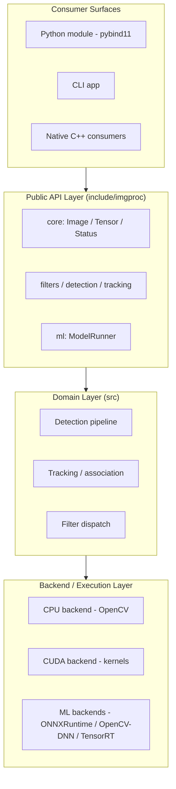
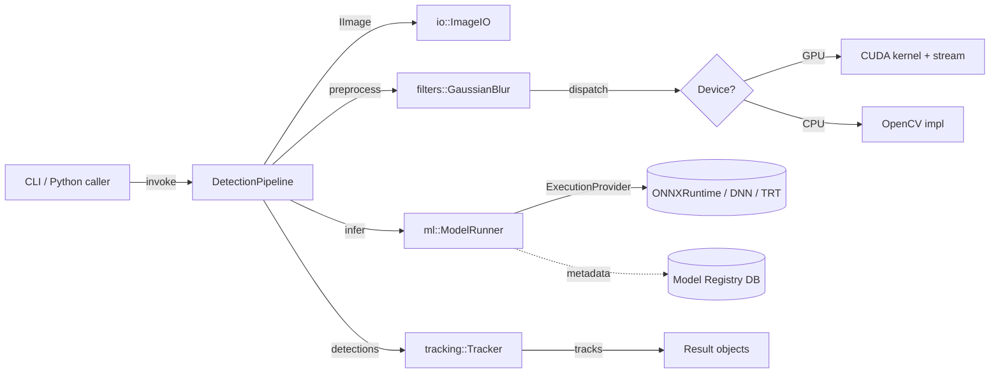
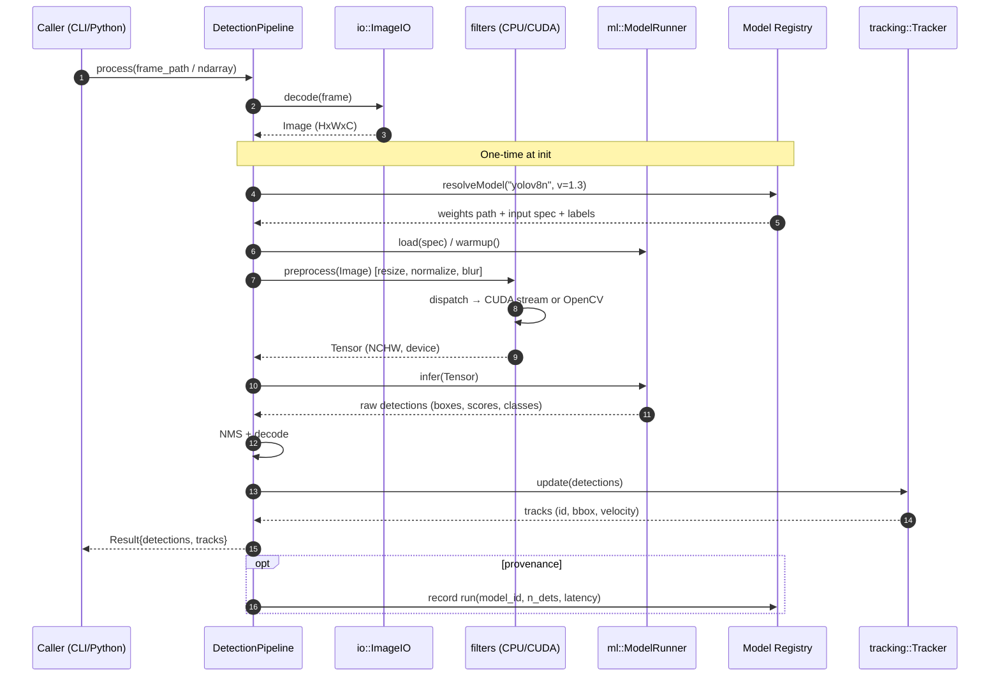
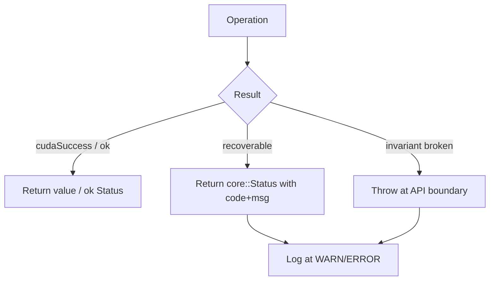
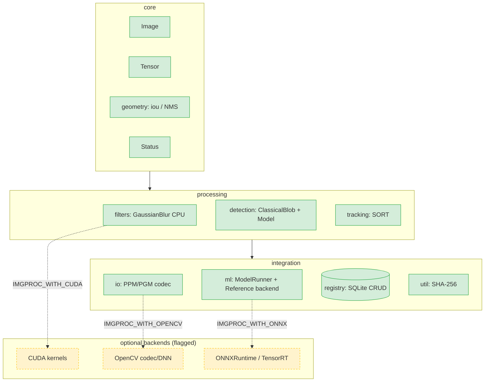

# Architecture — Image Processing Library (`imgproc`)

This document describes the architecture of `imgproc`, a C++20 computer-vision
library for **object detection and tracking** with **CUDA acceleration** and
**Python bindings**.

---

## 2.1 Chosen Architectural Pattern

### Pattern: **Layered, Plugin-Oriented Library (Modular Monolith)**

`imgproc` is not a network service — it is an **embeddable library** consumed
either as a native C++ dependency or via a Python wheel. The appropriate pattern
is therefore a **layered modular monolith** with **strategy/plugin** seams at the
performance-critical and model-integration boundaries.

### Why this pattern fits

| Requirement | How the pattern satisfies it |
| --- | --- |
| **Low-latency, in-process CV** | A library (no IPC/network hop) keeps frame data on the hot path; CUDA buffers never cross a process boundary. |
| **CPU *and* GPU execution** | A **strategy seam** (`Backend`) lets the same operation dispatch to OpenCV or a CUDA kernel based on device availability. |
| **Swappable ML models** | A **plugin seam** (`ml::Backend`) abstracts ONNXRuntime / OpenCV-DNN / TensorRT behind one interface. |
| **Python + C++ consumers** | Bindings are a thin adapter over a stable C++ API; both surfaces share one core. |
| **Maintainability at scale** | Strict layering (API → domain → backend) prevents OpenCV/CUDA leakage into the public ABI. |

> **Why not microservices?** The workload is latency-bound, GPU-memory-resident
> image data. Serializing tensors across a network would dominate runtime and
> defeat CUDA acceleration. A single optimized library is the correct unit.

---

## 2.2 Key Component Interactions

Components communicate via **direct in-process C++ calls** through interfaces.
There is **no message queue or network bus** inside the core; concurrency is
handled with **CUDA streams** and a **CPU thread pool**.

- **API calls** — synchronous C++ method calls across layers (the primary
  mechanism). Interfaces (`ObjectDetector`, `ModelRunner`, `Backend`) decouple
  callers from implementations.
- **Direct database access** — the **Model Registry** (SQLite/Postgres) is read
  at load time to resolve model versions, input specs, and class labels, and is
  written to record detection-run provenance. Accessed through a thin DAO, never
  from the hot inference loop.
- **Event bus / message queue** — *intentionally absent* in the core. For batch
  or server deployments, an **optional** outer harness (not part of the library)
  may pull frames from a queue (Kafka/SQS) and call `imgproc` per frame.
- **Concurrency channels** — CUDA streams (async H2D/D2H + kernel launches) and a
  CPU thread pool for parallel CPU-path stages.

---

## 2.3 Data Flow

Typical path of a frame from input → processing → result, with the model
registry consulted once at initialization.

### Memory data flow (CPU ↔ GPU)

Image pixels move to the device **once**, are processed and inferred on-GPU, and
only compact detection results return to the host — minimizing PCIe traffic.

---

## 2.4 Scalability & Performance Strategy

| Axis | Strategy |
| --- | --- |
| **Throughput (frames/s)** | CUDA **stream pipelining** — overlap H2D copy of frame *N+1* with compute of frame *N*; **pinned (page-locked) host memory** for async transfers. |
| **Batch inference** | Accumulate frames into an `N×C×H×W` batch tensor; the ML backend runs one batched forward pass. |
| **Multi-GPU** | Round-robin pipelines across devices via a device-id-parameterized `Backend`; each GPU owns its streams and model replica. |
| **CPU fallback** | When no CUDA device is present, the same API dispatches to OpenCV CPU paths — no caller code change. |
| **Memory** | Reusable device buffer pools (avoid per-frame `cudaMalloc`); zero-copy NumPy ↔ `Image` views in Python where layout allows. |
| **Compile-time scaling** | Separable CUDA compilation + per-architecture fat binaries; unity builds optional for CI speed. |
| **Horizontal (deployment)** | The library is stateless per call; a host application scales out by running more worker processes, each pinned to a GPU. |

**Performance guardrails:** google/benchmark micro-benchmarks run in CI; a
regression > X% on the hot path (blur, inference, NMS) fails the build.

---

## 2.5 Security Considerations

Although `imgproc` is a library (not an exposed network endpoint), it processes
**untrusted media** and loads **ML model artifacts**, which carry real risk.

### Authentication & Authorization
- The library itself performs no auth. When embedded in a service, the **host
  application** owns authn/authz; `imgproc` exposes hooks to receive an
  already-authenticated context (e.g., tenant id for registry scoping).
- Model-registry access uses least-privilege DB credentials (read-only for
  inference workers; write only for the registration tool).

### Data Protection
- Frames may be PII (faces, plates). The library keeps image buffers in memory
  only; it **never** writes inputs to disk unless explicitly told to.
- Optional at-rest encryption for cached model weights and result stores is
  delegated to the deployment (LUKS / KMS-managed volumes).

### API / Input Security
- **Untrusted-image hardening:** decode through OpenCV with size/dimension limits
  and decompression-bomb guards; reject malformed or oversized inputs early.
- **Model artifact validation:** verify model file **checksums/signatures** from
  the registry before loading; load only from an allow-listed model directory to
  prevent arbitrary-file / deserialization attacks.
- Bounds-checked tensor shapes — never trust a model's declared I/O dims blindly.

### Secret Management
- No secrets in source or headers. DB connection strings, registry URLs, and
  cloud credentials come from **environment variables** (`.env`, see
  `TECH-NOTES.md`) or a secrets manager (Vault / AWS Secrets Manager).
- `.env` is git-ignored; only `.env.example` is committed.

---

## 2.6 Error Handling & Logging Philosophy

### Error handling

A **two-tier** strategy that stays exception-light on the hot path:

1. **Recoverable / expected failures** → return a `core::Status` (an
   error-code + message value type, à la `absl::Status`). Used for: file not
   found, unsupported format, model-shape mismatch, no CUDA device.
2. **Programmer errors / invariants** → assertions in debug; `std::logic_error`
   in public API entry points for contract violations.
3. **CUDA errors** → every CUDA call is wrapped in a `IMGPROC_CUDA_CHECK(...)`
   macro that converts a non-`cudaSuccess` code into a `core::Status` (or throws
   at the public boundary), capturing the kernel/op name.

- **Exceptions cross the public boundary only**, where they are also translated
  into Python exceptions by the pybind11 layer (`Status` → `RuntimeError` /
  custom `ImgprocError`). Internal hot loops avoid throwing.

### Logging

- A **logging facade** (`core::log`) wraps a fast backend (spdlog) so the rest of
  the code never hard-depends on a logger.
- **Levels:** `TRACE` (per-frame timings, dev only) → `DEBUG` → `INFO`
  (lifecycle: model loaded, device selected) → `WARN` (CPU fallback, retried op)
  → `ERROR` (failed op) → `CRITICAL`.
- **Structured fields** for machine parsing: `frame_id`, `model_id`, `device`,
  `latency_ms`, `n_detections`.
- **No logging in tight kernels/inner loops** — sample or aggregate instead.
- Library default = `WARN`; the host app raises verbosity via env
  (`IMGPROC_LOG_LEVEL`).

---

## 2.7 Implementation Notes (as built)

The shipped implementation realises the architecture above with a
**dependency-light default** so the library compiles, tests, and runs with only
a C++20 toolchain. OpenCV / CUDA / ONNXRuntime / TensorRT are **optional
accelerated backends** behind feature flags — consistent with §2.4's CPU
fallback strategy.

### Module map

### Concrete backend choices

| Seam | Default (built & tested) | Optional acceleration |
| --- | --- | --- |
| Filter dispatch | Pure-C++ separable convolution | CUDA separable kernel (`.cu`) |
| Detector | Classical blob (threshold + connected components) | Model-backed (`ml::ModelRunner`) |
| ML backend | Deterministic `ReferenceRunner` | **ONNX Runtime** (`IMGPROC_WITH_ONNX`, implemented & tested) · OpenCV-DNN / TensorRT (future) |
| Image IO | Netpbm (PPM/PGM) codec | OpenCV `imread`/`imwrite` |
| Registry | Embedded **SQLite** (vendored amalgamation) | PostgreSQL (same schema) |

The **ONNX Runtime backend** (`src/ml/onnx_runner.cpp`) loads a real `.onnx`
model into an `Ort::Session` and runs genuine forward passes; it is verified
end-to-end in CI-style tests against a tiny fixture model. CMake fetches the
ONNX Runtime prebuilt (`cmake/Onnxruntime.cmake`) and stages its shared library
next to the executables. The CUDA execution provider is wired for the GPU ORT
package; the auto-fetched CPU package falls back to the CPU provider.

### Error handling & logging — as implemented

- The `core::Status` value type is used throughout the hot path exactly as
  described; the pybind11 layer translates a non-OK `Status` into a Python
  `RuntimeError`, and the CLI prints `Status::message()` to `stderr`.
- Current logging is lightweight `stderr` reporting in the CLI plus rich
  `Status` messages from the library. The structured spdlog facade (§2.6) is the
  documented target for the service-embedding milestone and is not yet wired in.
- CUDA calls are wrapped by `IMGPROC_CUDA_CHECK` in the `.cu` translation unit,
  converting a failing `cudaError_t` into a `core::CudaError` Status.
