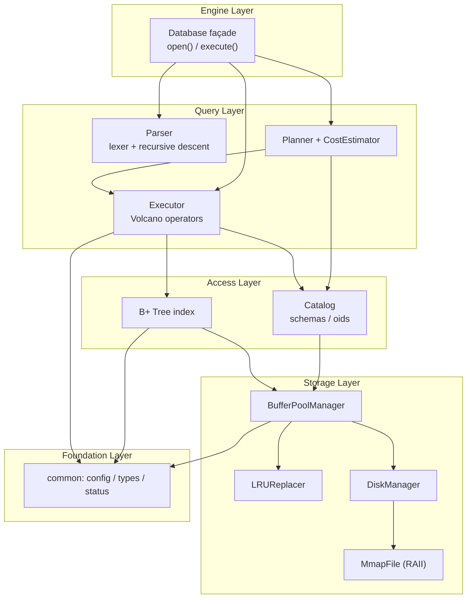
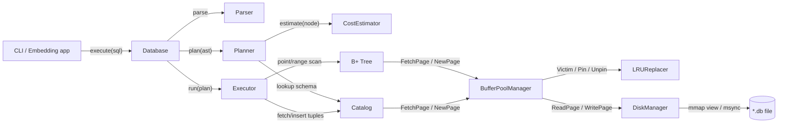
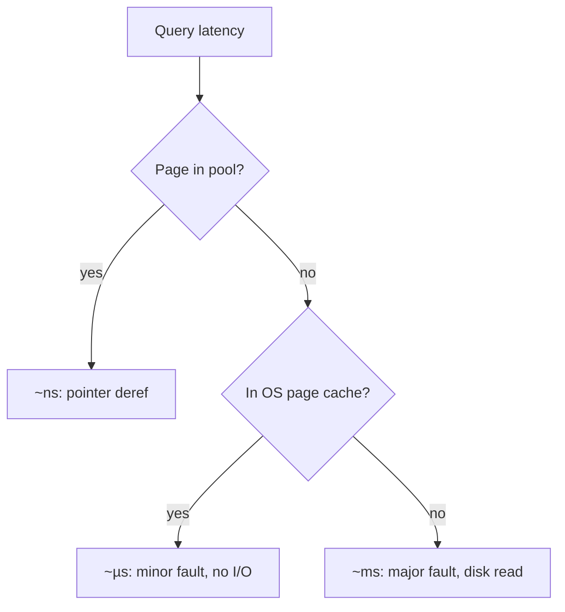
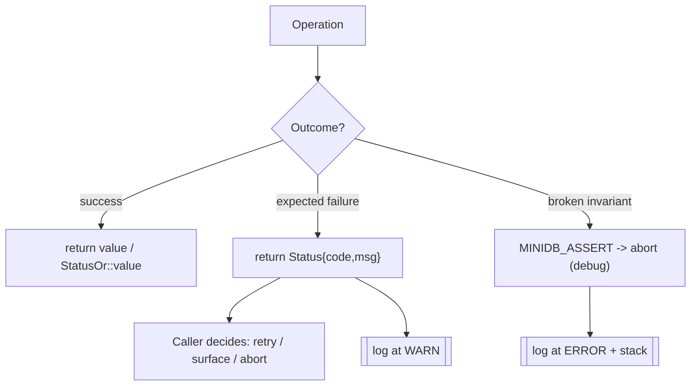

# MiniDB — Architecture

This document describes the architecture of the MiniDB engine: the chosen
pattern, how components interact, how data flows from a SQL string to disk and
back, and the cross-cutting concerns (scalability, security, error handling).

---

## 2.1 Chosen Architectural Pattern

**Pattern: Layered (modular) monolith with a Volcano-style execution core,
embedded as a library.**

MiniDB is *not* a service. It is a statically linked library (`libminidb_core`)
plus a thin CLI. The internal organization is a strict **layered architecture**:
each layer depends only on the layers beneath it.



### Why this pattern fits

- **Scale of the problem is bounded.** A single-node educational engine has no
  need for network boundaries, service discovery, or independent deployment.
  Microservices would add latency, serialization, and operational cost with zero
  benefit. A library is the smallest thing that can possibly work.
- **Teachability.** Strict layering means a reader can study one slab at a time
  (`storage` without `parser`, `index` without `execution`) and each has a
  crisp, testable contract.
- **Performance.** In-process function calls and a shared buffer pool keep the
  hot path free of IPC. The Volcano (iterator) model composes operators cleanly
  while keeping memory bounded.
- **Evolvability.** Because layers only depend downward, we can evolve the index
  internals (e.g. add node merging to the page-backed B+ Tree) or the I/O
  strategy without touching the SQL front end.

---

## 2.2 Key Component Interactions

There is **no message queue or event bus** — interactions are **direct,
synchronous function calls** plus **shared access to the buffer pool**. The
buffer pool is the single point through which all durable data passes.



| Interaction               | Mechanism            | Contract                                   |
|---------------------------|----------------------|--------------------------------------------|
| App → Engine              | `execute(string)`    | Returns `StatusOr<ResultSet>`              |
| Engine → Parser           | function call         | `StatusOr<Statement>` (no exceptions)      |
| Planner → CostEstimator   | function call         | Pure function: plan → `Cost`               |
| Executor → Index/Catalog  | function call         | Iterator (`Next()`), pinned-page borrow    |
| Access → BufferPool       | function call         | Borrowed `Page*`, must `UnpinPage` after   |
| BufferPool → Disk         | function call         | Page-granular read/write                   |
| Disk → File               | `mmap` + `msync`     | Byte range ↔ page offset                    |

**Invariant:** every `FetchPage`/`NewPage` is balanced by an `UnpinPage`. The
buffer pool is the only component that talks to the disk manager.

---

## 2.3 Data Flow

End-to-end path for `SELECT id, name FROM users WHERE id = 42;`

```mermaid
sequenceDiagram
    autonumber
    actor User
    participant CLI
    participant DB as Database
    participant Lex as Lexer
    participant Par as Parser
    participant Plan as Planner
    participant Cost as CostEstimator
    participant Exec as Executor
    participant Idx as B+ Tree
    participant BPM as BufferPool
    participant Disk as DiskManager(mmap)

    User->>CLI: type SQL + Enter
    CLI->>DB: execute("SELECT ... WHERE id = 42")
    DB->>Lex: tokenize(sql)
    Lex-->>DB: [SELECT, id, ',', name, FROM, ...]
    DB->>Par: parse(tokens)
    Par-->>DB: SelectStatement (AST)
    DB->>Plan: plan(ast, catalog)
    Plan->>Cost: estimate(SeqScan) vs estimate(IndexScan)
    Cost-->>Plan: IndexScan cheaper (point predicate)
    Plan-->>DB: PlanNode = IndexScan(users.pk, key=42)
    DB->>Exec: run(plan)
    Exec->>Idx: GetValue(42)
    Idx->>BPM: FetchPage(root) ... FetchPage(leaf)
    BPM->>Disk: ReadPage(leaf)  %% only on cache miss
    Disk-->>BPM: 4 KiB page (mmap view)
    BPM-->>Idx: Page* (pinned)
    Idx-->>Exec: RID(page=7, slot=3)
    Exec->>BPM: FetchPage(7) -> read tuple, project (id,name)
    Exec-->>DB: ResultSet { (42, "Ada") }
    DB-->>CLI: StatusOr<ResultSet> (OK)
    CLI-->>User: render table
```

**Write path** (`INSERT`) is symmetric: the executor serializes the tuple into a
heap page (marking it dirty in the buffer pool), updates the B+ Tree, and the
dirty page is flushed to the mmap'd file on eviction or explicit `flush()`.

---

## 2.4 Scalability & Performance Strategy

MiniDB scales **vertically** (bigger machine, bigger buffer pool), not
horizontally — appropriate for an embedded engine.

- **Buffer pool with LRU eviction.** Working set stays in RAM; only cold pages
  hit disk. Pool size is the primary scaling knob (`MINIDB_BUFFER_POOL_PAGES`).
- **Memory-mapped I/O.** `mmap` lets the OS page cache and the DB share physical
  pages, avoiding double buffering and `read()`/`write()` syscall overhead on
  the hot path. Reads become pointer dereferences; writes become stores +
  periodic `msync`.
- **B+ Tree for range locality.** High fan-out (hundreds of keys/node) keeps the
  tree shallow (3–4 levels for millions of rows) and makes range scans
  sequential-ish, which is cache- and prefetch-friendly.
- **Cost-based operator choice.** The planner avoids full scans when a selective
  index is available, and avoids index random-I/O when a scan is cheaper.
- **Zero-copy reads.** Operators borrow pinned `Page*` and read in place rather
  than copying whole pages.



**Known scaling limits (v1, by design):** single writer (coarse latch),
single-file store, no parallel query execution. Phase 3 lifts these via WAL,
MVCC, and a parallel scan path.

---

## 2.5 Security Considerations

MiniDB is an **embedded, trusted-process** library: there is no network surface,
no multi-tenant isolation, and the "user" is the host application. Security
therefore centers on **input handling and memory safety**, not authn/z.

- **Authentication & authorization.** Out of scope for the engine; delegated to
  the embedding application and OS file permissions on the `*.db` file. (A future
  server front end would add this at its boundary.)
- **Data protection.** Confidentiality/at-rest encryption is delegated to the
  filesystem (e.g., LUKS/BitLocker). Hook points exist in `DiskManager` for a
  future page-encryption codec. File created with least-privilege permissions.
- **API / input security.** The SQL parser is the untrusted boundary. Defenses:
  - **No string interpolation into a second interpreter** — the executor walks a
    typed AST; there is no `eval`. Classic SQL injection does not apply, but
    malformed input must never corrupt state.
  - **Bounds-checked deserialization** of pages/tuples (every offset validated
    against `PAGE_SIZE`); reject pages that fail invariants instead of trusting
    on-disk bytes.
  - **Resource caps**: max query length, max identifier length, recursion depth
    limit in the parser to prevent stack-exhaustion from pathological input.
  - **Memory safety**: ASan/UBSan in CI, `std::span`/bounds-checked accessors,
    no raw `memcpy` without a size invariant; parser fuzzing (Phase 3).
- **Secret management.** The engine holds no secrets. Tunables come from
  environment variables / `.env` (see `.env.example`); secrets (if an embedding
  app adds encryption keys) must come from a vault/KMS, never the repo.

---

## 2.6 Error Handling & Logging Philosophy

**Principle: exceptions for *programmer errors*, values for *expected failures*.**

- **`Status` / `StatusOr<T>` everywhere on the hot path.** Recoverable, expected
  conditions (parse error, table not found, key not found, page full) are
  returned as values, not thrown. This keeps the storage/execution core
  exception-free, predictable, and easy to reason about under `-fno-exceptions`
  if desired.

  ```cpp
  StatusOr<ResultSet> rs = db.execute(sql);
  if (!rs.ok()) { log.warn(rs.status().message()); return; }
  use(rs.value());
  ```

- **Exceptions / `assert` for invariants.** A pinned page being evicted, or a
  negative pin count, is a *bug*, not a runtime condition — those use
  `MINIDB_ASSERT` (active in debug, compiled out in release) and fail loudly.
- **Error taxonomy** (`StatusCode`): `kOk`, `kInvalidArgument`, `kNotFound`,
  `kAlreadyExists`, `kSyntaxError`, `kIOError`, `kOutOfMemory`, `kBufferPoolFull`,
  `kCorruption`, `kUnsupported`, `kInternal`. Each carries a human-readable
  message and never silently swallows context.
- **Logging.** A single leveled, lazily-evaluated logger (`TRACE..ERROR`) writes
  structured key=value lines to `stderr` by default; verbosity via
  `MINIDB_LOG_LEVEL`. No logging in tight loops above `TRACE`. Logs are
  developer-facing diagnostics — they never contain row data at `INFO`+ to avoid
  leaking user content.



This split gives the engine **predictable control flow** (no surprise unwinding
through the buffer pool) while still catching genuine bugs early and loudly.
