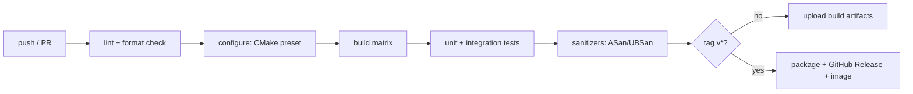
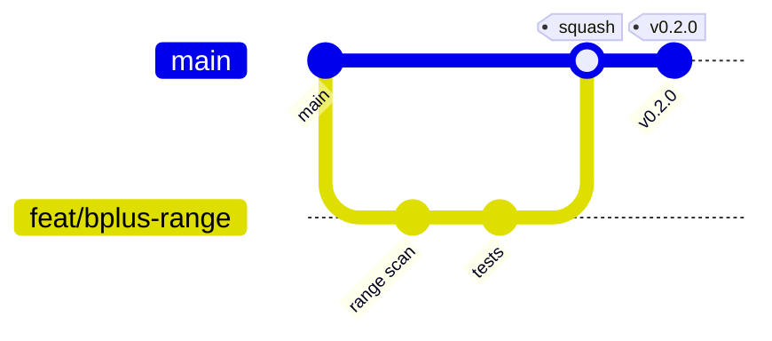

# MiniDB — Technical Notes

Actionable engineering guidance for building, testing, shipping, and operating
MiniDB. Pairs with `PROJECT-PLAN.md` (what) and `ARCHITECTURE.md` (how it's
shaped).

---

## 3.1 CI/CD Pipeline Design

MiniDB is a C++ library, so "deploy" means **publish a tested artifact**
(static lib + headers, a tagged release, optionally a container with the CLI),
not push to a running cluster. The pipeline is defined in
`.github/workflows/ci.yml`.



| Stage      | Tooling                                  | Gate                                  |
|------------|------------------------------------------|---------------------------------------|
| Lint       | `clang-format --dry-run`, `clang-tidy`   | Style + static analysis clean         |
| Build      | CMake + Ninja; GCC, Clang, MSVC          | Compiles `-Wall -Wextra -Werror`      |
| Test       | `ctest` (GoogleTest)                     | 100% of tests pass                    |
| Sanitize   | ASan + UBSan lane (Linux/Clang)          | No leaks / UB on the test corpus      |
| Package    | `cpack` / `docker build` on tags         | Release artifacts produced            |

**Build matrix:** `{ubuntu: gcc, clang} × {Debug, Release}` plus
`{windows: msvc} × {Debug, Release}`. Keep PR feedback fast: run the full matrix
on `main`, a reduced matrix (Linux/GCC Debug + one sanitizer) on PRs.

**Environments:** dev (local), staging (the `main`-branch artifacts consumers can
pin), prod (immutable tagged releases `vX.Y.Z`). Promotion is "advance the pinned
version," not a redeploy.

---

## 3.2 Testing Strategy

A database lives or dies on correctness, so testing is **layered and
property-based** where it counts.

### Unit testing
- **Framework:** GoogleTest (+ GoogleMock), pulled via `FetchContent` so there's
  no system dependency. One test binary per module keeps failures localized.
- **Coverage target:** ≥ **85%** lines on `storage` and `index` (the parts that
  corrupt data if wrong); ≥ 70% overall. Measured with `llvm-cov`/`gcov`.
- **What's already real & green:** `test_lru_replacer`, `test_cost_estimator`,
  `test_lexer`. These exercise fully-implemented modules and should stay passing.

### Property / randomized testing (the high-value lane)
- **Oracle pattern:** drive the B+ Tree with a randomized stream of
  insert/erase/lookup and assert it agrees with a `std::map` reference oracle.
  This finds split/merge bugs that example-based tests miss.
- **Round-trip invariants:** serialize → deserialize a tuple/page and assert
  equality; write N pages, reopen the file, read them back unchanged.
- **Buffer pool invariants:** pinned pages are never victimized; pin/unpin counts
  return to zero; dirty pages survive eviction.

### Integration testing
- `test_database.cpp` drives the public façade: `CREATE TABLE` → `INSERT` →
  `SELECT … WHERE`, asserting on the `ResultSet`. Runs against a temp file and
  re-opens it to prove durability.

### End-to-end / CLI testing
- Golden-file tests: feed `examples/sample_queries.sql` into the CLI, diff stdout
  against a checked-in expected transcript. Cheap, catches regressions in the
  user-visible surface.

### Hardening (Phase 3)
- **Fuzzing:** libFuzzer target over `Parser::parse` (untrusted input boundary).
- **Sanitizers:** ASan + UBSan in CI; periodic TSan run once concurrency lands.
- **Crash/recovery tests:** kill mid-write, reopen, assert no corruption (after
  WAL exists).

| Layer        | Tool                | Runs in CI | Primary risk it covers          |
|--------------|---------------------|------------|---------------------------------|
| Unit         | GoogleTest          | every PR   | local logic regressions         |
| Property     | GoogleTest + RNG    | every PR   | structural index bugs           |
| Integration  | GoogleTest          | every PR   | wiring / durability             |
| E2E (CLI)    | golden files        | every PR   | user-facing regressions         |
| Fuzz         | libFuzzer           | nightly    | parser memory safety            |
| Sanitizers   | ASan/UBSan/TSan     | PR/nightly | UB, leaks, data races           |

---

## 3.3 Deployment Strategy

There is no server to roll out; "deployment" = **distribution of a build
artifact**. Three supported consumption modes:

1. **Source / submodule + CMake** (primary). Consumers `add_subdirectory()` or
   `FetchContent` MiniDB and link `minidb::core`. This is the canonical path for
   an embeddable library.
2. **Tagged binary release.** On `vX.Y.Z`, CI runs `cpack` to produce a static
   lib + headers archive attached to a GitHub Release. Consumers `find_package`.
3. **Container (CLI demo).** A multi-stage `Dockerfile` builds in a full toolchain
   image and copies only the `minidb` CLI + a base runtime into the final layer.
   This is for demos/CI, not a production service.

```dockerfile
# Multi-stage: fat builder, slim runtime (see ./Dockerfile)
FROM gcc:14 AS build      # toolchain + cmake + ninja, compile & test
FROM debian:stable-slim   # copy only the minidb binary
```

**Versioning:** Semantic Versioning. The on-disk file format carries its own
`format_version` in the file header; bumping it is a major-version event and ships
with a migration note.

---

## 3.4 Environment Management

MiniDB reads tunables from **environment variables** (12-factor style), with sane
compiled-in defaults so it runs with zero configuration. `.env` is for local
convenience only and is **git-ignored**; `.env.example` is the documented
template (checked in).

| Variable                  | Default | Wired? | Purpose                              |
|---------------------------|---------|--------|--------------------------------------|
| `MINIDB_BUFFER_POOL_PAGES`| `1024`  | ✅ yes | Frames in the buffer pool (× 4 KiB)  |
| `MINIDB_DATA_DIR`         | `./data`| ⏳ no  | Directory convention for `*.db` files |
| `MINIDB_PAGE_SIZE`        | `4096`  | n/a    | Page size (compile-time; informational) |
| `MINIDB_LOG_LEVEL`        | `INFO`  | ⏳ no  | Reserved for the structured logger    |
| `MINIDB_MMAP_ENABLED`     | `1`     | ⏳ no  | Reserved for a buffered-I/O fallback  |
| `MINIDB_SYNC_ON_COMMIT`   | `1`     | ⏳ no  | Reserved; `FlushAll()` always syncs   |

Only `MINIDB_BUFFER_POOL_PAGES` is read at runtime today (in `Database::Open`);
the rest document the intended configuration surface for Phase-3 features and are
marked accordingly in `.env.example` so the template doesn't overpromise.

**Per-environment guidance:**
- *dev*: a small pool keeps memory low; point the CLI at a scratch `*.db`.
- *staging*: production-like pool size against disposable data.
- *prod/embedding*: pool size tuned by the host app; call `Flush()` for durability.

`.env.example` ships in the repo root — copy to `.env` and edit. The CLI loads it
on startup; never commit a real `.env`.

---

## 3.5 Version Control Workflow

**Recommended: trunk-based development with short-lived feature branches.**

- **Why trunk-based (not Gitflow):** MiniDB has a single deliverable and a small
  team. Long-lived `develop`/`release` branches in Gitflow create merge debt and
  delay integration — overkill here. Trunk-based keeps `main` always green and
  releasable, which pairs naturally with the "promote a tag" deployment model.
- **Branches:** `feat/bplus-split`, `fix/lru-victim`, `docs/...`; rebase on `main`,
  open a PR, squash-merge. Keep branches < ~2 days of work.
- **`main` is protected:** required green CI + one review; no direct pushes.
- **Releases:** annotate a tag `vX.Y.Z` on `main`; CI packages it. Hotfixes branch
  from the tag, fix, tag a patch, cherry-pick forward.
- **Conventional Commits** (`feat:`, `fix:`, `perf:`, `test:`, `docs:`, `refactor:`)
  to drive an auto-generated changelog and clarify semver impact.



---

## 3.6 Common Pitfalls (this tech stack)

A field guide to the bugs this stack tends to produce.

### mmap / I/O
- **Growing a mapped file is not transparent.** Extending the file does not
  enlarge an existing mapping; you must `munmap`/remap (or pre-size in chunks).
  Holding `Page*` across a remap = dangling pointer. Mitigation: pin-and-remap
  protocol, pre-allocate in large extents.
- **Durability ≠ "I wrote to the mapping."** Stores hit dirty OS pages; you need
  `msync(MS_SYNC)` (POSIX) / `FlushViewOfFile` + `FlushFileBuffers` (Windows) for
  real durability. `MINIDB_SYNC_ON_COMMIT` controls this tradeoff.
- **`SIGBUS` on truncation / out-of-space.** Touching a mapped page past EOF
  faults with `SIGBUS`, not a tidy error. Always size the file before mapping.
- **Windows vs POSIX divergence.** `MapViewOfFile` requires a file mapping object
  and offsets aligned to the allocation granularity (64 KiB), not the page size.
  Keep all of this behind `MmapFile` and test both OSes in CI.

### Buffer pool / pointers
- **Forgetting to `UnpinPage`** leaks frames until the pool is "full" and fetches
  fail. Treat fetch/unpin like new/delete; consider an RAII `PageGuard` (Phase 3).
- **Returning a `Page*` that later gets evicted.** Borrowed pages are valid only
  while pinned. Never stash a raw `Page*` past the unpin.

### B+ Tree
- **Off-by-one in split/merge and sibling redistribution** is the classic source
  of corruption. This is *why* the randomized `std::map` oracle test exists.
- **Iterator invalidation on concurrent structural change.** v1 sidesteps this
  with a single writer; revisit when MVCC lands.

### C++20 / build
- **Dangling `std::string_view`/`std::span`** into a temporary (e.g., a token
  viewing a parsed string that's freed). Tie lifetimes explicitly.
- **`FetchContent` network flakiness** in CI. Pin GoogleTest to a commit/tag and
  cache the build directory; allow a `find_package` fallback for offline builds.
- **MSVC vs GCC/Clang differences:** `__attribute__` vs `__declspec`, signed/
  unsigned warnings, `<bit>`/concepts support. CI matrix catches these; keep
  platform code isolated.
- **UB that "works" in Debug:** type-punning pages without `std::bit_cast`,
  unaligned reads, reading uninitialized padding. ASan/UBSan in CI is the safety
  net — keep that lane green.

### Process
- **Scope creep toward "a real database."** The phase gates and explicit non-goals
  in `PROJECT-PLAN.md` exist precisely to resist this.
