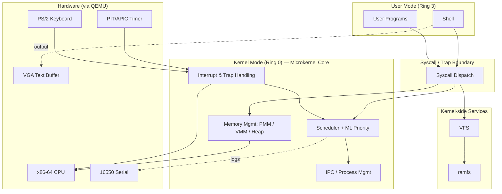
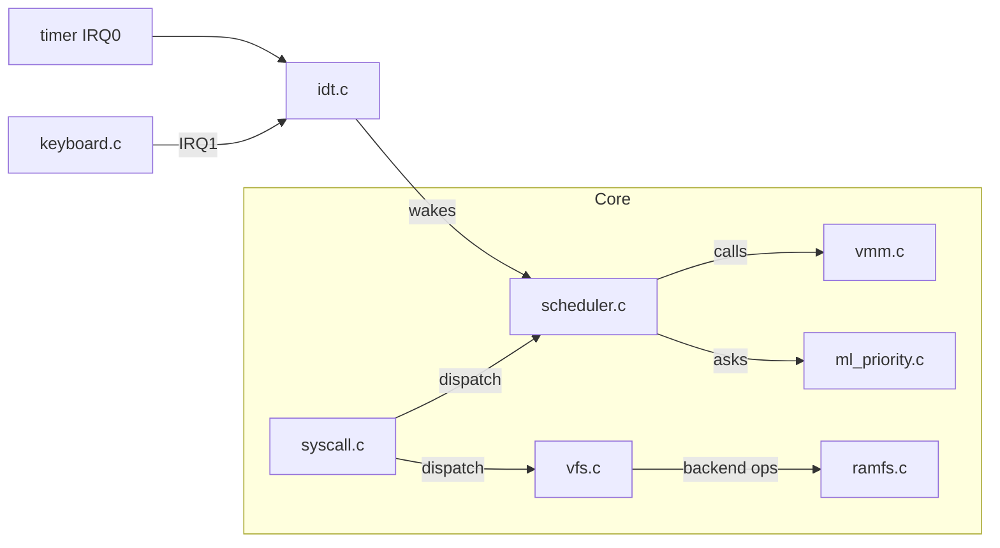
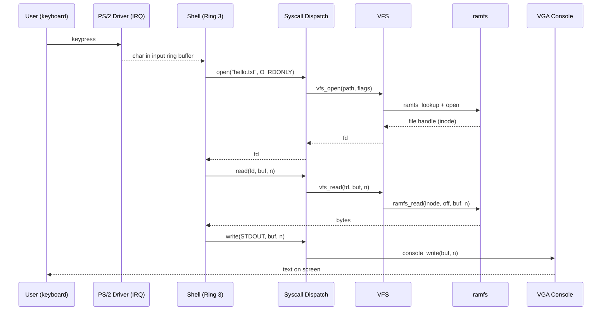
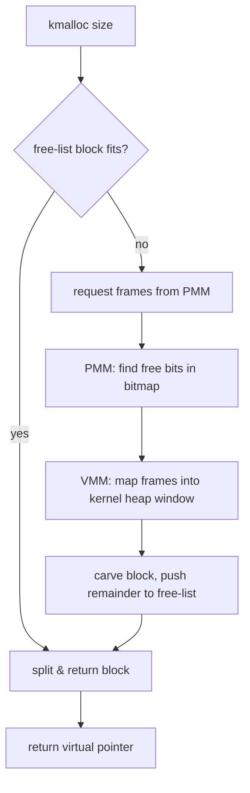
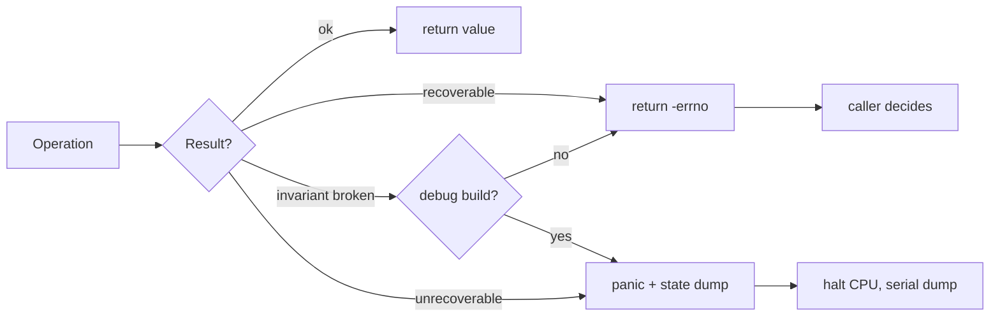

# Architecture — Operating System Kernel

> An educational x86-64 **microkernel**. This document describes the chosen
> architectural pattern, how components interact, how data flows, and the
> cross-cutting strategies (scalability, security/isolation, error handling).

---

## 2.1 Chosen Architectural Pattern

**Pattern: Microkernel (minimal privileged core + layered subsystems).**

The kernel keeps only the *mechanisms that require ring-0* inside the trusted
core: physical/virtual memory, scheduling, interrupt handling, IPC, and the
syscall boundary. Everything that can be expressed as policy or service is
pushed outward (filesystem, shell, future drivers).

### Why a microkernel for this project?

- **Pedagogical clarity.** Each concept (paging, scheduling, syscalls, FS) is a
  self-contained module with a narrow interface — ideal for teaching/reading.
- **Isolation.** A bug in `ramfs` cannot silently corrupt the scheduler because
  they communicate through defined interfaces, not shared globals.
- **Portability.** Architecture-specific code is quarantined in
  `kernel/arch/x86_64/`; the core compiles against abstract interfaces.
- **Testability.** Pure modules (PMM bitmap math, ML priority, ramfs) compile
  on the host and run under a unit-test harness without QEMU.

> Trade-off accepted: microkernels pay an IPC/syscall cost vs. a monolith. For
> an educational kernel, clarity and isolation outweigh raw throughput.

---

## 2.2 Key Component Interactions

Components communicate through **four** well-defined mechanisms:

| Mechanism            | Used between                                  | Example                              |
|----------------------|-----------------------------------------------|--------------------------------------|
| Syscall trap         | Userspace → kernel                            | `write(fd, buf, n)`                  |
| Direct function call | Within ring-0 core                            | scheduler calls `vmm_switch_space()` |
| Interrupt/IRQ        | Hardware → kernel                             | timer IRQ → `schedule()`             |
| Message/queue (IPC)  | Process ↔ process (future), driver ↔ service  | keyboard ring buffer → shell `read`  |

- **Scheduler ↔ ML model:** the scheduler asks `ml_priority_score(pcb)` when it
  recomputes run-queue ordering. The model is *advisory* — the scheduler clamps
  the result into a safe band so a bad prediction can never starve the system.
- **Syscall ↔ services:** `syscall.c` is the *only* code that translates a
  userspace request into a core/service call, validating every argument first.
- **Drivers ↔ services:** drivers expose ring buffers / callbacks; services
  poll or block on them — drivers never call into policy directly.

---

## 2.3 Data Flow

### Example: user types `cat hello.txt` in the shell

### Memory allocation flow (`kmalloc`)

---

## 2.4 Scalability & Performance Strategy

"Scale" here means **more CPUs, more processes, larger memory** — not web
traffic. The architecture supports growth along these axes:

- **SMP readiness.** Per-CPU run queues are the design target; the scheduler
  interface takes a CPU id so a single-queue implementation can later become
  per-core with work stealing without touching callers.
- **O(1)-ish scheduling.** Priority buckets (fixed array of run queues) keep
  pick-next at constant time; the ML model only *reorders within* a band,
  invoked off the hot path (on enqueue / periodic retune), not per tick.
- **Memory scaling.** Bitmap PMM is simple but O(n) to scan; the design leaves
  room for a buddy/free-list allocator and a slab cache for hot fixed-size
  objects (PCBs, inodes) as object counts grow.
- **Lazy work.** Demand paging and copy-on-write fork (Phase 3) avoid eager
  copies, keeping process creation cheap as workloads grow.
- **Measured, not guessed.** Serial-port counters (context switches/sec, page
  faults, alloc latency) make performance observable under QEMU.

---

## 2.5 Security Considerations

In an OS the "security" surface is **isolation and privilege**, mapped onto the
prompt's categories:

### Authentication & Authorization
- **Privilege rings:** user code runs in Ring 3; only the core runs in Ring 0.
  Transition happens *only* through the `syscall` instruction into a single,
  audited entry point.
- **Per-process identity:** each process has a PID and (future) a UID/owner used
  to authorize filesystem and IPC operations.

### Data Protection (memory isolation)
- **Per-process address spaces:** separate page tables; a process cannot read or
  write another's memory or the kernel's. Kernel pages are mapped with the
  *supervisor* bit so Ring 3 access faults.
- **W^X:** code pages are read-only/executable, data pages non-executable (NX),
  reducing code-injection risk.

### API Security (the syscall ABI)
- **Validate every argument at the boundary.** Pointers from userspace are
  range-checked against the caller's address space before deref; lengths are
  bounded; fds are validated against the process fd table.
- **No ambient authority:** a syscall acts only on resources the caller already
  holds (fds, its own address space).

### Secret Management
- A kernel has no app secrets, but the analogue is **build-time configuration**
  (feature flags, debug toggles, RNG seed) kept in `.env`/Make variables, never
  hard-coded in committed source. See `.env.example`.

---

## 2.6 Error Handling & Logging Philosophy

A consistent, layered policy distinguishes *recoverable* from *fatal*:

| Severity     | Mechanism                          | Example                              |
|--------------|------------------------------------|--------------------------------------|
| Recoverable  | Negative `errno`-style return code | `kmalloc` returns `NULL`; `-ENOENT`  |
| Programming  | `KASSERT(cond)` (debug builds)     | invariant violated in scheduler      |
| Fatal        | `panic("msg")` — halt with context | corrupt page tables, double fault    |

Principles:

1. **Errors travel as values inside the kernel** (negative codes), never via
   `longjmp`/exceptions. The syscall layer translates them into the userspace
   ABI errno convention.
2. **Fail loud in development, contained in production-ish builds.** `KASSERT`
   compiles out in release; the same condition still returns an error code.
3. **One logging path.** `kprintf` fans out to VGA (human) and serial (CI/log
   capture). Log levels: `LOG_DEBUG/INFO/WARN/ERROR`. CI greps the serial log
   for `PANIC`/`ERROR` to fail a boot test.
4. **`panic()` is informative:** message, CPU state snapshot, and a halt loop —
   so a QEMU/GDB session can inspect the frozen machine.

