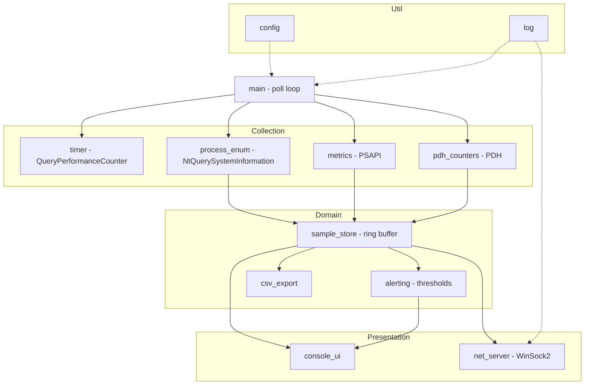
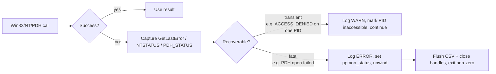

# Portable Process Monitor — Architecture

> Companion to [PROJECT-PLAN.md](./PROJECT-PLAN.md) and [TECH-NOTES.md](./TECH-NOTES.md).

---

## 2.1 Chosen Architectural Pattern

**Layered Monolith with a single-threaded poll-collect-render loop and a detached
I/O worker.**

This is a self-contained native console executable — not a distributed system —
so a clean **layered monolith** is the right altitude. The value of layering here
is *testability and portability of intent*, not deployment independence:

- The **collection layer** is the only code that touches Win32/NT/PDH structures.
- The **domain layer** (metrics math, alert rules, CSV schema) operates on plain
  C structs and can be unit-tested with CTest on any toolchain, no live OS calls.
- The **presentation layer** (console + optional WinSock2 stream) is a thin sink.

Justification vs. alternatives:

| Pattern | Verdict |
|---------|---------|
| Microservices / multi-process | Rejected — defeats the "single portable binary" goal; IPC overhead dwarfs the workload. |
| Event-driven (ETW pump) | Partially adopted as an *optional* Phase-3 enrichment, not the backbone — ETW raises deployment privilege and complexity. |
| **Layered monolith (chosen)** | Matches scale: one machine, one process, periodic polling. Lowest cognitive and operational cost. |

Concurrency is deliberately minimal: a single main thread owns the poll loop;
CSV flushing and the WinSock2 server run on their own threads behind a small
lock-guarded queue so that disk or network stalls never skew the sampling clock.

---

## 2.2 Key Component Interactions



Interaction mechanisms (no network/DB in the core path — everything is in-process
function calls):

- **Direct function calls** between layers — the dominant mechanism.
- **In-process ring buffer** (`sample_store`) acts as the single source of truth
  for the current and previous poll cycle; CPU% is a delta across two snapshots.
- **Lock-guarded queue** between the poll loop and the CSV/network worker threads
  (producer = main loop, consumers = export/server).
- **TCP socket (WinSock2)** is the *only* external interface, and it is read-only:
  remote collectors subscribe and receive a line-delimited metric stream.

---

## 2.3 Data Flow

```mermaid
sequenceDiagram
    participant Clk as timer (QPC)
    participant Loop as main poll loop
    participant Enum as process_enum (NtQuerySystemInformation)
    participant PS as metrics (PSAPI)
    participant PD as pdh_counters (PDH)
    participant Store as sample_store
    participant Alert as alerting
    participant UI as console_ui
    participant CSV as csv_export (worker)

    Clk->>Loop: interval tick (e.g. 1000 ms)
    Loop->>Enum: enumerate processes
    Enum-->>Loop: pid list + image names
    loop per process of interest
        Loop->>PS: GetProcessTimes / MemoryInfo / IoCounters
        PS-->>Loop: raw counters
    end
    Loop->>PD: collect system-wide counters
    PD-->>Loop: cpu%, mem, disk queue
    Loop->>Store: commit snapshot (compute deltas vs previous)
    Store-->>Alert: evaluate thresholds
    Alert-->>UI: alert events (if any)
    Store-->>UI: top-N rendered table
    Store->>CSV: enqueue rows (async flush)
    Note over Loop,Clk: sleep until next aligned tick
```

The path is intentionally **stateless between processes** and **stateful only in
the ring buffer**: a sample becomes meaningful only once a *previous* sample
exists (CPU time is monotonic; percentage = ΔbusyTime / Δwallclock / cores).

---

## 2.4 Scalability & Performance Strategy

Scale dimensions for this tool are **process count** and **polling frequency**,
not user count.

- **Single enumeration pass.** `NtQuerySystemInformation` returns *all* processes
  in one buffer; we avoid per-PID `CreateToolhelp32Snapshot` churn. The buffer is
  reused across polls and only regrown on `STATUS_INFO_LENGTH_MISMATCH`.
- **O(1) amortised sampling.** Per-process handles are cached in the ring buffer
  keyed by PID+start-time (to detect PID reuse); reopened only on change.
- **Drift-free clock.** Next wake time is computed against an absolute QPC anchor,
  so sampling does not accumulate latency under load.
- **Back-pressure isolation.** CSV/network I/O is offloaded to a worker thread
  with a bounded queue; if a consumer stalls, the queue drops oldest rows rather
  than blocking the sampler (configurable).
- **Linear memory.** Footprint is `O(tracked_processes × history_depth)`; the ring
  buffer caps history so memory is bounded regardless of runtime length.

Future headroom: the domain layer's struct-based contract means a second backend
(e.g. Prometheus exposition, ETW source) can be added without touching the loop.

---

## 2.5 Security Considerations

Native, locally-run tooling shifts the threat model toward **privilege, handle
hygiene, and the network surface**.

- **Authentication & authorization:** No auth in the local console mode. The
  WinSock2 server binds to `127.0.0.1` by default; binding to a routable address
  requires an explicit `--listen` flag and is documented as trusted-network-only.
  A future shared-token handshake is the planned auth mechanism if exposed.
- **Least privilege:** Runs as the invoking user. Full visibility into other
  users' processes requires `SeDebugPrivilege`; the tool requests it *only* when
  `--privilege` is passed and degrades gracefully (marks inaccessible PIDs) when
  not granted, rather than failing hard.
- **Data protection:** Metrics may reveal process names and resource patterns.
  CSV files are written with the user's default ACL; no secrets are collected. The
  network stream is plaintext and therefore loopback-only by default.
- **API security:** The TCP interface is **read-only and command-free** — it
  accepts no input that influences execution, eliminating injection vectors. Input
  parsing (config/INI/CLI) uses bounded copies and validates ranges.
- **Secret management:** The tool has no secrets of its own. Any future remote
  token is read from an environment variable / file, never hard-coded, and never
  written to logs (see logging philosophy).

---

## 2.6 Error Handling & Logging Philosophy



Principles:

- **Errors are values, not exceptions.** Every fallible function returns a
  `ppmon_status_t` enum; callers must check it. Output parameters are only valid
  on `PPMON_OK`.
- **Translate at the boundary.** Collection modules convert `NTSTATUS`,
  `GetLastError()`, and `PDH_STATUS` into the unified `ppmon_status_t` immediately,
  so the domain layer never sees raw OS error codes.
- **Degrade, don't crash.** A per-process failure (access denied, exited mid-poll)
  is a `WARN` and skips that row; only infrastructure failures (cannot open PDH,
  cannot allocate) are fatal.
- **Levelled, structured logging.** `LOG_TRACE … LOG_ERROR`, each line carrying a
  monotonic timestamp, level, and module tag. Level is configurable; default is
  `INFO`. Logs go to `stderr` so they never corrupt CSV on `stdout` redirection.
- **No secrets in logs.** Tokens and full command lines are redacted by policy.
- **Deterministic cleanup.** All handles/sockets are released in a single `cleanup:`
  unwind path per function (goto-based RAII idiom common in C system code).
```
