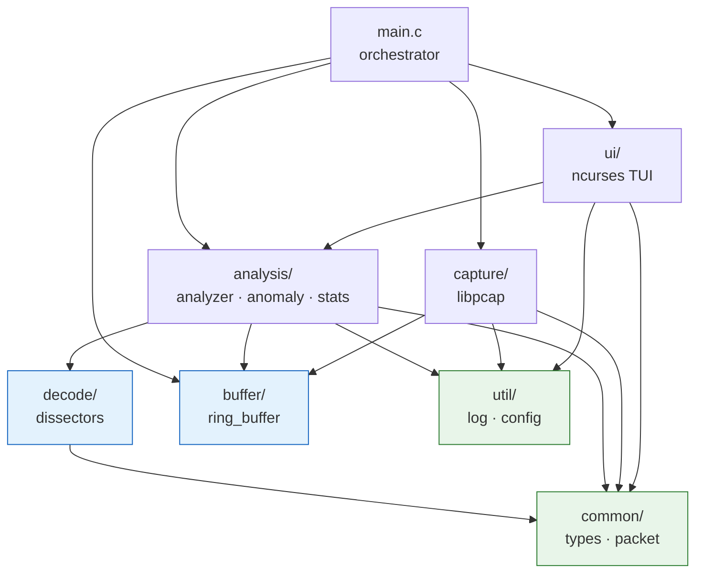
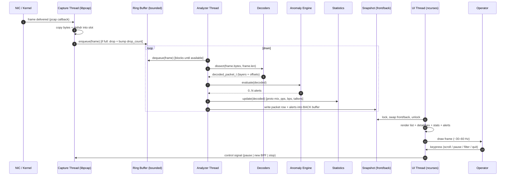
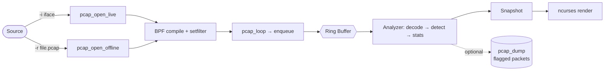
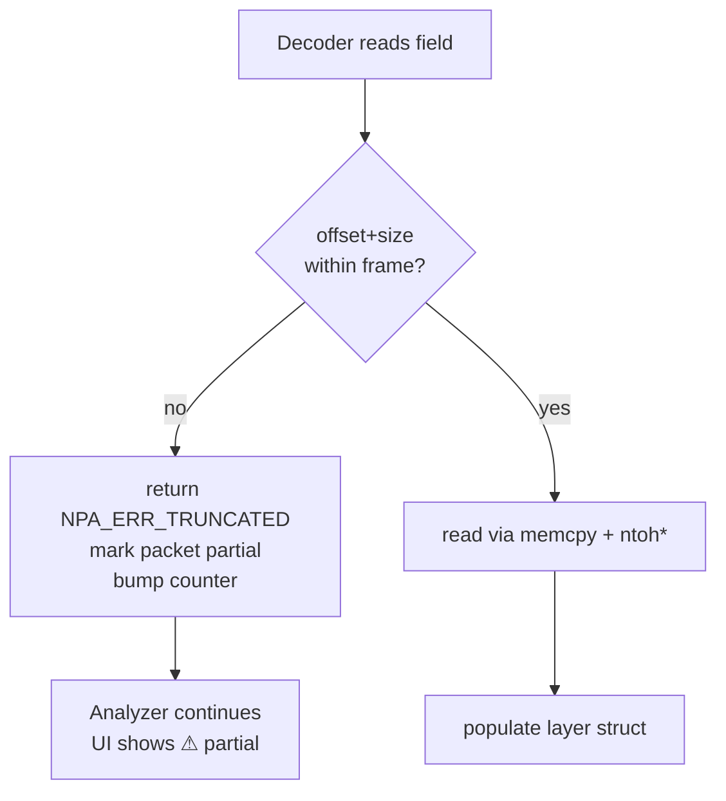

# Network Packet Analyzer — Architecture

> Scope: how `npa` is structured internally, how data flows across threads, and the
> non-functional strategies (performance, safety, errors) that shape the design.

---

## 2.1 Chosen Architectural Pattern

**Pattern: Multi-threaded Pipeline (Producer → Bounded Queue → Consumer) inside a Layered Monolith.**

`npa` is a single process, but internally it is a **staged pipeline** with a strict
threading model:

```
[ Capture thread ]  --enqueue-->  [ Ring Buffer ]  --dequeue-->  [ Analyzer thread ]
   (libpcap)            (SPSC)        (bounded)         (decode + detect + stats)
                                                                       |
                                                                  publishes snapshots
                                                                       v
                                                              [ UI thread (ncurses) ]
```

### Why this pattern (and not the alternatives)

- **Why a monolith, not microservices?** This is a host-local CLI tool with a
  latency-critical hot path (kernel → userspace per packet). Network/IPC hops would
  add overhead and complexity for zero benefit. One statically-linkable binary is the
  right deployment unit for `apt`/`brew`.
- **Why a pipeline with threads (not single-threaded `poll`)?** Capture must *never*
  stall. Decoding, anomaly matching, and especially ncurses rendering are bursty and
  comparatively slow. Decoupling capture from processing with a bounded queue is the
  classic way to absorb traffic spikes without dropping frames in userspace.
- **Why exactly three roles?** It maps cleanly to the three distinct rates:
  1. **Capture** is I/O-bound and must be greedy.
  2. **Analysis** is CPU-bound and parallelizable later (N analyzer threads draining the same MPSC queue).
  3. **UI** is human-paced (~30–60 Hz refresh) and must own ncurses exclusively.

This gives us the simplicity of a monolith with the throughput isolation of a
pipeline — appropriate for the project's scale (single host, 1–10 Gbps best-effort).

### Module layering (compile-time dependency direction)



> Dependencies only point "down". `common` and `util` are leaves (depend on nothing
> internal), which is what makes `decode`, `buffer`, and `anomaly` unit-testable in
> isolation.

---

## 2.2 Key Component Interactions

There is **no network IPC, no message broker, and no database** in this system.
All interaction is in-process, and the integration contracts are:

| Producer | Consumer | Mechanism | Contract |
|---|---|---|---|
| Capture thread | Analyzer thread | **Ring buffer** (`ring_buffer.c`) | Fixed-size slots of `captured_frame_t` (raw bytes + `pcap_pkthdr` metadata). Copy-in on enqueue; capture never holds a pointer into pcap's buffer past the callback. |
| Analyzer thread | UI thread | **Double-buffered snapshots** | Analyzer writes into a back buffer (recent packets, stats, alerts) guarded by a mutex; UI atomically swaps and renders the front buffer. UI never reads live counters mid-update. |
| UI thread | Capture thread | **Control flags + BPF channel** | `pause`, `quit`, and "apply new filter" are signalled via atomics / a small command struct; capture acts on them between packets. |
| Config/CLI | All | **Immutable `npa_config_t`** | Parsed once at startup, passed by `const` pointer. Live changes (filter) go through the control channel, not by mutating config. |

### Concurrency primitives used
- `pthread_mutex_t` + `pthread_cond_t` — ring buffer not-empty / not-full signalling.
- `atomic_bool` / `atomic_uint_fast64_t` — stop flags, drop counters, stat counters on the hot path.
- One mutex around the UI snapshot swap.

---

## 2.3 Data Flow

End-to-end path of a single packet, from wire to screen:



### Offline path
`npa -r capture.pcap` swaps the live NIC source for `pcap_open_offline`. The rest of
the pipeline is identical — capture thread reads frames from the file as fast as the
ring drains, which makes file replay a clean superset of the live test path.



---

## 2.4 Scalability & Performance Strategy

This is a **vertical / single-host** scalability story — "scale" means *more packets
per second on one box*, not more nodes.

1. **Decouple capture rate from processing rate** — the bounded ring is the shock
   absorber. Burst arrives → ring fills → analyzer catches up. The only thing that
   stalls is the *display*, never the capture.
2. **Bounded, configurable backpressure** — ring capacity is a CLI/config knob
   (`--ring-size`). When full, we **drop and count** rather than block capture
   (configurable: drop vs. block). The drop counter is shown in the UI so the operator
   knows fidelity is degraded.
3. **Designed for N analyzer threads** — the queue contract is written MPSC-ready.
   Phase 3 promotes the ring from mutex-guarded to a lock-free SPSC/MPSC ring and runs
   multiple analyzer workers pinned to cores, with per-thread stat shards merged on read.
4. **Zero-copy where it counts** — decoders never copy payloads; they record
   `(offset, length)` into the original frame buffer. Only the small `captured_frame_t`
   header + bytes are copied once (on enqueue), to detach from libpcap's transient buffer.
5. **O(1) hot path** — per-packet work is bounded: fixed-depth dissect, hash-bucketed
   talker lookup, and a compiled rule set (no regex backtracking on the hot path;
   byte-pattern matching uses precompiled automata in Phase 3).
6. **Snapshot rendering** — the UI redraws from an immutable snapshot at a capped FPS,
   so render cost is independent of packet rate.

### Capacity planning knobs
- `--ring-size N` (slots) and per-slot snaplen → memory ceiling is deterministic.
- `--snaplen` to cap bytes captured per packet (headers-only modes are cheap).
- BPF filter pushes selection **into the kernel** — the cheapest possible drop.

---

## 2.5 Security Considerations

`npa` is a local tool that reads raw traffic, so "security" here is about **least
privilege, safe parsing, and not leaking captured data** — there is no user-facing
auth surface.

- **Authentication & authorization**
  - No accounts; trust boundary is the OS user. Capturing requires elevated
    capability. We **do not** require running as full root.
  - Recommended: `setcap cap_net_raw,cap_net_admin+eip ./npa`, or open the device
    while privileged and then **drop privileges** (`setgid`/`setuid` to an unprivileged
    user) before entering the main loop. The capture FD survives the drop.
- **Data protection**
  - Captured payloads may contain secrets (credentials, tokens). `npa` keeps them in
    memory only; nothing is persisted unless the operator explicitly exports to `.pcap`.
  - Log files (`util/log`) record metadata/events, **never raw payload bytes** by default.
  - Planned: a `--mask-payload` flag to redact payload bytes in the hex view for screen-sharing.
- **API / input security (the parsing surface)**
  - The real attack surface is **hostile packets**. Every dissector treats input as
    adversarial: bounds-check before every read, never trust on-wire length fields,
    cap iteration counts. Decoders are pure and fuzzed in CI (Phase 3).
  - Rule/config files are parsed defensively (length caps, no `system()`, no eval).
- **Secret management**
  - The tool itself has no secrets/keys. Config carries no credentials. `.env.example`
    only documents runtime tunables (interface, ring size, log path), never secrets.

---

## 2.6 Error Handling & Logging Philosophy

**Principle: a single bad packet must never take down the analyzer.** Errors are
classified by blast radius and handled at the right layer.

| Class | Examples | Policy |
|---|---|---|
| **Per-packet (recoverable)** | Truncated header, bad checksum, unknown ethertype | Decoder returns a typed result (`DECODE_TRUNCATED`, `DECODE_UNSUPPORTED`); packet is marked partial, counted, and rendering continues. **Never abort.** |
| **Subsystem (degraded)** | Ring full, log write fails, stats overflow | Increment a counter, surface in UI, keep running in a degraded mode. |
| **Fatal (startup/contract)** | Bad interface, BPF compile error, OOM at init, can't init ncurses | Fail fast with a clear `stderr` message + non-zero exit. These are configuration errors, caught before the main loop. |

### Return-code convention
Internal functions return a `npa_result_t` enum (`NPA_OK`, `NPA_ERR_INVAL`,
`NPA_ERR_TRUNCATED`, `NPA_ERR_NOMEM`, `NPA_ERR_IO`, …) — never magic `-1`s. Pointers-out
parameters are only valid on `NPA_OK`.

### Logging (`util/log`)
- **Leveled**: `TRACE / DEBUG / INFO / WARN / ERROR / FATAL`, threshold set by config/env.
- **Out-of-band**: logs go to a **file** (or `stderr` before ncurses starts), *never*
  to `stdout`/the TUI screen — writing to the terminal would corrupt the ncurses display.
- **Structured-ish lines**: `ts level thread tag message` for greppability.
- **Hot-path discipline**: the per-packet path logs at `TRACE` only; production runs at
  `INFO`, so logging never throttles capture.
- **Crash context (planned)**: a `SIGSEGV`/`SIGABRT` handler will log a one-line
  breadcrumb (last decoded protocol + frame length) to aid fuzz triage, then re-raise.


