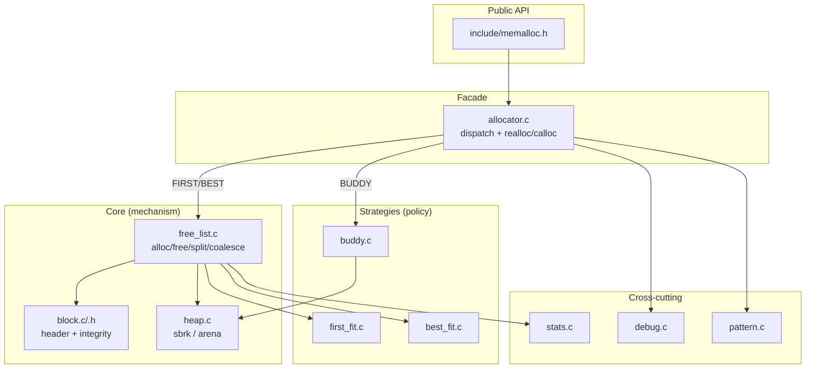
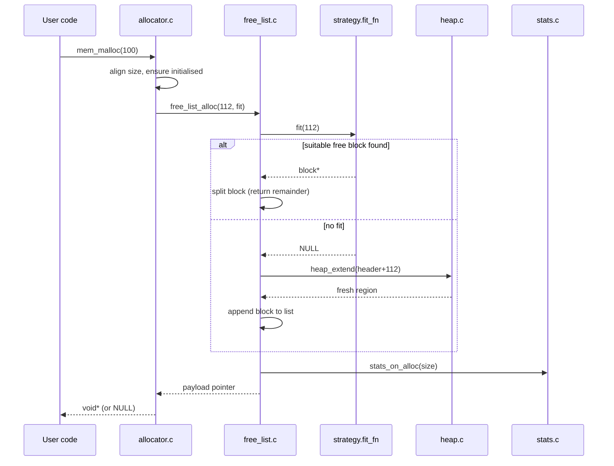
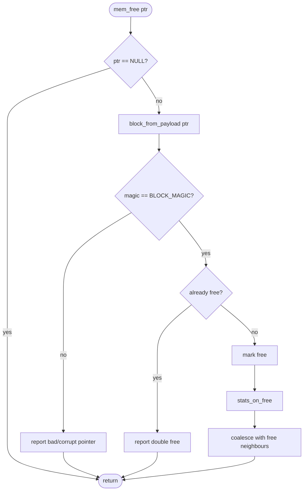

# Memory Allocator — Architecture

## 2.1 Chosen Architectural Pattern

**Layered modular monolith with a Strategy pattern at its core.**

A memory allocator is a single in-process library — there are no network
boundaries, services, or queues to justify a distributed design. The right
shape here is a **layered monolith** so that policy (which block to pick) is
cleanly separated from mechanism (how blocks are tracked and handed to the OS).

The variability the project demands — *swappable placement algorithms* —
is expressed with the **Strategy pattern**:

- The **façade** (`allocator.c`) exposes a stable API and selects a strategy.
- List-based strategies (`first_fit`, `best_fit`) are reduced to a single hook:
  a `fit_fn_t` that picks a free block. They share one engine (`free_list.c`).
- The **buddy system** is structurally different (free-list-per-order), so it is
  a self-contained alternative backend behind the same façade.

**Why suitable:** the codebase stays small and cache-friendly (no indirection
across processes), yet a new strategy is added by writing one `fit_fn_t` (≈10
lines) without touching the engine. The pattern keeps the educational goal front
and center: each algorithm is readable in isolation.

---

## 2.2 Key Component Interactions

There is **no IPC, message queue, or database** — all interaction is direct
in-process function calls. The contracts:

| Caller        | Callee            | Contract                                              |
|---------------|-------------------|-------------------------------------------------------|
| `allocator.c` | `free_list.c`     | `free_list_alloc(size, fit)` / `free_list_free(ptr)`  |
| `free_list.c` | strategy `fit_fn` | "return a free block ≥ size, or NULL"                 |
| `free_list.c` | `heap.c`          | `heap_extend(bytes)` → fresh OS-backed region          |
| `free_list.c` | `stats.c`         | event hooks `stats_on_alloc/free`                      |
| `allocator.c` | `debug.c`         | `debug_track_alloc/free` (only active in debug builds) |
| `allocator.c` | `pattern.c`       | `pattern_observe` / `pattern_recommend`                |

The single shared state is the **address-ordered block list** owned by `heap.c`
and mutated only through `free_list.c`. Keeping one owner avoids the classic
allocator bug of two code paths disagreeing about list invariants.

---

## 2.3 Data Flow

### Allocation request (`mem_malloc`)

### Free request (`mem_free`)

The returned pointer always points **past the header**; `block_from_payload`
walks backwards by `BLOCK_HEADER_SIZE` to recover metadata. Coalescing keeps the
free list from degrading into many small unusable holes.

---

## 2.4 Scalability & Performance Strategy

"Scale" for an allocator means *requests per second* and *memory efficiency*,
not horizontal nodes.

- **Algorithmic:** first/best-fit are `O(n)` in the free list — fine for teaching,
  poor at scale. The growth path is **segregated free lists / size classes**
  (Phase 3), turning the common case into `O(1)`. The buddy system already gives
  `O(log n)` with bounded external fragmentation.
- **Locality:** headers are inline with payloads, so touching a block touches one
  cache line. Alignment is fixed at 16 bytes for SIMD-safe payloads.
- **Throughput backstop:** `heap_extend` grows in 64 KiB chunks to amortize the
  syscall cost over many small allocations.
- **Concurrency (future):** the design isolates all shared state behind
  `heap.c`/`free_list.c`, so thread safety can be added as either a single arena
  lock or, preferably, **thread-local arenas** with cross-thread free handling —
  without changing strategy code.
- **Measurability:** `stats.c` exposes a fragmentation ratio and peak usage so
  performance regressions are observable, and `benchmarks/` makes them reproducible.

---

## 2.5 Security Considerations

A library has no users to authenticate, but it sits on the **memory-safety**
attack surface — the highest-value target in C.

- **Authentication & authorization:** N/A (in-process library). The trust
  boundary is the process itself.
- **Data protection / integrity:** every block carries a `magic` value; `free`
  and `realloc` reject pointers whose header is corrupt or not allocator-owned
  (`heap_start/heap_end` bounds). Debug builds add **canaries** around payloads to
  catch buffer overflows, and a tracking table to catch **double-free** and
  **free-of-untracked** pointers — the bugs that become exploitable UAF/heap
  corruption primitives.
- **API security (hardening roadmap):** size-class freelist poisoning checks,
  freed-memory scrubbing (`0xDD` fill) to surface use-after-free, and randomized
  arena base to weaken heap grooming.
- **Secret management:** no secrets are handled. The only "config" is non-sensitive
  tunables (`.env.example`); these are read at startup and never logged with values
  that could reveal memory addresses in production builds.

> Note: the educational debug features are **opt-in** (`-DMEM_DEBUG`) and add
> overhead; release builds (`-DNDEBUG`) compile them out.

---

## 2.6 Error Handling & Logging Philosophy

C has no exceptions, so the contract is **explicit and uniform**:

1. **Allocation functions return `NULL` on failure** — never abort. Callers decide
   policy. `mem_calloc` additionally returns `NULL` on multiplication overflow
   rather than allocating a truncated buffer.
2. **Programmer errors are surfaced, not hidden.** Double-free, corrupt headers,
   and frees of untracked pointers are detected and reported to `stderr` with the
   offending call site (file:line, captured by the debug macros). In release builds
   these checks degrade gracefully (ignore + return) to avoid crashing production.
3. **Diagnostics are leveled and prefixed.** All output uses a `[mem]` /
   `[mem][debug]` / `[mem][leak]` prefix so it is greppable and clearly originates
   from the allocator, never interleaved ambiguously with application logs.
4. **Observability over guesswork.** `stats_dump()` and `debug_report_leaks()` give
   a structured snapshot instead of ad-hoc `printf`s; tests and CI assert on them.
5. **Fail loud in tests, soft in production.** ASan/Valgrind in CI turn latent
   corruption into hard failures during development; the library itself stays
   defensive at runtime.
