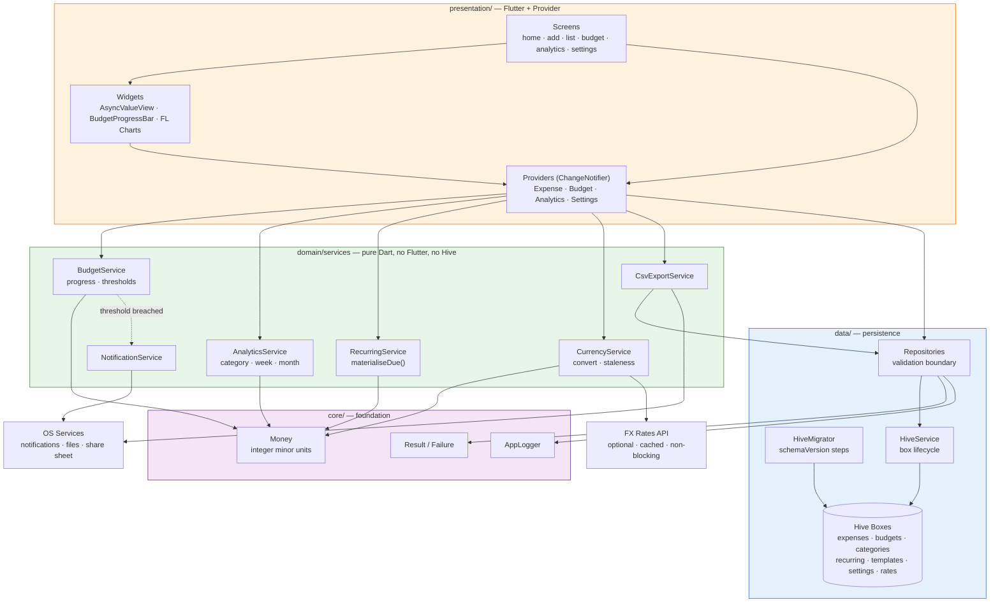
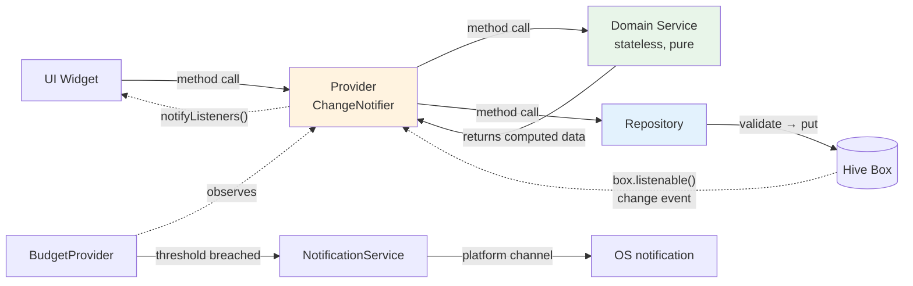
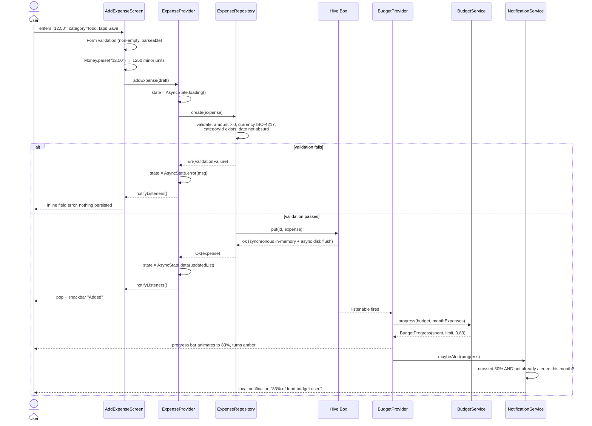
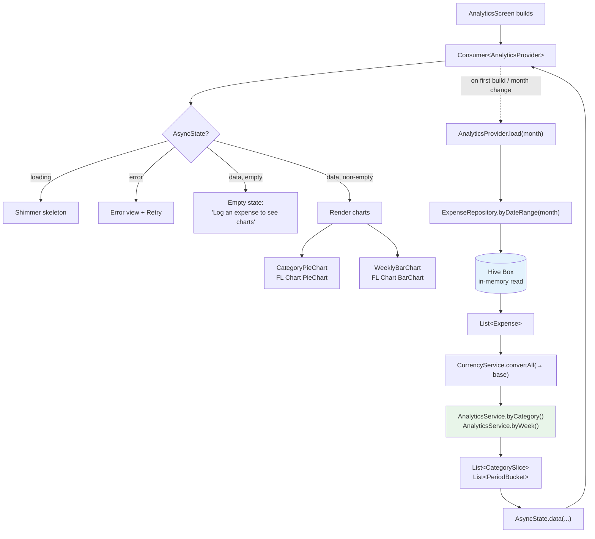
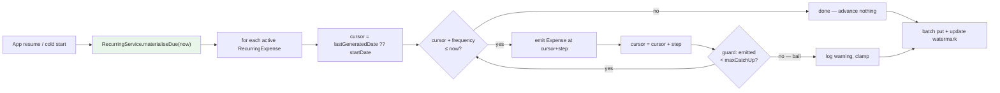
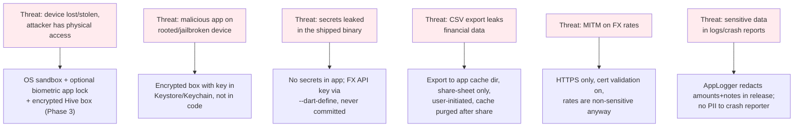
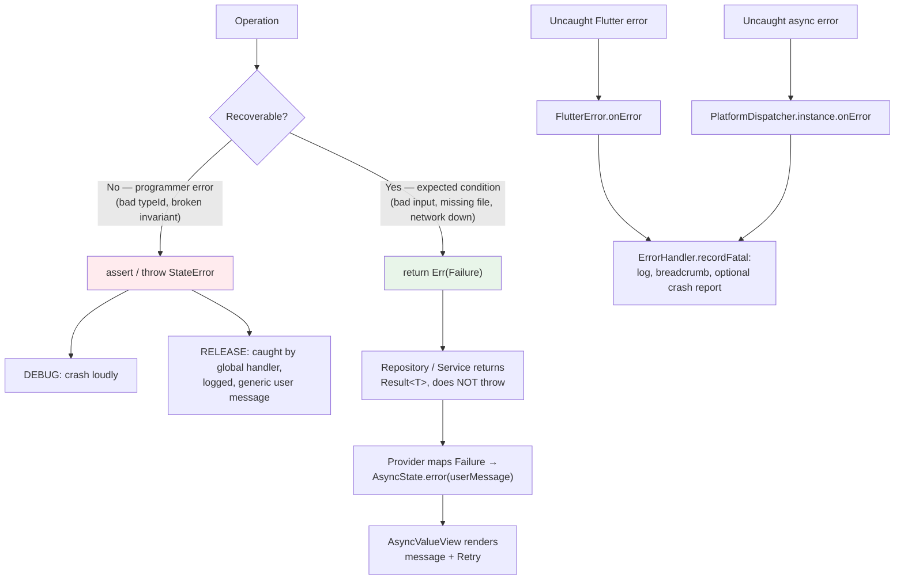

# Architecture — Personal Expense Tracker

---

## 2.1 Chosen Architectural Pattern

### Layered Local-First Monolith (single process, unidirectional dependencies)

Four layers, with a strict **inward-only** dependency rule:

```
presentation ──▶ domain ──▶ (plain data)
     │                          ▲
     └──────────▶ data ─────────┘
```

| Layer | Owns | May import | May NOT import |
|---|---|---|---|
| `presentation/` | Widgets, Providers, navigation | `flutter`, `provider`, `domain`, `data` models | — |
| `domain/` | Business rules, aggregation, scheduling | plain Dart, `core/utils` | `flutter/*`, `hive/*` |
| `data/` | Hive boxes, adapters, repositories, migrations | `hive`, `core` | `presentation/*` |
| `core/` | Money, Result, Failure, logging, theme | `flutter` (theme only) | `data/*`, `domain/*`, `presentation/*` |

### Why this pattern, and why not the alternatives

**Why layered monolith:** The entire system is one binary running on one device with one user and one
writer. There is no network partition, no concurrent writer, no independent scaling axis, no
deployment boundary. Every property that motivates a distributed architecture is absent. Introducing
one would add coordination cost and buy literally nothing.

**Why not Clean Architecture with full use-case classes?** A `GetExpensesForMonthUseCase` wrapping a
single repository call is ceremony. This design keeps the *valuable* part of Clean Architecture — the
pure, framework-free `domain/` layer — and drops the part that only pays off across many teams. When a
service method exceeds ~40 lines or grows a third collaborator, it gets extracted; not before.

**Why not BLoC/Riverpod?** The brief specifies Provider, and Provider is genuinely correct here: the
state is small, mostly derived, and the interesting logic already lives in testable services. `BLoC`'s
event/state indirection would add two classes per screen to model "the user typed an amount".

**Why not offline-first-with-sync?** Offline-first implies a server of record and conflict resolution
(vector clocks, LWW, or CRDTs). Local-first here means the device **is** the server of record. No
conflicts can exist. This is the single largest complexity saving in the whole design, and it is why
"multi-device sync" is a v2 feature requiring an explicit architectural amendment, not a config flag.



---

## 2.2 Key Component Interactions

There are **no API calls between components, no message queues, and no event bus infrastructure** —
everything is in-process. Four interaction mechanisms cover the whole app:

| Mechanism | Used for | Implementation |
|---|---|---|
| **Direct method call** | Provider → Service → Repository | Plain Dart, synchronous or `Future` |
| **Observer / fan-out** | Repository writes → interested Providers | `ChangeNotifier` + Hive `box.listenable()` |
| **Constructor injection** | Wiring at startup | `MultiProvider` in `main.dart` is the only composition root |
| **Platform channel** | Notifications, file system, share sheet | Plugin packages, always behind a service facade |

### Interaction rules that keep this maintainable

1. **Providers never touch Hive.** A Provider talks to a Repository or a Service. This is why the
   domain tests need no Hive at all.
2. **Repositories are the validation boundary.** Exactly like an HTTP controller: nothing gets into a
   box without passing validation, and violations return a typed `Failure`, never an untyped throw.
3. **Services are stateless.** They take data in and return data out. All mutable state lives in
   Providers (UI state) or Hive (persistent state). This makes services trivially unit-testable.
4. **Cross-feature reactions go through the notifier, not direct coupling.** `BudgetProvider`
   observes expense changes and asks `NotificationService` to alert; `ExpenseProvider` does not know
   budgets exist.



---

## 2.3 Data Flow

### Write path — user logs an expense (the critical path)



**Note the ordering guarantee:** the write is acknowledged to the UI *before* the budget/notification
fan-out runs. A failure in notification scheduling can never fail or roll back an expense write. This
is deliberate — logging an expense is the user's goal; alerting is a side effect.

### Read path — analytics screen



**Why conversion happens before aggregation:** summing mixed-currency amounts is meaningless. All
values are normalised to the user's base currency first, then aggregated. Each `Expense` retains its
original amount *and* currency so historical records stay truthful even if rates change.

### Recurring materialisation — the catch-up problem



This loop is **idempotent** (re-running generates nothing new because the watermark advanced) and
**catch-up-capable** (a user who ignores the app for six weeks gets all six weekly instances, not
one). Both properties are unit-tested; both are easy to get wrong.

---

## 2.4 Scalability & Performance Strategy

"Scalability" for a local-first app is **not** about servers or throughput. There are exactly three
axes that matter, and each has a concrete budget:

### Axis 1 — Data volume growth over years of use

A heavy user logs ~15 expenses/day → ~5,500/year → ~55,000 after a decade. Each `Expense` is roughly
120 bytes on disk, so a decade is ~7 MB. Hive loads a box into memory on open.

| Volume | Strategy |
|---|---|
| < 20k records | Do nothing. Full in-memory box, O(n) scans are sub-millisecond. |
| 20k–100k | Month-partitioned reads; keep a **derived monthly-totals box** so charts never scan all history. |
| > 100k | Archive boxes per year (`expenses_2027`), lazily opened; current year stays hot. |

The important architectural move is that **`ExpenseRepository` is the only thing that knows how data
is partitioned.** Swapping to year-partitioned boxes is a change in one file, invisible to services
and UI. That is the whole point of the repository layer in an app with no network.

### Axis 2 — UI responsiveness

| Budget | Approach |
|---|---|
| Cold start → first frame < 400 ms | Only `settings` + `categories` boxes opened eagerly; expenses opened lazily after first frame |
| Scroll at 60/120 fps | `ListView.builder` with `itemExtent`; never `Column` over a full list |
| No dropped frames on chart rebuild | Aggregation is memoised per `(month, baseCurrency)` — recomputed only when inputs change |
| Rebuild scope | `Selector`/`ValueListenableBuilder` over `Consumer` at the top of the tree; a new expense repaints the list row + total, not the screen |

### Axis 3 — Feature growth without structural rot

The `domain/services/` boundary means new features (savings goals, receipt photos, split expenses)
attach as new services + new boxes without touching existing ones. The lint-enforced import rule is
what stops the classic decay into a mud-ball where a widget writes directly to a box.

### Explicit non-goals

Multi-device sync, real-time collaboration, and server-side reporting are **out of scope by design**.
Adding any of them is a v2 architectural amendment: it introduces a server of record, conflict
resolution, and auth — and it invalidates the privacy promise in §2.5. It should be a deliberate
product decision, never an incremental commit.

---

## 2.5 Security Considerations

The threat model is specific and worth stating plainly, because it differs sharply from a web app:
**there is no server to attack, no network traffic carrying user data, no credentials to steal, and no
multi-tenant data to leak across.** The realistic threats are device-local.



### Authentication & authorization

**There is no user authentication, and adding it would be a security regression** — an account
creates a remote attack surface and a data-breach liability where none currently exists. Authorization
is delegated entirely to the OS: the app's Hive files live in the app-private sandbox
(`getApplicationDocumentsDirectory()`), unreadable by other apps under normal Android/iOS
permissions.

The one legitimate addition is a **local re-authentication gate**: optional biometric/PIN app lock via
`local_auth` (Phase 3), guarding against casual access to an unlocked device. This is a UX gate, not
a cryptographic boundary — the crypto boundary is box encryption below.

### Data protection

- **At rest, baseline:** OS full-disk encryption + app sandbox. Adequate for most users.
- **At rest, hardened (Phase 3):** `Hive.openBox(encryptionCipher: HiveAesCipher(key))` where the
  256-bit key is generated once, stored in Android Keystore / iOS Keychain via
  `flutter_secure_storage`, and **never** hardcoded, logged, or exported. Note the migration
  consequence: enabling encryption on an existing box requires read-plaintext → write-encrypted →
  delete-plaintext, which belongs in `HiveMigrator` as a versioned step.
- **In transit:** only FX rates. HTTPS with default certificate validation; never disable it.
- **In backups:** consider excluding boxes from iCloud/Android auto-backup if the encryption key is
  device-bound — otherwise a restored backup yields an undecryptable box. Document the choice.

### API security

The only outbound call is `GET /latest?base=USD` to a public FX endpoint. Rules:

1. Treat the response as **untrusted input** — validate shape and types, reject non-finite or
   negative rates, and never `as`-cast blindly into a model.
2. **Never block the UI on it.** Timeout ≤5 s, fall back to cached rates, surface staleness.
3. If the provider requires a key, it is a **build-time** `--dart-define`, and it is understood to be
   extractable from the binary — so use a key with rate-limit-only scope, never a billable secret.

### Secret management

| Secret | Where it lives | Never |
|---|---|---|
| FX API key (if any) | Codemagic env var → `--dart-define` | in git, in `pubspec.yaml`, in a committed `.env` |
| Android upload keystore | Codemagic signing config | in the repo |
| iOS certs / provisioning | Codemagic code-signing (App Store Connect API key) | in the repo |
| Hive encryption key | Device Keystore/Keychain, generated on device | in source, in CI, in backups |

`.env` is git-ignored; only `.env.example` (placeholder values) is committed.

---

## 2.6 Error Handling & Logging Philosophy

### Principle: fail loudly in development, degrade gracefully in production, never silently



### The two-category rule

Every error is classified once, at the point it arises:

**Category A — expected conditions** (invalid user input, no data yet, FX API unreachable, export
cancelled). These are **values, not exceptions**: functions return `Result<T>` = `Ok(T) | Err(Failure)`.
`Failure` is a sealed hierarchy (`ValidationFailure`, `StorageFailure`, `NetworkFailure`,
`PermissionFailure`, `UnexpectedFailure`) so exhaustive `switch` gives compile-time proof that every
case is handled — including new ones added later.

**Category B — programmer errors** (unregistered adapter, negative money constructed internally,
impossible enum state). These `throw` and are allowed to crash in debug. Swallowing them is how a bug
becomes a mystery three releases later.

### Logging rules

| Level | Use | Ships in release? |
|---|---|---|
| `trace` | Loop internals, cursor advances | No — stripped |
| `debug` | Box opened, migration step ran | No |
| `info` | App start, schema version, recurrences materialised (count only) | Yes |
| `warn` | Stale FX rates, notification permission denied, catch-up clamped | Yes |
| `error` | Failed write, migration failure, uncaught error | Yes |

**Redaction is mandatory and enforced in `AppLogger`:** in release builds, expense amounts and note
text are never logged — they are the most sensitive data the app holds. Log the *shape* of the
problem (`"write failed for expense id=…, box=expenses"`), never the values. A log line that would
embarrass the user if screenshotted does not belong in release.

### User-facing error contract

1. Never show a raw exception, stack trace, or `Failure` class name to the user.
2. Every error view offers either a **Retry** or a clear next action.
3. Errors that lose user input are unacceptable — the add-expense form retains its state on failure.
4. A failed side effect (notification, FX refresh) must never present as a failed primary action.
