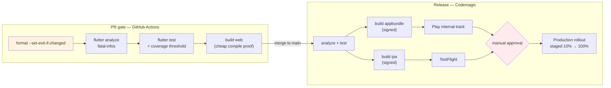
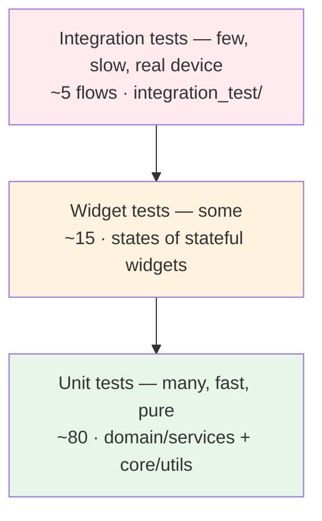
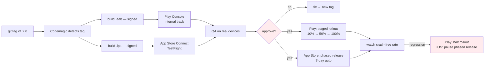
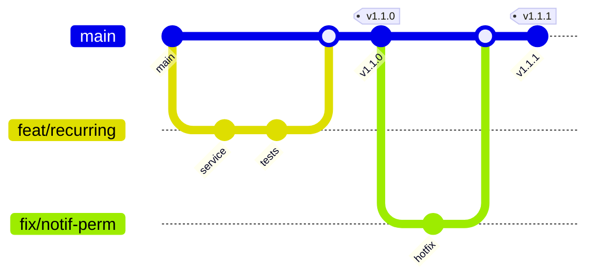

# Technical Notes — Personal Expense Tracker

Actionable guidance for building, testing, shipping and maintaining this app.

---

## 3.1 CI/CD Pipeline Design

Two pipelines with different jobs. Do not merge them — they optimise for opposite things.

| | GitHub Actions (`.github/workflows/ci.yaml`) | Codemagic (`codemagic.yaml`) |
|---|---|---|
| Purpose | Fast feedback on every PR | Signed builds + store publishing |
| Target time | **< 4 min** | 15–30 min |
| Runs on | every push / PR | `main` merges, version tags, nightly |
| Needs macOS? | No | Yes (iOS) |
| Needs signing secrets? | No | Yes |

### Stage graph



### Stage-by-stage rules

1. **Lint / format** — `dart format --output=none --set-exit-if-changed .`. Formatting is not a review
   topic; the machine decides.
2. **Analyze** — `flutter analyze --fatal-infos --fatal-warnings`. With the strict
   `analysis_options.yaml` in this repo, infos are real signal. Do not soften this to get a build
   green; fix the code or justify an inline `// ignore:` with a reason.
3. **Test** — `flutter test --coverage`, then enforce the threshold in `scripts/coverage.sh`. Fail the
   build below target. A coverage number nobody enforces is decoration.
4. **Build** — PRs compile web only (fast, no toolchain cost, still catches real compile errors).
   Release builds produce `.aab` + `.ipa` **from the same commit**, never rebuilt separately.
5. **Deploy** — internal/TestFlight automatically on tag; production behind a **manual approval gate**
   plus staged rollout. Never auto-promote a mobile release to 100%: unlike a server, you cannot roll
   back a bad binary that users have already installed.

### Build numbering

Use Codemagic's `$PROJECT_BUILD_NUMBER` for `--build-number` and derive `--build-name` from the git
tag. Stores reject duplicate build numbers, and manual numbering **will** collide eventually. Never
hand-edit the version in `pubspec.yaml` on a release branch.

---

## 3.2 Testing Strategy

The test pyramid here is deliberately bottom-heavy, and that is a direct payoff of the
`domain/services/` boundary — the interesting logic needs no Flutter and no Hive to test.



### Unit tests — `flutter_test` (`test/unit/`), target ≥ 85% on `domain/` + `core/`

These are the tests that actually protect this product. Priority order:

| Under test | Cases that matter |
|---|---|
| `Money` | parse/format round-trips, `0.1+0.2`, negatives rejected, 3-decimal currencies (KWD/JOD), overflow |
| `BudgetService` | 0%, exactly-at-threshold, exactly-100%, over-budget, zero-limit (div-by-zero!), no-budget-set |
| `AnalyticsService` | empty list, single expense, week boundaries (Sun/Mon), month with 5 partial weeks, DST transition |
| `RecurringService` | **idempotency** (run twice → no dupes), 6-week catch-up, endDate respected, leap-year Feb 29 monthly, month-end clamping (Jan 31 + 1 month) |
| `CsvExportService` | commas/quotes/newlines inside notes, unicode, empty dataset |
| `CurrencyService` | missing rate, stale rate, rate = 0 rejected, same-currency no-op |

**Coverage targets by layer** — a single global number hides the truth:

| Layer | Target | Rationale |
|---|---|---|
| `domain/services/` | **90%** | Pure logic, no excuse |
| `core/utils/` | **95%** | `Money` bugs are silent and catastrophic |
| `data/repositories/` | 75% | Validation paths; Hive itself is not ours to test |
| `presentation/` | 40% | Widget tests target states, not pixel coverage |

### The Hive testing decision

**Do not mock Hive.** Mocking a database means testing your mock's behaviour. Instead use a real Hive
instance rooted in a temp directory (`test/helpers/hive_test_helper.dart`): `Hive.init(tempDir.path)`,
register adapters, open boxes, delete the directory in `tearDown`. It is nearly as fast as a mock and
it actually exercises adapter serialisation — which is where the real bugs are, especially with
hand-written adapters.

### Widget tests (`test/widget/`)

Test **states**, not layouts. `BudgetProgressBar` has three visual states (under / near / over) and
they must be distinguishable without colour alone (accessibility). Golden tests are optional and, if
used, must be regenerated on one platform only — cross-platform font rendering makes them flaky.

### Integration tests (`integration_test/` + `flutter drive`)

Five flows maximum. They are slow and the most brittle asset you own. Cover only what unit tests
cannot: add expense → appears in list → chart total updates → survives app restart (this last one is
the real Hive persistence proof). Run them on a Codemagic emulator/simulator on `main`, not on every
PR.

---

## 3.3 Deployment Strategy

**There is no containerisation and there should not be.** The artifacts are a signed Android App
Bundle and a signed iOS IPA. Docker plays no part in shipping a mobile app; it would only ever be a
CI convenience, and Codemagic already provides managed macOS/Linux build VMs.



### Platform specifics

**Android** — ship `.aab`, not `.apk`. Enable Play App Signing (Google holds the app signing key; you
hold the upload key). **Back up the upload keystore somewhere you will still have in three years** —
losing it is a genuinely painful recovery. Use staged rollout always.

**iOS** — automatic code signing via App Store Connect API key in Codemagic. Budget real time for the
first signing setup; it is the single most common cause of a blocked first release. Phased release is
on by default; leave it on.

**Web / Windows** — these targets exist for development velocity (hot reload in Chrome is faster than
an emulator) and are **not** shipping targets. `flutter_local_notifications` does not support them, so
`NotificationService` guards on platform. Do not let a web-only bug block a mobile release.

### Rollback reality

You cannot recall an installed binary. Mitigations, in order of value:

1. **Staged rollout + crash-rate watch** — catch it while 10% are exposed.
2. **Halt rollout** immediately on regression; promote a fixed build.
3. **Forward-fix only.** Never ship a build whose `HiveMigrator` cannot read the newer schema — a
   downgrade with an unreadable box is data loss. Migrations must be **additive and
   backward-tolerant**: unknown fields ignored, missing fields defaulted.

---

## 3.4 Environment Management

Flutter has **no runtime `.env`** — a bundled `.env` asset is readable by anyone who unzips the APK,
so it is not a secret store. Configuration is **compile-time** via `--dart-define`, read through
`String.fromEnvironment`, centralised in `lib/core/config/env.dart`.

`.env.example` (committed, placeholders only) documents the variables; `.env` is git-ignored and fed
to the build via `--dart-define-from-file=.env` or `scripts/dart_define.sh`.

### Flavours

| Env | Flavour | App id suffix | Traits |
|---|---|---|---|
| dev | `dev` | `.dev` | verbose logs, seeded demo data, 1-min notification test hooks |
| staging | `stg` | `.stg` | release-like, real FX API, analytics off |
| prod | `prod` | — | logs at info+, redaction on, staged rollout |

Distinct application IDs let all three install side by side on one device — worth the setup cost the
first time you need to reproduce a prod bug while running dev.

```bash
flutter run --dart-define-from-file=.env --flavor dev
flutter build appbundle --dart-define-from-file=.env.prod --flavor prod
```

**Never commit a real `.env`.** In Codemagic the values are environment variables in an encrypted
group, injected into the build command — the repo never holds a secret.

---

## 3.5 Version Control Workflow

### Recommendation: trunk-based with short-lived branches + release tags



**Rules:** `main` always releasable · branches live < 3 days · squash-merge (one logical change = one
commit) · PR requires green CI + review · releases are annotated tags (`v1.2.0`) and Codemagic builds
*from the tag*.

**Why not Gitflow?** Gitflow's `develop` + `release/*` branches exist to coordinate scheduled releases
across teams, and they cost you constant merge reconciliation. For a small team shipping mobile, that
overhead buys nothing: the store review queue is already your release buffer, and staged rollout is
already your safety valve. Trunk-based keeps the diff between "what is tested" and "what ships" at
zero.

**The one Gitflow-ish concession:** if a production hotfix is needed while `main` has unreleased
features, branch from the *release tag*, fix, tag `v1.2.1`, then cherry-pick forward to `main`. This is
rare enough that it does not justify a permanent branch structure.

**Commit hygiene:** conventional commits (`feat:`, `fix:`, `refactor:`, `test:`) so the changelog is
generated, not written. **Never commit:** `.env`, keystores, `*.jks`, `build/`, `.dart_tool/`,
`coverage/`.

---

## 3.6 Common Pitfalls (specific to this stack)

### Money — the pitfall that ruins expense trackers

**Never use `double` for money.** `0.1 + 0.2 != 0.3`, and after a few hundred additions your monthly
total is visibly wrong by a cent — in an app whose entire value is arithmetic. Store **integer minor
units** (cents) and divide only at the moment of display. Retrofitting this later requires migrating
every stored record, so it is a Phase 1 task, not a refactor.

Related: not every currency has 2 decimals. JPY has 0, KWD/BHD/JOD have 3. Hardcoding `× 100` breaks
for travellers — exactly your stated audience.

### Hive

- **typeIds are permanent.** Reusing a typeId for a different class silently deserialises garbage.
  Keep the registry in `hive_boxes.dart` and treat it as append-only.
- **Field indices are permanent too.** Adding a field = new index. *Never* renumber or reuse.
  Removing a field means retiring its index forever, not shifting the others down.
- **`box.values` is in-memory** — fast, but the whole box is RAM-resident once opened. Fine at 20k
  records; plan partitioning beyond that (ARCHITECTURE §2.4).
- **`put()` returns before disk flush.** Data is durable enough for normal use, but do not assume the
  bytes hit disk before the next line runs; on hard kill the last write can be lost.
- **`Hive.close()` matters in tests.** Leaked open boxes across tests cause bizarre cross-test
  contamination. Always `tearDown`.
- **Enums:** store the index via an adapter, and never reorder the enum. Reordering rewrites the
  meaning of existing rows.

### Provider

- **`notifyListeners()` in a build → infinite loop.** Mutate state from callbacks/`Future`s, never
  during build.
- **`context.read` in `build`, `context.watch` in callbacks — both are wrong.** `watch` in `build`,
  `read` in callbacks.
- **`Consumer` at the top of a screen rebuilds everything.** Use `Selector` or push `Consumer` down to
  the smallest subtree that actually depends on the value.
- **`ProxyProvider` ordering** matters when a provider depends on another; register dependencies
  first. A confusing "provider not found" at startup is usually ordering, not a missing provider.
- **Async state races:** if the user changes month twice quickly, the slower load can overwrite the
  newer result. Guard with a request token/generation counter.

### FL Chart

- **Empty data throws or renders nonsense.** Always branch on empty *before* constructing chart data —
  a brand-new user has zero expenses, so this is the first screen they see.
- **Breaking changes between minor versions are common.** Pin the version and read the changelog before
  bumping; expect renamed params.
- **`FlTitlesData` defaults are noisy.** Explicitly disable unused axes or you get duplicated labels.
- **Legibility in dark mode is not automatic** — pull chart colours from the theme, and do not encode
  meaning in colour alone (colour-blind users; also `AppColors` palette is chosen for this).

### flutter_local_notifications

This package is the single most common source of "works on my phone, dead in production":

- **Timezone init is mandatory** for scheduled notifications — `tz.initializeTimeZones()` plus the
  device's local zone, or schedules fire at the wrong time or not at all.
- **Android 13+ requires runtime `POST_NOTIFICATIONS`**; without it, scheduling silently no-ops.
- **Android 12+ exact alarms** need `SCHEDULE_EXACT_ALARM`/`USE_EXACT_ALARM`. Prefer inexact
  (`AndroidScheduleMode.inexactAllowWhileIdle`) for budget alerts — a nudge does not need
  second-accuracy, and exact-alarm permission invites Play policy scrutiny.
- **Aggressive OEM battery managers** (Xiaomi, Huawei, Samsung) kill scheduled work. Never make a
  notification the *only* path to important information — the in-app progress bar is the source of
  truth.
- **Not supported on Web/Windows** — guard with `Platform` checks or the dev build crashes.
- **iOS requires explicit permission request** and shows nothing in foreground unless configured.

### Flutter / Dart general

- **`BuildContext` across `await`** — check `if (!mounted) return;` after every await before using
  context, or you get "used after dispose" crashes on fast navigation.
- **`DateTime` and DST/timezones.** "This month's expenses" needs local-midnight boundaries;
  `DateTime.now().subtract(Duration(days: 30))` is not "last month". Use explicit month arithmetic
  (`core/utils/date_range.dart`) and store dates consistently (local date for the *day* semantics, and
  document that choice).
- **`Duration(days: 1)` is not a calendar day** across DST — it is exactly 24 h. Month-length and
  DST-transition arithmetic must use `DateTime(y, m, d)` construction.
- **Month-end recurrence:** Jan 31 + 1 month = ? Decide (clamp to Feb 28/29) and unit-test it, or you
  will get duplicate or missing March entries.
- **CSV correctness:** notes containing commas, quotes, or newlines must be RFC-4180 quoted. Use the
  `csv` package rather than string interpolation; hand-rolled joins are a guaranteed bug.
- **Web build of `path_provider`** behaves differently — another reason web is dev-only here.
