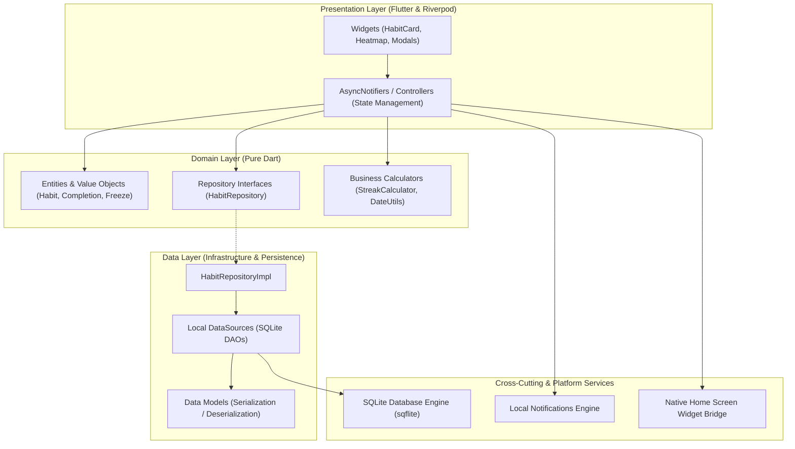
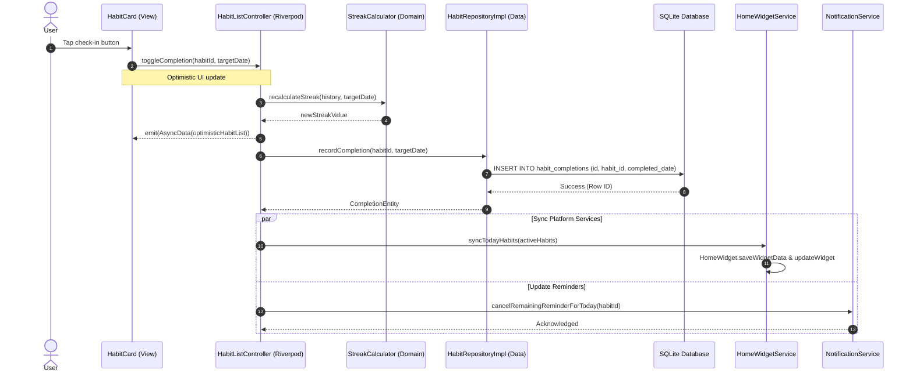

# Habit Streak Tracker - Architecture Documentation

## 1. System Overview
**Habit Streak Tracker** is an offline-first mobile application designed to cultivate consistent routines. It leverages high-performance embedded relational storage (SQLite), reactive asynchronous state management (Riverpod), platform-native home screen widgets (`home_widget`), and hardware-scheduled local notifications (`flutter_local_notifications`).

---

## 2.1 Chosen Architectural Pattern: Feature-First Clean Layered Architecture

The application adopts a **Feature-First Clean Layered Architecture**, augmented by Riverpod's reactive unidirectional data flow. 

### Justification for Project Scale & Requirements:
1. **Offline-First Resilience:** Habit tracking demands instant response without network latency. Storing relational data directly in SQLite ensures zero-delay queries and transactional integrity.
2. **Deterministic State Synchronization:** Riverpod enforces immutable state transitions and reactive dependency invalidation. When a user marks a habit completed, the habit list, calendar heatmap, and statistics recalculate synchronously without stale-state race conditions.
3. **Decoupled Platform Extensions:** Home screen widgets and system notifications operate outside the standard Flutter widget tree. Decoupling the business domain allows services to format lightweight payloads for native iOS (WidgetKit) and Android (RemoteViews/Glance) independently.
4. **Testability:** Domain logic (such as streak calculation algorithms and freeze deduction rules) is implemented as pure Dart classes with 0% UI/Flutter framework dependencies, allowing ultra-fast unit testing.

---

## 2.2 Key Component Interactions

The system coordinates several distinct layers and subsystems without tight coupling:

### Communication Matrix
| Sender | Receiver | Mechanism | Purpose |
| :--- | :--- | :--- | :--- |
| **User / Widget** | `HabitListController` | Method invocation | Dispatch intent (e.g., `toggleHabitCompletion(id, date)`) |
| **`HabitListController`** | `HabitRepository` | Asynchronous contract call | Persist completion toggle, fetch updated aggregates |
| **`HabitRepository`** | `AppDatabase` (SQLite) | SQL queries / Transactions | Atomically insert completion, deduct freeze if needed |
| **`HabitListController`** | `HomeWidgetService` | Async service call | Export today's habit snapshot to App Groups / SharedPreferences |
| **`HabitListController`** | `NotificationService` | Async service call | Reschedule or cancel reminder alarms for completed tasks |
| **Native OS Widget** | App Main / Background Handler | Platform Channel / Deep link | Handle widget tap directly or launch app with habit payload |

### Detailed Subsystem Roles:
- **Riverpod Provider Container:** Serves as the central dependency injection (DI) and reactive event engine. Providers maintain cached states and emit notifications when data stores update.
- **Direct Database Access via DAOs:** All database read/write interactions pass through strongly-typed Data Access Objects (`HabitLocalDatasource`). Raw queries are isolated; business logic only interacts with domain models.
- **Event-Driven Widget Invalidation:** Rather than running background polling, the app triggers a home widget refresh via `HomeWidget.updateWidget` immediately following any local database transaction.
- **Alarm / Notification Scheduler:** Schedules localized daily alarms using Android AlarmManager / iOS UNUserNotificationCenter. Does not require internet connectivity or backend servers.

---

## 2.3 Data Flow Architecture

The data lifecycle follows a strict unidirectional loop:
1. **Action:** User taps the checkmark on a `HabitCard`.
2. **Optimistic Update:** The `HabitListController` immediately emits an optimistic UI state (habit marked done, streak incremented).
3. **Persistence:** `HabitRepository` writes the completion row to SQLite inside a transaction.
4. **Platform Sync:**
   - The updated habit list is serialized to JSON and pushed to `home_widget` storage.
   - Pending notifications for that specific habit are dismissed for the remainder of the day.
5. **Confirmation or Rollback:** If the database write succeeds, the state is finalized; if it fails, the controller rolls back to the previous snapshot and presents a user alert.

### Sequence Diagram

---

## 2.4 Scalability & Performance Strategy

1. **Indexed Relational Schema:**
   - Composite unique index on `habit_completions(habit_id, completed_date)` ensures that checking or unchecking a habit executes in $O(\log N)$ time.
   - Covering indexes on `habits(is_archived, created_at)` keep home screen loading under 10ms even with 500+ archived habits.
2. **Lazy Heatmap Loading:**
   - The calendar heatmap queries completions bounded by a 1-year date range (`WHERE completed_date >= ? AND completed_date <= ?`), keeping memory footprint minimal.
3. **Batched Widget Serialization:**
   - Only the minimal payload required for the native widget (ID, title, completion status, streak count) is serialized to JSON string format, avoiding inter-process communication (IPC) overhead.
4. **Zero-Overhead State Rebuilds:**
   - Riverpod `select()` is utilized in list items to ensure that modifying Habit A only triggers a re-render of Habit A's card, leaving the rest of the list idle.

---

## 2.5 Security Considerations

1. **Authentication & Authorization:**
   - The application operates offline-first without requiring cloud user accounts. If cloud backup is introduced in future iterations, Firebase Auth with OAuth 2.0 / PKCE and biometrics (`local_auth`) will be used.
2. **Data Protection at Rest:**
   - SQLite database files are stored in the application's protected sandbox directory (`getApplicationDocumentsDirectory()`), preventing access by third-party apps on non-rooted devices.
   - For sensitive user habits, SQLCipher can be activated as a drop-in replacement for `sqflite` with zero architecture changes.
3. **Secret & Key Management:**
   - No hardcoded API secrets exist in client code.
   - CI/CD keys (Firebase distribution credentials, Keystore passwords, Apple Provisioning profiles) are injected via GitHub Actions Secrets and Flutter `--dart-define-from-file`.
4. **Input Validation:**
   - Habit titles and descriptions are sanitized against injection attacks and character limits (e.g., maximum 60 characters for titles, parameterized SQL queries throughout).

---

## 2.6 Error Handling & Logging Philosophy

1. **Functional Error Handling (Either / Result Pattern):**
   - The Data and Domain layers never throw unhandled runtime exceptions to the UI.
   - Repositories return a `Result<T, Failure>` or catch exceptions into typed `Failure` classes (`DatabaseFailure`, `NotificationFailure`, `ValidationFailure`).
2. **Graceful Degradation:**
   - If `HomeWidgetService` fails (e.g., widget not placed by user or platform error), the error is logged without failing the habit completion database commit.
3. **Structured Logging:**
   - A centralized `AppLogger` utility suppresses verbose debug logs in release builds while capturing critical runtime errors with stack traces for Firebase Crashlytics.
